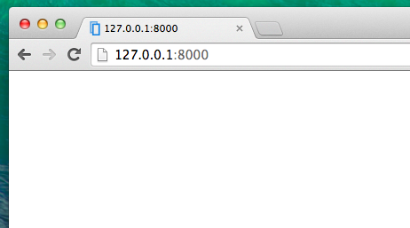

# Introduction to HTML

What's a template, you may ask?

A template is a file that we can re-use to present different information in a consistent format - for example, you could use a template to help you write a letter, because although each letter might contain a different message and be addressed to a different person, they will share the same format.

A Django template's format is described in a language called HTML (that's the HTML we mentioned in the first chapter __How the Internet works__).

## What is HTML?

HTML is a simple code that is interpreted by your web browser - such as Chrome, Firefox or Safari - to display a webpage for the user.

HTML stands for "HyperText Markup Language." __HyperText__ means it's a type of text that supports hyperlinks between pages. __Markup__ means we have taken a document and marked it up with code to tell something (in this case, a browser) how to interpret the page. HTML code is built with __tags__, each one starting with `<` and ending with `>`. These tags markup __elements__.

## Your first template!

Creating a template means creating a template file. Everything is a file, right? You have probably noticed this already.

Templates are saved in `blog/templates/blog` directory. So first create a directory called `templates` inside your blog directory. Then create another directory called `blog` inside your templates directory:

    blog
    └───templates
        └───blog

(You might wonder why we need two directories both called `blog` - as you will discover later, this is simply a useful naming convention that makes life easier when things start to get more complicated.)

And now create a `post_list.html` file (just leave it blank for now) inside the `blog/templates/blog` directory.

See how your website looks now: http://127.0.0.1:8000/

> If you still have an error `TemplateDoesNotExists`, try to restart your server. Go into command line, stop the reserver by pressing Ctrl+C (Control and C buttons together) and start it again by running a `python manage.py runserver` command.

No error anymore! Congratulations :) However, your website isn't actually publishing anything except an empty page, because your template is empty too. We need to fix that.

Add the following to your template file:

    <html>
        
Hi there!

        
It works!

    </html>

So how does your website look now? Click to find out: http://127.0.0.1:8000/

It worked! Nice work there :)

- The most basic tag, `<html>`, is always the beginning of any webpage and `</html>` is always the end. As you can see, the whole content of the website goes between the beginning tag `<html>` and closing tag `</html>`
- `
` is a tag for paragraph elements; `
` closes each paragraph

## Head & body

Each HTML page is also divided into two elements: __head__ and __body__.

- __head__ is an element that contains information about the document that is not displayed on the screen.

- __body__ is an element that contains everything else that is displayed as part of the web page.

We use `<head>` to tell the browser about the configuration of the page, and `<body>` to tell it what's actually on the page.

For example, you can put a webpage title element inside the `<head>`, like this:

    <html>
        <head>
            <title>Ola's blog</title>
        </head>
        <body>
            
Hi there!

            
It works!

        </body>
    </html>

Save the file and refresh your page.

Notice how the browser has understood that "Ola's blog" is the title of your page? It has interpreted `<title>Ola's blog</title>` and placed the text in the title bar of your browser (it will also be used for bookmarks and so on).

Probably you have also noticed that each opening tag is matched by a _closing tag_, with a `/`, and that elements are _nested_ (i.e. you can't close a particular tag until all the ones that were inside it have been closed too).

It's like putting things into boxes. You have one big box, `<html></html>`; inside it there is `<body></body>`, and that contains still smaller boxes: `

`.

You need to follow these rules of _closing_ tags, and of _nesting_ elements - if you don't, the browser may not be able to interpret them properly and your page will display incorrectly.

## Customize your template

You can now have a little fun and try to customize your template! Here are a few useful tags for that:

- `<h1>A heading</h1>` - for your most important heading
- `<h2>A sub-heading</h2>` for a heading at the next level
- `<h3>A sub-sub-heading</h3>` ... and so on, up to `<h6>`
- `<em>text</em>` emphasizes your text
- `<strong>text</strong>` strongly emphasizes your text
- ` ` goes to another line (you can't put anything inside br)
- `<a href="http://google.com/">link</a>` creates a link
- `<ul><li>first item</li><li>second item</li></ul>` makes a list, just like this one!
- `

` defines a section of the page

Here's an example of a full template:

    <html>
        <head>
            <title>Django Girls blog</title>
        </head>
        <body>
            

                <h1><a href="">Django Girls Blog</a></h1>
            

            

                
published: 14.06.2014, 12:14

                <h2><a href="">My first post</a></h2>
                
Aenean eu leo quam. Pellentesque ornare sem lacinia quam venenatis vestibulum. Donec id elit non mi porta gravida at eget metus. Fusce dapibus, tellus ac cursus commodo, tortor mauris condimentum nibh, ut fermentum massa justo sit amet risus.

            

            

                
published: 14.06.2014, 12:14

                <h2><a href="">My second post</a></h2>
                
Aenean eu leo quam. Pellentesque ornare sem lacinia quam venenatis vestibulum. Donec id elit non mi porta gravida at eget metus. Fusce dapibus, tellus ac cursus commodo, tortor mauris condimentum nibh, ut f.

            

        </body>
    </html>

We've created three `div` sections here.

- The first `div` element contains the title of our blogpost - it's a heading and a link
- Another two `div` elements contain our blogposts with a published date, `h2` with a post title that is clickable and two `p`s (paragraph) of text, one for the date and one for our blogpost.

It gives us this effect:

Yaaay! But so far, our template only ever displays exactly __the same information__ - whereas earlier we were talking about templates as allowing us to display __different__ information in the __same format__.

What we want really want to do is display real posts added in our Django admin - and that's where we're going next.

## One more thing

It'd be good to see if your website will be still working on Heroku, right? Let's try deploying again. Open up your console and type this:

    heroku push --app djangogirlsblog

> __Note__: Remember to replace `djangogirlsblog` with the name of your application on Heroku.

And that should be it! Once Heroku is finished, you can go ahead and refresh your website in the browser. Changes should be visible!
