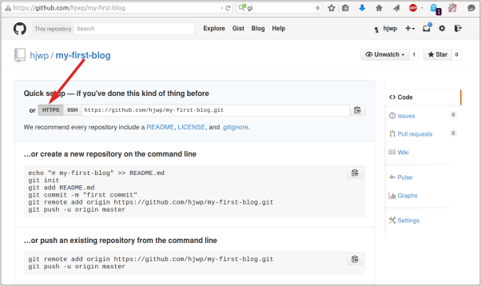

# Հրապարակում

> **Նշում** Հաջորդ գլուխը, որոշ դեպքերում կարող է մի փոքր դժվար թվալ: Եղեք համառ և ավարտին հասցրեք այն, սերվերային կայքի տեղադրումը վեբ մշակման կարևոր մասն է: Այս գլուխը միտումնավոր տեղադրված է ձեռնարկի մեջտեղում, որպեսզի ձեր ուսուցիչը կարողանա օգնել ձեզ կայք թողարկելու բարդ գործընթացում: Այս կերպ Դուք կարող եք ինքնուրույն լրացնել բոլոր գլուխները, նույնիսկ եթե ժամանակը սուղ է:

Մինչ այժմ ձեր կայքը հասանելի էր միայն ձեր համակարգչում: Այժմ դուք կսովորեք, թե ինչպես «տեղակայել/շահագործման հանձնել» ձեր կայքը: Տեղակայումը ձեր ծրագիրը ինտերնետում հրապարակելու գործընթացն է, որպեսզի մարդիկ վերջապես տեսնեն ձեր ստեղծած աշխատանքը: :) :)

Ինչպես արդեն գիտեք, կայքը պետք է տեղակայված լինի սերվերի վրա: Ինտերնետում կան շատ սերվերների մատակարարներ, մենք կօգտագործենք [PythonAnywhere](https://www.pythonanywhere.com/) - ը: PythonAnywhere- ն անվճար է փոքր ծրագրերի համար, որոնք ունեն փոքր թվով այցելուներ, ինչը մեզ համար ավելի քան բավարար է:

Մյուս արտաքին ծառայությունը, որը մենք կօգտագործենք, [ GitHub ](https://www.github.com) է, որը ծածկագրերի հոսթինգի (hosting-սպասարկման) ծառայություն է: Կան նաև այլ նմանատիպ ծառայություններ, բայց այսօր գրեթե յուրաքանչյուր ծրագրավորող ունի GitHub հաշիվ, և հիմա դուք նույնպես::

Այս երեք տեղերը ձեզ համար կարևոր կլինեն: Ձեր տեղական համակարգիչը կլինի այն վայրը, որտեղ դուք կկատարեք մշակում և փորձարկում: Երբ գոհ լինեք փոփոխություններից, ձեր ծրագրի պատճենը կտեղադրեք GitHub- ում: Ձեր կայքը կլինի PythonAnywhere- ում, և դուք այն կթարմացնեք ՝ GitHub-ից ձեր կոդի նոր օրինակը ստանալու միջոցով:

# Git

> ** Նշում ** Եթե դուք արդեն կատարել եք [installation steps](../installation/README.md), (տեղադրման քայլերը), ապա դա նորից անելու անհրաժեշտություն չկա. Կարող եք անցնել հաջորդ բաժին և սկսել ստեղծել ձեր Git պահոցը:



## Ստեղծեք մեր Git պահոցը:

Git- ը հետևում է ֆայլերի որոշակի հավաքածուի փոփոխությանը, որը կոչվում է պահոց (կրճատ ՝ «repo»): Եկեք ստեղծենք մեկը մեր նախագծի համար: Բացեք վահանակ և գործարկեք այս հրամանները `djangogirls` գրացուցակում.

> **Նշում** Նախքան պահեստի նախնականացումը սկսեք, ստուգեք ձեր ընթացիկ աշխատանքային գրացուցակը `օգտագործելով `pwd` (Mac OS X/Linux) կամ `cd` (Windows) հրամաններ: Դուք պետք է լինեք ` djangogirls ` պանակում (folder):

command-line

    $ git init
    Initialized empty Git repository in ~/djangogirls/.git/
    $ git config --global user.name "Your Name"
    $ git config --global user.email you@example.com
    

Յուրաքանչյուր նախագծի համար անհրաժեշտ է նախաձևակերպել git պահոցը (git repository)միայն մեկ անգամ (և այլևս ստիպված չեք լինի կրկին մուտքագրել ձեր` օգտվողի անունն ու էլ. Փոստի հասցեն):

Git- ը հետևելու է տվյալ գրացուցակի բոլոր ֆայլերի և գրացուցակների փոփոխություններին, սակայն մենք գերադասում ենք անտեսել դրանցից մի քանիսը: Դա անելու համար մենք պետք է պահեստի բազային գրացուցակում ստեղծենք ` .gitignore ` կոչվող ֆայլ: Բացեք ձեր խմբագիրը և ստեղծեք նոր ֆայլ հետևյալ բովանդակությամբ.

.gitignore

    # Python
    *.pyc
    *~
    __pycache__
    
    # Env
    .env
    myvenv/
    venv/
    
    # Database
    db.sqlite3
    
    # Static folder at project root
    /static/
    
    # macOS
    ._*
    

Եվ այն պահպանեք որպես ` .gitignore ` "djangogirls" արմատային գրացուցակում:

> ** Նշում ** Ֆայլի անվան սկզբում գտնվող կետը կարևոր է: Եթե ​​նման ֆայլեր ստեղծելու խնդիրներ ունեք (Mac- ը թույլ չի տա ձեզ, կետով սկսվող անունով ֆայլ ստեղծել օրինակ, Finder- ի միջոցով), ապա օգտագործեք "Save As" (-պահել որպես) կոճակը ձեր կոդի խմբագրի ընտրացանկում, դա հաստատ անվտանգ է: Եվ համոզվեք, որ ֆայլի անվանման մեջ չեք ավելացնում `.txt`, `.py` կամ որևէ այլ ընդլայնում - Git- ը դա կճանաչի միայն այն դեպքում, եթե անունը պարունակում է միայն `.gitignore`.: Այն ֆայլեր, որոնց անունները սկսվում են (օրինակ `.gitignore` ով) Linux- ը և MacOS-ը դրանք ընդունում են որպես թաքնված, և սովորական `ls` հրամանը ցույց չի տալիս այս ֆայլերը: Փոխարենը օգտագործեք `ls -a` հրամանը `.gitignore` ֆայլը տեսնելու համար:
> 
> **Նշում** Ձեր `.gitignore` ֆայլում նշված ֆայլերից մեկը `db.sqlite3` է: Այս ֆայլը ձեր (local database) տեղական տվյալների շտեմարանն է, որտեղ պահվում են ձեր օգտվողների բոլոր գրառումները: Մենք հետևելու ենք վեբ ծրագրավորման ստանդարտ պրակտիկային, ինչը նշանակում է, որ մենք կօգտագործենք առանձին տվյալների բազաներ ձեր տեղական թեստային կայքի և PythonAnywhere- ում ձեր կենդանի կայքի համար: PythonAnywhere տվյալների բազան կարող է լինել SQLite, ճիշտ այնպես, ինչպես ձեր զարգացման սարքում, բայց սովորաբար դուք կօգտագործեք MySQL անունով շտեմարան, որը կարող է սպասարկել այցելուների շատ ավելի մեծ քանակության, քան SQLite- ը: Ամեն դեպքում, անտեսելով ձեր SQLite տվյալների շտեմարանը GitHub- ի համար, նշանակում է, որ մինչ այժմ ձեր ստեղծած բոլոր հաղորդագրություններն ու գերշահագործողները հասանելի կլինեն միայն տեղական մակարդակում, և արտադրության համար անհրաժեշտ է ստեղծել նորերը: Դուք պետք է ձեր տեղական տվյալների բազայի (local database-ի) մասին մտածեք որպես լավ խաղահրապարակ, որտեղ կարող եք փորձարկել տարբեր բաներ և չվախենալ, որ ձեր իրական գրառումները կջնջեք ձեր բլոգից:

Լավ է օգտագործել `git status` (git կարգավիճակի) հրամանը նախքան`git add` (git ավելացնելը) կամ ցանկացած այլ պահ, երբ վստահ չեք, թե ինչն է փոխվել: Դա կօգնի Ձեզ զերծ մնալ տհաճ անակնկալներից, ինչպիսիք են սխալ ֆայլերի ավելացումը կամ կատարումը: `git status` (git կարգավիճակ) հրամանը վերադարձնում է տեղեկատվություն git- ում նախկինում չնկատված / փոփոխված / ներկայացված բոլոր ֆայլերի, ինչպես նաև մասնաճյուղի կարգավիճակի և այլնի մասին: Արդյունքը պետք է նման լինի հետևյալին.

command-line

    $ git status
    On branch master
    
    No commits yet
    
    Untracked files:
      (use "git add <file>..." to include in what will be committed)
    
            .gitignore
            blog/
            manage.py
            mysite/
            requirements.txt
    
    nothing added to commit but untracked files present (use "git add" to track)
    

Եվ վերջապես մենք կպահպանենք մեր փոփոխությունները: Անցեք վահանակին և մուտքագրեք այս հրամանները.

command-line

    $ git add .
    $ git commit -m "My Django Girls app, first commit"
     [...]
     13 files changed, 200 insertions(+)
     create mode 100644 .gitignore
     [...]
     create mode 100644 mysite/wsgi.py
    

## Հրապարակեք ձեր կոդը GitHub- ում

Անցեք [GitHub.com](https://www.github.com) կայք և գրանցվեք նոր անվճար օգտվողի հաշվի համար: (Եթե դա արդեն արել եք սեմինարի նախապատրաստական ​​փուլում, հիանալի է): Համոզվեք, որ հիշում եք ձեր գաղտնաբառը (ավելացրեք այն գաղտնաբառերի կառավարչին (password manager), եթե այն օգտագործում եք):

Հաջորդը, ստեղծեք նոր պահեստ ` "my-first-blog" (իմ առաջին բլոգը) անունով: "initialize with a README" վանդակը պետք չէ ընտրել, բաց թողեք .gitignore- ը (այս ֆայլը ձեռքով կստեղծենք) և թողեք License որպես None:

> **Նշում** . `my-first-blog` (իմ առաջին բլոգ) պահեստի անվանումը շատ կարևոր է: Իհարկե կարող եք այլ անվանումով հանդես գալ, բայց այն բազմիցս հանդիպում է հրահանգներում, և ամեն անգամ ստիպված կլինեք փոխել այն ձեր սեփականով: Միգուցե ավելի հեշտ է պահպանել `my-first-blog` անվանումը:

Հաջորդ էկրանին կտեսնեք ձեր ռեպոյի կլոնային URL- ը, որը դուք կօգտագործեք հետևյալ հրահանգների միջոցով:

Այժմ մենք պետք է ձեր համակարգչում կապենք տեղական Git պահոցը GitHub- ի հետ:

Մուտքագրեք հետևյալը ձեր վահանակի (console-ի) մեջ (փոխարինեք `<your-github-username>` - ը ձեր GitHub հաշիվը ստեղծելիս մուտքագրած օգտանունով, բայց առանց անկյունային գծերի. իսկ URL-ը պետք է համապատասխանի ձեր տեսած կլոնային URL- ին):

command-line

    $ git remote add origin https://github.com/<your-github-username>/my-first-blog.git
    $ git push -u origin master
    

GitHub մուտք գործելուց հետո ձեզանից կպահանջվի ձեր GitHub օգտվողի անունն ու գաղտնաբառը (կա՛մ հենց այնտեղ ՝ հրամանի տողի պատուհանում, կա՛մ ելնող պատուհանում), և հավատարմագրերը մուտքագրելուց հետո պետք է հայտնվի նման մի բան.

command-line

    Counting objects: 6, done.
    Writing objects: 100% (6/6), 200 bytes | 0 bytes/s, done.
    Total 3 (delta 0), reused 0 (delta 0)
    To https://github.com/ola/my-first-blog.git
    
     * [new branch]      master -> master
    Branch master set up to track remote branch master from origin.
    

<!--TODO: maybe do ssh keys installs in install party, and point ppl who dont have it to an extension -->

Ձեր ծածկագիրն այժմ GitHub- ում է: Գնացեք կայք և ստուգեք այն: Այն կարող եք գտնել հիանալի ընկերություններում ինչպիսիք են՝ [Django](https://github.com/django/django), the [Django Girls Tutorial](https://github.com/DjangoGirls/tutorial), և շատ այլ բաց կոդով ծրագրեր GitHub- ում: :)

# PythonAnywhere- ում մեր բլոգի տեղադրումը

## Գրանցվեք PythonAnywhere հաշվում

> **Նշում** Եթե ավելի վաղ դուք արդեն գրանցվել եք PythonAnywhere հաշվում, ապա կարիգ չկա այն կրկնել:



## Մեր կայքի տեղադրումը PythonAnywhere- ում

Վերադարձեք [PythonAnywhere Dashboard](https://www.pythonanywhere.com/) հիմնական ընտրացանկ ՝ կտտացրեք պատկերանշանին և ընտրեք "Bash" վահանակը (console) գործարկելու տարբերակը. Սա PythonAnywhere-ի command line-ի (հրամանի տողի) տարբերակն է, ինչպես ձեր համակարգչում:

> **Հղում** PythonAnywhere- ը հիմնված է Linux- ի վրա, այնպես որ, եթե դուք օգտագործում եք Windows, ապա console-ը (վահանակը) մի փոքր այլ տեսք կունենա ձեր համակարգչի վրա:

PythonAnywhere- ում վեբ հավելվածի տեղադրումը ենթադրում է GitHub- ից ձեր կոդի բեռնումը և PythonAnywhere-ի կարգավորումը `որպեսզի այն ճանաչի և գործարկի որպես վեբ ծրագիր: Դա ձեռքով անելու եղանակներ կան, բայց PythonAnywhere- ը տրամադրում է օգնող գործիք, որն ամեն ինչ կանի ձեր փոխարեն: Եկեք նախ տեղադրենք այն.

PythonAnywhere command-line

    $ pip install --user pythonanywhere
    

Վահանակը պետք է տպի նման մի բան, ինչպիսին է `Collecting pythonanywhere` և վերջում `Successfully installed (...) pythonanywhere- (...)`.

Այժմ մենք գործարկում ենք օգնականին ՝ GitHub-ից մեր հավելվածը ավտոմատ կերպով կարգավորելու համար: PythonAnyplace- ի վահանակի մեջ մուտքագրեք հետևյալ հրահանգը (մի մոռացեք օգտագործել ձեր GitHub օգտվողի անունը `<your-github-username>` -ի փոխարեն, որպեսզի URL- ը համապատասխանի GitHub-ի կլոնավորված URL- ին):

PythonAnywhere command-line

    $ pa_autoconfigure_django.py --python=3.10 https://github.com/<your-github-username>/my-first-blog.git
    

Երբ տեսնեք, թե ինչպես է այն աշխատում, կարող եք հասկանալ, թե կոնկրետ ինչ է այն անում.

- Ներբեռնեք ձեր կոդը GitHub- ից
- Virtualenv-ի ստեղծումը PythonAnyplace- ում `ճիշտ այնպես, ինչպես ձեր համակարգչում է
- Թարմացրեք ձեր settings file-ը (կարգավորումների ֆայլը) տեղակայման որոշ կարգավորումներում (deployment settings)
- Ստեղծեք տվյալների բազա PythonAnywhere-ում ՝ օգտագործելով այս `manage.py migrate` հրամանը
- Ձեր ստատիկ ֆայլերի (static files) կարգավորում (դրանց մասին մենք կիմանանք ավելի ուշ)
- Եվ կարգավորեք PythonAnywhere- ը `ձեր վեբ հավելվածը API- ի միջոցով սպասարկելու համար

Այս բոլոր քայլերը ավտոմատացված են PythonAnywhere- ում, բայց դրանք այն նույն քայլերն են, որոնք պետք է կատարվեն սերվերի ցանկացած այլ մատակարարի հետ:

Հիմնական բանը, որն այժմ պետք է նկատել, այն է, որ PythonAnywhere տվյալների բազան իրականում ամբողջովին տարանջատված է ձեր համակարգչի տվյալների բազայից: Սա նշանակում է, որ նրանք կարող են ունենալ տարբեր հաղորդագրություններ և ադմինիստրատորի հաշիվներ: Արդյունքում, ինչպես արդեն արեցինք մեր համակարգչում, մենք պետք է ադմինիստրատորի հաշիվը նախապատրաստենք `createsuperuser` - ով: PythonAnywhere- ը ավտոմատ կերպով կակտիվացնի ձեր virtualenv-ին, այնպես որ ձեզ հարկավոր է միայն գործարկել՝

PythonAnywhere command-line

    (ola.pythonanywhere.com) $ python manage.py createsuperuser
    

Մուտքագրեք ադմինիստրատորի հաշվի (admin user) տեղեկատվությունը: Քանի դեռ չեք ցանկանում ձեր PythonAnywhere գաղտնաբառն ավելի ապահով դարձնել, ցանկալի է օգտագործել ձեր համակարգչում օգտագործածները, որպեսզի խառնաշփոթ չլինի, 

Այժմ, եթե ցանկանում եք, կարող եք նաև հայացք նետել ձեր կոդին PythonAnywhere- ում ՝ օգտագործելով `ls`:

PythonAnywhere command-line

    (ola.pythonanywhere.com) $ ls
    blog  db.sqlite3  manage.py  mysite requirements.txt static
    (ola.pythonanywhere.com) $ ls blog/
    __init__.py  __pycache__  admin.py  apps.py  migrations  models.py
    tests.py  views.py
    

Կարող եք նաև մտնել "Files" («Ֆայլեր») ներդիր էջ և շրջել ՝ օգտագործելով PythonAnywhere- ի ներկառուցված ֆայլերի զննիչը (built-in file browser): (Վահանակի էջից վերևի աջ անկյունում գտնվող ցանկի կոճակից կարող եք անցնել PythonAnywhere- ի այլ էջեր: Էջերից մեկում հայտնվելուց հետո, վերին մասում այլ էջերի հղումներ կան:)

## Դու օնլայն եք:

Ձեր կայքը այժմ հանրային ինտերնետում է: Անցեք PythonAnywhere- ի "Web" ներդիրին `ձեր կայքի հղումը ( link-ը) ստանալու համար: Կարող եք այն կիսել յուրաքանչյուրի հետ, ում ցանկանում եք: :)

> **Նշում** Սա սկսնակների ձեռնարկ է, և մենք կայքը տեղակայելիս օգտագործել ենք մի քանի հնարքներ, որոնք անվտանգության տեսանկյունից իդեալական չեն: Եթե ​​որոշեք դրանով նախագիծ կառուցել կամ նորը սկսել, ապա պետք է ստուգեք [Django deployment checklist](https://docs.djangoproject.com/en/2.2/howto/deployment/checklist/) -ը՝ (Django- ի տեղակայման ստուգաթերթը) ձեր կայքի անվտանգության վերաբերյալ որոշ խորհուրդների համար:

## Վրիպազերծման խորհուրդներ

Ահա մի քանի ընդհանուր պատճառներ, եթե ​​ `pa_autoconfigure_django.py` սկրիպտը գործարկելիս սխալ եք տեսնում

- PythonAnywhere API նշան բանալի չի ստեղծվել ՝ մուտքն ապահովելու համար:
- GitHub պահոցի URL- ում սխալ է տեղի ունեցել
- Եթե ​​տեսնում եք սխալ *"Could not find your settings.py"* (Չկարողացա գտնել ձեր settings.py) հետևյալ բովանդակությամբ, դա հավանաբար այն պատճառով է, որ դուք ի վիճակի չէիք ձեր բոլոր ֆայլերը ավելացնել Git- ին և / կամ դրանք հաջողությամբ չկարողացաք բեռնել GitHub- ում: Եվս մեկ անգամ նայեք վերևում գտնվող Git հատվածին և ստուգեք հրահանգները:
- Եթե ​​նախկինում գրանցվել եք PythonAnywhere հաշվում և ունեցել եք ստատիկ սխալ, ապա, հավանաբար, ձեր հաշվի համար ունեք SQLite- ի հին տարբերակ (օրինակ ՝ 3.8.2): Այս դեպքում մուտք գործեք նոր հաշիվ և փորձեք վերևում գտնվող PythonAnywhere բաժնի հրահանգները:

Եթե ​​ձեր կայք այցելելիս սխալ եք տեսնում, ապա տեղեկատվության կարգավորման համար, նախ նայիր **error log** (սխալների մատյանը): Դրա հղումը կարող եք գտնել PythonAnywhere ["Web" page](https://www.pythonanywhere.com/web_app_setup/) էջում: Տեսեք, արդյոք կան սխալի հաղորդագրություններ. վերջինները ներքևում են:

Այնտեղ կարող եք տեսնել նաև [general debugging tips on the PythonAnywhere help site](http://help.pythonanywhere.com/pages/DebuggingImportError). (PythonAnywhere- ի օգնության կայքի ընդհանուր սխալների վերացման խորհուրդներ)

Եվ հիշեք. Ձեր մարզիչը այստեղ է ՝ օգնելու:

# Ստուգեք ձեր կայքը:

Ձեր կայքի դեֆոլտ էջում պետք է գրվի "It worked!"-(Այն աշխատեց), ճիշտ այնպես, ինչպես դա անում է ձեր տեղական համակարգչում: Փորձեք URL- ի վերջում ավելացնել `/admin/` և դուք կտեղափոխվեք ադմինիստրատորի կայք: Մուտք գործեք ձեր օգտվողի անունով և գաղտնաբառով և կտեսնեք, որ կարող եք նոր գրառումներ ավելացնել սերվերում. Հիշեք, որ ձեր փորձարկման տվյալների բազայից գրառումները չեն ուղարկվի ձեր կենդանի բլոգ:

Մի քանի գրառում ստեղծելուց հետո կարող եք վերադառնալ ձեր տեղական կարգավորմանը (ոչ PythonAnywhere): Այստեղ է, որ պետք է աշխատել փոփոխություններ ստեղծելու վրա: Սա վեբ մշակման ընդհանուր աշխատանքային գործընթաց է. Տեղական փոփոխություններ կատարեք, այդ փոփոխությունները վերբեռնեք GitHub- ում և մղեք իրական վեբ սերվերի վրա: Սա թույլ է տալիս աշխատել և փորձարկել `առանց ձեր կայքը խափանելու: Բավականին լավ է, այնպես չէ՞

Դուք արժանի եք գովասանքի: Սերվերների տեղակայումը վեբ մշակման ամենաբարդ փուլերից մեկն է, և դա իրականացնելը հաճախ տևում է մի քանի օր, մինչ դրանք կաշխատեն: Բայց դուք ստացաք կենդանի կայք ՝ իրական ինտերնետում: