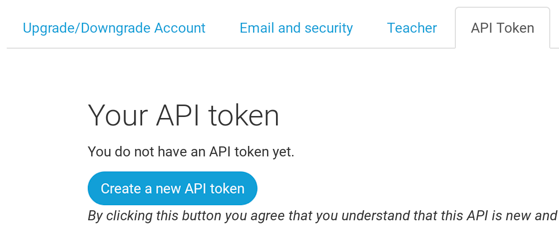

PythonAnyway- ը ծառայություն է Python կոդի «ամպի մեջ» ("in the cloud") սերվերների վրա աշխատելու համար: Մենք այն օգտագործում ենք ինտերնետում մեր կայքը տեղակայելու համար:

Գրանցվեք PythonAnywhere հաշիվը որպես "Beginner" («Սկսնակ», անվճար տարբերակը բավարար է, կրեդիտ քարտ չի պահանջվում):

* [www.pythonanywhere.com](https://www.pythonanywhere.com/)

> **Նշում** . Օգտանուն ընտրելիս հիշեք, որ բլոգի URL-ը կունենա այսպիսի տեսք `yourusername.pythonanywhere.com`, այնպես որ ընտրեք կամ ձեր սեփական մականունը կամ բլոգի թեմային վերաբերող անուն: Նաև համոզվեք, որ կհիշեք ձեր գաղտնաբառը (ավելացրեք այն ձեր գաղտնաբառերի կառավարչին,եթե նման բան օգտագործում եք):

## PythonAnywhere- ում API token-ի (նշանի) ստեղծում

Սա մի բան է, որը դուք պետք է անեք միայն մեկ անգամ: Երբ գրանցվեք PythonAnywhere- ում, ձեզ կտեղափոխեն կառավարման վահանակ (dashboard): Գտեք ձեր "Account" (հաշիվ) էջի վերևի աջ մասի հղումը ՝

ապա ընտրեք "API token" անունով ներդիրը և սեղմեք "Create new API token". (ստեղծել նոր API նշան) կոճակը:

