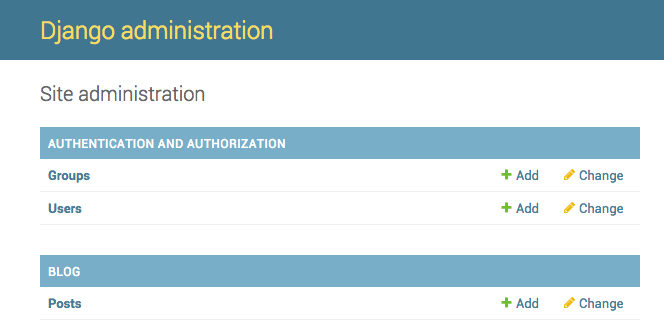

# Django ադմին

Հենց նոր մոդելավորված գրառումները ավելացնելու, խմբագրելու և ջնջելու համար մենք կօգտագործենք Django ադմինիստրատորը:

Բացեք `blog/admin.py` ֆայլը ծածկագրի խմբագրում և դրա բովանդակությունը փոխարինեք հետևյալով.

blog/admin.py 

```python
from django.contrib import admin
from .models import Post

admin.site.register(Post)
```

Ինչպես տեսնում եք, մենք ներմուծել ենք (include-ներառել) Post-ի մոդելը, որը սահմանված էր նախորդ գլխում: Որպեսզի մեր մոդելը հասանելի լինի ադմինիստրատորի էջում, մենք պետք է այն գրանցենք ՝ օգտագործելով այս `admin.site.register(Post)` գրառումը:

Լավ, ժամանակն է նայել մեր Post մոդելը: Հիշեք, որ վեբ սերվերը գործարկելու համար վահանակում գործարկեք այս `python manage.py runserver` հրամանը: Գնացեք ձեր browser (դիտարկիչ) և մուտքագրեք այս http://127.0.0.1:8000/admin/ հասցեն: Դուք կտեսնեք մուտքի թույլտվության էջ.


Մուտք գործելու համար հարկավոր է ստեղծել *superuser* ՝ օգտվողի հաշիվ, որն ամբողջությամբ վերահսկում է կայքը: Վերադարձեք հրամանի տող, մուտքագրեք `python manage.py createsuperuser` և սեղմեք Enter:

> Հիշեք ՝ վեբ սերվերի գործարկման ընթացքում նոր հրամաններ գրելու համար բացեք նոր տերմինալային պատուհան և ակտիվացրեք ձեր վիրտուալ միջավայրը (virtualenv): Մենք վերանայեցինք, թե ինչպես գրել նոր հրամաններ ** Ձեր առաջին Django նախագիծը ** (Your first Django project)գլուխը, **Մեկնարկելով վեբ սերվերը** (Starting the web server) բաժնում:

macOS or Linux:

    (myvenv) ~/djangogirls$ python manage.py createsuperuser
    

Windows:

    (myvenv) C:\Users\Name\djangogirls> python manage.py createsuperuser
    

Երբ ձեզ հուշում են, մուտքագրեք ձեր օգտվողի անունը (փոքրատառով, առանց բացատներ), էլ. Փոստի հասցեն և գաղտնաբառը: ** Մի անհանգստացեք, որ չեք կարող տեսնել ձեր մուտքագրած գաղտնաբառը, դա բնական է ** Մուտքագրեք այն և սեղմեք `enter` շարունակելու համար: Արդյունքը պետք է ունենա այսպիսի տեսք (որտեղ օգտագործողի անունը և էլ. փոստը պետք է լինեն ձեր սեփականը).

    Username: ola
    Email address: ola@example.com
    Password:
    Password (again):
    Superuser created successfully.
    

Վերադարձեք ձեր բրաուզեր (browser) և մուտք գործեք ձեր ընտրած օգտվողի անունով և գաղտնաբառով: Այնուհետև Դուք պետք է տեսնեք Django կառավարման վահանակ (Django admin dashboard):



Գնացեք գրառումներ/ Posts բաժին և մի փոքր փորձարկեք այն: Ավելացրեք հինգ կամ վեց բլոգային գրառումներ (blog posts): Մի անհանգստացեք բովանդակության համար. Դուք այն տեսնում եք միայն ձեր տեղական համակարգչում. Դուք կարող եք պատճենել և տեղադրել տեքստը այս ձեռնարկից ՝ ժամանակ խնայելու համար: :)

Համոզվեք, որ առնվազն երկու կամ երեք գրառում (բայց ոչ բոլորը) հրապարակման ամսաթիվ ունեն: Ապագայում դա կարող է օգտակար լինել:


Եթե ​​ցանկանում եք ավելին իմանալ Django- ի ադմինիստրատորի մասին, տես պաշտոնական փաստաթղթերի այս բաժինը ՝ https://docs.djangoproject.com/en/2.2/ref/contrib/admin/

Հավանաբար, ճիշտ ժամանակն է մեկ բաժակ սուրճով (կամ թեյով) ինքներդ ձեզ ոքևորելու և ձեր էներգիան լրացնելու համար ինչ-որ բան ուտելու համար: Դուք պարզապես ստեղծեցիք ձեր առաջին Django մոդելը և արժանի եք ընդմիջման: