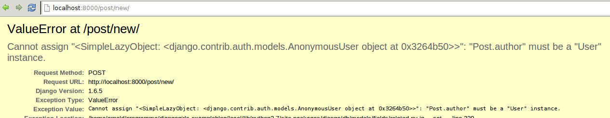
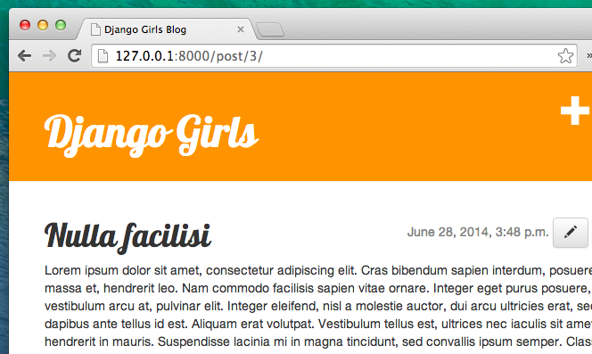

# Django ֆորմաներ 

Վերջին բանը, որ մենք ուզում ենք անել մեր կայքում, բլոգի գրառումներն ավելացնելու և խմբագրելու հարմարավետ միջոց ստեղծելն է: Django- ի `admin` -ը (ադմինիստրատորը) հիանալի է, բայց դրա դիզայնը դժվար է փոխել: `forms` -ի հետ մենք բացարձակ վերահսկողություն կունենանք մեր ինտերֆեյսի վրա: Մենք կարող ենք իրագործել գրեթե այն ամենը, ինչ կարող ենք պատկերացնել:

Django ձևերի (Django forms-ի) մեջ հաճելին այն է, որ մենք կարող ենք զրոյից ստեղծել նոր ձև, կամ օգտագործել `ModelForm`-ը ՝ ձևերի պարունակությունը մոդելում պահելու համար: 

Սա հենց այն է, ինչ մենք ուզում ենք անել. Մենք ձև կստեղծենք `Post` մոդելի համար:

Ինչպես Django-ի յուրաքանչյուր կարեւոր մաս, ձևերը (forms) նույնպես ունեն իրենց սեփական ֆայլը . ` form.py `:

Մենք պետք է այս անունով ֆայլ ստեղծենք `blog` գրացուցակում:

    blog
       └── forms.py
    

Շատ լավ, եկեք բացենք այն կոդերի խմբագրում և մուտքագրենք հետևյալ կոդը.

blog/forms.py

```python
django ներմուծման ձևերից

.models- ից ներմուծում են Post

դասի PostForm (forms. ModelForm):

    class Meta:
        model = Post
        fields = ('title', 'text',)


```

Նախ մենք պետք է ներմուծենք Django ձևերը/Django forms (`from django import forms` /django ներմուծման ձևերից) և մեր `Post` մոդելը/model (` .models- ից ներմուծում ենք Post `):

` PostForm ` - ը, ինչպես, հավանաբար, ենթադրում եք, մեր ձևի անունն է: Մենք պետք է Django- ին ասենք, որ այս ձևը ` ModelForm ` է (այնպես որ Django- ն ինչ-որ կախարդանք անի մեզ համար). դրա համար պատասխանատու է `forms.ModelForm` - ը:

Հաջորդը, մենք ունենք ` class Meta `, որտեղ մենք սահմանում ենք (Django- ին), թե որ մոդելը կօգտագործվի այս ձևը ստեղծելու համար (` model = Post `): 

Վերջապես, մենք կարող ենք հստակեցնել, թե որ դաշտը (կամ դաշտերը) պետք է առկա լինեն մեր ֆորմայում: Այս սցենարում մենք ուզում ենք միայն ` title (վերնագիրը) ` և ` text(տեքստը) ` ցուցադրվեն. Հեղինակը պետք է լինի այն օգտվողը, ով մուտք է գործել իր օգտվողի անունով (այսինքն դու!) և ` created_date(ստեղծված_ ամսաթիվը) `պետք է ավտոմատ կերպով տեղադրվի գրառման ստեղծման ժամանակ (այսինքն ՝ կոդով), այնպես չէ՞: 

Եվ վերջ այսքանը! Մեզ մնում է միայն օգտագործել ձևը *view* և ցուցադրել այն template-ում(ձևանմուշում):

Այսպիսով, մեկ անգամ ևս մենք կստեղծենք link(հղում) դեպի էջ, URL, դիտում և template (ձևանմուշ):

## Link (Հղում) դեպի էջի ձևը

Հղումը չավելացնելուց առաջ մեզ պետք են մի քանի պատկերակներ, որոնք կօգտագործվեն որպես հղման կոճակներ: Այս ձեռնարկի համար ներբեռնեք [ file-earmark-plus.svg ](https://raw.githubusercontent.com/twbs/icons/main/icons/file-earmark-plus.svg) և պահեք այն ` blog/templates/blog/icons/ ` թղթապանակում:

> Նշում. SVG պատկերը ներբեռնելու համար բացեք համատեքստային ընտրացանկը հղման վրա (սովորաբար դրա վրա աջ կտտացնելով) և ընտրեք <<Save link as>> («Պահել հղումը որպես»): Պատուհանում հարցնելով, թե որտեղ պետք է ֆայլը պահպանել, անցեք ձեր Django նախագծի ` djangogirls ` գրացուցակը, իսկ դրա ներքո ՝ ` blog/templates/blog/icons/ ` ենթագրացուցակ, և ֆայլը այնտեղ պահեք:

Codeամանակն է ծածկագրի խմբագրում բացել `blog/templates/blog/base.html`: Այժմ մենք կարող ենք օգտագործել այս պատկերակային ֆայլը բազային ձևանմուշի մեջ ՝ հետևյալ կերպ. ` div ` տարրում ` headrer ` բաժնում, մենք կավելացնենք հղում ` h1 ` տարրից առաջ.

blog/templates/blog/base.html

```html
<a href="" class="top-menu">
    
</a>
```

Նկատի ունեցեք, որ մենք ուզում ենք մեր նոր տեսակետը կոչել ` post_new `: [SVG icon](https://icons.getbootstrap.com/icons/file-earmark-plus/) տրամադրվում է [Bootstrap Icons ](https://icons.getbootstrap.com/) կողմից, և դրանում կցուցադրվի էջի պատկերակ `գումարած նշանով: Մենք օգտագործում ենք Django ձևանմուշի դիրեկտիվը, որը կոչվում է `include `: Սա ֆայլի պարունակությունը կներարկի Django ձևանմուշում: Վեբ զննարկիչը գիտի, թե ինչպես վարվել այս տեսակի բովանդակության հետ `առանց հետագա մշակման:

> Bootstrap- ի բոլոր պատկերակները կարող եք ներբեռնել [ here](https://github.com/twbs/icons/releases/download/v1.1.0/bootstrap-icons-1.1.0.zip): Անջատեք ֆայլը և պատճենեք բոլոր SVG պատկերային ֆայլերը ` blog/templates/blog/ ` ներսում գտնվող նոր պանակի մեջ, որը կոչվում է ` icons `: Այդ կերպ Դուք կարող եք մուտք գործել ` pencil-fill.svg ` պես պատկերակ ՝ օգտագործելով ֆայլի ուղի `blog/templates/blog/icons/pencil-fill.svg `

Տողը խմբագրելուց հետո ձեր HTML ֆայլը այժմ պետք է ունենա այսպիսի տեսք.

blog/templates/blog/base.html

```html

<!DOCTYPE html>
<html>
    <head>
        <title>Django Girls blog</title>
        <link rel="stylesheet" href="https://cdn.jsdelivr.net/npm/bootstrap@4.5.3/dist/css/bootstrap.min.css" integrity="sha384-TX8t27EcRE3e/ihU7zmQxVncDAy5uIKz4rEkgIXeMed4M0jlfIDPvg6uqKI2xXr2" crossorigin="anonymous">
        <link href='//fonts.googleapis.com/css?family=Lobster&subset=latin,latin-ext' rel='stylesheet' type='text/css'>
        <link rel="stylesheet" href="">
    </head>
    <body>
        <header class="page-header">
            <div class="container">
                <a href="" class="top-menu">
                    
                </a>
                <h1><a href="/">Django Girls Blog</a></h1>
            </div>
        </header>
        <main class="content container">
            <div class="row">
                <div class="col">
                    
                    
                </div>
            </div>
        </main>
    </body>
</html>
```

http://127.0.0.1:8000 էջը փրկելուց և թարմացնելուց հետո կտեսնեք ծանոթ ` NoReverseMatch ` error(սխալ) : Այդպե՞ս է: Լավ

## URL

Կոդի խմբագրում բացում ենք ` blog/urls.py` և ավելացնում տող.

blog/urls.py

```python
path('post/new/', views.post_new, name='post_new'),
```

Եվ վերջնական ծածկագիրը կտեսնի այսպես.

blog/urls.py

```python
from django.urls import path
from . import views

urlpatterns = [
    path('', views.post_list, name='post_list'),
    path('post/<int:pk>/', views.post_detail, name='post_detail'),
    path('post/new/', views.post_new, name='post_new'),
]
```

Կայքը թարմացնելուց հետո մենք տեսնում ենք ` AttributeError `, քանի որ իրականացված չենք ` post_new ` դիտումը: Եկեք ավելացնենք հենց հիմա:

## post_new view

բացեք ` բլոգը / views.py ` ֆայլը ծածկագրի խմբագրում և ավելացնել տողերի մնացած տողերի հետևյալ տողերը. 

blog/views.py

```python
.forms- ից ներմուծում է PostForm
```

Եվ հետո մեր * տեսակետը *:

 blog/views.py 

```python
def post_new(request):
    form = PostForm()
    return render(request, 'blog/post_edit.html', {'form': form})
```

Նոր ` Post ` ձև ստեղծելու համար հարկավոր է զանգահարել ` PostForm () ` և փոխանցել այն ձևանմուշին: Մենք կվերադառնանք այս *view*, բայց առայժմ արագ եկեք ձևանմուշ ստեղծենք ձևի համար:

## Կաղապար

Մենք պետք է ` post_edit.html` գրացուցակում ` blog/templates/blog` ֆայլ ստեղծենք և բացենք այն կոդերի խմբագրում: Ձևը գործ դնելու համար մեզ մի քանի բան է պետք.

* Մենք պետք է ցուցադրենք ձևը: Մենք կարող ենք դա անել (օրինակ) `{{ form.as_p }}` - ով:
* Վերևի տողը պետք է փաթաթված լինի HTML ձևի տարրով. `<form method="POST"> ... </form>`:
* Մեզ պետք է ` Save` կոճակը: Մենք դա անում ենք HTML կոճակի միջոցով. `<button type="submit"> Save </button>`:
* Եվ, վերջապես, `<form ...>` թեգը բացելուց անմիջապես հետո մենք պետք է ավելացնենք  `  ` : Սա շատ կարևոր է, քանի որ դրանով ապահովվում են ձեր ձևերի անվտանգությունը: Եթե ​​մոռանաք այս բիթի մասին, Django- ն կբողոքարկի, երբ փորձեք պահպանել ձևը.


Լավ, այնպես որ եկեք տեսնենք, թե ինչպես պետք է HTML- ը ` post_edit.html ` - ում:

blog/templates/blog/post_edit.html

```html



    <h2>New post</h2>
    <form method="POST" class="post-form">
        {{ form.as_p }}
        <button type="submit" class="save btn btn-default">Save</button>
    </form>

```

Թարմացնելու ժամանակն է: Այո Ձեր ձևը ցուցադրվում է:


Բայց սպասեք մի րոպե: Երբ ինչ-որ բան եք մուտքագրում ` title ` և ` title ` դաշտերում և փորձում եք այն պահպանել, ի՞նչ կլինի:

Ոչինչ Մենք նորից նույն էջում ենք, և մեր տեքստը այլևս չկա ... և ոչ մի նոր գրառում չի ավելացվում: Այսպիսով, ի՞նչն է սխալ եղել: 

Պատասխանն է. Ոչինչ: Մենք պետք է մի փոքր ավելի շատ աշխատանք կատարենք մեր * view*:

## Ձևը պահելը

Մեկ անգամ եւս բացեք ` blog/views.py ` կոդը խմբագրիչի մեջ: Ներկայումս ` post_new ` տեսքում մենք ունենք միայն հետևյալը.

blog/views.py

```python
def post_new(request):
    form = PostForm()
    return render(request, 'blog/post_edit.html', {'form': form})
```

Ձևը ներկայացնելիս մեզ հետ են բերում նույն տեսակետը, բայց այս անգամ մենք ունենք ևս մի քանի տվյալներ ` request` - ում, ավելի կոնկրետ ` request. POST ` (անվանումն ունի ոչ մի կապ չունի բլոգի "post"(«գրառման») հետ. դա կապ ունի այն փաստի հետ, որ մենք "psoting" («տեղադրում ենք») տվյալներ): Հիշո՞ւմ եք, թե ինչպես HTML ֆայլում մեր `<form>` սահմանումն ուներ փոփոխական ` method="POST" `: Ձևի բոլոր դաշտերն այժմ գտնվում են ` request.POST `: Դուք չպետք է վերանվանեք ` POST ` ը որևէ այլ բանի (` method ` միակ այլ վավեր արժեքը ` GET ` է, բայց մենք ժամանակ չունենք բացատրելու, թե ինչ տարբերություն է):

Այսպիսով, մեր * view* մենք ունենք կարգավորման երկու առանձին իրավիճակ. Առաջին ՝ երբ մենք առաջին անգամ մուտք ենք գործում էջ և ուզում ենք դատարկ ձև, և երկրորդ, երբ վերադառնում ենք * view* բոլոր մուտքագրված ձևի տվյալներով: Այսպիսով, մենք պետք է պայման դնենք (դրա համար կօգտագործենք ` if `):

blog/views.py

```python
if request.method == "POST":
    [...]
else:
    form = PostForm()
```

Լրացրեք կետերը ` [...] `: Եթե ​​` method` ` POST ` է, ապա մենք ուզում ենք կառուցել ` PostForm- ը ` ձևից ստացված տվյալներով, այնպես չէ՞: Մենք դա կանենք հետևյալ կերպ.

 blog/views.py

```python
form = PostForm(request.POST)
```

Հաջորդ բանը `ստուգել, ​​թե արդյոք ձևը ճիշտ է (բոլոր պահանջվող դաշտերը դրված են և սխալ արժեքներ չեն ներկայացվել): Մենք դա անում ենք ` form.is_valid () ` - ի միջոցով:

Մենք ստուգում ենք, արդյոք ձևը վավեր է, և եթե այո, ապա այն կարող ենք պահպանել:

blog/views.py

```python
if form.is_valid():
    post = form.save(commit=False)
    post.author = request.user
    post.published_date = timezone.now()
    post.save()
```

Ըստ էության, մենք այստեղ ունենք երկու բան. Մենք ձևը պահում ենք ` form.save ` և ավելացնում ենք հեղինակ. ` commit = False ` նշանակում է, որ մենք դեռ չենք ուզում պահպանել ` Post ` մոդելը. Մենք նախ ուզում ենք ավելացնել հեղինակին: Շատ ժամանակ դուք կօգտագործեք ` form.save () ` առանց ` commit = False `, բայց այս դեպքում մենք պետք է այն մատակարարենք: ` post.save () ` կպահպանի փոփոխությունները (ավելացնելով հեղինակին) և կստեղծվի բլոգում նոր գրառում:

Վերջապես, զարմանալի կլիներ, եթե մենք կարողանայինք անմիջապես անցնել ` post_detail ` էջը մեր նորաստեղծ բլոգում տեղադրելու համար, այնպես չէ՞: Դա անելու համար մեզ անհրաժեշտ է ևս մեկ ներմուծում.

blog/views.py

```python
from django.shortcuts import redirect
```

Ավելացրեք այն ձեր ֆայլի հենց սկզբում: Եվ հիմա մենք կարող ենք ասել. «Անցեք ` post_detail ` էջը նորաստեղծ գրառման համար».

blog/views.py

```python
return redirect('post_detail', pk=post.pk)
```

` post_detail ` այն տեսքի անունն է, որին մենք ցանկանում ենք այցելել: Հիշո՞ւմ եք, որ այս * view* պահանջում է ` pk ` փոփոխական: Այն դիտումներին փոխանցելու համար մենք օգտագործում ենք ` pk = post.pk `, որտեղ ` post` նոր ստեղծվող բլոգային գրառում է:

Լավ, մենք շատ ենք խոսել, բայց հավանաբար ուզում ենք տեսնել, թե ինչպիսին է այժմ * view * ճիշտ է:

 բլոգ /views.py 

```python
def post_new(request):
    if request.method == "POST":
        form = PostForm(request.POST)
        if form.is_valid():
            post = form.save(commit=False)
            post.author = request.user
            post.published_date = timezone.now()
            post.save()
            return redirect('post_detail', pk=post.pk)
    else:
        form = PostForm()
    return render(request, 'blog/post_edit.html', {'form': form})
```

Տեսնենք ՝ կաշխատի՞: Անցեք http://127.0.0.1:8000/post/new/ էջին, ավելացրեք `վերնագիր` և `տեքստ`, պահեք այն… և voilà: Ավելացվեց բլոգի նոր գրառումը, և մենք վերահասցեագրվում ենք ` հաղորդագրության_մանրամասնություն ` էջ:

Գուցե նկատած լինեիք, որ մենք տեղադրում ենք հրապարակման ամսաթիվը նախքան հաղորդագրությունը պահելը: Ավելի ուշ, մենք կներկայացնենք * հրապարակման կոճակ * ** Django Girls Tutorial- ում ՝ Extensions **:

Դա հիանալի է!

> Քանի որ մենք վերջերս օգտագործել ենք Django ադմինիստրատորի միջերեսը, համակարգը ներկայումս կարծում է, որ մենք դեռ մուտք ենք գործել: Կան մի քանի իրավիճակներ, որոնք կարող են հանգեցնել մեզ դուրս գալուն (զննարկիչը փակելը, DB- ն վերագործարկելը և այլն): Եթե ​​հաղորդագրություն ստեղծելիս հայտնաբերում եք, որ սխալներ եք գրանցում մուտք գործած օգտվողի բացակայության վերաբերյալ, ապա անցեք ադմինիստրատորի էջ http://127.0.0.1:8000/admin և կրկին մուտք գործեք: Դրանով խնդիրը ժամանակավորապես կկարգավորվի: ** Տնային առաջադրանք. Ձեզ սպասում է մշտական ​​շտկում ՝ հիմնական ձեռնարկից հետո անվտանգություն ավելացրեք ձեր կայքում: **



## Ձևի վավերացում

Այժմ մենք ձեզ ցույց կտանք, թե որքան զով են Django- ի ձևերը: Բլոգի գրառումը պետք է ունենա ` title ` և ` text ` դաշտեր: Մեր ` Post` մոդելում մենք չասացինք, որ այս դաշտերը (ի տարբերություն ` published_date `) չեն պահանջվում, ուստի Django- ն, ըստ նախնականի, ակնկալում է, որ դրանք կսահմանվեն:

Փորձեք պահպանել ձևը առանց ` title ` և ` text `: Գուշակիր, թե ինչ կլինի:


Django- ն հոգ է տանում հաստատելու, որ մեր ձևի բոլոր դաշտերը ճիշտ են: Հիանալի չէ՞:

## Խմբագրել ձևը

Այժմ մենք գիտենք, թե ինչպես ավելացնել նոր գրառում: Բայց ի՞նչ կլինի, եթե մենք ուզում ենք խմբագրել գոյություն ունեցողը: Սա շատ նման է մեր արածին: Եկեք արագ ստեղծենք մի քանի կարևոր բաներ: (Եթե ինչ-որ բան չեք հասկանում, պետք է հարցնեք ձեր մարզչին կամ նայեք նախորդ գլուխներին, քանի որ մենք արդեն ծածկել ենք այս բոլոր քայլերը):

Նախ, եկեք պահենք պատկերակը, որը ներկայացնում է խմբագրման կոճակը: Ներբեռնեք [ pencil-fill.svg ](https://raw.githubusercontent.com/twbs/icons/main/icons/pencil-fill.svg) - ը և այն պահեք ` blog/templates/blog/icons/`:

Կոդի խմբագրում բացեք `blog/templates/blog/post_detail.html` և `article` էլեմենտի մեջ ավելացրեք հետևյալ ծածկագիրը.

blog/templates/blog/post_detail.html

```html
<aside class="actions">
    <a class="btn btn-default" href="">
      
    </a>
</aside>
```

այնպես, որ ձևանմուշն այսպիսին լինի.

 բլոգ / ձևանմուշներ / բլոգ / post_detail.html 

```html



    <article class="post">
        <aside class="actions">
            <a class="btn btn-default" href="">
                
            </a>
        </aside>
        
            <time class="date">
                {{ post.published_date }}
            </time>
        
        <h2>{{ post.title }}</h2>
        <p>{{ post.text|linebreaksbr }}</p>
    </article>

```

Բացեք ` blog/urls.py ` ծածկագրի խմբագրում և ավելացրեք այս տողը.

blog/urls.py

```python
    path('post/<int:pk>/edit/', views.post_edit, name='post_edit'),
```

Մենք կրկին կօգտագործենք ` blog/templates/blog/post_edit.html ` ձևանմուշը, այնպես որ վերջին բացակայողը * view -է*:

Եկեք բացենք ` blog/views.py` ծածկագրի խմբագրում և ավելացնենք սա ֆայլի հենց վերջում.

blog/views.py

```python
def post_edit(request, pk):
    post = get_object_or_404(Post, pk=pk)
    if request.method == "POST":
        form = PostForm(request.POST, instance=post)
        if form.is_valid():
            post = form.save(commit=False)
            post.author = request.user
            post.published_date = timezone.now()
            post.save()
            return redirect('post_detail', pk=post.pk)
    else:
        form = PostForm(instance=post)
    return render(request, 'blog/post_edit.html', {'form': form})
```

Սա կարծես գրեթե նույնն է, ինչ մեր ` post_new ` տեսակետը: Բայց ոչ ամբողջությամբ: Մեկի համար մենք ` url- ից ` փոխանցում ենք լրացուցիչ ` pk ` պարամետր: Հաջորդը, մենք ստանում ենք ` Post ` մոդելը, որը ցանկանում ենք խմբագրել ` get_object_or_404(Post, pk=pk)`, իսկ հետո, երբ ձև ենք ստեղծում, այս գրառումն անցնում ենք որպես ` instance`, այնպես էլ, երբ ձևը պահում ենք

blog/views.py

```python
form = PostForm(request.POST, instance=post)
```

… Եվ երբ մենք այս գրառմամբ նոր բացեցինք ձևաթուղթ ՝ խմբագրելու համար.

blog/views.py

```python
form = PostForm(instance=post)
```

Լավ, եկեք փորձենք, արդյոք այն աշխատում է: Եկեք գնանք ` post_detail` էջին: Վերին աջ անկյունում պետք է լինի խմբագրման կոճակ.



Երբ կտտացրեք այն, կտեսնեք ձևը մեր բլոգի գրառման հետ.


Ազատորեն փոխեք վերնագիրը կամ տեքստը և պահպանեք փոփոխությունները:

Շնորհավորում եմ Ձեր դիմումը ավելի ու ավելի ամբողջական է դառնում:

Եթե ​​Django ձևերի վերաբերյալ ավելի շատ տեղեկատվության կարիք ունեք, պետք է կարդաք փաստաթղթերը. https://docs.djangoproject.com/hy/2.2/topics/forms/

## Անվտանգություն

Հղումը կտտացնելով նոր հաղորդագրություններ ստեղծելու կարողությունը զարմանալի է: Բայց հենց հիմա, յուրաքանչյուր ոք, ով այցելում է ձեր կայք, կկարողանա նոր բլոգային գրառում կատարել, և դա, հավանաբար, ձեր ուզածը չէ: Եկեք այնպես անենք, որ կոճակը ցուցադրվի ձեզ համար, բայց ոչ ուրիշ մեկի:

Բացեք ` blog/templates/blog/base.html` կոդերի խմբագրում, գտեք մեր ` div ` ` վերնագրի ներսում ` և խարիսխի տարրը, որը դուք ավելի վաղ այնտեղ եք տեղադրել , Այն պետք է ունենա այսպիսի տեսք.

blog/templates/blog/base.html

```html
<a href="" class="top-menu">
    
</a>
```

Մենք դրան կավելացնենք ևս `  ` պիտակը, որը կստիպի հղումը ցույց տալ միայն այն ադմինիստրատոր մուտք գործած օգտվողների համար: Հենց հիմա, դու հենց դու ես: Փոխեք `<a>` տարրը ՝ այսպիսի տեսք ունենալու համար.

blog/templates/blog/base.html

```html

    <a href="" class="top-menu">
        
    </a>

```

Սա `  ` կհանգեցնի այն, որ հղումը կուղարկվի զննարկիչ, միայն եթե էջը հայցող օգտվողը մուտք է գործում: Սա ամբողջությամբ չի պաշտպանում նոր հաղորդագրությունների ստեղծումը, բայց դա լավ առաջին քայլ է: Մենք ավելի շատ անվտանգություն ենք ծածկելու ընդլայնման դասերին:

Հիշո՞ւմ եք խմբագրման պատկերակը, որը մենք պարզապես ավելացրել ենք մեր մանրամասն էջին: Մենք ուզում ենք նաև նույն փոփոխությունն ավելացնել այնտեղ, այնպես որ այլ մարդիկ չեն կարողանա խմբագրել առկա հաղորդագրությունները:

Բացեք ` blog/templates/blog/post_detail.html` կոդերի խմբագրում և գտեք այս տողը.

blog/templates/blog/post_detail.html

```html
<a class="btn btn-default" href="">
    
</a>
```

Փոխեք այն այստեղ ՝

blog/templates/blog/post_detail.html

```html

     <a class="btn btn-default" href="">
        
     </a>

```

Քանի որ, ամենայն հավանականությամբ, մուտք եք գործել կայք, եթե թարմացնեք էջը, այլ բան չեք տեսնի: Էջը բեռնեք այլ զննարկչում կամ ինկոգնիտո պատուհանում (Windows Edge- ում կոչվում է «InPrivate»), և կտեսնեք, որ հղումը չի ցուցադրվում, և պատկերակը նույնպես չի ցուցադրվում:

## Եվս մեկ բան. Տեղաբաշխեք ժամանակ:

Տեսնենք, արդյոք այս ամենը աշխատում է PythonAnywhere- ում: Anotherամանակն է նոր տեղակայման:

* Նախ, կատարեք ձեր նոր ծածկագիրը և սեղմեք այն դեպի GitHub:

command-line

    $ git status
    $ git add .
    $ git status
    $ git commit -m "Added views to create/edit blog post inside the site."
    $ git push
    

* Հետո, [ PythonAnywhere Bash կոնսոլում ](https://www.pythonanywhere.com/consoles/)

PythonAnywhere command-line

    $ cd ~/<your-pythonanywhere-domain>.pythonanywhere.com
    $ git pull
    [...]
    

(Մի մոռացեք փոխարինել `<your-pythonanywhere-domain>` ձեր իրական PythonAnywhere ենթադոմեյնով ՝ առանց անկյունային փակագծերի:)

* Ի վերջո, անցեք [ "Web" page](https://www.pythonanywhere.com/web_app_setup/) (օգտագործեք մենյուի վերևի աջ մասում ընտրացանկի կոճակը) և սեղմեք ** Reload**: Թարմացրեք ձեր https://subdomain.pythonanywhere.com բլոգը ՝ փոփոխությունները տեսնելու համար:

Եվ դա պետք է լինի դա: Շնորհավորանքներ :)