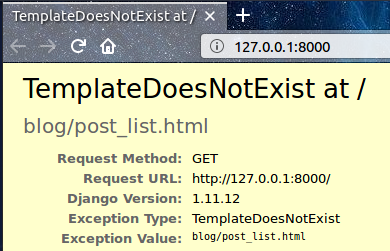

# Django- ի դիտում. Ստեղծագործելու ժամանակն է:

Ժամանակն է ազատվել այն սխալից, որի հետ մենք բախվեցինք վերջին գլխում: :)

*view/տեսարանը * այն հատվածն է, որտեղ տեղադրում ենք մեր հավելվածի «տրամաբանությունը»: Այն տեղեկատվություն կխնդրի ձեր ստեղծած նախկին `model`-ից և կփոխանցի `template/ձևանմուշ`-ին: Հաջորդ գլխում շաբլոն/template կստեղծենք: Views/Դիտումները պարզապես Python գործառույթներ/ Python functions են, որոնք մի փոքր ավելի բարդ են, քան այն, ինչ մենք գրել ենք **Introduction to Python/Python- ի «Ներածություն»** գլխում:

Դիտումները տեղակայված են ` views.py ` ֆայլում: Մենք կավելացնենք մեր *views/դիտումները * `blog/views.py`- ին:

## blog/views.py

Լավ, եկեք բացենք այս ֆայլը մեր կոդի խմբագրում/code editor և տեսնենք, թե ինչ կա այնտեղ:

blog/views.py

```python
from django.shortcuts import render

# Create your views here.
```

Այստեղ դեռ շատ բան չկա:

Հիշեք, որ ` # ` - ով սկսվող տողերը մեկնաբանություններ են. դա նշանակում է, որ այս տողերը չեն աշխատի Python- ում:

Եկեք ստեղծենք *view/տեսակետ*, ինչպես հուշում է մեկնաբանությունը: Դրա տակ ավելացրեք հետևյալ նվազագույն տեսքը.

blog/views.py

```python
def post_list(request):
    return render(request, 'blog/post_list.html', {})
```

Ինչպես տեսնում եք, մենք ստեղծել ենք `post_list` անունով մի (`def`) մեթոդ, որը `request/խնդրանք` -ը որպես փաստարկ է վերցնում և `return/վերադարձնում` է `render/մատուցման ` մեթոդի արդյունքը, որը հավաքելու է մեր `blog/post_list.html` էջի ձևանմուշը:

Պահեք ֆայլը, անցեք այստեղ հղումով http://127.0.0.1:8000/ և տեսեք, թե ինչ ունենք:

Եվս մեկ սխալ: Կարդացեք, թե ինչ է կատարվում հիմա ՝



Սա ցույց է տալիս, որ սերվերը գոնե նորից է աշխատում, բայց նրա աշխատանքի ընթացքը դեռ սխալ է թվում, ճի՞շտ է: Մի անհանգստացեք, սա պարզապես սխալի էջ է, վախենալու ոչինչ չկա: Ինչպես և վահանակի սխալի հաղորդագրությունները, այս հաղորդագրությունները նույնպես օգտակար են: Կարող եք կարդալ, որ *TemplateDoesNotExist*: Եկեք շտկենք այս սխալը և ձևանմուշ/template ստեղծենք հաջորդ գլխում:

> Իմացեք ավելին Django- ի տեսակետների/Django views-ի մասին `կարդալով պաշտոնական փաստաթղթերը. https://docs.djangoproject.com/en/2.2/topics/http/views/