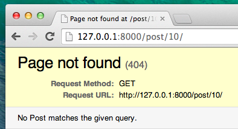
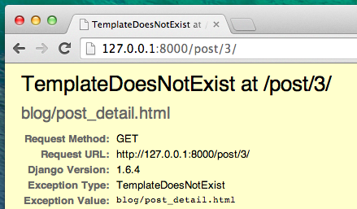



# Ընդլայնել հավելվածը.

Մենք արդեն ավարտել ենք մեր կայքի ստեղծման համար անհրաժեշտ բոլոր տարբեր քայլերը. Մենք գիտենք, թե ինչպես գրել մոդել, URL, դիտում և ձևանմուշ: Մենք նաև գիտենք, թե ինչպես կարելի է գեղեցիկ դարձնել մեր կայքը:

Պրակտիկայի ժամանակն է:

Բլոգում առաջին բանը, որ մեզ պետք է, հատուկ գրառումներ բացելու էջն է, այնպես չէ՞:

Մենք դեռ ունենք `Post` մոդել, ուստի հարկավոր չէ որևէ լրացուցիչ կոդ ավելացնել մեր `models.py` ֆայլին:

## Ստեղծեք ձևանմուշի հղում դեպի գրառման մանրամասներ

Մենք կսկսենք այս `blog/templates/blog/post_list.html` ֆայլի ներսում հղում ավելացնելով: Բացեք այն ձեր կոդերի խմբագրում, և այժմ այն ​​պետք է ունենա այսպիսի տեսք. blog/templates/blog/post_list.html

```html



    
        <article class="post">
            <time class="date">
                {{ post.published_date }}
            </time>
            <h2><a href="">{{ post.title }}</a></h2>
            <p>{{ post.text|linebreaksbr }}</p>
        </article>
    

```

 Մենք կցանկանայինք ցուցակում գրառման վերնագրից (post's title in the post list) հղում ունենալ գրառման մանրամասների (post's detail) էջին: Եկեք փոխենք `<h2><a href="">{{ post.title }}</a></h2>` այնպես, որ այն հղվի հաղորդագրության մանրամասն էջին ՝ 

{{ warning_icon }} blog/templates/blog/post_list.html

```html
<h2><a href="">{{ post.title }}</a></h2>
```

 toամանակն է բացատրել խորհրդավոր ``: Ինչպես կարող եք ենթադրել, այս ``նշումը նշանակում է, որ մենք օգտագործում ենք Django ձևանմուշի պիտակները/ Django template tags.: Այս անգամ մենք կօգտագործենք այն մեկը, որը մեզ համար URL կստեղծի: 

` post_detail ` մասը նշանակում է, որ Django- ն սպասում է URL- ի`blog/urls.py` անունով = post_detail

Իսկ ինչ վերաբերում է `pk=post.pk`- ին: `pk`- ն կարճ բանալին է, որը եզակի նույնացուցիչ է տվյալների բազայում յուրաքանչյուր գրառման համար: Յուրաքանչյուր Django մոդել ունի մի դաշտ, որը ծառայում է որպես իր հիմնական բանալի, և նրա ցանկացած այլ անուն կարող է նաև անվանվել «pk»: Քանի որ մենք չենք սահմանել հատուկ առաջնային բանալի մեր `Post` մոդելի մեջ, Django- ն կստեղծի մեկը մեզ համար (անխոս, դա կլինի մի թիվ, որը յուրաքանչյուր հաղորդագրության համար ավելանում է մեկով, ինչպես 1, 2, 3) և այն ավելացնում է ` pk ` անունով դաշտին ՝ մեր յուրաքանչյուր գրառման համար: Մենք մուտք ենք գործում հիմնական բանալին ՝ մուտքագրելով ` post.pk `, նույն կերպ, ինչպես մուտք ենք գործում այլ դաշտեր (`title/վերնագիր`, `author/հեղինակ`, etc.) մեր `Post/Հրապարակել ` օբյեկտ:

Այժմ, երբ մենք գնանք http://127.0.0.1:8000/, մենք կունենանք սխալ (ինչպես սպասվում էր, քանի որ մենք դեռ URL կամ *view/դիտում* չունենք `post_detail`- ի համար): Դա նման տեսք կունենա: 


## Ստեղծեք URL ՝ post's detail/գրառման մանրամասներ էջի համար

Եկեք `urls.py`- ում ստեղծենք URL մեր `post_detail` *view* համար:

Մենք ուզում ենք, որ մեր առաջին հաղորդագրության մանրամասները ցուցադրվեն այս **URL** - ում ՝ http://127.0.0.1:8000/post/1/

Եկեք `blog/urls.py` ֆայլում URL կազմենք ՝ Django- ին ուղղելու համար `post_detail`, անունով *view/դիտումը*-ն , որը ցույց կտա բլոգի մի ամբողջ գրառում: Բացեք `blog/urls.py` ֆայլը կոդերի խմբագրում և ավելացրեք այս տողը (`path('post/<int:pk>/', views.post_detail, name='post_detail'),`), որպեսզի ֆայլն այսպիսի տեսք ունենա.

{{ warning_icon }} blog/urls.py

```python
from django.urls import path
from . import views

urlpatterns = [
    path('', views.post_list, name='post_list'),
    path('post/<int:pk>/', views.post_detail, name='post_detail'),
]
```

Այս `post/<int:pk>/` մասը նշում է URL- ի օրինակը. Մենք ձեզ կբացատրենք ստորև.

- `post/` /գրառում նշանակում է, որ URL- ը պետք է սկսվի **post** բառով, որին կհաջորդի **/**: Առայժմ ամեն բան կարգին է:
- `<int:pk>` - այս հատվածը ավելի բարդ է: Դա նշանակում է, որ Django- ն ակնկալում է ամբողջ թվային արժեք և այն կփոխանցի view-ին որպես `pk` կոչվող փոփոխական:
- `/` - ապա մեզ պետք է կրկին այս նշանը **/**, մինչև url- ի ավարտը:

Սա նշանակում է, որ եթե ձեր բրաուզերում մուտքագրեք սա `http://127.0.0.1:8000/post/5/` , Django- ն պետք է հասկանա, որ ձեզ հարկավոր է *view*-ն որը կոչվող է ` post_detail `, և և փոխանցել այն տեղեկատվությունը, որը ` pk ` *հավասար է ` 5 ` այս <1>view*-ում:

Լավ, մենք URL- ի նոր օրինակ ենք ավելացրել `blog/urls.py`-ում: Եկեք թարմացնենք էջը ՝ http://127.0.0.1:8000/ Boom! Սերվերը կրկին դադարեցրել է աշխատանքը: Հայացք գցեք կոնսոլին. Ինչպես և սպասվում էր, ևս մեկ սխալ կա:


Հիշու՞մ եք, թե որն է հաջորդ քայլը: Դա view-ի/տեսակետ է ավելացնում:

## Ավելացնել հաղորդագրության մանրամասն տեսք/post's detail view

Այս անգամ մեր *view*-ին/ տեսակետին տրվում է լրացուցիչ պարամետր, `pk`. Մեր *view*-ն պետք է որսա, այնպես չէ՞: Այսպիսով, մենք մեր գործառույթը կսահմանենք որպես `def post_detail(request, pk):`. Նկատի ունեցեք, որ այս պարամետրը պետք է ունենա ճիշտ նույն անունը, ինչ որ մենք նշեցինք `urls` (`pk`) ներսում. Նկատի ունեցեք նաև, որ այս փոփոխականը բաց թողնելը սխալ է և կհանգեցնի սխալի:

Այժմ մենք ուզում ենք ստանալ մեկ և միայն մեկ բլոգային հաղորդագրություն: Դա անելու համար մենք կարող ենք օգտագործել հարցաթերթիկներ, ինչպես հետևյալը.

{{ warning_icon }} blog/views.py

```python
Post.objects.get(pk=pk)
```

Բայց այս ծածկագիրը խնդիր ունի: Եթե ​​`primary key` (`pk`) -ում (տրված առաջնային բանալում) `Post`/գրառում չկա, մենք կունենանք շատ տգեղ սխալ:


Մենք դա չենք ուզում: Բայց բարեբախտաբար, Django- ն շրջանցելու միջոց ունի, որը կկարգավորի դա մեզ համար. `get_object_or_404`: Այն դեպքում, երբ չկա `Post`/Հաղորդագրություն տրված ` pk ` -ի համար, մենք կստանանք շատ ավելի լավ էջ, որը կոչվում է `Page Not Found 404`/ Էջը չի գտնվել):



Լավ նորությունն այն է, որ դուք իրականում կարող եք ստեղծել ձեր սեփական `Page not found` / չգտնված էջը/ և այն դարձնել այնքան գեղեցիկ, որքան ցանկանում եք: Բայց դա հիմա այդքան էլ կարևոր չէ, ուստի մենք այն բաց կթողնենք:

Լավ, ժամանակն է մեր `views.py` ֆայլին *view* /դիտում ավելացնել:

`blog/urls.py`- ում մենք ստեղծեցինք URL կանոն `post_detail` անունով, որը վերաբերում է `views.post_detail` կոչվող դիտմանը: Սա նշանակում է, որ Django- ն `blog/views.py`- ի ներսում `post_detail` անունով գործառույթ կսպասարկի ներկայացնելու համար:

Ժամանակն է բացել `blog/views.py` ֆայլը կոդի խմբագրում և տողերի կողքին ավելացնել `from` հետևյալ տողերը.

blog/views.py

```python
from django.shortcuts import render, get_object_or_404
```

Եվ ֆայլի վերջում մենք կավելացնենք մեր *view* -ն:

blog/views.py

```python
def post_detail(request, pk):
    post = get_object_or_404(Post, pk=pk)
    return render(request, 'blog/post_detail.html', {'post': post})
```

Այո Էջը թարմացնելու ժամանակն է ՝ http://127.0.0.1:8000/


Աշխատում է! Ի՞նչ է պատահում, եթե փորձեք հետևել հաղորդագրության վերնագրի հղմանը:



Օ ոչ! Եվս մեկ սխալ! Բայց մենք արդեն գիտենք, թե ինչպես վարվել դրա հետ, ճիշտ է: Մենք պետք է ձևանմուշ/template ավելացնենք:

## Ստեղծեք ձևանմուշի հղում գրառման մանրամասների համար

Մենք `blog/templates/blog`-ում կստեղծենք ֆայլ, որը կոչվում է `post_detail.html`, և կբացենք այն կոդերի խմբագրում:

Մուտքագրեք հետևյալ ծածկագիրը.

blog/templates/blog/post_detail.html

```html



    <article class="post">
        
            <time class="date">
                {{ post.published_date }}
            </time>
        
        <h2>{{ post.title }}</h2>
        <p>{{ post.text|linebreaksbr }}</p>
    </article>

```

Կրկին մենք երկարացնում ենք `base.html`- ը: `content` (բովանդակություն) բլոկում մենք ցուցադրում ենք հրապարակման ամսաթիվը (եթե գոյություն ունի հրապարակված_ թվականը), վերնագիրն ու տեքստը: Բայց մենք պետք է քննարկենք մի քանի կարևոր բաներ, ճիշտ է՞:

No translations matched your search ` ... ` - ը ձևանմուշի պիտակ է, որը մենք կարող ենք օգտագործել, եթե ինչ-որ բան փորձելու կարիք ունենանք: (Հիշո՞ւմ եք եթե ... `if... կառուցվածքը Python- ի «Ներածություն» գլխից:) Այս բաժնում մենք ուզում ենք ստուգել, ​​թե արդյոք մեր գրառման <code>published_date` -ն /հրապարակված_թվականը պարունակում է տվյալներ, թե ոչ:

Լավ, մենք կարող ենք թարմացնել մեր էջը և տեսնել, թե արդյո՞ք `TemplateDoesNotExist` - ը այլևս չկա:


Այո դա աշխատում է:

# Տեղակայման ժամանակն է:

Լավ կլինի ստուգել, ​​որ կայքը դեռ աշխատում է PythonAnywhere- ում, ճիշտ չէ՞: Եկեք նորից կատարենք տեղակայումը:

command-line

    $ git status
    $ git add .
    $ git status
    $ git commit -m "Added view and template for detailed blog post as well as CSS for the site."
    $ git push
    

Հետո, [PythonAnywhere Bash console](https://www.pythonanywhere.com/consoles/)-ում:

PythonAnywhere command-line

    $ cd ~/<your-pythonanywhere-domain>.pythonanywhere.com
    $ git pull
    [...]
    

(Հիշեք, որ `<your-pythonanywhere-domain>` - ը փոխարինեք ձեր PythonAnywhere օգտվողի անունով, առանց չակերտների (անկյունային փակագծերի:)

## Ստատիկ ֆայլերի թարմացվումը սերվերում

Python- ի նման սերվերները ցանկացած այլ վայրում սիրում են ստեղծել «ստատիկ ֆայլեր» (օրինակ ՝ CSS ֆայլեր) Python ֆայլերից առանձին, քանի որ դրանք կարող են օպտիմալացնել, որպեսզի դրանք ավելի արագ բեռնվեն: Արդյունքում, ամեն անգամ, երբ մենք փոփոխություններ ենք կատարում մեր CSS ֆայլերում, մենք պետք է սերվերի վրա գործադրենք լրացուցիչ հրաման ՝ ասելու, որ դրանք թարմացնի: Հրամանը կոչվում է `collectstatic`:

Սկսեք ակտիվացնելով ձեր virtualenv- ը, եթե այն արդեն ակտիվ չէ (PythonAnywhere- ը դրա համար օգտագործում է `workon` կոչվող հրամանը, սա նույնն է, ինչ `source myenv/bin/activate` հրամանը, որը դուք օգտագործում եք ձեր սեփական համակարգչում ):

PythonAnywhere command-line

    $ workon <your-pythonanywhere-domain>.pythonanywhere.com
    (ola.pythonanywhere.com)$ python manage.py collectstatic
    [...]
    

`manage.py collectstatic` հրամանը փոքր-ինչ նման է < `manage.py migrate`-ին: Մենք որոշ փոփոխություններ ենք կատարում մեր կոդի մեջ, այնուհետև ասում ենք, որ Django- ն *apply* / <0>կիրառի</0> այդ փոփոխությունները սերվերում կամ տվյալների բազայում ստատիկ ֆայլերի հավաքածուի մեջ:

Ամեն դեպքում, մենք այժմ պատրաստ ենք անցնել ["Web" page](https://www.pythonanywhere.com/web_app_setup/) / <0>«Վեբ» էջ</0> (վահանակի վերևի աջ անկյունում գտնվող կոճակի ընտրացանկից) և կտտացնել **Reload** / <1>Վերաբեռնել</1>, և այնուհետև անցնել այս հղումով https: // page subdomain.pythonanywhere.com արդյունքը տեսնելու համար:

Այսքանը: Դու արեցիր դա!