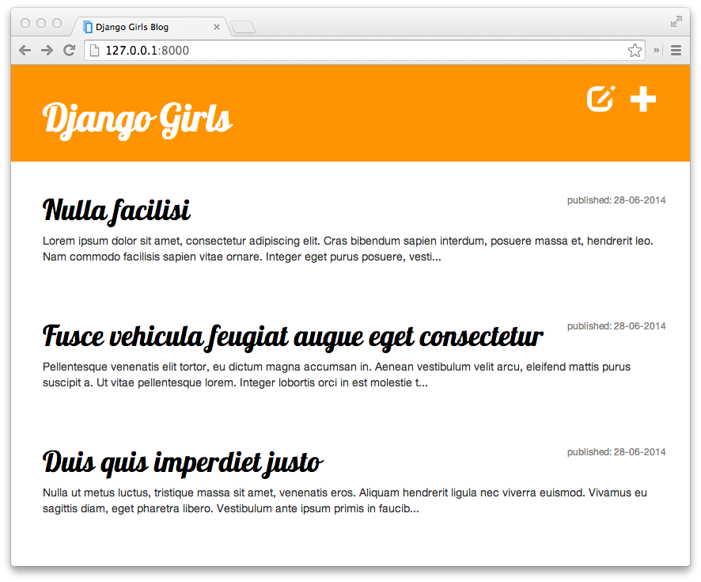

# Il tutorial di Django Girls

> Questo lavoro è concesso sotto la licenza Creative Commons Attribuzione-ShareAlike 4.0 internazionale. Per visualizzare una copia di questa licenza, visita https://creativecommons.org/licenses/by-sa/4.0/

## Benvenuta

Benvenuta al tutorial Django Girls! We are happy to see you here :) In this tutorial, we will take you on a journey under the hood of web technologies, offering you a glimpse of all the bits and pieces that need to come together to make the web work as we know it.

As with all unknown things, this is going to be an adventure - but no worries, since you already worked up the courage to be here, you'll be just fine :)

## Introduzione

Have you ever felt that the world is more and more about technology to which you cannot (yet) relate? ti sei mai chiesta come creare un sito web ma non hai mai avuto abbastanza motivazione per iniziare? Hai mai pensato che il mondo del software è troppo complicato per te persino per provare a fare qualcosa per conto tuo?

Beh, abbiamo buone notizie per te! La programmazione non è così complicata come sembra e vogliamo dimostrati quanto può essere divertente.

This tutorial will not magically turn you into a programmer. Se vuoi diventare bravo/a, ci vorranno mesi o addirittura anni di apprendimento e pratica. Ma ti vogliamo dimostrare che la programmazione o creare siti web non è complicato come sembra. Proveremo a spiegarti diversi argomenti come meglio possiamo, in modo che non ti senta più intimidito/a dalla tecnologia.

Speriamo di essere in grado di farti amare la tecnologia come lo facciamo noi!

## Cosa imparerai durante questo tutorial?

Once you've finished the tutorial, you will have a small working web application: your own blog. We will show you how to put it online, so others will see your work!

Assomiglierà (più o meno) a questo:

> If you work with the tutorial on your own and don't have a coach who will help you in case of any problem, we have a chat system for you: . Abbiamo chiesto ai nostri insegnanti e partecipanti precedenti di esserci di volta in volta ed aiutare gli altri con il tutorial! Non aver paura di fare domande!

OK, [let's start at the beginning…](./how_the_internet_works/README.md)

## Seguire il tutorial da casa

È fantastico prendere parte a un workshop Django Girls, ma siamo consapevoli che non sempre è possibile essere presenti a un workshop. This is why we encourage you to try following this tutorial at home. For readers at home, we are currently preparing videos that will make it easier to follow the tutorial on your own. It is still a work in progress, but more and more things will be covered soon at the [Coding is for girls](https://www.youtube.com/channel/UC0hNd2uW8jTR5K3KBzRuG2A/feed) YouTube channel.

In ogni capitolo già trattato, c'è un link che punta al video corretto.

## Informazioni e contribuzioni

Questo tutorial è mantenuto da [DjangoGirls](https://djangogirls.org/). Se trovi errori o se vuoi aggiornare questo tutorial, [segui le linee guida per i collaboratori](https://github.com/DjangoGirls/tutorial/blob/master/README.md).

## Would you like to help us translate the tutorial into other languages?

Currently, translations are being kept on crowdin.com platform at:

https://crowdin.com/project/django-girls-tutorial

If your language is not listed on [crowdin](https://crowdin.com/), please [open a new issue](https://github.com/DjangoGirls/tutorial/issues/new) informing us of the language so we can add it.