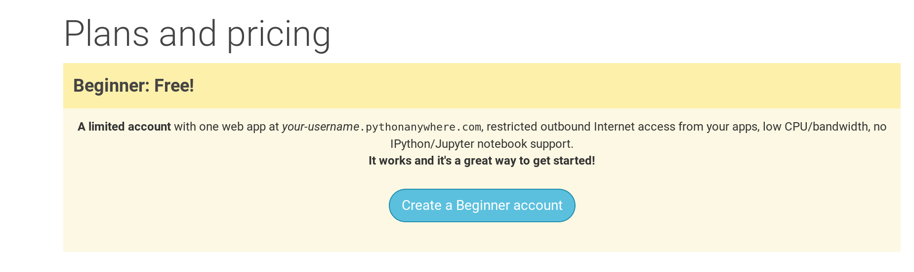

PythonAnywhere はクラウド上のサーバーでPythonのコードを走らせるためのサービスです。私たちはこれを私たちのサイトをホスティングして、インターネット上で動かし続けるために使います。

今までの章で作ったブログをPythonAnywhere上にホスティングします。PythonAnywhereの「Beginner」でサインアップしましょう(アカウントは無料枠で大丈夫です。クレジットカードは必要ありません)。

* [https://www.pythonanywhere.com](https://www.pythonanywhere.com/)

> **注意** ユーザー名は `yourusername.pythonanywhere.com` というようにブログのURLに反映されます。なので、あなたのニックネームかブログの名前をユーザー名とするようにしてください。 パスワードは忘れないようにしてください。(パスワードマネージャーを使っているなら覚えさせておくのも良いでしょう。)

## PythonAnywhere APIトークンの作成

トークンは一度だけ作ればよいです。PythonAnywhereのサインアップが終わるとダッシュボード画面に移動します。「Account」ページへのリンクはページ右上のバーの中にあります。

「Account」ページに移動したら、「API Token」というタブを選んで、「Create new API token」のボタンを押してください。

