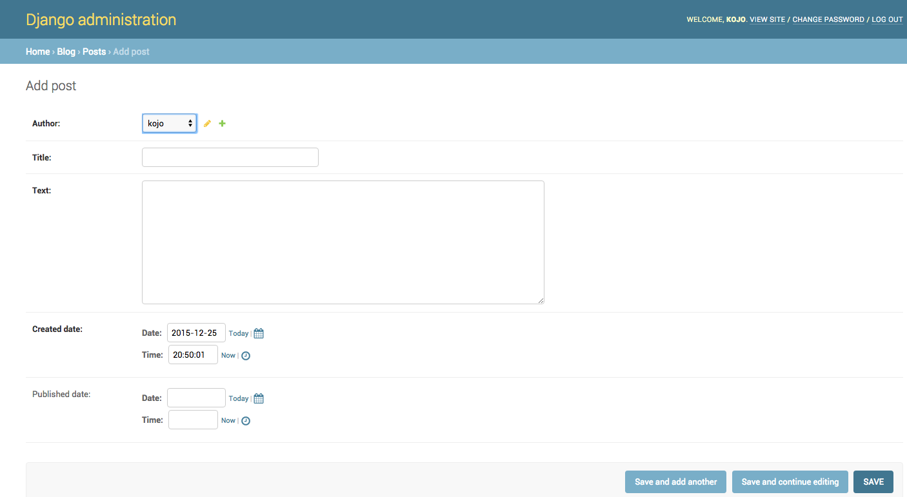

# Django admin

今作成したポストを追加、編集、削除するのにDjango adminを使います。

`blog/admin.py<code>ファイルをエディタで開いて、内容をこのように変えて下さい：

blog/admin.py

<pre><code class="python"><code>from django.contrib import admin
from .models import Post

admin.site.register(Post)` </code></pre> 

見て分かる通り、前回定義したPostモデルをimportしています。 Adminページ(管理画面)のモデルを作るために、モデルを登録する必要があります。`admin.site.register(Post)`の部分です.

ではPostモデルを見てみましょう。 Web サーバーを実行するコンソールで `python manage.py runserver` を実行してください。 ブラウザに行って http://127.0.0.1:8000/admin/ とアドレスバーにタイプします。 こんなログインページが出ますね。

ログインするには、*superuser *（サイトの全てを管理するユーザー）を作る必要があります。 コマンドラインに戻り、`python manage.py createsuperuser` と入力し、enter キーを押します。

> 今あなたのコマンドラインでは、最初の Django プロジェクト **プロジェクトを作成しよう**で行った web サーバー</b> セクションを開始しています。 Web サーバーの実行中に新しいコマンドを書き込む時は、新しいターミナル ウィンドウを開いて、仮想環境をアクティブにしてください。

Mac OS X または Linux:

    (myvenv) ~/djangogirls$ python manage.py runserver
    

Windows:

    (myvenv) C:\Users\Name\djangogirls> python manage.py createsuperuser
    

プロンプトが表示されたら、ユーザー名 (小文字、スペースなし)、電子メール アドレス、およびパスワードを入力します。 タイプしてる間パスワードは見えなくても大丈夫、それが正常です。タイプしてEnterを押して続けましょう。 そうすればこのように見えるはずです。（ユーザーネームとパスワードは今あなたがタイプしたものです。）

    Username: admin
    Email address: admin@admin.com
    Password:
    Password (again):
    Superuser created successfully.
    

ブラウザに戻ってsuperuserでログインすると、Django admin ダッシュボードが見えるでしょう。

Postsに行って少し試してみてください。5～6のブログポストを入れてみましょう。コンテンツは心配しなくて大丈夫。今はとりあえずこのチュートリアルからテキストをいくつかコピペするだけでいいです。 （ブログ機能を確認するためなので、内容は何でも大丈夫です。自分で適当な文字列を打ち込んでももちろんOKです。）

少なくとも 2 つまたは 3 つの記事 (すべてではない) は 同じ日付あることを確認します。それは後で参考になります。

もしDjango adminについてもっと知りたければ、Django's documentationを見て下さい。（お使いの環境に合わせたバージョンを参照ください） https://docs.djangoproject.com/en/1.11/ref/contrib/admin/

ここでおそらく、コーヒーか紅茶か何かを食べてリフレッシュする時間をとりましょう！！ 初めてのDjango modelを作成しました。