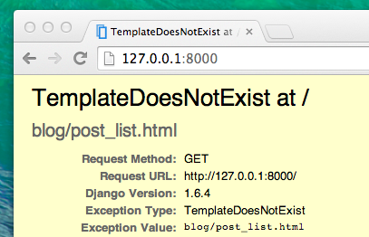

# Djangoビュー – 今こそ作りましょう！

それでは前の章の続きをやりましょう。確かビューの作成がまだだったので、エラーになっていましたね！:)

*ビュー* はアプリのロジックを書いていくところです。 ビューは、以前あなたが作った `モデル` に情報を要求し、それを `テンプレート` に渡します。 テンプレートは、次の章で作ります。 ビューはただのPythonの関数です。**Python入門**の章で書いたものよりもちょっと複雑なだけですよ。

ビューは、`views.py` に記述します。私たちの場合 `blog/views.py` に書くことになります。

## blog/views.py

では、早速 blog/views.py をコードエディタで開いて何があるか見てみましょう：

blog/views.py

```python
from django.shortcuts import render

# Create your views here.
```

まだ何もないですね。

`#` で始まる行は、コメントです。この行に書いたものはPythonは無視します。

それでは、次のようなちょっとした *ビュー* を作ってみましょう。

blog/views.py

```python
def post_list(request):
    return render(request, 'blog/post_list.html', {})
```

見てのとおり、`post_list` という関数（`def` から始まる部分のことです）を作りました。これは `request` を引数に取ります。`blog/post_list.html` テンプレートを（色々なものを合わせて）組み立てる `render` という関数を呼び出して得た値を `return` しています。

ファイルを保存したら、どんな風に表示されるか、ブラウザで http://127.0.0.1:8000/ を確認してみましょう。

今度は別のエラーになりましたね。なんと書いてあるでしょうか。



サーバーは実行されていることはわかるのですが、正しく表示されないのはなぜでしょう？ 心配しないで！ただのエラーページです！ コンソールでのエラーメッセージと同じように、これは実際にかなり便利です。 *TemplateDoesNotExist* と書いてありますね。 それでは次の章でテンプレートを作って、エラーを解決しましょう！

> Djangoのビューについてもっと知りたいのなら、公式ドキュメントをぜひ読んでみてください。 https://docs.djangoproject.com/ja/2.2/topics/http/views/