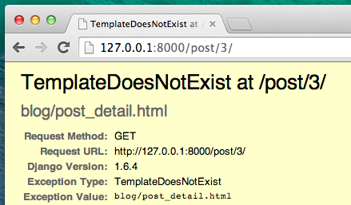
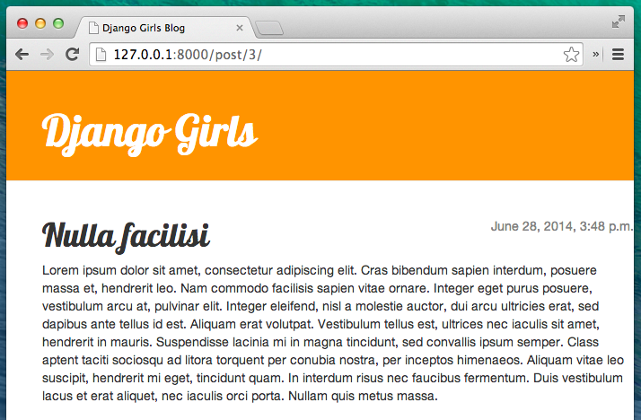



# アプリケーションを拡張しよう

もう、ウェブサイトを作るのに必要な全ての章は終わりました。どのようにモデル、URL、ビュー、テンプレートを書いたら良いかわかっていますし、またウェブサイトの作り方もわかります。

さあ練習しましょう！

ブログに最初に必要なものはおそらく、記事を表示するページですよね。

もう`Post`モデルが入っていますから、`models.py`は追加する必要はありません

## 投稿の詳細へのテンプレートリンクを作成する

`blog/templates/blog/post_list.html`ファイルに次のようにリンクを追加しましょう： blog/templates/blog/post_list.html

```html



    
        <div class="post">
            <div class="date">
                {{ post.published_date }}
            </div>
            <h1><a href="">{{ post.title }}</a></h1>
            <p>{{ post.text|linebreaksbr }}</p>
        </div>
    

```

投稿リストの投稿のタイトルから投稿の詳細ページへのリンクが必要です。 投稿の詳細ページにリンクするように`<h1><a href="">{{ post.title }}</a></h1>` 

{{ warning_icon }} blog/templates/blog/post_list.html

```html
<h1><a href="">{{ post.title }}</a></h1>
```

` {％url 'post_detail' pk = post.pk％}`を説明します。 ` {％％} </ code>という表記は、Djangoのテンプレートタグを使用していることを意味しています。 次にURLを作成するものを使用します！</p>

<p><code> post_detail </ code>の部分は、Djangoが<code> blog / urls.py </ code>にname = post_detailのURLを指定していることを意味します</p>

<p>pk = post.pkの部分は、 pkは主キーの略で、データベースの各レコードの一意の名前です。 Postモデルでプライマリキーを指定しなかったので、Djangoは私たちのために1つのキーを作成します（デフォルトでは、レコードごとに1、2、3と数字が増えます）。 私たちの記事はPostオブジェクトの他のフィールド（タイトル、作者など）にアクセスするのと同じ方法で、post.pkを書くことによって主キーにアクセスします！</p>

<p>さて、私たちがhttp://127.0.0.1:8000/に行くと、（<code> post_detail </ code>のURLまたは<em> view </ em>をまだ持っていないので、 >）。 それは次のようになります：</p>

<p></p>

<h2>投稿の詳細へのURLを作成する</h2>

<p><code> post_detail </ code> <em>ビュー</ em>用に<code> urls.py </ code>にURLを作成しましょう！</p>

<p>最初の投稿の詳細がこの<strong> URL </ strong>に表示されるようにします：http://127.0.0.1:8000/post/1/</p>

<p>Djangoが<code> post_detail </ code>という名前の<em>表示</ em>を指すように<code> blog / urls.py </ code>ファイルにURLを作ってください。 <code> blog / urlsに<code> url（r '^ post /（？P＆lt; pk＆gt; \ d +）/ $'、views.post_detail、name = 'post_detail'）、</ code>行を追加します。 py </ code>ファイルにコピーします。 ファイルは次のようになるでしょう。</p>

<p>{{ warning_icon }} blog/urls.py</p>

<pre><code class="python">from django.conf.urls import url
from . import views

urlpatterns = [
    url(r'^$', views.post_list, name='post_list'),
    url(r'^post/(?P<pk>\d+)/$', views.post_detail, name='post_detail'),
]
`</pre> 

この部分` ^ post /（？P <pk> \ d +）/ $ </ code>は難しく見えますが、心配する必要はありません。</p>

<ul>
<li><code> ^ </ code>は「文字列の開始」を意味します。</li>
<li><code> post / </ code>というのは、最初の後に<strong>post</ strong>と<strong> / </ strong>という単語が含まれることを意味します。 ここまでは順調ですね。</li>
<li><code>(?P<pk>\d+)` -この部分はトリッキーです。 これは、Djangoがあなたがここに置いたすべてを、` pk </ code>という変数としてビューに転送することを意味します。 （これは<code> blog / templates / blog / post_list.html </ code>でプライマリキー変数に与えた名前と一致します）！<code> \ d </ code> 数字で、文字ではありません（0と9の間のすべてです）。 
<code> + </ code>は、そこに1つ以上の数字が必要であることを意味します。 したがって、<code> http://127.0.0.1:8000/post// </ code>のようなものは無効ですが、<code> http://127.0.0.1:8000/post/1234567890/ </ code>は 完全にOK！</li>
<li>
<code> / </ code>  - もう一度<strong> / </ strong>を入力する必要があります。</li>
<li><code>$` -「終わり」!を意味します。</li> </ul> 

つまり、ブラウザに` http://127.0.0.1:8000/post/5/ </ code>を入力すると、Djangoは<em>view</ em>を探していると理解します。<code> post_detail </ code>に移動し、<code> pk </ code>が<code> 5 </ code>と同じ情報をその<em>view</ em>に転送します。</p>

<p>[Ok] を我々 は <code>blog/urls.py` に新しい URL パターンを追加しました! ページを更新しましょう：http://127.0.0.1:8000/ Boom！ サーバーが再び実行を停止しました。 コンソールを見てください - 予想通り、もう一つのエラーがあります！


あなたは次のステップが何であるか覚えていますか？ もちろん：ビューを追加する！ですね。

## 投稿の詳細ビューを追加する

今回は* view </ em>に追加のパラメータ` pk </ code>が与えられます。 私たちの<em>view</ em>はそれを捕らえる必要がありますか？ そこで関数を<code> def post_detail（request、pk）：</ code>として定義します。 urls（<code> pk </ code>）で指定した名前とまったく同じ名前を使用する必要があることに注意してください。 この変数を省略すると、エラーが発生します。</p>

<p>今、私たちは1つだけのブログ投稿を取得したいと考えています。 これを行うには、次のようにクエリーセットを使用できます。</p>

<p>{{ warning_icon }} blog/views.py</p>

<pre><code class="python">Post.objects.get(pk=pk)
`</pre> 

しかし、このコードには問題があります。 与えられた`主キー</ code>（<code> pk </ code>）で<code> Post </ code>が存在しない場合、非常に醜いエラーが発生します。</p>

<p></p>

<p>私たちはそれを望んでいません！ しかしもちろん、Djangoには、それを処理するものがあります：<code> get_object_or_404 </ code>。 与えられた<code> pk </ code>に<code> Post </ code>がない場合、<code> Page Not Found 404 </ code>のページが表示されます。</p>

<p></p>

<p>自分用の<code>Page not found</ code>ページを作成することもできます。 しかし、それは現在非常に重要ではないので、私たちはそれをスキップします。</p>

<p><code> views.py </ code>ファイルに<em>view</ em>を追加してください。</p>

<p><code> blog / urls.py </ code>では<code> views.post_detail </ code>というビューを参照する<code> post_detail </ code>という名前のURLルールを作成しました。 これは、Djangoが<code> blog / views.py </ code>内の<code> post_detail </ code>というビュー機能を使うことを意味します。</p>

<p><code> blog / views.py </ code>を開き、他の<code>from</ code>行の近くに次のコードを追加する必要があります。</p>

<p>blog/views.py</p>

<pre><code class="python">from django.shortcuts import render, get_object_or_404
`</pre> 

ファイルの最後に*view</ em>を追加します：</p> 

blog/views.py

```python
def post_detail(request, pk):
    post = get_object_or_404(Post, pk=pk)
    return render(request, 'blog/post_detail.html', {'post': post})
```

ページを更新してみましょう：http://127.0.0.1:8000/


出来ましたね！ しかし、あなたはブログのポストタイトルのリンクをクリックするとどうなりますか？



あらいやだ！ 別のエラー！ しかし、私たちはすでにそれに対処する方法をすでに知っていますね。 そう！テンプレートを追加する必要があります！

## 投稿の詳細へのテンプレートリンクを作成する

` blog / templates / blog </ code>に<code> post_detail.html </ code>というファイルを作成します。</p>

<p>こんな感じですね。</p>

<p>blog/templates/blog/post_detail.html</p>

<pre><code class="html">


    <div class="post">
        
            <div class="date">
                {{ post.published_date }}
            </div>
        
        <h1>{{ post.title }}</h1>
        <p>{{ post.text|linebreaksbr }}</p>
    </div>

`</pre> 

もう一度` base.html </ code>を拡張します。 <code> content </ code>ブロックでは、投稿のpublished_date（存在する場合）、タイトル、およびテキストを表示します。 しかし、私たちはいくつかの重要なことについて議論すべきですよね？</p>

<p><code> ...  {％endif％}は、何かをチェックしたいときに使用できるテンプレートタグです。 (<code>if ... else... Introduction to Pythonのチャプターでやってこを覚えていますか？）このシナリオでは我々はポストの<code>published_date`が空ではないかどうかを確認します。

これで、` TemplateDoesNotExist </ code>がなくなったかどうか確認してページを更新できます。</p>

<p></p>

<p>イェーイ！うまくできていますね！</p>

<h1>Deploy time!</h1>

<p>あなたのウェブサイトがまだPythonAnywhere上で動作するかどうかを確認してみましょう。</p>

<p>command-line</p>

<pre><code>$ git status
$ git add --all .
$ git status
$ git commit -m "Added view and template for detailed blog post as well as CSS for the site."
$ git push
`</pre> 

それから、[ PythonAnywhere Bash console](https://www.pythonanywhere.com/consoles/)で：

command-line

    $ cd ~/<your-pythonanywhere-username>.pythonanywhere.com
    $ git pull
    [...]
    

(`<your-pythonanywhere-username>`の部分を、自分の実際のPythonAnywhereのユーザー名に角カッコをはずして置き換えることを忘れずに)

## サーバー上の静的ファイルの更新

PythonAnywhereのようなサーバは、（CSSファイルのような）「静的ファイル」をPythonファイルとは違って扱うのが好きです。なぜなら、それらが高速に読み込まれるように最適化できるからです。 その結果、CSSファイルを変更するたびに、サーバー上で追加のコマンドを実行して、更新するように指示する必要があります。 コマンドは` collectstatic </ code>です。</p>

<p>あなたが使用している<code> source myenv / bin / activate </ code>コマンドと同じです（PythonAnywhereはこれを行うために<code> workon </ code>というコマンドを使用します） あなた自身のコンピュータで）：</p>

<p>command-line</p>

<pre><code>$ workon <your-pythonanywhere-username>.pythonanywhere.com
(ola.pythonanywhere.com)$ python manage.py collectstatic
[...]
`</pre> 

 manage.py collectstatic </ code>コマンドは、<code> manage.py migrate </ code>のようなものです。  私たちはコードをいくつか変更してから、Djangoにサーバの静的ファイルのコレクションまたはデータベースに変更を適用するよう指示します。</p>

<p>いずれにしても、<a href="https://www.pythonanywhere.com/web_app_setup/"> Webタブ</a>にアクセスして、<strong> Reload </ strong>を押す準備が整いました。</p>

<p>そしてdeployします! おめでとうございます :)</p>