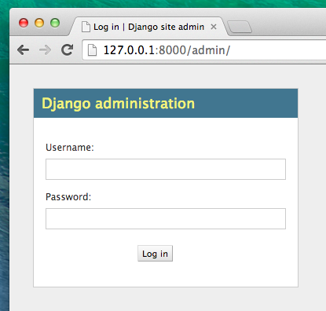

# 장고 관리자

관리자 화면을 한국어로 변경하길 원할 경우 'settings.py'중 `LANGUAGE_CODE = 'en-us'`를 `LANGUAGE_CODE = 'ko'`로 바꾸세요.

방금 막 모델링 한 글들을 장고 관리자에서 추가하거나 수정, 삭제할 수 있어요.

이제 `blog/admin.py` 파일을 열어서 내용을 다음과 같이 바꾸세요.


blog/admin.py
```python
from django.contrib import admin
from .models import Post

admin.site.register(Post)
```

코드에서 알 수 있듯이 앞 장에서 정의했던 `Post`모델을 가져오고(import) 있어요. 관리자 페이지에서 만든 모델을 보려면 `admin.site.register(Post)`로 모델을 등록해야 해요.

자, 이제 `Post`모델을 볼까요? 웹 서버를 실행하려면 콘솔 창에서 `python manage.py runserver`를 실행하는걸 잊지 마세요. 브라우저를 열고 주소창에 http://127.0.0.1:8000/admin/ 을 입력하면 아래와 같은 로그인 페이지를 볼 수 있어요.



로그인하기 위해서는, 모든 권한을 가지는 *슈퍼 사용자(superuser)*를 생성해야 해요. 커맨드라인으로 돌아가서 `python manage.py createsuperuser`을 입력하고 엔터를 누르세요. 

> 새 터미널 창을 열고 virtualenv를 활성화 시켜 웹 서버를 실행시키고 난 후 명령어를 입력해야합니다. <b>나의 첫 번째 Django 프로젝트!</b> 장의 <b>웹 서버 시작하기</b>섹션에서 명령어를 입력하는 방법을 배웠어요,

메시지가 나타나면 사용자 이름 (소문자, 공백 없이), 이메일 주소 및 암호를 입력합니다. password를 입력할 때 화면에 글자가 보이지 않는다고 해도 걱정하지 마세요. 원래 password는 화면에 보이지 않습니다. 작성한 후에 `enter`를 누르세요. 실행화면은 아래와 같을 거예요. (슈퍼 사용자로 사용할 username 과 email 주소는 본인 계정을 사용하세요) :

command-line
```
(myvenv) ~/djangogirls$ python manage.py createsuperuser
Username: admin
Email address: admin@admin.com
Password:
Password (again):
Superuser created successfully.
```

브라우저로 돌아와서 장고 관리자 페이지에서 슈퍼 사용자로 로그인한 후 대시보드를 확인하세요.


게시글로 가서 이것저것 시도해보세요. 5~6개 블로그 포스트를 올려보세요. 안에 내용은 걱정하지 마세요. 튜토리얼에 있는 텍스트를 그냥 복사붙여넣기를 할 수 있으니까요.

최소한 2, 3개의 글에 게시 날짜가 있는지 확인하세요. (모두 볼 필요는 없어요) 이건 나중에 도움이 될 거에요.


장고 관리자에 대해서 좀 더 알고 싶다면 장고 공식 문서를 읽어보세요 : https://docs.djangoproject.com/en/1.8/ref/contrib/admin/

자, 우리는 내 첫 번째 장고 모델을 만들었어요! 잠깐 쉴 시간이 필요해요. 열심히 했으니 재충전을 위해 커피 한 잔(또는 차 한 잔) 또는 뭔가 먹고 돌아오세요.
