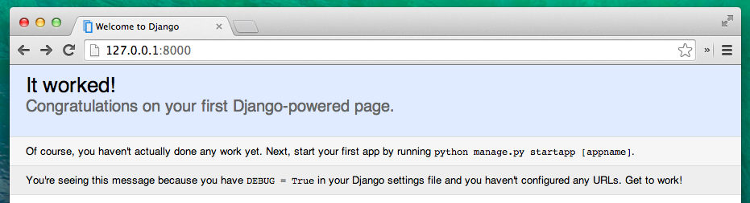

# 나의 첫 번째 장고 프로젝트!

> **Note** 이 장의 일부는 Geek Girls Carrots (http://django.carrots.pl/)의 튜토리얼을 기초로 작성되었습니다.


> **Note** 이 장의 일부는 Creative Commons Attribution-ShareAlike 4.0 International License에 준수하여 [django-marcador 튜토리얼](https://github.com/ggcarrots/django-carrots)를 기초로 작성되었습니다. django-marcador 튜토리얼 저작권은 Markus Zapke-Gründemann et al이 소유하고 있습니다.

아주 간단한 블로그 사이트를 만들어 볼 거예요!

첫 단계는 장고 프로젝트를 시작하는 거예요. 다시 말해 장고의 기본 골격을 만들어주는 스크립트를 실행할 거예요. 이 디렉토리와 파일 묶음은 나중에 사용할 것입니다.

장고에서는 디렉토리와 파일명이 매우 중요하답니다. 파일명을 마음대로 변경해서도 안되고 다른 곳으로 옮겨도 안됩니다. 장고는 중요한 것들을 찾을 수 있게 특정한 구조를 유지해야 합니다.

> 모든 작업은 가상환경(virtualenv) 안에서 해야 하는 것을 꼭 기억하세요. 현재 콘솔 창에서 접두어로 `(myvenv)`가 안 보인다면 먼저 virtualenv를 활성화해야 합니다. **Django 설치하기** 장에서 **virtualenv 작동법**에 대해 배웠어요. 윈도우에서는 `myvenv\Scripts\activate`를 타이핑하고, 맥 OS과 리눅스에서는 `source myvenv/bin/activate`을 입력하세요.

<!--sec data-title="OS X / Linux" data-id="django_start_project_OSX_Linux" data-collapse=true ces-->

맥 OS과 리눅스 콘솔에서는 다음과 같이 명령을 실행해야해요. **명령어 끝에 `.`(점, 마침표)을 입력하는 것을 잊지마세요.** :

command-line
```
(myvenv) ~/djangogirls$ django-admin startproject mysite .
```


> 점 `.`은 현재 디렉토리에 장고를 설치하라고 스크립트에 알려주기 때문에 중요해요. (축약된 표시입니다)
>
> **Note** 위 명령을 입력할 때 `django-admin`로 시작하는 부분만 입력하세요. 여기에 보이는 `(myvenv) ~/djangogirls$`부분은 커맨드 라인에 입력을 가져오게 하는 메세지(프롬트프 prompt)입니다.

<!--endsec-->

<!--sec data-title="Windows" data-id="django_start_project_windows" data-collapse=true ces-->

윈도우에서도 **명령 끝에 `.`(점)을 입력하는 것을 잊지마세요** :

command-line
```
(myvenv) C:\Users\Name\djangogirls> django-admin.py startproject mysite .
```

> 점 `.`은 현재 디렉토리에 장고를 설치하라고 스크립트에 알려주기 때문에 중요해요. (축약된 표시입니다)
>
> **Note** 위 명령을 입력할 때 `django-admin.py`로 시작하는 부분만 입력하세요. 여기에 보이는 `(myvenv) C:\Users\Name\djangogirls>`부분은 커맨드 라인에 입력을 가져오게 하는 메세지(프롬프트 prompt)입니다.

<!--endsec-->

`django-admin.py`은 스크립트로 디렉토리와 파일들을 생성합니다. 스크립트 실행 후에는 아래와 같이 새로 만들어진 디렉토리 구조를 볼 수 있을 거예요.

    djangogirls
    ├───manage.py
    └───mysite
            settings.py
            urls.py
            wsgi.py
            __init__.py


`manage.py`는 스크립트인데, 사이트 관리를 도와주는 역할을 합니다. 이 스크립트로 다른 설치 작업 없이, 컴퓨터에서 웹 서버를 시작할 수 있습니다.

`settings.py`는 웹사이트 설정이 있는 파일입니다.

앞에 우편배달부는 어느 곳으로 편지를 배달해야 하는지 판단해야 한다고 말했던 것을 기억하고 있나요? `urls.py`파일은 `urlresolver`가 사용하는 패턴 목록을 포함하고 있습니다.

지금 그 파일들을 수정하지 않을 거니 무시하세요. 실수로 파일을 지우지 않게 조심하세요!

## 설정 변경

`mysite/settings.py`을 조금 고쳐 볼게요. 설치한 코드 에디터를 열어 파일을 열어주세요.

웹사이트에 정확한 현재 시간을 넣으면 좋겠죠. [위키피디아 타임존 리스트][2]에 가서 해당 시간대(타임존)를 복사하세요. (예: `Asia/Seoul`)

 [2]: https://en.wikipedia.org/wiki/List_of_tz_database_time_zones

Settings.py에서 `TIME_ZONE`있는 줄을 찾으세요. 그리고 이를 해당 시간대로 변경하세요.

mysite/settings.py
```python
    TIME_ZONE = 'Asia/Seoul'
```

다음으로 정적파일 경로를 추가할 거에요. (정적 파일은 튜토리얼 후반부에서 CSS와 함께 다룰 거에요) 파일의 *끝(end)*으로 내려가서, `STATIC_URL`항목 바로 아래에 `STATIC_ROOT`을 추가하세요.

mysite/settings.py
```python
STATIC_URL = '/static/'
STATIC_ROOT = os.path.join(BASE_DIR, 'static')
```

`DEBUG`가`True`이고 `ALLOWED_HOSTS`가 비어 있으면, 호스트는 `['localhost', '127.0.0.1', '[::1]']`에 대해서 유효합니다. 애플리케이션을 배포할 때 PythonAnywhere의 호스트 이름과 일치하지 않으므로 다음 설정을 아래와 같이 변경해줘야 합니다. :

mysite/settings.py
```python
ALLOWED_HOSTS = ['127.0.0.1', '.pythonanywhere.com']
```

> **Note** 크롬북 사용자는, `settings.py` 맨 마지막 줄에 아래 코드를 추가하세요. :
> `MESSAGE_STORAGE = 'django.contrib.messages.storage.session.SessionStorage'`

## 데이터베이스 설정하기

사이트 내 데이터를 저장하기 위한 많은 다양한 데이터베이스 소프트웨어들이 있습니다. 그중에서 우리는 `sqlite3`을 사용할 거예요.

이미 `mysite/settings.py`파일 안에 설치가 되어있어요.

mysite/settings.py
```python
DATABASES = {
    'default': {
        'ENGINE': 'django.db.backends.sqlite3',
        'NAME': os.path.join(BASE_DIR, 'db.sqlite3'),
    }
}
```

블로그에 데이터베이스를 생성하기 위해서 콘솔 창에서 아래 코드를 실행하세요. : `python manage.py migrate` (이 명령을 실행하기 위해서는 `djangogirls`디렉터리 안에 있는 `manage.py`가 필요합니다)

잘 작동되면, 아래와 같은 내용이 나옵니다.

command-line
```
(myvenv) ~/djangogirls$ python manage.py migrate
Operations to perform:
  Apply all migrations: auth, admin, contenttypes, sessions
Running migrations:
  Rendering model states... DONE
  Applying contenttypes.0001_initial... OK
  Applying auth.0001_initial... OK
  Applying admin.0001_initial... OK
  Applying admin.0002_logentry_remove_auto_add... OK
  Applying contenttypes.0002_remove_content_type_name... OK
  Applying auth.0002_alter_permission_name_max_length... OK
  Applying auth.0003_alter_user_email_max_length... OK
  Applying auth.0004_alter_user_username_opts... OK
  Applying auth.0005_alter_user_last_login_null... OK
  Applying auth.0006_require_contenttypes_0002... OK
  Applying auth.0007_alter_validators_add_error_messages... OK
  Applying sessions.0001_initial... OK
```

잘했어요! 이제 웹 서버를 시작해 웹 사이트가 잘 작동하는지 확인해봐요!

프로젝트 디렉토리(`djangogirls`)에 `manage.py`파일이 있어야 합니다. 콘솔에서는 `python manage.py runserver`명령을 실행해, 웹 서버를 바로 시작할 수 있습니다.

command-line
```
(myvenv) ~/djangogirls$ python manage.py runserver
```

크롬북 사용자는 아래 명령어를 입력하세요. :

Cloud 9
```
(myvenv) ~/djangogirls$ python manage.py runserver 0.0.0.0:8000
```

윈도우에서 `UnicodeDecodeError`오류가 난다면 아래 명령을 대신 써보세요. :

command-line
```
(myvenv) ~/djangogirls$ python manage.py runserver 0:8000
```

웹 사이트가 모두 잘 작동하는지 확인해봐요. 사용하는 브라우저(파이어폭스, 크롬, 사파리, 인터넷 익스플로어 등 여러분의 원하는 대로)를 열어서 주소를 입력하세요.

browser
```
http://127.0.0.1:8000/
```

크롬북 사용자는 항상 테스트 서버를 통해 접근해야 합니다.:

browser
```
https://django-girls-<your cloud9 username>.c9users.io
```

축하해요! 여러분은 방금 웹 서버를 활용한 첫 웹사이트를 만들었어요! 정말 멋지죠?



웹 서버가 실행되는 동안 추가 명령을 입력 할 수있는 새로운 명령어 프롬프트가 표시되지 않습니다. 새 텍스트를 터미널에서 입력할 수 있지만 명령은 실행되지 않습니다. 웹 서버가 들어오는 요청을 수신 대기하기 위해 지속적으로 실행하고 있기 때문이에요.

> <b>인터넷은 어떻게 작동될까요</b> 장에서 웹 서버에 대해 배웠었어요.


웹 서버가 실행되는 동안 추가 명령을 입력하려면 새 터미널 창을 열고 virtualenv를 활성화하세요. 웹 서버를 중지하려면 실행중인 창으로 다시 전환하고 CTRL + C - Control+C 키를 함께 누르세요. (윈도우에서는 Ctrl + Break를 눌러야 할 수도 있습니다)

다음 단계로 넘어갈 준비가 되셨나요? 새로운 것을 또 배워볼까요!
