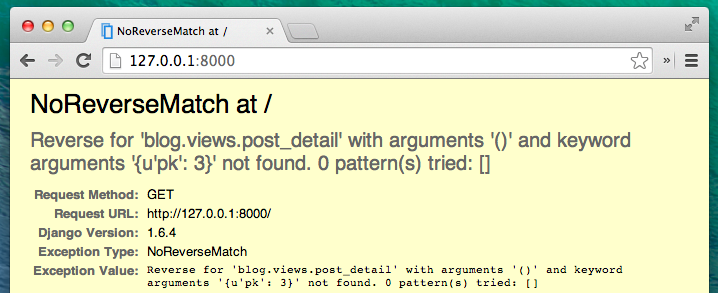
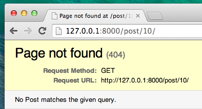
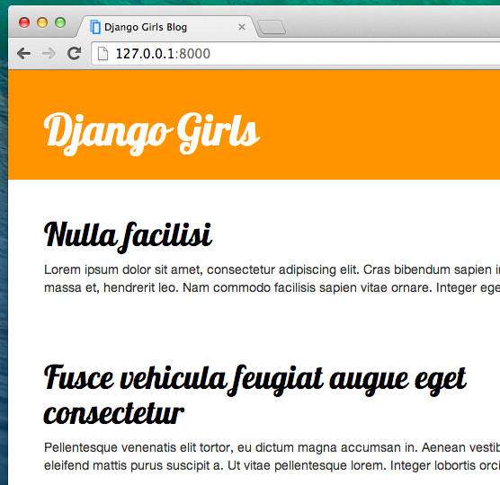
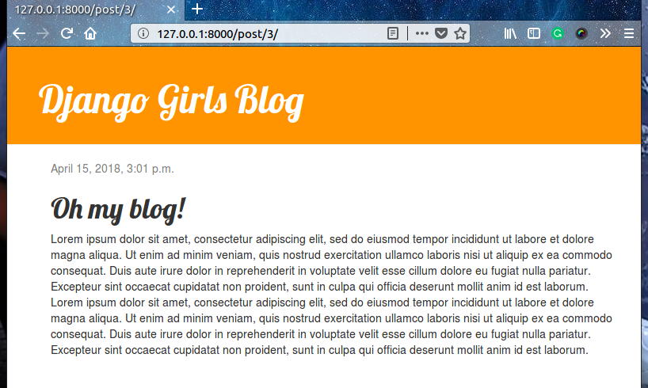

# 어플리케이션 확장하기

우리는 지금까지 웹사이트 제작에 필요한 모든 단계들을 마쳤어요. 모델, url, 뷰와 템플릿을 만드는지 알게 되었고요. 또 웹사이트를 어떻게 멋지게 꾸미는지 알게 되었어요.

이제 연습해 봅시다!

블로그에 가장 필요한 것은 페이지에 포스트가 보이게 만드는 것이겠죠?

이미 앞에서 `Post` 모델을 만들었으니 `models.py`에 추가할 내용은 없습니다.

## Post에 템플릿 링크 만들기

We will start with adding a link inside `blog/templates/blog/post_list.html` file. So far it should look like this: blog/templates/blog/post_list.html

```html



    
        <div class="post">
            <div class="date">
                {{ post.published_date }}
            </div>
            <h1><a href="">{{ post.title }}</a></h1>
            <p>{{ post.text|linebreaksbr }}</p>
        </div>
    

```

우리는 post 목록에 있는 제목에서 post의 내용 페이지로 가는 링크를 만들 거에요. `<h1><a href="">{{ post.title }}</a></h1>` 를 변경해 봅시다. post의 상세 페이지는  로 연결됩니다.

blog/templates/blog/post_list.html

```html
<h1><a href="">{{ post.title }}</a></h1>
```

``에 대해 설명할 때가 왔군요! 예상하셨겠지만 `` 표기는 장고 템플릿 태그를 사용하고 있는 것을 말합니다. 이번에는 우리를 위한 URL를 만들어 사용해 봅시다!

The `post_detail` part means that Django will be expecting a URL in `blog/urls.py` with name=post_detail

And how about `pk=post.pk`? `pk` is short for primary key, which is a unique name for each record in a database. Because we didn't specify a primary key in our `Post` model, Django creates one for us (by default, a number that increases by one for each record, i.e. 1, 2, 3) and adds it as a field named `pk` to each of our posts. We access the primary key by writing `post.pk`, the same way we access other fields (`title`, `author`, etc.) in our `Post` object!

Now when we go to http://127.0.0.1:8000/ we will have an error (as expected, since we do not yet have a URL or a *view* for `post_detail`). It will look like this:



## Post 상세 페이지에 URL 만들기

`urls.py` 파일에 `post_detail` *view*를 위한 URL를 만들어 봅시다!

첫 번째 게시물의 상세 **URL**은 이렇게 나올 거에요. : http://127.0.0.1:8000/post/1/

`blog/urls.py`파일에 URL을 만들어, 장고가 `post_detail`이란 *view<1/>로 보내, 전체 블로그 글이 보일 수 있게 만들어 봅시다. `url(r'^post/(?P<pk>[0-9]+)/$', views.post_detail, name='post_detail')` 코드를 `blog/urls.py` 파일에 추가하세요. 그러면 아래처럼 보일 거에요. :</p> 

blog/urls.py

```python
from django.conf.urls import url
from . import views

urlpatterns = [
    url(r'^$', views.post_list, name='post_list'),
    url(r'^post/(?P<pk>\d+)/$', views.post_detail, name='post_detail'),
]
```

This part `^post/(?P<pk>\d+)/$` looks scary, but no worries – we will explain it for you:

- it starts with `^` again – "the beginning".
- `post/` just means that after the beginning, the URL should contain the word **post** and a **/**. So far so good.
- `(?P<pk>\d+)` – this part is trickier. 이 정규 표현식의 의미는 장고가 여러분이 여기에 넣은 모든 것을 `pk`변수에 넣어 뷰로 전송하겠다는 뜻입니다. (Note that this matches the name we gave the primary key variable back in `blog/templates/blog/post_list.html`!) `\d` also tells us that it can only be a digit, not a letter (so everything between 0 and 9). `+`는 하나 또는 그 이상의 숫자가 와야한다는 것을 의미합니다. So something like `http://127.0.0.1:8000/post//` is not valid, but `http://127.0.0.1:8000/post/1234567890/` is perfectly OK!
- `/` – then we need a **/** again.
- `$` – "the end"!

That means if you enter `http://127.0.0.1:8000/post/5/` into your browser, Django will understand that you are looking for a *view* called `post_detail` and transfer the information that `pk` equals `5` to that *view*.

OK, we've added a new URL pattern to `blog/urls.py`! 페이지를 새로고침 해보세요: http://127.0.0.1:8000/ 짠! 서버 실행이 멈추었어요! Have a look at the console – as expected, there's yet another error!


다음 단계는 무엇일까요? 그렇죠. : view를 추가해야죠!

## Post 상세 페이지에 뷰 추가하기

This time our *view* is given an extra parameter, `pk`. *view*에 가져다가 써야겠죠? 그래서 함수를 정의할 때, pk를 받도록 `def post_detail(request, pk):`라고 정의 할 것입니다. 기입된 urls(`pk`)에 지정한 것과 정확히 똑같은 이름을 사용해야함을 주의하세요. 변수가 생략되면 문제가 생겨 오류가 날 거에요!

Now, we want to get one and only one blog post. To do this, we can use querysets, like this:

blog/views.py

```python
Post.objects.get(pk=pk)
```

But this code has a problem. If there is no `Post` with the given `primary key` (`pk`) we will have a super ugly error!


우리가 원하는게 아니에요! 장고에서는 이를 해결 하기위해 특별한 기능을 제공해요. : `get_object_or_404`이에요. In case there is no `Post` with the given `pk`, it will display much nicer page, the `Page Not Found 404` page.



좋은 점은 여러분 만의 `페이지 찾을 수 없음(Page not found)` 페이지를 예쁘게 만들 수 있다는 거에요. 지금 당장 중요한 것이 아니까 생략할게요.

OK, time to add a *view* to our `views.py` file!

In `blog/urls.py` we created a URL rule named `post_detail` that refers to a view called `views.post_detail`. This means that Django will be expecting a view function called `post_detail` inside `blog/views.py`.

We should open `blog/views.py` and add the following code near the other `from` lines:

blog/views.py

```python
from django.shortcuts import render, get_object_or_404
```

And at the end of the file we will add our *view*:

blog/views.py

```python
def post_detail(request, pk):
    post = get_object_or_404(Post, pk=pk)
    return render(request, 'blog/post_detail.html', {'post': post})
```

브라우저를 새로고침 해보세요. : http://127.0.0.1:8000/



잘 되네요! 그런데 블로그 제목 안의 링크를 클릭하면 어떻게 되나요?


이런! 또 에러가 나왔네요! 하지만 이제는 이런 걸 어떻게 다뤄야하는지 알고 있죠? 우리는 이제 템플릿을 추가해 볼 거에요!

## Create a template for the post details

`blog/templates/blog` 디렉토리 안에 `post_detail.html`라는 새 파일을 생성하세요.

아마도 화면에 이렇게 보이겠죠?

blog/templates/blog/post_detail.html

```html



    <div class="post">
        
            <div class="date">
                {{ post.published_date }}
            </div>
        
        <h1>{{ post.title }}</h1>
        <p>{{ post.text|linebreaksbr }}</p>
    </div>

```

다시 한 번 `base.html`을 확장해 봅시다. `content` 블록에서, 블로그 글의 published_date 출판일(존재한다면) 과 제목, 내용을 보이게 할 거에요. 그런데 제일 중요한 것을 얘기해봐야하지 않겠어요?

` ... ` is a template tag we can use when we want to check something. (Remember `if ... else ..` from **Introduction to Python** chapter?) In this scenario we want to check if a post's `published_date` is not empty.

OK, we can refresh our page and see if `TemplateDoesNotExist` is gone now.



야호! 잘 되네요!

## 한 가지만 더: 배포하세요!

PythonAnywhere에서도 웹사이트가 잘 작동하는지 봐야겠죠? 다시 한 번 배포해봅시다.

command-line

    $ git status
    $ git add --all .
    $ git status
    $ git commit -m "Added view and template for detailed blog post as well as CSS for the site."
    $ git push
    

그 다음 [PythonAnywhere Bash console](https://www.pythonanywhere.com/consoles/)을 여세요:

command-line

    $ cd my-first-blog
    $ git pull
    [...]
    

마지막으로 [웹 탭(Web tab)](https://www.pythonanywhere.com/web_app_setup/)에서 **다시 불러오기(Reload)**를 누르세요.

이제 배포가 완료 되었어요. 잘 작동되는지 확인해 보세요! 축하합니다. :)