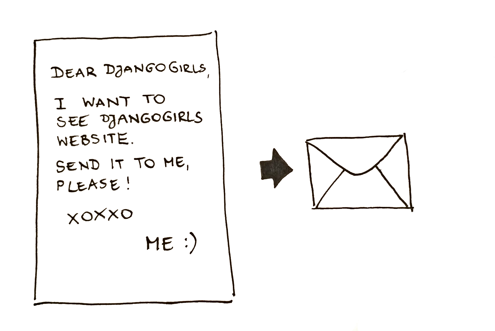

# 인터넷은 어떻게 작동할까요

> **Note** 이번 장은 Jessica McKellar의 글 ["How the internet works"](http://web.mit.edu/jesstess/www/)을 기초로 작성되었습니다. 

우리는 매일 인터넷을 사용합니다. 그러나 브라우저 주소창에 [http://djangogirls.org](http://djangogirls.org)를 입력하고 `엔터`키를 누르면 어떤 일이 일어나는지 알고 있나요?

웹 사이트란 동영상, 음악, 사진 파일처럼 하드 디스크에 저장된 파일묶음과 같습니다. 웹 사이트가 일반 파일과 다른 점은 HTML이라는 프로그래밍 코드가 들어있다는 것이에요.

프로그래밍에 익숙하지 않은 분이라면, HTML을 이해하기 어려울 수도 있어요. 하지만 브라우저들(크롬, 사파리, 파이어폭스) HTML을 사랑한답니다. 웹 브라우저는 코드를 이해하고 지시에 따라 정확하게 구현되도록 설계되었어요.

다른 파일처럼 HTML도 하드 디스크 어딘가에 저장해야 합니다. 인터넷에선 *서버*라는 특별하고 강력한 컴퓨터를 사용합니다. 데이터를 저장하고 제공하는 것이 주된 목적이기 때문에 모니터나 마우스, 키보드가 필요 없지요. 데이터를 *제공(serve)*하는 일을 하므로 *서버(server)*라고 부릅니다.

인터넷은 어떻게 생겼을지 궁금하죠?

여러분들의 이해를 돕기 위해 그림을 그려봤어요!

조금 지저분해 보이죠? 사실 인터넷은 수 많은 기계들이 연결된(앞서 얘기한 *서버* 라는) 하나의 네트워크랍니다. 수백, 수천 대의 기계들이요! 긴, 아주 긴 케이블들이 지구 전체를 둘러싸고 있답니다! 해저 케이블 지도 사이트 (http://submarinecablemap.com/) 에 가보면 케이블이 얼마나 복잡하게 연결되어있는지 알 수 있어요. 아래 사진은 웹사이트에서 가져온 스크린 샷입니다.

멋지지 않나요? 그러나 인터넷에 연결된 모든 기계 전부 연결하는 것은 불가능한 일입니다. 그래서 특정한 기계(예를 들어 https://djangogirls.org 가 저장되었다면)에 도달하기 위해서는 수없이 많은 다른 기계들을 통과해야 한답니다.

그림으로 보면 다음과 같습니다.

주소창에 https://djangogirls.org 을 입력하는 건, "사랑하는 장고걸스 여러분, 저는 장고걸스 웹사이트를 보고 싶어요. 저에게 그 웹 사이트를 보여주세요!"라고 편지를 써서 보내는 것과 같아요.

이 편지는 나와 가장 가까이에 있는 동네 우체국으로 갑니다. 받을 사람에게 가까운 다른 우체국으로, 다른 우체국으로 전달되어 주소지에 최종 도착하게 됩니다. 특별한 점은 같은 장소에서 많은 양의 편지(*데이터 패킷*)을 보내면, 각기 다른 우체국(*라우터*)를 통해 전달된다는 것입니다. 또 우체국마다 전달되는 방법이 다르지요.

맞아요, 간단해요. 메시지를 보내고 답장을 기다리는 거죠. 물론 종이랑 펜 대신 몇 바이트의 데이터를 사용하는 것이지만, 기본 개념은 같답니다!

그리고 도로명과 도시 이름, 우편번호를 쓰는 대신 IP주소라는 것을 써야 해요. 컴퓨터는 먼저 DNS(도메인 주소 시스템)에 djangogirls.org IP주소가 무엇인지 물어봅니다. 전화주소록에서 연락하고 싶은 대상의 이름을 찾아 전화번호와 주소를 찾아내는 방법과 비슷하지요.

편지를 보낼 때 규칙을 지켜야 제대로 배달되어요. 주소가 적혀있어야 하고, 우표가 있어야 해요. 수령인이 읽을 수 있는 언어로 작성되어야 하고요. 이처럼 *데이터 패킷*에도 같이 적용되어야 웹사이트를 볼 수 있습니다. 우리는 HTTP(Hypertext Transfer Protocol: 하이퍼텍스트 전송 프로토콜)라는 프로토콜을 사용합니다.

이처럼 기본적으로 웹 사이트를 만들려면 그 웹 사이트가 동작할 *서버*(기계)가 필요합니다. *서버*에서 *요청*(편지)을 받으면, 다시 웹 사이트(다른 편지)로 되돌려줍니다.

장고걸스 튜토리얼을 시작할 때부터, 장고가 무슨 일을 하는지 궁금하셨죠? 답장 전송 시 모든 사람이 같은 내용을 받는 것이 아니라, 받는 사람마다 각각 다른 답장을 보내면 더 좋지 않을까요? 이처럼 장고는 각 사용자에게 맞춤형 편지를 보낼 수 있게 도와준답니다. :)

이제 수다는 그만하고, 정말 뭔가 만들어 보자고요!
