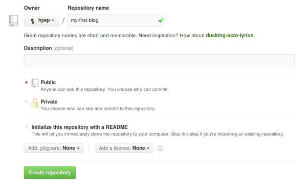
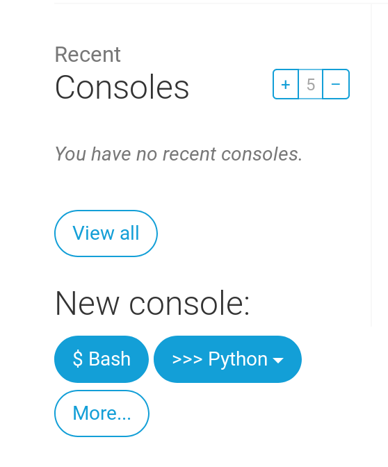

# Wdrażanie!

> **Uwaga:** Niniejszy rozdział może być miejscami dość trudny. Bądź dzielna i przestudiuj go do końca; wdrażanie jest ważną częścią pracy nad stroną. Celowo umieściłyśmy go tutaj, aby Twój mentor był w stanie pomóc Ci przejść przez skomplikowany proces opublikowania Twojej strony w sieci. Oznacza to, że możesz wciąż ukończyć tutorial samodzielnie, jeśli zabraknie Ci czasu.

Do teraz twoja strona była dostępna tylko na twoim komputerze. Właśnie teraz nauczymy się, jak ją wdrożyć! Wdrożenie to inaczej opublikowanie Twojej aplikacji w internecie, dzięki czemu możesz w końcu pokazać ją innym ludziom. :)

Jak już wiesz, strona internetowa musi znajdować się na jakimś serwerze. W internecie działa wielu dostawców serwerów. Skorzystamy z usług [PythonAnywhere](https://www.pythonanywhere.com/). PythonAnywhere jest darmowy dla małych aplikacji, które nie przyciągają zbyt wielu odwiedzających. Z pewnością jest wystarczający dla Ciebie.

Drugą zewnętrzną usługą, jakiej będziemy używać jest [GitHub](https://www.github.com), który przechowuje kod. Istnieją inne usługi, ale w dzisiejszych czasach prawie wszyscy programiści mają konto na GitHubie - i Ty dzisiaj do nich dołączysz!

Te trzy miejsca będą dla Ciebie bardzo ważne. Twój lokalny komputer będzie miejscem, w którym będziesz rozwijać i testować swoją aplikację. Kiedy będziesz zadowolona ze swoich zmian, kod swojego programu umieścisz na GitHubie. Twoja strona za to będzie dostępna na PythonAnywhere i wszystkie zmiany będziesz tam ściągał ze swojej kopii kodu na GitHubie.

# Git

> **Uwaga** Jeżeli wykonałaś już wszystkie kroki instalacji, nie ma potrzeby ich powtarzać - możesz przeskoczyć do następnej sekcji i zacząć tworzyć repozytorium w Gicie.



## Tworzenie repozytorium Git

Git śledzi zmiany dokonywane w zbiorze plików w czymś, co nazywamy repozytorium kodu (albo po prostu "repo", żeby było krócej). Stwórzmy takie repozytorium dla naszego projektu. Otwórz konsolę w katalogu `djangogirls` i wpisz następujące polecenia:

> **Uwaga** Sprawdź bieżący katalog roboczy za pomocą polecenia `pwd` (Mac OS X/Linux) lub `cd` (Windows) przed inicjalizacją repozytorium. Powinnaś się znajdować w katalogu `djangogirls`.

command-line

    $ git init
    Initialized empty Git repository in ~/djangogirls/.git/
    $ git config --global user.name "Twoja Nazwa Uzytkownika"
    $ git config --global user.email ty@adres.pl
    

Inicjalizacja repozytorium gita jest jednorazowym zadaniem dla każdego projektu (nie będzie więcej potrzeby, byś ponownie podawał nazwę użytkownika i email).

Git będzie śledzić zmiany we wszyskich plikach i folderach w tym katalogu, ale zwróć uwagę, że znajdują się w nim pewne pliki, których zmiany chcemy ignorować. By to zrobić, musimy utworzyć w tym katalogu plik, który nazwiemy `.gitignore`. Otwórz swój edytor kodu i utwórz nowy plik o następującej treści:

.gitignore

    *.pyc
    *~
    __pycache__
    myvenv
    db.sqlite3
    /static
    .DS_Store
    

I zapisz go jako `.gitignore` w katalogu "djangogirls".

> **Uwaga** Ta kropka na początku nazwy pliku jest ważna! Jeżeli masz problem podczas tworzenia tego pliku (MacOS ma na przykład problem z tworzeniem plików zaczynających się od kropki za pomocą Findera), to spróbuj użyć polecenia "Zapisz jako" w swoim edytorze, to akurat jest niezawodne.
> 
> **Uwaga** Jednym z plików, który wyszczególniliśmy w `.gitignore` to `db.sqlite3`. Ten plik to twoja lokalna baza danych, gdzie będą się znajdować wszystkie artykuły z twojego bloga. Nie chcemy dodawać tego pliku do repozytorium, ponieważ twoja strona na PythonAnywhere będzie korzystać z innnej bazy danych. Tą bazą może być SQLite, tak jak na twojej maszynie deweloperskiej, ale najczęściej będziesz korzystać z bazy MySQL, która radzi sobie z dużą większą ilością odwiedzających. W każdym razie, zignotowanie twojej bazy SQLite w kopii na GitHubie, oznacza że wszystkie artykuły, które stworzyłaś do tej pory zostaną i będą widoczne tylko lokalnie, i będziemy musiały dodać je ponownie na środowisku produkcyjnym. Powinnaś myśleć o swojej lokalnej bazie danych jako o dobrym placu zabaw, na którym możesz testować różne rzeczy nie bojąc się, że skasujesz prawdziwe artykuły ze swojego bloga.

Dobrym nawykiem jest wpisywanie polecenia `git status` zanim wpiszesz `git add` albo gdy nie jesteś pewna co się zmieniło. Pozwala ono zabezpieczyć się przed niespodziankami takimi, jak chociażby dodanie lub skomitowanie błędnego pliku. Polecenie `git status` zwraca informację o wszystkich nieśledzonych/zmienionych/zaplanowanych do najbliższego commita plików, statusie brancha i wiele innych. Wynik powinien wyglądać podobnie do następującego:

command-line

    $ git status
    On branch master
    
    Initial commit
    
    Untracked files:
      (use "git add <file>..." to include in what will be committed)
    
            .gitignore
            blog/
            manage.py
            mysite/
    
    nothing added to commit but untracked files present (use "git add" to track)
    

I na końcu zapisujemy zmiany. Przejdź do konsoli i wykonaj poniższe polecenia:

command-line

    $ git add --all .
    $ git commit -m "My Django Girls app, first commit"
     [...]
     13 files changed, 200 insertions(+)
     create mode 100644 .gitignore
     [...]
     create mode 100644 mysite/wsgi.py
    

## Przesyłanie kodu do GitHuba

Wejdź na stronę [GitHub.com](https://www.github.com) i utwórz nowe, darmowe konto. (Jeśli już to wcześniej zrobiłaś, to super!)

Następnie utwórz nowe repozytorium i nadaj mu nazwę "my-first-blog" (ang. "mój-pierwszy-blog"). Pozostaw niezaznaczone pole wyboru "initialize with README", pozostaw opcję .gitignore pustą (zrobiłyśmy to ręcznie) i pozostaw licencję jako None.

> **Uwaga** Nazwa `my-first-blog` jest ważna - mogłabyś wybrać jakąś inną, ale będziemy tej nazwy używać wiele razy i za każdym razem musiałabyś pamiętać, żeby zastępować "my-first-blog" swoją wybraną nazwą. Z tego powodu najłatwiej będzie jak użyjesz nazwy `my-first-blog`.

Na następnej stronie wyświetli Ci się adres URL do klonowania Twojego repozytorium. Wybierz wersję "HTTPS", skopiuj go i niedługo będziemy go wklejać do terminala:

Teraz musimy podpiąć repozytorium Git na komputerze do tego na GitHubie.

Wpisz następujące polecenie do konsoli (Zamień `<your-github-username>` na swoją nazwę użytkownika, którą podałaś przy tworzeniu konta na GitHubie, ale bez nawiasów ostrokątnych, czyli "<" i ">"):

command-line

    $ git remote add origin https://github.com/<your-github-username>/my-first-blog.git
    $ git push -u origin master
    

Wpisz swoją nazwę użytkownika GitHub oraz hasło, a wtedy powinnaś zobaczyć coś takiego:

command-line

    Username for 'https://github.com': ola
    Password for 'https://ola@github.com':
    Counting objects: 6, done.
    Writing objects: 100% (6/6), 200 bytes | 0 bytes/s, done.
    Total 3 (delta 0), reused 0 (delta 0)
    
    To https://github.com/ola/my-first-blog.git
     * [new branch]      master -> master
    Branch master set up to track remote branch master from origin.
    

<!--TODO: maybe do ssh keys installs in install party, and point ppl who dont have it to an extension -->

Twój kod jest teraz na GitHubie. Możesz to sprawdzić! Znajdujesz się teraz w wyśmienitym towarzystwie - [Django](https://github.com/django/django), [kurs Django Girls](https://github.com/DjangoGirls/tutorial) i wiele innych świetnych projektów open-source trzyma swój kod na GitHubie! :)

# Wdrażanie bloga na PythonAnywhere

## Zakładanie konta na PythonAnywhere

> **Uwaga** Możliwe, że już wcześniej utworzyłaś konto na PythonAnywhere, jeśli przeszłaś przez wszystkie kroki w rozdziale instalacyjnym - nie ma potrzeby, byś robiła to drugi raz.



## Konfigurowanie naszej strony w PythonAnywhere

Wróć do głównego panelu [PythonAnywhere Dashboard](https://www.pythonanywhere.com/), klikając logo i wybierz opcję uruchomienia konsoli "Bash" - jest to wersja wiersza poleceń PythonAnywhere, podobnie jak na Twoim komputerze.

> **Uwaga** PythonAnywhere jest oparty na Linuksie, więc jeśli pracujesz na Windowsie, to konsola będzie wyglądać trochę inaczej, niż na Twoim komputerze.

Wdrożenie aplikacji internetowej w PythonAnywhere polega na ściągnięciu kodu z GitHuba, a następnie skonfigurowaniu PythonAnywhere w celu rozpoznania go i rozpoczęciu wyświetlania go jako aplikacji internetowej. Istnieją manualne sposoby robienia tego, ale PythonAnywhere zapewnia narzędzie pomocnicze, które zrobi to wszystko za Ciebie. W pierwszej kolejności zainstalujmy:

PythonAnywhere command-line

    $ pip3.6 install --user pythonanywhere
    

To powinno wydrukować rzeczy takie jak `Collecting pythonanywhere`, a skończyć się na linii z napisem `Successfully installed (...) pythonanywhere- (...)`.

Teraz uruchamiamy pomocnika, aby automatycznie skonfigurować naszą aplikację z GitHubem. Wpisz następujące polecenie do konsoli w PythonAnywhere (nie zapomnij zamienić `<your-github-username>` na swoją nazwę użytkownika):

PythonAnywhere command-line

    $ pa_autoconfigure_django.py https://github.com/<your-github-username>/my-first-blog.git
    

Jeżeli patrzysz na proces, będziesz mogła zobaczyć:

- Pobieranie kodu z GitHuba
- Tworzenie środowiska wirtualnego na PythonAnywhere, podobnie jak na Twoim PC
- Aktualizowanie pliku ustawień z niektórych ustawień wdrażania
- Konfigurowanie bazy danych w PythonAnywhere za pomocą polecenia `manage.py migrate`
- Konfigurowanie plików statycznych (dowiemy się o nich później)
- I konfigurowanie PythonAnywhere do obsługi aplikacji internetowej za pomocą interfejsu API

W PythonAnywhere wszystkie te kroki są zautomatyzowane, ale są to te same kroki, które trzeba wykonać z dowolnym innym dostawcą serwera. Najważniejsze, aby zauważyć, że baza danych w PythonAnywhere jest całkowicie oddzielona od bazy danych na własnym komputerze, co oznacza, że może mieć inne posty i konta administracyjne.

W rezultacie, tak jak zrobiłyśmy to na własnym komputerze, musimy zainicjować konto administratora za pomocą `createsuperuser`. PythonAnywhere automatycznie aktywował Twój virtualenv dla Ciebie, więc wszystko, co musisz zrobić, to uruchomić:

PythonAnywhere command-line

    (ola.pythonanywhere.com) $ python manage.py createsuperuser
    

Wpisz szczegóły dla konta swojego administratora. Najlepiej używać tych samych, których używasz na swoim komputerze, aby uniknąć nieporozumień, chyba że chcesz, aby hasło w PythonAnywhere było bezpieczniejsze.

Teraz, jeśli chcesz, możesz również rzucić okiem na swój kod w PythonAnywhere używając `ls`:

PythonAnywhere command-line

    (ola.pythonanywhere.com) $ ls
    blog  db.sqlite3  manage.py  mysite  static
    (ola.pythonanywhere.com) $ ls blog/
    __init__.py  __pycache__  admin.py  forms.py  migrations  models.py  static
    templates  tests.py  urls.py  views.py
    

Możesz także przejść do zakładki "Pliki" i poruszać się za pomocą wbudowanej przeglądarki plików w PythonAnywhere.

## Jesteś na żywo!

Twoja strona powinna teraz być dostępna w publicznym Internecie! Przejdź do zakładki "Sieć" PythonAnywhere, aby uzyskać link do niej. Możesz podzielić się nim z kimkolwiek chcesz :)

> **Uwaga:** Jest to poradnik dla początkujących, a podczas wdrażania tej witryny użyłyśmy kilka skrótów, które nie są idealnym rozwiązaniem z punktu widzenia bezpieczeństwa. Jeśli zdecydujesz się zbudować ten projekt lub rozpocząć nowy projekt, należy przejrzeć [Django deployment checklist](https://docs.djangoproject.com/en/1.11/howto/deployment/checklist/), aby uzyskać jakieś wskazówki dotyczące zabezpieczania witryny.

## Porady dotyczące debugowania

Jeśli widzisz błąd podczas uruchamiania skryptu `pa_autoconfigure_django.py`, oto kilka typowych przyczyn:

- Zapominasz utworzyć Twój PythonAnywhere API token.
- Robisz błąd w GitHub URL
- Jeśli zobaczysz komunikat o błędzie *"Could not find your settings.py"*, prawdopodobnie nie udało Ci się dodać wszystkich plików do Git, i / lub nie przekazałeś ich do pomyślnie do GitHuba. Jeszcze raz spójrz na sekcję Git powyżej

Jeśli odwiedzając swoją stronę zobaczysz błąd, to pierwszym miejscem, w którym powinnaś poszukać informacji o tym, co się stało, jest Twój **dziennik błędów** (ang. "error log"). Znajdziesz do niego link na karcie [Web](https://www.pythonanywhere.com/web_app_setup/) w PythonAnywhere. Sprawdź, czy znajdują się tam jakieś komunikaty o błędach - te najświeższe znajdują się na samym dole.

Są tam też dostępne [generalne porady odnośnie debugowania na stronie pomocy PythonAnywhere](http://help.pythonanywhere.com/pages/DebuggingImportError).

I pamiętaj, Twój mentor jest tutaj, by Ci pomóc!

# Sprawdź swoją stronę!

Domyślna strona Twojej witryny powinna brzmieć "It worked!", tak jak na Twoim lokalnym komputerze. Spróbuj dodać `/admin/` na koniec swojego adresu URL - powinnaś się przenieść do panelu admina. Zaloguj się przy użyciu nazwy użytkownika i hasła, a zobaczysz, że możesz dodawać nowe posty na serwerze.

Po utworzeniu kilku postów możesz wrócić do konfiguracji lokalnej (nie PythonAnywhere). Od teraz powinnaś pracować na swoim lokalnym komputerze, jeżeli będziesz chciała dokonać zmian na stronie. To częsty sposób pracy w rozwijaniu stron WWW - wprowadzaj zmiany lokalnie, wypychaj je na GitHuba i zaciągaj na swój internetowy serwer WWW. Pozwala to na pracę i eksperymentowanie bez obawy, że zepsujesz działającą stronę. Całkiem nieźle, co nie?

*Przybij piątkę!* Wdrożenia strony na serwery są jednym z najtrudniejszych elementów tworzenia stron internetowych i często ludzie potrzebują kilku dni, zanim wszystko zacznie poprawnie działać. Masz swoją witrynę na żywo, w prawdziwym Internecie, właśnie tak!