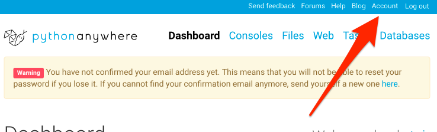

PythonAnywhere jest platformą do uruchamiania kodu Pythona w chmurze. Będziemy go używać do hostowania naszej strony na żywo w internecie.

Utwórz konto dla "Beginner" na PythonAnywhere (darmowy poziom jest dobry, nie potrzebujesz do niego karty kredytowej).

* [www.pythonanywhere.com](https://www.pythonanywhere.com/)

> ** Uwaga!** Wybierając tutaj swoją nazwę użytkownika, należy pamiętać, że adres URL bloga będzie miał postać `twojanazwa.pythonanywhere.com`, więc wybierz swój własny nick lub nazwę tego, o czym będzie blog. Pamiętaj, aby zapamiętać hasło (dodaj je do menedżera haseł, jeśli go używasz).

## Tworzenie tokenu PythonAnywhere API

Tę operację będziesz musiała wykonać tylko raz. Kiedy już zakończysz tworzenie konta na PythonAnywhere, zostaniesz przeniesiona do strony nawigacyjnej. Znajdź u góry na prawo link do Twojego konta (ang. Account).

a następnie wybierz zakładkę o nazwie "API Token" i wciśnij przycisk, który utworzy nowy token API (ang. "Create new API token").

