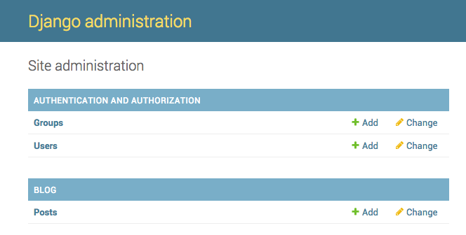

# Administracja Django (admin)

W celu dodawania, edycji czy usuwania artykułów, dla których model przed chwilą stworzyłyśmy, użyjemy admina Django.

Otwórzmy plik `blog/admin.py` i zamieńmy jego zawartość na:

blog/admin.py

```python
from django.contrib import admin
from .models import Post

admin.site.register(Post)
```

Jak widać, importujemy (dołączamy) model Post, który zdefiniowałyśmy w poprzednim rozdziale. Aby nasz model był widoczny w panelu admina, musimy go zarejestrować za pomocą polecenia `admin.site.register(Post)`.

OK, czas rzucić okiem na nasz model Post. Pamiętaj, by wpisać `python manage.py runserver` w wierszu poleceń, by uruchomić serwer. Przejdź do przeglądarki i wpisz adres http://127.0.0.1: 8000/admin/. Zobaczysz stronę logowania podobną do tej:


Aby móc się zalogować, musisz utworzyć konto administratora (*superuser*) - czyli użytkownika, który posiada nieograniczony dostęp do całej strony. Wróć do wiersza poleceń, wpisz `python manage.py createsuperuser` i wciśnij enter.

> Pamietaj - aby móc wprowadzić nowe polecenie podczas pracy web serwera, otwórz nowy terminal i aktywuj virtualenv. Przyjrzałyśmy się, jak wpisywać nowe komendy w rozdziale **Twój pierwszy projekt w Django!**, w sekcji **Uruchamianie serwera www**.

Mac OS X or Linux:

    (myvenv) ~/djangogirls$ python manage.py createsuperuser
    

Windows:

    (myvenv) C:\Users\Name\djangogirls> python manage.py createsuperuser
    

Po wyświetleniu komunikatu, wpisz swoją nazwę użytkownika (małymi literami, bez spacji), adres e-mail i hasło. ** Nie martw się, że nie widzisz hasła, które wpisujesz - tak powinno być. ** Po prostu wpisz je i naciśnij klawisz `Enter`, aby kontynuować. Dane wyjściowe powinny wyglądać tak (gdzie nazwa użytkownika i adres e-mail powinny być Twoje):

    Username: admin
    Email address: admin@admin.com
    Password:
    Password (again):
    Superuser created successfully.
    

Wróć do przeglądarki. Zaloguj się za pomocą danych logowania administratora, które wybrałaś; powinnaś zobaczyć panel administracyjny Django.



Przejdź do Postów i poeksperymentuj z nimi trochę. Dodaj pięć lub sześć wpisów na blogu. Nie przejmuj się zawartością - możesz po prostu skopiować i wkleić tekst z tego tutoriala, aby zaoszczędzić czas. :)

Upewnij się, że co najmniej dwa lub trzy posty (ale nie wszystkie) mają ustawioną datę publikacji. Będzie to pomocne później.


Jeśli chcesz dowiedzieć się więcej o administratorze Django, powinnaś sprawdzić dokumentację Django: https://docs.djangoproject.com/en/1.11/ref/contrib/admin/

Jest to prawdopodobnie dobry moment, aby wziąć kawę (lub herbatę) lub coś do jedzenia, aby ponownie naładować się energią. Stworzyłaś swój pierwszy model Django - zasługujesz na małą przerwę!