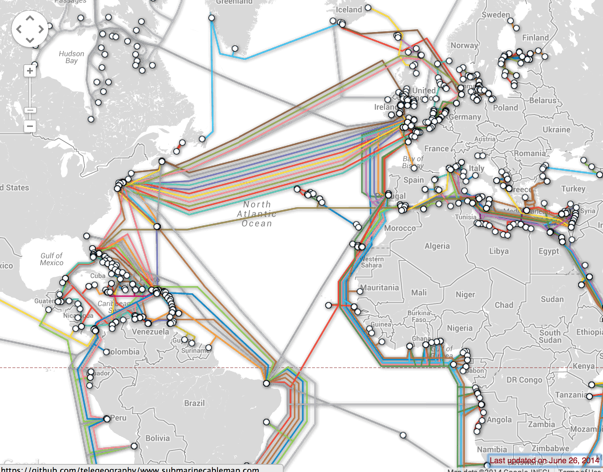
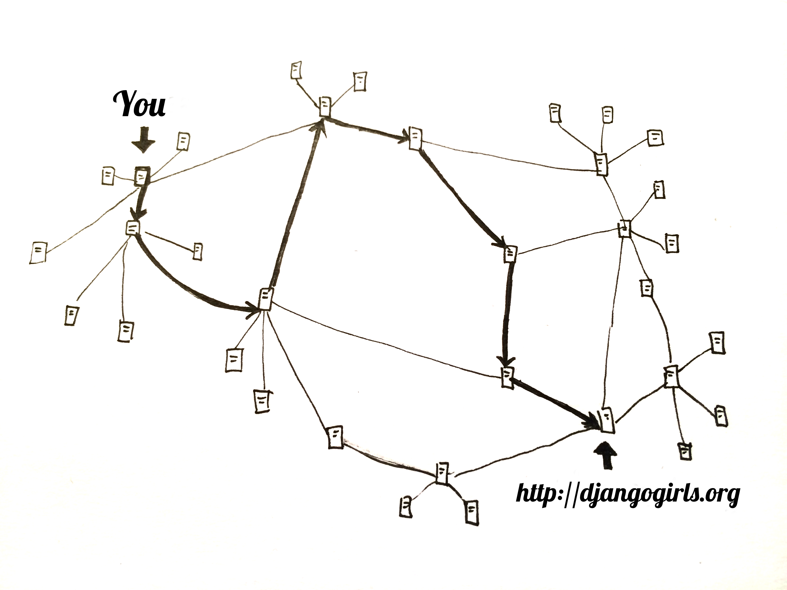
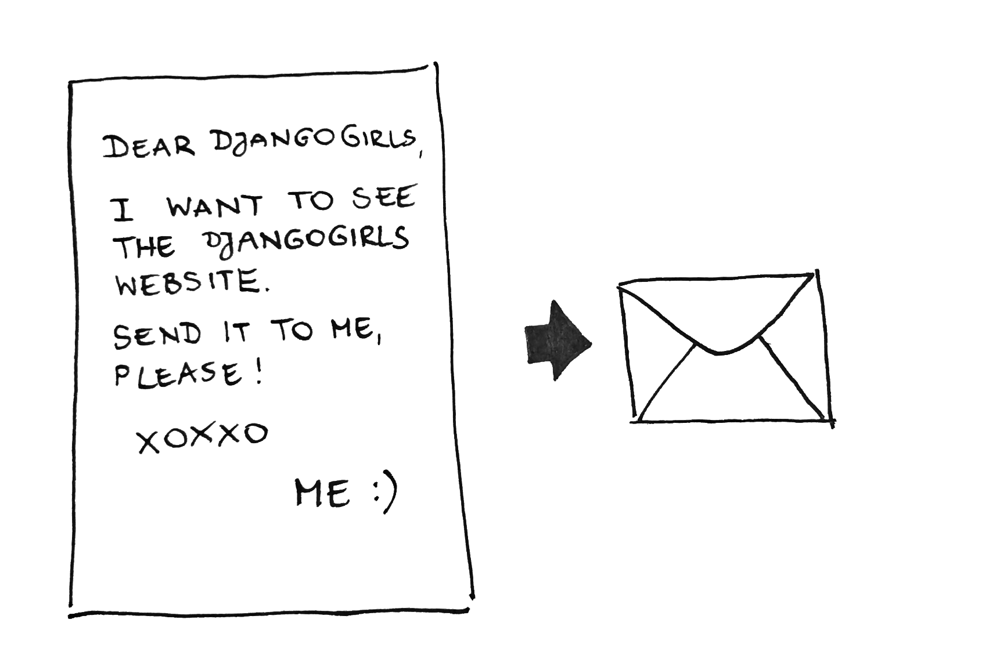

# Jak działa internet

> For readers at home: this chapter is covered in the [How the Internet Works](https://www.youtube.com/watch?v=oM9yAA09wdc) video.
> 
> This chapter is inspired by the talk "How the Internet works" by Jessica McKellar (http://web.mit.edu/jesstess/www/).

We bet you use the Internet every day. But do you actually know what happens when you type an address like https://djangogirls.org into your browser and press `enter`?

Aby zrozumieć jak działa internet powinnaś najpierw dowiedzieć się czym tak naprawdę jest strona internetowa, a jest ona tylko zbiorem plików zapisanych na dysku twardym. Tak samo jak twoje zdjęcia, muzyka czy filmy. Aczkolwiek strony internetowe różnią się od nich tym, że zawierają kod komputerowy zwany HTML.

Jeśli nie miałaś wcześniej do czynienia z programowaniem, może być Ci na początku trudno zrozumieć HTML, ale przeglądarki internetowe (takie jak Chrome, Safari, Firefox itd.) uwielbiają go. Zostały one zaprojektowane po to, by czytać ten kod, przetwarzać go i postępować zgodnie z jego instrukcjami. Prezentują pliki, z których składa się Twoja strona - by wyglądała dokładnie tak jak Ty chcesz.

Tak jak w przypadku każdego innego pliku, musimy umiejscowić pliki HTML na dysku twardym. Do przechowywania plików HTML używamy specjalnych, potężnych komputerów zwanych *serwerami (ang. servers)*. Serwery nie posiadają monitorów, myszy ani klawiatur, ponieważ ich głownym celem jest przechowywanie danych i serwowanie ich. That's why they're called *servers* – because they *serve* you data.

OK, but you want to know how the Internet looks, right?

Narysowaliśmy Ci schemat Internetu! Wygląda tak:

Wygląda dość chaotycznie, prawda? In fact it is a network of connected machines (the above-mentioned *servers*). Setki tysięcy maszyn! Wiele, wiele kilometrów kabli na całym świecie! Możesz wejść na stronę Submarine Cable Map (http://submarinecablemap.com) i sama zobaczyć jak skomplikowana jest ta sieć. Oto zrzut ekranu ze strony internetowej:

To fascynujące, prawda? Ale oczywiście niemożliwe jest stworzenie bezpośredniego połączenia kablowego między każdym komputerem w internecie. So, to reach a machine (for example, the one where https://djangogirls.org is saved) we need to pass a request through many, many different machines.

Wygląda to tak:

Imagine that when you type https://djangogirls.org, you send a letter that says: "Dear Django Girls, I want to see the djangogirls.org website. Send it to me, please!"

List trafia do urzędu pocztowego najbliżej Ciebie. Potem idzie do drugiego urzędu, który znajduje się trochę bliżej Twojego adresata. Potem do kolejnego, kolejnego, kolejnego, aż w końcu zostanie doręczony do miejsca przeznaczenia. Ciekawa rzecz - jeśli wyślesz wiele listów (*pakietów danych*) do tego samego adresata, mogą przejść przez zupełnie inne urzędy pocztowe (*routery*). To zależy od tego w jaki sposób zostaną rozdzielone w każdym urzędzie.

That's how it works - you send messages and you expect some response. Of course, instead of paper and pen you use bytes of data, but the idea is the same!

Zamiast adresów z nazwą ulicy, miastem, kodem pocztowym oraz nazwą kraju, używa się adresów IP. Twój komputer najpierw pyta serwera DNS (system nazw domenowych, ang. DNS - Domain Name System) o przetłumaczenie djangogirls.org na adres IP. It works a little bit like old-fashioned phonebooks where you can look up the name of the person you want to contact and find their phone number and address.

When you send a letter, it needs to have certain features to be delivered correctly: an address, a stamp, etc. Muszą być też napisane językiem zrozumiałym dla odbiorcy. To samo dotyczy *pakietów danych*, które wysyłasz, by zobaczyć jakąś stronę. Używany jest protokół HTTP (Hypertext Transfer Protocol).

Tak więc, ogólnie rzecz ujmując, jeśli chcesz mieć swoją stronę internetową musisz mieć *serwer* (komputer), gdzie będzie ona funkcjonować. Gdy *serwer* odbiera przychodzące *żądania* (Twój list), wysyła Ci w odpowiedzi Twoją stronę (kolejny list).

Since this is a Django tutorial, you might ask what Django does. Kiedy odpowiadasz na żądanie, nie chcesz aby każdy dostawał tę samą odpowiedź, prawda? Zdecydowanie lepiej jest jeśli listy są spersonalizowane i skierowane do konkretnej osoby, do tej, która napisała do Ciebie. Django pomaga Ci w tworzeniu tych spersonalizowanych, interesujących listów. :)

Enough talk – time to create!