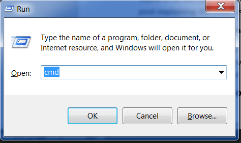

> Dla czytelniczek w domu: ten rozdział jest również omówiony w wideo [Installing Python & Code Editor](https://www.youtube.com/watch?v=pVTaqzKZCdA).
> 
> Niniejszy podrozdział powstał w oparciu o kurs Geek Girls Carrots (https://github.com/ggcarrots/django-carrots)

Django jest napisane w Pythonie. Musimy posiadać Pythona, by zrobić cokolwiek w Django. Zacznijmy od jego instalacji! Chcemy zainstalować Python 3.6, więc jeżeli posiadasz jakąkolwiek wcześniejszą wersję, będziesz musiała ją uaktualnić.

<!--sec data-title="Install Python: Windows" data-id="python_windows" data-collapse=true ces-->

Na początku sprawdź, czy twój komputer działa na 32-bitowej czy 64-bitowej wersji Windowsa, poprzez wciśnięcie kombinacji przycisków Windows + Pause/Break, które otworzą Właściwości systemu - sprawdź w linii "Typ systemu". Możesz ściągnąć Pythona dla Windowsa ze strony https://www.python.org/downloads/windows/. Kliknij w link "Latest Python 3 Release - Python x.x.x". Jeżeli twój komputer pracuje na **64-bitowej** wersji Windowsa, ściągnij **Windows x86-64 executable installer**. W innym wypadku ściągnij **Windows x86 executable installer**. Po ściągnięciu instalatora, powinnaś go uruchomić (klikając dwukrotnie w niego) i postępować według wyświetlanych instrukcji.

Na jedną rzecz będziesz musiała uważać: Podczas instalacji zauważysz ekran oznaczony jako "Setup". Upewnij się, że zaznaczyłaś checkbox "Add Python 3.6 to PATH" oraz kliknęłaś "Install Now", tak jak tutaj:

W nadchodzących krokach, będziesz używać "Wiersz poleceń" Windowsa (o której też Ci zaraz opowiemy). Na teraz, jeżeli będziesz musiała wpisać jakiekolwiek polecenie, przejdź do menu Start → System → Wiersz polecenia. Możesz też przytrzymać klawisz Windows i nacisnąć "R" - pojawi się Tobie okno "Uruchamianie". W celu otworzenia Wiersza polecenia, wpisz "cmd" i wciśnij przycisk enter w oknie "Uruchamianie". (Na nowszych wersjach Windowsa możesz być zmuszona by wyszukać "Wiersz polecenia", ponieważ może być on ukryty.)

Uwaga: Jeżeli używasz starszej wersji Windowsa (7, Vista lub jakikolwiek starszy) i podczas instalacji Python 3.6.x dostaniesz błąd, możesz:

1. zainstalować wszystkie uaktualnienia systemu Windows a spróbować instalacji Pythona 3.6 jeszcze raz; lub
2. zainstalować [starszą wersję Pythona](https://www.python.org/downloads/windows/), np. [3.4.6](https://www.python.org/downloads/release/python-346/).

Jeżeli zainstalujesz starszą wersję Pythona, ekrany instalatora mogą wyglądać nieznacznie inaczej niż pokazane wyżej. Upewnij się, że przewinęłaś do "Add python.ext to Path", kliknęłaś przycisk po lewej i wybrałaś "Will be installed on local hard drive":

<!--endsec-->

<!--sec data-title="Install Python: OS X" data-id="python_OSX"
data-collapse=true ces-->

> **Uwaga** Zanim zainstalujesz Pythona na OS X, musisz się upewnić, że ustawienia twojego Maca pozwolą na instalację pakietów, które nie pochodzą z App Store'a. Przejdź do Preferencji systemowych (znajdziesz je w folderze Aplikacje), kliknij "Ochrona i prywatność" i przejdź do zakładki "Ogólne". Jeżeli w "Dopuszczaj aplikacje pobrane z:" jest ustawione na "App Store", zmień to na "App Store i od zidentyfikowanych deweloperów".

Przejdź na stronę https://www.python.org/downloads/release/python-361/ i pobierz instalator Pythona:

* Pobierz plik o nazwie *Mac OS X 64-bit/32-bit installer*,
* Kliknij dwukrotnie na *python-3.6.1-macosx10.6.pkg*, by uruchomić instalator.

<!--endsec-->

<!--sec data-title="Install Python: Linux" data-id="python_linux"
data-collapse=true ces-->

Jest bardzo prawdopodobne, że masz już zainstalowanego Pythona wraz z systemem. Aby się upewnić (a także sprawdzić jego wersję) otwórz konsolę i wpisz następujące polecenie:

command-line

    $ python3 --version
    Python 3.6.1
    

Jeżeli masz zainstalowaną inną 'mikrowersję' Pythona, np. 3.6.0, to nie ma potrzeby, byś dokonywała aktualizacji. Jeżeli nie masz zainstalowanego Pythona lub chciałabyś zainstalować go w innej wersji, skorzystaj z jednego z poniższych sposobów:

<!--endsec-->

<!--sec data-title="Install Python: Debian or Ubuntu" data-id="python_debian" data-collapse=true ces-->

Wpisz w konsoli poniższe polecenie:

command-line

    $ sudo apt install python3.6
    

<!--endsec-->

<!--sec data-title="Install Python: Fedora" data-id="python_fedora"
data-collapse=true ces-->

Użyj następującego polecenia w konsoli:

command-line

    $ sudo dnf install python3
    

Jeżeli używasz starszej wersji Fedory możesz dostać wiadomość o błędzie, że polecenie `dnf` nie zostało znalezione. W takim wypadku powinnaś użyć yum.

<!--endsec-->

<!--sec data-title="Install Python: openSUSE" data-id="python_openSUSE"
data-collapse=true ces-->

Użyj następującego polecenia w konsoli:

command-line

    $ sudo zypper install python3
    

<!--endsec-->

Sprawdź, czy instalacja zakończyła się pomyślnie - otwórz wiersz poleceń i uruchom polecenie `python3`:

command-line

    $ python3 --version
    Python 3.6.1
    

**Uwaga:** Jeżeli pracujesz na Windowsie i dostajesz wiadomość o błędzie, że `python3` nie został znaleziony, spróbuj użyć `python` (bez `3`) oraz sprawdź, czy być może w taki sposób uruchomisz Pythona 3.6.

* * *

W razie jakichkolwiek wątpliwości albo jeśli coś poszło nie tak i nie wiesz, co dalej robić, zapytaj mentora lub osobę prowadzącą kurs! Czasami nie wszystko idzie tak, jak powinno i najlepszym wyjściem z sytuacji jest poprosić o pomoc kogoś bardziej doświadczonego.