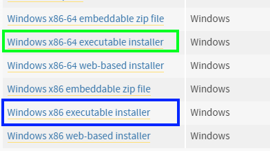
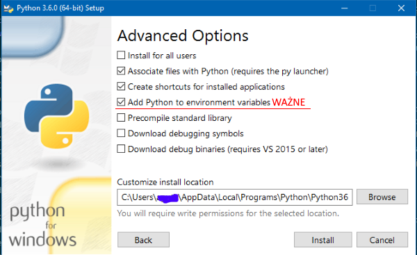

> Niniejszy podrozdział powstał w oparciu o kurs Geek Girls Carrots (https://github.com/ggcarrots/django-carrots)

Django został napisany w Pythonie. Potrzebujemy Pythona, żeby móc cokolwiek zrobić w Django. Zacznijmy zatem od zainstalowania go! Potrzebujemy zainstalować Pythona 3.6.0, dlatego jeżeli masz już zainstalowaną jakąkolwiek starszą wersję, będziesz musiała ją uaktualnić.

Pliki instalacyjne Pythona możesz pobrać z tej strony: https://www.python.org/downloads/release/python-360/. Lista plików do pobrania, dla wszystkich systemów znajduje się na samym dole strony. Poniżej są szczegółowe instrukcje instalacji, w zależności od Twojego systemu operacyjnego.

<!--sec data-title="Windows" data-id="python_windows" data-collapse=true ces-->

Wybierz wersję instalacyjną, odpowiednią dla Twojego systemu. Poniżej na zdjęciu zaznaczone są wersje dla systemu 64-bitowego (kolor zielony), oraz dla systemu 32-bitowego (kolor niebieski).
Jeśli nie jesteś pewna jaki jest Twój system, to nie bój się zapytać mentora.

Po pobraniu odpowiedniego pliku np. **python-3.6.0-amd64.exe** dla systemu 64-bitowego *(lub python-3.6.0.exe dla 32-bitowego, numer wersji może się zmieniać)*, uruchom go (klikając dwukrotnie na niego) i postępuj według wyświetlanych instrukcji:
* na pierwszym ekranie kliknij opcję **Customize installation**
* na drugim ekranie "Optional features" zaznacz wszystkie opcje oprócz "for all users"
* na trzecim ekranie "Advanced Options" zaznacz nastęujące opcje:
  * Associate files with Python
  * Create shortcuts for installed Applications
  * Add Python to environment variables **WAŻNE**

Jeśli masz wszystkie opcje zaznaczone, to możesz nacisnąć przycisk **Install**

**Uwaga**
Jeśli bardzo dawno nie aktualizowałaś swojego systemu Windows 7, to możesz natrafić na błąd podczas instalacji, który będzie zawierać frazę podobną do "...C runtime libraries...".
W tym wypadku uruchom instalator Python jako administrator: prawy przycisk myszy na pliku instalacyjnym -> "Uruchom jako administrator". Jeśli dalej nie będziesz mogła zainstalować, to musisz zaktualizować swój system.

<!--endsec-->

<!--sec data-title="OS X" data-id="python_OSX"
data-collapse=true ces-->

Przejdź na stronę https://www.python.org/downloads/release/python-360/ i pobierz instalator Pythona:

  * Pobierz plik o nazwie *Mac OS X 64-bit/32-bit installer*,
  * Kliknij dwukrotnie na *python-3.6.0-macosx10.6.pkg*, by uruchomić instalator.

Sprawdź, czy instalacja zakończyła się pomyślnie - otwórz aplikację *Terminal* i uruchom polecenie `python3`:

    $ python3 --version
    Python 3.6.0

<!--endsec-->

<!--sec data-title="Linux" data-id="python_linux"
data-collapse=true ces-->

Jest bardzo prawdopodobne, że masz już zainstalowanego Pythona wraz z systemem. Aby się upewnić (a także sprawdzić jego wersję) otwórz konsolę i wpisz następujące polecenie:

    $ python3 --version
    Python 3.6.0

Jeżeli nie masz zainstalowanego Pythona lub chciałabyś zainstalować go w innej wersji, skorzystaj z jednego z poniższych sposobów:

<!--endsec-->

<!--sec data-title="Debian or Ubuntu" data-id="python_debian"
data-collapse=true ces-->

Wpisz w konsoli poniższe polecenie:

    $ sudo apt-get install python3.6

<!--endsec-->

<!--sec data-title="Fedora (22+)" data-id="python_fedora22"
data-collapse=true ces-->

Użyj następującego polecenia w konsoli:

    $ sudo dnf install python3.6

<!--endsec-->

<!--sec data-title="openSUSE" data-id="python_openSUSE"
data-collapse=true ces-->

Użyj następującego polecenia w konsoli:

    $ sudo zypper install python3

<!--endsec-->

* * *

W razie jakichkolwiek wątpliwości albo jeśli coś poszło nie tak i nie wiesz, co dalej robić - zapytaj mentora lub osobę prowadzącą kurs! Czasami nie wszystko idzie tak, jak powinno i najlepszym wyjściem z sytuacji jest poprosić o pomoc kogoś bardziej doświadczonego.
