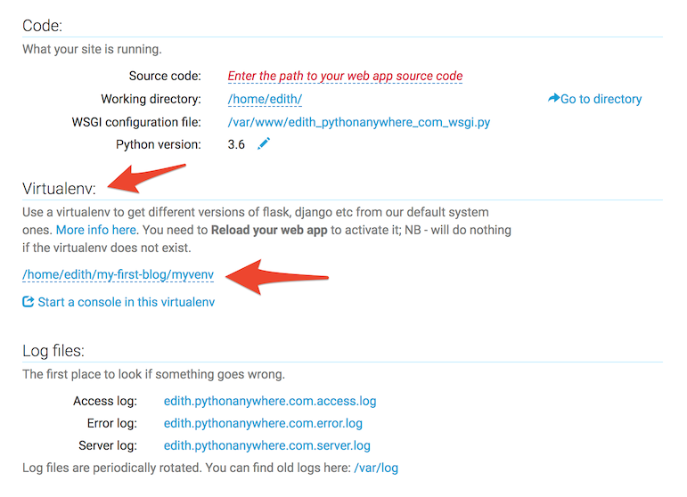

# Implantação!

> **Nota** O capítulo seguinte pode ser, às vezes, um pouco difícil de percorrer. Persista e termine-o; Implantação é uma parte importante do processo de desenvolvimento de website. Este capítulo está localizado no meio do tutorial para que sua tutora possa lhe ajudar com o processo ligeiramente complexo de colocar seu site online. Isto significa que você ainda pode terminar o tutorial por conta própria se você não tiver tempo.

Até agora, seu site só estava disponível no seu computador. Agora você vai aprender como publicar ele na internet! A implantação é o processo de publicação do seu aplicativo na Internet de tal forma que as pessoas possam, finalmente, ver seu aplicativo :).

Como você aprendeu, um website precisa estar localizado num servidor. Existem muitos provedores, mas iremos utilizar o que tem um processo de deploy relativamente simples: [PythonAnywhere](https://www.pythonanywhere.com/). PythonAnywhere é gratuito para aplicações pequenas que não possuem muitos visitantes, então será suficiente para você por enquanto.

O outro serviço externo que usaremos é [GitHub](https://www.github.com), que é um serviço de hospedagem de código. Existem outros, mas muitas das pessoas que programam possuem uma conta no GitHub atualmente e agora você também!

Esses três locais serão importantes para você. Seu computador local será o local aonde você faz o desenvolvimento e testes. Quando você estiver satisfeita com as mudanças, você colocará uma cópia de seu programa no GitHub. Seu website estará no PythonAnywhere e você irá atualizá-lo pegando uma nova cópia de seu código a partir do GitHub.

# Git

> **Nota** Se você já passou pelos passos de Instalação, não há necessidade de fazer isso novamente – você pode pular para a
próxima seção e começar a criar seu repositório Git.



## Começando nosso repositório no Git

Git controla as alterações para um determinado conjunto de arquivos no que chamamos de repositório de código (ou "repo"). Vamos começar um para nosso projeto. Abra o console e execute esses comandos, no diretório `djangogirls`:

> **Nota**: Verifique o seu diretório de trabalho atual com um `pwd` (OSX/Linux) ou o comando `cd` (Windows) antes de inicializar o repositório. Você deve estar na pasta `djangogirls`.

command-line
```
$ git init
Initialized empty Git repository in ~/djangogirls/.git/
$ git config --global user.name "Your Name"
$ git config --global user.email you@example.com
```

Inicializar o repositório git é algo que só precisamos fazer uma vez por projeto (e você não terá que re-introduzir o nome de usuário e e-mail nunca mais)

Git irá controlar as alterações para todos os arquivos e pastas neste diretório, mas existem alguns arquivos que queremos ignorar. Fazemos isso através da criação de um arquivo chamado `.gitignore` no diretório base. Abra seu editor e crie um novo arquivo com o seguinte conteúdo:


.gitignore
```
*.pyc
*~
__pycache__
myvenv
db.sqlite3
/static
.DS_Store
```

E salve como `.gitignore` na pasta "djangogirls".

> **Nota**: O ponto no início do nome do arquivo é importante! Se você está tendo alguma dificuldade em criá-la (Macs não gostam de criar arquivos que começam com um ponto através do Finder, por exemplo), use o recurso "Save As" no seu editor que sempre funciona.

> **Nota** Um dos arquivos que você especificou em seu arquivo `.gitignore` é o `db.sqlite3`. Esse arquivo é o seu banco de
dados local, aonde todos as suas postagens estão armazenadas. Nós não queremos adicionar isso no seu repositório porquê seu
website no PythonAnywhere estará usando um banco de dados diferente. Esse banco de dados poderia ser o SQLite, como na sua
máquina de desenvolvimento, mas geralmente você irá usar um chamado MySQL, o qual pode lidar com muito mais visitantes que o
SQLite. De qualquer forma, ignorar seu banco de dados SQLite na cópia no GitHub, significa que todos as  postagens que você
criou até agora vão ficar disponíveis apenas localmente, e você terá que adicioná-las novamente em produção. Você deve pensar no seu banco de dados local como um bom "playground", onde você pode testar coisas diferentes e não ter medo de apagar as
postagens reais de seu blog.

É uma boa idéia para usar um comando de `git status` antes de `git add` ou sempre que você não tiver certeza do que foi alterado. Isso previne que surpresas aconteçam, tais como adicionar ou fazer "commit" de arquivos errados. O comando `git status` retorna informações sobre qualquer arquivo "untracked/modified/staged" (não rastreado/modificado/encenado), status da branch e muito mais. A saída deve ser semelhante a:

command-line
```
$ git status
On branch master

Initial commit

Untracked files:
  (use "git add <file>..." to include in what will be committed)

        .gitignore
        blog/
        manage.py
        mysite/

nothing added to commit but untracked files present (use "git add" to track)
```

E finalmente nós salvamos nossas alterações, vá para o seu console e execute estes comandos:

command-line
```
$ git add --all .
$ git commit -m "My Django Girls app, first commit"
 [...]
 13 files changed, 200 insertions(+)
 create mode 100644 .gitignore
 [...]
 create mode 100644 mysite/wsgi.py
 ```

## Empurrando o nosso código para GitHub

Vá para [GitHub.com](https://www.github.com) e cadastre uma nova e gratuita conta de usuário. (Se você já fez isso na preparação
no workshop, parabéns!)

Em seguida, crie um novo repositório, e dê o nome "my-first-blog". Deixe o "initialise with a README" desmarcado, deixe a opção .gitignore em branco (já fizemos isso manualmente) e a licença como None.


> **Nota** O nome `my-first-blog` é importante -- você poderia escolher outra coisa, mas vamos usá-lo muitas vezes nas instruções abaixo e você teria que substituí-lo cada vez. É provavelmente mais fácil ficar com o nome `my-first-blog`.

Na tela seguinte, você será mostrada um clone da URL do seu repo. Escolha a versão "HTTPS",copie, e vamos colá-la no terminal em breve:


Agora precisamos conectar o repositório Git no seu computador com o no GitHub.

Digite o seguinte em seu console (Substitua `<your-github-username>` pelo nome de usuário que você usou quando criou sua conta
no GitHub, mas sem os sinais `<` e `>`):

command-line
```
$ git remote add origin https://github.com/<your-github-username>/my-first-blog.git
$ git push -u origin master
```

Digite seu GitHub username e senha, e você deve ver algo como isto:


command-line
```
Username for 'https://github.com': hjwp
Password for 'https://hjwp@github.com':
Counting objects: 6, done.
Writing objects: 100% (6/6), 200 bytes | 0 bytes/s, done.
Total 3 (delta 0), reused 0 (delta 0)
To https://github.com/hjwp/my-first-blog.git
 * [new branch]      master -> master
Branch master set up to track remote branch master from origin.
```

<!--TODO: maybe do ssh keys installs in install party, and point ppl who dont have it to an extention -->

Seu código agora está no GitHub. Vá e confira! Você irá descobrir que está em boa companhia - [Django](https://github.com/django/django), o [Django Girls Tutorial](https://github.com/DjangoGirls/tutorial) e muitos outros grandes projetos de software de código aberto também hospedam seu código no GitHub :)

# Criação de nosso blog em PythonAnywhere

> **Nota** Você já deve ter criado uma conta no PythonAnywhere anteriormente, durante os passos de instalação – se sim, não é
preciso fazer isso novamente



## Puxando nosso código para a PythonAnywhere

Quando você se inscreve para PythonAnywhere, você é levado ao seu painel de controle ou página "Consoles". Escolha a opção para iniciar o console "Bash" -- que é a versão PythonAnywhere de um console, como aquela no seu PC

> **Nota**: PythonAnywhere é baseado em Linux, assim se você estiver no Windows o console vai parecer um pouco diferente do que está no seu computador.

Vamos puxar nosso código a partir do GitHub para a PythonAnywhere através da criação de um "clone" do repo. Digite o seguinte no console da PythonAnywhere (não se esqueça de usar seu nome de usuário no lugar de `<your-github-username>`):

PythonAnywhere command-line
```
$ git clone https://github.com/<your-github-username>/my-first-blog.git
```

Isto puxará uma cópia do seu código para PythonAnywhere. Confira digitando:

PythonAnywhere command-line
```
$ tree my-first-blog
my-first-blog/
├── blog
│   ├── __init__.py
│   ├── admin.py
│   ├── migrations
│   │   ├── 0001_initial.py
│   │   └── __init__.py
│   ├── models.py
│   ├── tests.py
│   └── views.py
├── manage.py
└── mysite
    ├── __init__.py
    ├── settings.py
    ├── urls.py
    └── wsgi.py
```

### Criando um virtualenv na PythonAnywhere

Assim como fez em seu próprio computador, você pode criar um virtualenv na PythonAnywhere. No console Bash, digite:


    PythonAnywhere command-line
    20:20 ~ $ cd my-first-blog

    20:20 ~ $ virtualenv --python=python3.5 myvenv
    Running virtualenv with interpreter /usr/bin/python3.5
    [...]
    Installing setuptools, pip...done.

    20:20 ~ $ source myvenv/bin/activate

    (mvenv)20:20 ~ $ pip install django~=1.11.0 whitenoise~=2.0
    Collecting django
    [...]
    Successfully installed django-1.11.5 whitenoise-2.0

> **Nota** O passo `pip install` pode levar alguns minutos.  Paciência, paciência! Mas se levar mais de cinco minutos, algo
está errado. Pergunte a sua treinadora.

### Coleta de arquivos estáticos.

Você estava imaginando o que é "whitenoise"? É uma ferramenta para servir os chamados "arquivos estáticos". Arquivos estáticos funcionam de forma diferente nos servidores em comparação com nosso próprio computador, e precisamos de uma ferramenta como o "whitenoise" para atendê-los.

Vamos descobrir um pouco mais sobre arquivos estáticos mais tarde no tutorial, quando vamos editar o CSS para o nosso site.

Por enquanto só precisamos executar um comando extra chamado "collectstatic" no servidor. Isso diz pro Django reunir todos os arquivos estáticos que ele precisa no servidor. Em sua maioria, estes são os arquivos estáticos que fazem o site do admin bonito no momento.

    20:20 ~ $ python manage.py collectstatic

    You have requested to collect static files at the destination
    location as specified in your settings:

        /home/edith/my-first-blog/static

    This will overwrite existing files!
    Are you sure you want to do this?

    Type 'yes' to continue, or 'no' to cancel: yes


### Criando o banco de dados em PythonAnywhere

Aqui está outra coisa que é diferente entre seu computador e o servidor -- ele usa um banco de dados diferente. Então as contas de usuário e postagens podem ser diferentes no servidor e no seu computador.

Nós podemos inicializar o banco de dados no servidor da mesma maneira que fizemos em nosso próprio computador, com `migrate` e  `createsuperuser`:

PythonAnywhere command-line
```
(mvenv) $ python manage.py migrate
Operations to perform:
[...]
  Applying sessions.0001_initial... OK
(mvenv) $ python manage.py createsuperuser
```

## Publicando nosso blog como um aplicativo web

Agora nosso código está na PythonAnywhere, nossa virtualenv está pronta e o banco de dados está inicializado, estamos prontos para publicá-lo como um aplicativo da web!

Clique em voltar para o painel de controle da PythonAnywhere clicando no seu logotipo e clique na guia **Web**. E finalmente
aperte **Add a new web app**.

Após a confirmação de seu nome de domínio, escolha **manual configuration** (N.B. -  *não* a opção "Django") na caixa de diálogo. Em seguida, escolha **Python 3.5** e clique em "Next" para concluir o assistente.

> **Nota** certifique-se de escolher a opção "Manual configuration", não a "Django". Nós somos demais para o padrão de configuração Django da PythonAnywhere ;-)

### Definindo o virtualenv

Você será levado para a tela de configuração da PythonAnywhere para seu webapp, que é onde você precisará de ir quando quiser fazer alterações no aplicativo no servidor.



Na seção "Virtualenv", clique no texto vermelho que diz "Enter the path to a virtualenv" e digite: `/home/<your-PythonAnywhere-username>/my-first-blog/myvenv/`.  Clique na caixa azul com a "checkmark" (marca de seleção) para salvar o "path" (caminho) antes de proseguir.

> **Nota**: substitua seu próprio nome de usuário PythonAnywhere conforme apropriado. Se você cometer um erro, PythonAnywhere irá mostrar um pequeno aviso.

### Configurando o arquivo WSGI

Django funciona usando o "WSGI protocol", um padrão para servir sites usando Python, que tem suporte na PythonAnywhere. A maneira que configuramos PythonAnywhere para reconhecer nosso blog Django é editando um arquivo de configuração do WSGI.

Clique no link "WSGI configuration file" (na seção "Code" perto do topo da página - -ele vai ser nomeado algo como `/var/www/<your-username>_pythonanywhere_com_wsgi.py`), e você será levada para um editor.

Apague todo o conteúdo atual e substitua com algo parecido com isto:

&lt;your-username&gt;_pythonanywhere_com_wsgi.py
```python
import os
import sys

path = '/home/<your-PythonAnywhere-username>/my-first-blog'  # use your own PythonAnywhere username here
if path not in sys.path:
    sys.path.append(path)

os.environ['DJANGO_SETTINGS_MODULE'] = 'mysite.settings'

from django.core.wsgi import get_wsgi_application
from django.contrib.staticfiles.handlers import StaticFilesHandler
application = StaticFilesHandler(get_wsgi_application())
```

> **Nota** não se esqueça de substituir por seu próprio nome de usuário PythonAnywhere onde diz `<your-username>`
> **Nota** Na linha quatro, nós nos certificamos que Python anywhere saiba como encontrar nossa aplicação. É muito importante
que esse nome "path" (caminho) esteja correto, e especialmente que não exista espaços extras aqui. Senão você verá um "ImportError" no registro de erro.

O que esse arquivo faz é dizer PythonAnywhere onde mora a nossa aplicação web e qual o nome do arquivo de configurações Django.

O `StaticFilesHandler` é para lidar com o nosso CSS. Isso é cuidado automaticamente para você, durante o desenvolvimento local,
executando o comando `runserver`. Nós falaremos um pouco mais sobre arquivos estáticos mais tarde nesse tutorial, quando editarmos o CSS para o nosso site.


Aperte **Save** e então volte para a guia **Web**.

Já terminamos! Aperte o grande botão verde de **Reload**e você será capaz de ir ver o seu aplicativo. Você encontrará um link para ele no topo da página.

## Dicas de debugging

Se você ver um erro quando você tentar visitar o seu site, o primeiro lugar para procurar alguma informação de debugging é no seu **error log** -- você encontrará um link para isso em  PythonAnywhere [Web tab](https://www.pythonanywhere.com/web_app_setup/). Veja se há mensagens de erro lá. As mais recentes estão na parte inferior. Problemas comuns incluem:

-  esquecer um dos passos que fizemos no console: criando o virtualenv, ativá-lo, instalando o Django nele, migrando o banco de dados
- cometer um erro no "path" (caminho) do virtualenv na guia web -- haverá geralmente uma pequena mensagem de erro vermelha lá, se há um problema.
- Você usou a mesma versão do Python para seu virtualenv e para sua app web? Ambas devem ser 3.5.

Existem também algumas [dicas gerais de debugging no wiki da PythonAnywhere](https://www.pythonanywhere.com/wiki/DebuggingImportError).

E lembre-se, sua treinadora está aqui para ajudar!

# Você está ao vivo!

A página padrão para seu site deve dizer "Bem-vindo ao Django", como acontece no seu PC local. Tente adicionar `/admin/` no final da URL, e você será levado a administração do site. Faça login com o nome de usuário e senha, e você verá que você pode adicionar novas postagens no servidor.

Uma vez que você tenha algumas postagens criadas, você pode voltar para sua configuração local (não no PythonAnywhere). A partir de agora você deve trabalhar em sua configuração local para fazer mudanças. Esse é o fluxo de trabalho comum no desenvolvimento web – fazer alterações localmente, enviar essas mudanças para o GitHub, e mandar suas alterações para o seu servidor Web de produção. Isso permite você trabalhar e experimentar sem quebrar seu site Web que está online. Muito legal, não é?

Dê em você mesma um *enorme* tapinha nas costas - implantações de servidor são uma das partes mais difíceis do desenvolvimento web, e muitas vezes leva dias antes de fazer funcionar. Mas você tem seu site publicado, na Internet, simples assim!
