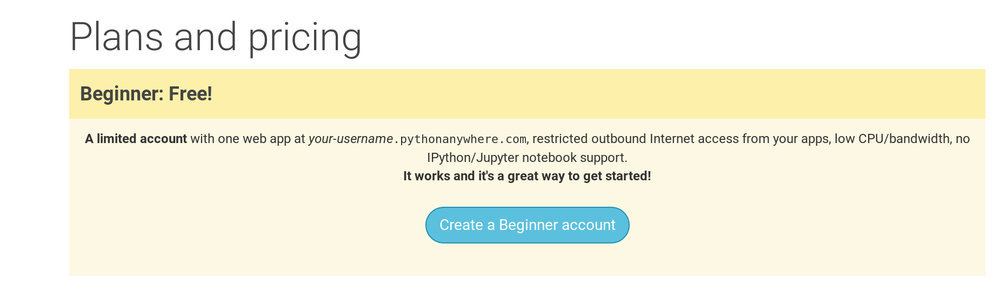

PythonAnywhere é um serviço para execução de código Python em servidores "na nuvem". Nós vamos utilizá-lo para hospedar nosso site e deixá-lo no ar na internet.

Vamos hospedar o blog que estamos construindo no PythonAnywhere. Cadastre uma conta "Begginer" (de iniciante) no PythonAnywhere (o pacote gratuito é suficiente, você não precisa de um cartão de crédito).

* [www.pythonanywhere.com](https://www.pythonanywhere.com/)

> ** Observação ** Quando escolher seu nome de usuário no PythonAnywhere, lembre que a URL do blog será `seunomedeusuário.pythonanywhere.com `, então use algo como o seu apelido ou um nome que descreva o assunto do blog. Além disso, certifique-se de lembrar sua senha (adicione-a ao seu gerenciador de senhas, se você usar um).

## Criando um token de API do PythonAnywhere

Você só precisará fazer isso uma vez. Depois de se registrar no PythonAnywhere, você será levada ao seu painel de controle. Encontre o link para a página de "Account" (conta, em português) próximo ao topo no lado direito:

em seguida, selecione a guia chamada "API Token" e aperte o botão que diz "Create new API token" (criar novo token API").

