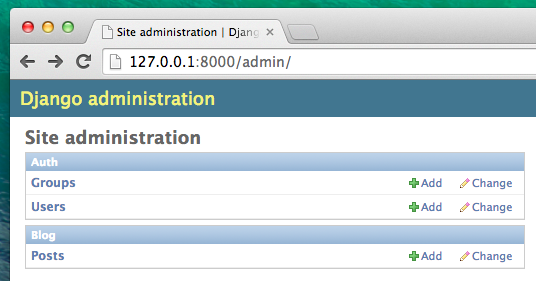

# Administração

Para adicionar, editar e remover postagens que nós criamos usaremos o Django admin.

Vamos abrir o arquivo `blog/admin.py` e substituir seu conteúdo por:

blog/admin.py
```python
from django.contrib import admin
from .models import Post

admin.site.register(Post)
```

Como você pode ver, nós importamos (incluímos) o modelo Post definido no capítulo anterior. Para tornar nosso modelo visível na página de administração, nós precisamos registrá-lo com: `admin.site.register(Post)`.

OK, hora de olhar para o nosso modelo de Post. Lembre-se de executar `python manage.py runserver` no console para executar o servidor web. Vá para o navegador e digite o endereço http://127.0.0.1:8000/admin/ Você verá uma página de login assim:


Para fazer login você precisa criar um *superuser* - um usuário que possui controle sobre tudo no site. Volte para o terminal e digite `python manage.py createsuperuser`, pressione enter.

> Lembre-se, para escrever novos comandos enquanto o servidor web estiver rodando, abra um novo terminal e ative seu ambiente
virtual. Nós revisamos como escrever novos comandos no capítulo <b>Seu primeiro projeto Django!</b>, na seção <b>Iniciando o servidor web</b>.

Quando perguntado, digite seu nome de usuário (minúsculas, sem espaços), endereço de email, e senha. Não se preocupe que você não pode ver a senha que você está digitando - é assim que deve ser. Apenas digite e pressione `enter` para continuar. A saída deve parecer com essa (onde username e email devem ser os seus):

command-line
```
(myvenv) ~/djangogirls$ python manage.py createsuperuser
Username: admin
Email address: admin@admin.com
Password:
Password (again):
Superuser created successfully.
```

Volte para a o navegador e faça login com as credenciais de superuser que você escolheu, você deve visualizar o painel de controle do Django admin.



Vá para as postagens e experimente um pouco com elas. Adicione cinco ou seis postagens. Não se preocupe com o conteúdo - você pode copiar e colar algum texto deste tutorial para o conteúdo para economizar tempo :).

Certifique-se que pelo menos duas ou três postagens (mas não todas) tenham a data de publicação definida. Isso será útil depois.


Se você quiser saber mais sobre o Django admin, você deve conferir a documentação do Django: https://docs.djangoproject.com/en/1.9/ref/contrib/admin/

Este é provavelmente um bom momento para tomar um café (ou chá) ou comer alguma coisa para repor as energias. Você criou seu primeiro modelo de Django - você merece um pouco de descanso!
