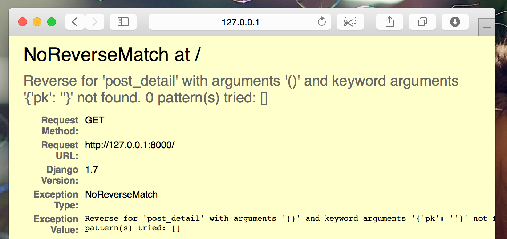

# Amplie sua aplicação

Já concluímos todos os passos necessários para a criação do nosso site: sabemos como criar um modelo, uma url, uma view e um template. Também sabemos como melhorar a aparência do nosso website.

Hora de praticar!

A primeira coisa que precisamos no nosso blog é, obviamente, uma página para mostrar uma postagem, certo?

Já temos um modelo de `Post`, então não precisamos adicionar nada ao `models.py`.

## Criar um link de template para um "detalhe" da postagem

Vamos começar com a adição de um link dentro do arquivo `blog/templates/blog/post_list.html`. Neste momento ele deve se parecer com:
blog/templates/blog/post_list.html
```html



    
        <div class="post">
            <div class="date">
                {{ post.published_date }}
            </div>
            <h1><a href="">{{ post.title }}</a></h1>
            <p>{{ post.text|linebreaksbr }}</p>
        </div>
    

```

Nós queremos ter um link com o título da postagem na lista de postagens para a página de detalhes da postagem. Vamos mudar `<h1><a href="">{{ post.title }}</a></h1>` para que ele redirecione para a página de detahles da postagem:

blog/templates/blog/post_list.html
```html
<h1><a href="">{{ post.title }}</a></h1>
```

Tempo para explicar o misterioso ``. Como você pode suspeitar, a notação  `` significa que estamos usando as tags de template do Django. Desta vez, vamos usar uma que vai criar uma URL para nós!

`blog.views.post_detail` é um caminho para uma *view* `post_detail` que queremos criar. Preste atenção: `blog` é o nome da sua aplicação (o diretório `blog`), `views` vem do nome do arquivo `views.py` e, a última parte - `post_detail` - é o nome da *view*.

Agora quando formos para: http://127.0.0.1:8000/ teremos um erro (como esperado, já que não temos uma URL ou uma *view* para `post_detail`). Vai se parecer com isso:



## Criando a URL para detalhe da postagem

Vamos criar a URL em `urls.py` para a nossa *view* `post_detail`!

Nós queremos que nosso primeiro detalhe de postagem seja exibido através dessa **URL**: http://127.0.0.1:8000/post/1/

Vamos criar uma URL no arquivo `blog/urls.py` para direcionar o Django para uma *view* de nome `post_detail`, que irá exibir uma postagem de blog completa. Adicione a linha `url(r'^post/(?P<pk>\d+)/$', views.post_detail, name='post_detail'),` ao arquivo `blog/urls.py`. O arquivo deve ficar dessa forma:

blog/urls.py
```python
from django.conf.urls import url
from . import views

urlpatterns = [
    url(r'^$', views.post_list),
    url(r'^post/(?P<pk>[0-9]+)/$', views.post_detail, name='post_detail'),
```

O trecho ``^post/(?P<pk>\d+)/$`` parece assustador, mas não se preocupe – nós iremos explicar ele para você:
 - ele começa com `^` novamente - "o início".
- `post/` apenas significa que após o início, a URL deve ter a palavra __post__ e um __/__. Até aqui, tudo bem.
- `(?P<pk>\d+)` - essa parte é mais complicada. Isso significa que o Django vai pegar tudo que você colocar aqui e transferir para uma view através de uma variável chamada `pk`. `\d` também nos diz que só pode ser um número, não uma letra (tudo entre 0 e 9). `+` significa que precisa existir um ou mais dígitos. Então, algo como `http://127.0.0.1:8000/post//`, não é válido, mas `http://127.0.0.1:8000/post/1234567890/` é perfeitamente ok!
- `/` - então precisamos de um __/__ outra vez.
- `$` - "o fim"!

Isso significa que, se você digitar `http://127.0.0.1:8000/post/5/` em seu navegador, Django vai entender que você está procurando uma *view* chamada `post_detail` e transferir a informação de que `pk` é igual a `5` para aquela *view*.

`pk` é uma abreviação para `primary key` (chave primária). Esse é o nome geralmente usado nos projetos feitos em Django. Mas você pode dar o nome que quiser às variáveis (lembre-se: minúsculas e `_` ao invés de espaços em branco!). Por exemplo em vez de `(?P<pk>\d+)` podemos ter uma variável`post_id`, então esta parte ficaria como: `(?P<post_id>\d+)`.

OK, nós adicionamos um novo padrão de URL ao `blog/urls.py`! Vamos atualizar a página: http://127.0.0.1:8000/ Boom! O servidor parou de funcionar novamente. Dê uma olhada no console – como esperado, temos outro erro!


Você se lembra qual é o próximo passo? Claro: adicionar uma view!

## Adicionando a view de detalhe da postagem

Desta vez a nossa *view* recebe um parâmetro extra, `pk`. Nossa *view* precisa pegá-la, certo? Então vamos definir nossa função como `def post_detail (request, pk):`. Observe que precisamos usar exatamente o mesmo nome que especificamos em urls (`pk`). Omitir essa variável é errado e resultará em um erro!

Agora queremos receber apenas um post do blog. Para isso podemos usar querysets como este:

blog/views.py
```python
Post.objects.get(pk=pk)
```

Mas este código tem um problema. Se não houver nenhum `Post` com a `chave primária` (`pk`) fornecida teremos um erro horroroso!


Não queremos isso! Mas, claro, o Django vem com algo que vai lidar com isso para nós: `get_object_or_404`. Caso não haja nenhum `Post` com o `pk` informado, ele exibirá uma página muito mais agradável (chamada `Page Not Found 404` - página não encontrada).


A boa notícia é que você realmente pode criar sua própria página de `Page not found` e torná-la tão bonita quanto você quiser. Mas isso não é super importante agora, então nós vamos pular essa parte.

Ok, hora de adicionar uma *view* ao nosso arquivo `views.py`!

Devemos abrir `blog/views.py` e adicionar o seguinte código perto das outras linha com `from`:

blog/views.py
```python
from django.shortcuts import render, get_object_or_404
```

E no final do arquivo, adicionaremos a nossa *view*:

blog/views.py
```python
def post_detail(request, pk):
    post = get_object_or_404(Post, pk=pk)
    return render(request, 'blog/post_detail.html', {'post': post})
```

Sim. Está na hora de atualizar a página: http://127.0.0.1:8000 /


Funcionou! Mas o que acontece quando você clica em um link no título do post do blog?


Ah não! Outro erro! Mas nós já sabemos como lidar com isso, não é? Precisamos adicionar um template!

## Criação de um template para o detalhe da postagem

Vamos criar um arquivo em `blog/templates/blog` chamado `post_detail.html`.

Será algo parecido com isto:

blog/templates/blog/post_detail.html
```html



    <div class="post">
        
            <div class="date">
                {{ post.published_date }}
            </div>
        
        <h1>{{ post.title }}</h1>
        <p>{{ post.text|linebreaksbr }}</p>
    </div>

```

Mais uma vez estamos estendendo `base.html`. No bloco `content` queremos exibir o published_date (data de publicação) da postagem (se houver), título e texto. Mas devemos discutir algumas coisas importantes, certo?

` ... ` é uma tag de template que podemos usar quando queremos verificar algo (Lembra do `if ... else...` do **capítulo introdução ao Python**?). Neste cenário, queremos verificar se `published_date` de uma postagem não está vazia.

Ok, podemos atualizar nossa página e ver se o  `TemplateDoesNotExist`já se foi.


Yay! Funciona!

## Mais uma coisa: hora de implantar!

Seria bom ver se seu site ainda estará trabalhando em PythonAnywhere, certo? Vamos tentar fazer deploy novamente.

command-line
```
$ git status
$ git add --all .
$ git status
$ git commit -m "Added view and template for detailed blog post as well as CSS for the site."
$ git push
```

Então, em um [console Bash do PythonAnywhere](https://www.pythonanywhere.com/consoles/):

command-line
```
$ cd my-first-blog
$ git pull
[...]
```

E finalmente, pule para a [tab Web](https://www.pythonanywhere.com/web_app_setup/) e aperte **Reload**.

E deve ser isso! Parabéns :)
