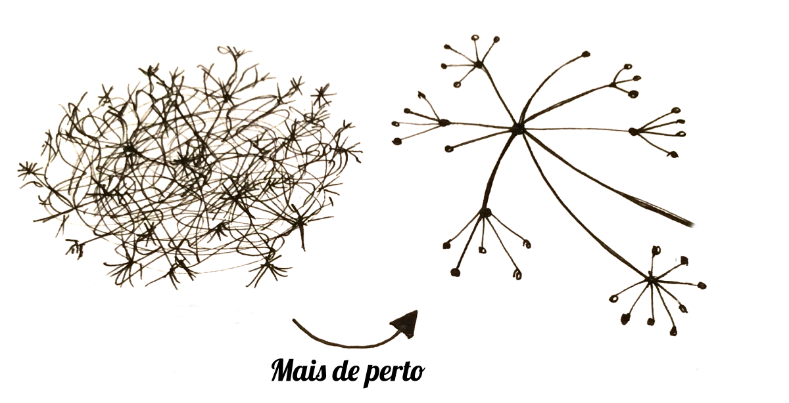
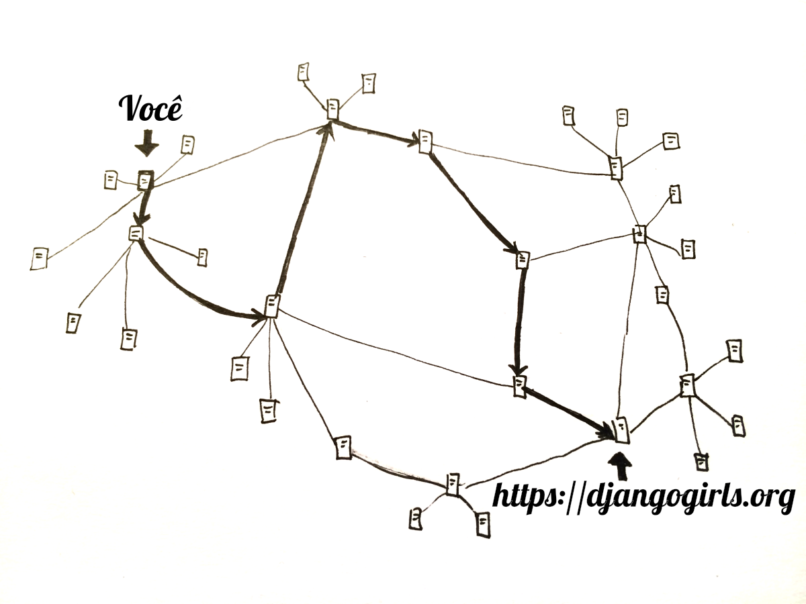
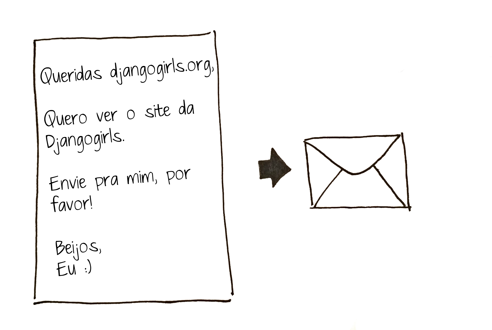

# Como funciona a internet

> Este capítulo é inspirado na palestra "Como a Internet funciona" de Jessica McKellar (http://web.mit.edu/jesstess/www/).

Apostamos que você usa a Internet todos os dias. Mas você sabe realmente o que acontece quando você digita um endereço como https://djangogirls.org em seu navegador e pressiona 'Enter'?

A primeira coisa que você precisa entender é que um site é só um monte de arquivos salvos em um disco rígido. Assim como seus filmes, músicas ou fotos. No entanto, há uma parte que é exclusiva para sites: essa parte inclui códigos de computador chamado HTML.

Se você não estiver familiarizada com a programação, pode ser difícil compreender o HTML no começo, mas seus navegadores da web (como o Chrome, Safari, Firefox, etc) amam ele. Navegadores da Web são projetados para entender esse código, seguir suas instruções e apresentar todos esses arquivos de que seu site é feito exatamente do jeito que você quer que eles sejam apresentados.

Igual à todos os arquivos, os arquivos HTML precisam ser armazenados num disco rígido. Pra internet nós usamos poderosos computadores especiais chamados *servidores*. Eles não têm uma tela, o mouse ou o teclado, porque sua finalidade principal é para armazenar dados e servi-los. É por isso que eles são chamados de *servidores*..--porque eles *servem* a você, dados.

OK, mas você quer saber com o quê a internet se parece, certo?

Fizemos um desenho pra você! Veja:

Que bagunça né? Na verdade é uma rede de máquinas conectadas (os *servidores* mencionados acima). Centenas de milhares de máquinas! Muitos, muitos quilômetros de cabos em todo o mundo! Para ver quão complicada a internet é você pode visitar um site (http://submarinecablemap.com/) que mostra um mapa com os cabos submarinos. Aqui está um screenshot do site:

Fascinante, não? Mas, obviamente, não é possível ter um fio conectado a toda máquina ligada na internet. Logo, para chegar em uma máquina (por exemplo aquela onde https://djangogirls.org está salva) nós precisamos passar uma requisição por muitas máquinas diferentes.

Se parece com isso:

Imagine que quando você digita https://djangogirls.org você envia uma carta que diz: "Querido Django Girls, eu desejo ver o site djangogirls.org. Envie ele pra mim, por favor!"

Sua carta vai para a agência dos correios mais próxima de você. Depois vai para outra que é um pouco mais perto do seu destinatário, depois para outra e outra até que seja entregue ao seu destino. O único diferencial é que se você enviar cartas (*pacotes de dados*) com freqüência para o mesmo lugar, cada carta pode passar por diferentes agências de correios (*roteadores*), dependendo de como elas são distribuídas em cada agência.

Sim, é simples assim. Você envia mensagens e espera alguma resposta. Claro, ao invés de papel e caneta você usa bytes de dados, mas a ideia é a mesma!

Ao invés de endereços com o nome da rua, cidade, código postal e nome do país, nós usamos endereços IP. Primeiro seu computador pergunta pelo DNS (Domain Name System - Sistema de Nome de Domínio) para traduzir djangogirls.org para um endereço IP. O funcionamento dele se parece um pouco com as antigas listas telefônicas onde você pode olhar para o nome da pessoa que quer entrar em contato e achar o seu número de telefone e endereço.

Quando você envia uma carta, ela precisa ter certas características para ser entregue corretamente: um endereço, selo, etc. Você também usa uma linguagem que o receptador compreende, certo? O mesmo acontece com *pacotes de dados* que você envia para ver um site: você usa um protocolo chamado HTTP (Hypertext Transfer Protocol - Protocolo de Transferência de Hipertexto).

Então, basicamente, quando você tem um site você precisa ter um *servidor* (máquina) onde ele fica hospedado. O *servidor* está à espera de quaisquer *requisições* recebidas (cartas que solicitam ao servidor o envio do seu site) e ele envia de volta seu site (em outra carta).

Como este é um tutorial de Django você vai perguntar o que o Django faz. Quando envia uma resposta nem sempre você quer enviar a mesma coisa para todo mundo. É muito melhor se suas cartas são personalizadas, especialmente para a pessoa que acabou de escrever para você, certo? O Django ajuda você a criar essas personalizadas e interessantes cartas :).

Chega de falar, é hora de criar!