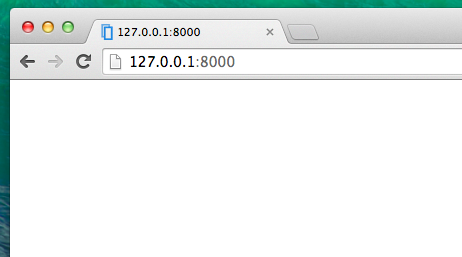

# Introdução a HTML

Você pode se perguntar: e o que é um template?

Um template é um arquivo que nós podemos reutilizar para apresentar diferentes informações de uma forma consistente. Por exemplo, você poderia usar um template para te ajudar a escrever uma carta, pois, embora cada carta possua uma mensagem e um destino diferente, todas compartilham o mesmo formato.

O formato do template do Django é descrito em uma linguagem chamada HTML (esse é o mesmo HTML que mencionamos no primeiro capítulo __Como a Internet funciona__).

## O que é HTML?

HTML é um código simples que é interpretado pelo seu navegador web - como o Chrome, o Firefox ou o Safari - para exibir uma página web para o usuário.

HTML significa "HyperText Markup Language". __HiperText__ significa que é um tipo de texto que suporta hiperlinks entre páginas. __Markup__ nada mais é que marcar um documento com códigos que dizem para alguém (nesse caso, o navegador web) como a página deverá ser interpretada. Código em HTML é feito com __tags__, cada uma começando com `<` e terminando com `>`. Essas tags marcam os __elementos__.

## Seu primeiro template!

Criar um template significa criar um arquivo de template. Tudo é um arquivo, certo? Provavelmente você já deve ter notado isso.

Os templates são salvos no diretório `blog/templates/blog`. Então, crie um diretório chamado `templates` dentro do diretório do seu blog. Em seguida, crie outro diretório chamado `blog` dentro da diretório templates:

    blog
    └───templates
        └───blog


(Você deve estar se perguntando porque nós precisamos de dois diretórios chamados `blog` - como você descobrirá mais para frente, essa é uma simples e útil convenção que facilita a vida quando as coisas começarem a ficar mais complicadas.)

E agora crie o arquivo `post_list.html` (deixe-o em branco por agora) dentro do diretório `blog/templates/blog`.

Veja como o nosso site está se parecendo agora: http://127.0.0.1:8000/

> Se ocorrer um erro de `TemplateDoesNotExists` tente reiniciar o seu servidor. Entre na linha de comando, pare o servidor pressionando Ctrl+C (Control seguido da tecla C, juntas) e reinicie-o rodando `python manage.py runserver`.



Acabaram-se os erros! Parabéns :) Entretanto, nosso site não mostra nada a não ser uma página em branco. Isso porque o nosso template está vazio. Então precisamos consertar isso.

Adicione a seguinte linha dentro do template:


blog/templates/blog/post_list.html
```html
<html>
    <p>Hi there!</p>
    <p>It works!</p>
</html>
```

Como nosso site se parece agora? Clique para descobrir: http://127.0.0.1:8000/


Funcionou! Bom trabalho :)

- A tag mais básica, `<html>`, estará sempre no começo de qualquer página da web, assim como, `</html>` sempre estará no fim. Como você pode ver, todo o conteúdo de um website se encontra entre a tag de início `<html>` e entre a tag de fim `</html>`
- `<p>` é a tag que denomina parágrafos; `</p>` determina o fim de cada parágrafo

## Head & body

Cada página HTML também é dividida em dois elementos: __head__ (cabeça) e __body__ (corpo).

- __head__ é um elemento que contém informações sobre o documento que não são mostradas na tela.

- __body__ é um elemento que contém tudo o que é exibido como parte de uma página de um site.

Nós usamos a tag `<head>` para dizer ao navegador sobre as configurações da página. Por sua vez, a tag `<body>` diz ao navegador o que há de verdade na página.

Por exemplo, você pode por o elemento título de uma página web dentro da tag `<head>`. Veja:

blog/templates/blog/post_list.html
```html
<html>
    <head>
        <title>Ola's blog</title>
    </head>
    <body>
        <p>Hi there!</p>
        <p>It works!</p>
    </body>
</html>
```

Salve o arquivo e atualize sua página.


Viu como o navegador entendeu que "Ola's blog" é o título da página? Ele interpretou `<title>Ola's blog</title>` e colocou o texto na barra de título do seu navegador (e também será usado para os favoritos e outras coisas mais).

Provavelmente você já deve ter notado que cada tag de abertura casa com uma _tag de fechamento_, com uma `/`, e que os elementos estão _aninhados_ (ex.: você não pode fechar uma tag em particular antes que todas as outras tags que estiverem dentro dela já estejam fechadas).

É como colocar coisas dentro de caixas. Você tem uma grande caixa, `<html></html>`; dentro dela há `<body></body>`, sendo que esta ainda contém caixas menors: `<p></p>`.

Você precisa seguir essas regras de _fechamento_ de tags, e de _aninhamento_ de elementos - se você não fizer isso, o navegador poderá não estar apto para interpretar seu código de maneira correta e sua página será exibida de maneira incorreta.

## Customize seu template

Agora você pode se divertir um pouco tentando customizar o seu template! Aqui estão algumas tags úteis para isso:

- `<h1>Um título</h1>` - para o título mais importante
- `<h2>Um sub-título</h2>` para um título um nível abaixo
- `<h3>Um sub-sub-título</h3>` ... e por aí vai, até `<h6>`
- `<em>texto</em>` enfatiza seu texto
- `<strong>text</strong>` enfatiza fortemente seu texto
- `<br />` pula para a próxima linha (você não pode colocar nada dentro de br)
- `<a href="https://djangogirls.org">link</a>` cria um link
- `<ul><li>primeiro item</li><li>segundo item</li></ul>` cria uma lista, exatamente como essa!
- `<div></div>` define uma seção da página

Aqui está um exemplo de um template completo:

blog/templates/blog/post_list.html
```html
<html>
    <head>
        <title>Django Girls blog</title>
    </head>
    <body>
        <div>
            <h1><a href="">Django Girls Blog</a></h1>
        </div>

        <div>
            <p>published: 14.06.2014, 12:14</p>
            <h2><a href="">My first post</a></h2>
            <p>Aenean eu leo quam. Pellentesque ornare sem lacinia quam venenatis vestibulum. Donec id elit non mi porta gravida at eget metus. Fusce dapibus, tellus ac cursus commodo, tortor mauris condimentum nibh, ut fermentum massa justo sit amet risus.</p>
        </div>

        <div>
            <p>published: 14.06.2014, 12:14</p>
            <h2><a href="">My second post</a></h2>
            <p>Aenean eu leo quam. Pellentesque ornare sem lacinia quam venenatis vestibulum. Donec id elit non mi porta gravida at eget metus. Fusce dapibus, tellus ac cursus commodo, tortor mauris condimentum nibh, ut f.</p>
        </div>
    </body>
</html>
```

Nós criamos três seções `div` aqui.

- O primeiro elemento `div` possui o título do nosso blog - é um título e um link
- Os outros dois elementos `div` possuem nossas postagens com a data de publicação, `h2` com o título da postagem que é clicável e dois `p`s (parágrafos) de texto, um para a data e outro para o texto da postagem.

Isso nos dá o seguinte efeito:


Yaaay! Mas, até agora, nosso template mostra exatamente __sempre a mesma informação__ - sendo que, anteriormente, nós falávamos sobre templates como uma maneira para exibir informações __diferentes__ em um __mesmo formato__.

O que nós realmente queremos fazer é exibir postagens reais que foram adicionadas no Django admin - e isso é o que faremos em seguida.

## Mais uma coisa: implantação ("deploy")!

Seria bom ver tudo isto na Internet, certo? Vamos fazer outra implantação ("deploy") no PythonAnywhere:

### Commit, e ponha seu código no GitHub

Primeiro de tudo, vejamos quais arquivos foram alterados desde a última implantação  (execute esses comandos localmente, não
no PythonAnywhere):


command-line
```
$ git status
```

Verifique se você está no diretório `djangogirls` e vamos dizer ao `git` para incluir todas as mudanças dentro deste diretório:

command-line
```
$ git add --all .
```

> __Nota__ `--all` significa que o `git` também reconhecerá se você deletou algum arquivo (por padrão, o git apenas reconhece arquivos criados/modificados). Lembre-se também (do capítulo 3) que `.` significa o diretório atual.

Antes de nós fazermos o upload de todos os arquivos, vamos confirmar o que o `git` enviará (todos os arquivos que o `git` for enviar deverá aparece em verde):

command-line
```
$ git status
```

Estamos quase lá! Agora é hora de dizer a ele para salvar essa modificação em seu histórico. Nós daremos a ele uma "mensagem de commit" onde nós descrevemos as modificações que fizemos. Você pode escrever o que você quiser agora, mas será mais útil se você escrever alguma coisa mais descritiva, algo para você poder se lembrar, no futuro, das coisas que você fez.

command-line
```
$ git commit -m "Changed the HTML for the site."
```

> __Nota__ Certifique-se que você usou aspas duplas para delimitar a mensagem do commit.

Após termos feito isso, nós fazemos o upload (envio) das nossas mudanças para o PythonAnywhere:

command-line
```
$ git push
```

### Empurre seu novo código para o PythonAnywhere e recarregue o seu aplicativo web

*   Abra a [página de consoles de PythonAnywhere] (https://www.pythonanywhere.com/consoles/) e vá para o seu **console Bash** (ou inicie um novo). Em seguida, execute:

 command-line
```
$ cd ~/my-first-blog
$ git pull
[...]
```

E veja seu código sendo baixado. Se você deseja verificar se já chegou, pode ir para a **Files tab** e ver seu código no PythonAnywhere.

*   Finalmente, pule para a [Web tab](https://www.pythonanywhere.com/web_app_setup/) e aperte **Reload** em seu aplicativo web.

 [6]: https://www.pythonanywhere.com/web_app_setup/

Sua atualização deve estar ao vivo! Vá em frente e atualize seu site no navegador. As alterações devem ser visíveis :)
