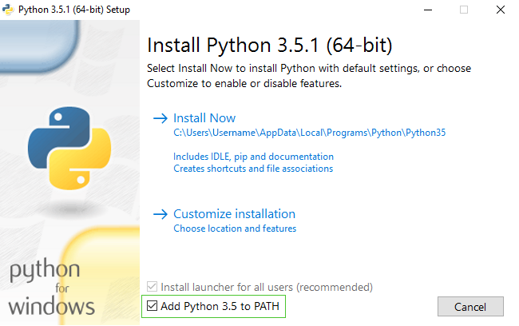

> Leitores em casa: esse capítulo está disponível em vídeo (em inglês) [Installing Python & Code Editor](https://www.youtube.com/watch?v=pVTaqzKZCdA).

> Essa seção é baseada em um tutorial feito por Geek Girls Carrots (https://github.com/ggcarrots/django-carrots)

O Django é escrito em Python. Nós precisamos de Python para fazer qualquer coisa com Django. Vamos começar instalando ele! Nós queremos que você instale o Python 3.5, então se você tiver alguma versão anterior, você precisará fazer uma atualização.


<!--sec data-title="Windows" data-id="python_windows" data-collapse=true ces-->

Primeiro verifique se o seu computador está rodando uma versão 32-bit ou uma versão 64-bit do Windows em https://support.microsoft.com/en-au/kb/827218. Você pode baixar o Python para Windows a partir do website
https://www.python.org/downloads/windows/. Clique no link "Latest Python 3 Release - Python x.x.x". Se o seu computador está rodando uma versão **64-bit** do Windows, baixe o **Windows x86-64 executable installer**. Senão, baixe o **Windows x86 executable installer**. Após baixar o instalador, você deve executá-lo (duplo clique nele) e seguir as instruções apresentadas.

Uma coisa para se atentar: Durante a instalação você irá notar uma janela com a marcação "Setup". Certifique-se de selecionar "Add Python 3.5 to PATH" na caixa de seleção e clicar em "Install Now", como mostrado aqui:



Nos passos a seguir, você usará a Linha de Comando do Windows (**nós também iremos falar sobre ela com você**). Por enquanto, se você precisar digitar alguns comandos, vá para o menu Iniciar → Todos os Programas → Acessórios → Prompt de Comando. Você pode também manter pressionada a tecla Windows e pressionar a tecla "R" até a janela "Executar" ("Run") aparecer. Para abrir a Linha de Comando, digite "cmd" e pressione o enter na janela "Executar" ("Run"). (Nas versões mais novas do Windows, você pode precisar pesquisar por "Prompt de Comando" ("Command Prompt"), já que ele, às vezes está escondido.)


Nota: se você estiver usando uma versão antiga do Windows (7, Vista, ou qualquer uma anterior a essas) e o instalador do Python 3.5.x falhar com um erro, você pode tentar:
1. instalar todas as Atualizações do Windows e tentar instalar Python 3.5 novamente; ou
2. instalar uma [versão antiga do Python](https://www.python.org/downloads/windows/), por exemplo, [3.4.4](https://www.python.org/downloads/release/python-344/).

Se você instalar um versão antiga do Python, a tela de instalação pode parecer um pouco diferente da mostrada abaixo. Certifique-se de rolar a página para baixo para ver "Add python.exe to Path", e então clique no botão a esquerda e escolha "Will be installed on local hard drive":


<!--endsec-->

<!--sec data-title="OS X" data-id="python_OSX"
data-collapse=true ces-->

> **Nota** Antes de você instalar o Python no OS X, você deve ter certeza que as configurações de seu Mac permitem a instalação de pacotes que não são da App Store. Vá até Preferências do Sistema (está na pasta Aplicações), clique em "Segurança & Privacidade," e então na aba "General". Se estiver configurado "Mac App Store" em "Allow apps downloaded from:", altere para "Mac App Store and identified developers."

Você precisa ir no website https://www.python.org/downloads/release/python-351/ e baixar o instalador Python:

* Baixe o arquivo *Mac OS X 64-bit/32-bit installer*,
* Duplo clique em *python-3.5.1-macosx10.6.pkg* para rodar o instalador.

<!--endsec-->

<!--sec data-title="Linux" data-id="python_linux"
data-collapse=true ces-->

É bem provável que você já tenha o Python instalado. Para checar se você tem ele instalado (e qual versão é), abra o console e digite o seguinte comando:

command-line
```
$ python3 --version
Python 3.5.1
```

Se você tem uma 'micro versão' do Python diferente instalada, por exemplo 3.5.0, então você não precisa fazer uma atualização. Se você não tem o Python instalado, ou se você quer uma versão diferente, você pode instalá-la como a seguir:


<!--endsec-->

<!--sec data-title="Debian or Ubuntu" data-id="python_debian"
data-collapse=true ces-->

Use esse comando em seu console:

command-line
```
$ sudo apt install python3.5
```

<!--endsec-->

<!--sec data-title="Fedora (22+)" data-id="python_fedora22"
data-collapse=true ces-->

Use esse comando em seu console:

command-line
```
$ sudo dnf install python3
```

<!--endsec-->

<!--sec data-title="openSUSE" data-id="python_openSUSE"
data-collapse=true ces-->

Use esse comando em seu console:

command-line
```
$ sudo zypper install python3
```

<!--endsec-->

Verifique se a instalação foi feita com sucesso abrindo a aplicação *Terminal* e executando o comando `python3`:

command-line
```
$ python3 --version
Python 3.5.1
```

**NOTA:** Se você estiver no Windows e retornar uma mensagem de erro dizendo que o `python3` não foi encontrado, tente usando `python` (sem o `3`) e cheque se ainda pode ser a versão 3.5 do Python.

----

Se você tiver qualquer dúvida, ou se alguma coisa sair errada e você não tem ideia do que fazer, por favor pergunte a sua treinadora! Algumas vezes as coisas não correm de maneira fluida e é melhor pedir ajuda a alguém com mais experiência.
