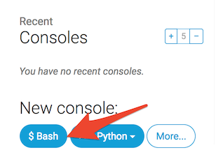

# Публикация!

> **Примечание**: Эта глава может показаться сложной. Будь упорна, развертывание сайта на сервере является важной частью веб-разработки. Данная глава намеренно расположена в середине учебника для того, чтобы твой наставник смог помочь с таким мудреным процессом, как публикация сайта. Так ты сможешь самостоятельно закончить все главы, даже если время будет поджимать.

До сих пор твой сайт был доступен только с твоего компьютера. Сейчас ты узнаешь, как "развернуть" свой сайт! Развертывание (deploy) — это процесс публикации приложения в интернете, чтобы люди могли наконец увидеть твое творение. :)

Как ты уже знаешь, веб-сайт должен располагаться на сервере. В интернете есть много сервер-провайдеров, мы будем использовать [PythonAnywhere](https://www.pythonanywhere.com/). PythonAnywhere предоставляется бесплатно для небольших приложений с небольшим числом посетителей, что более чем достаточно для нас.

Другим внешним сервисом, которым мы будем пользоваться, является [GitHub](https://www.github.com) — сервис хостинга кода. Существуют и другие похожие сервисы, но практически у каждого программиста есть GitHub аккаунт, теперь будет и у тебя!

Эти три места будут важны для вас. Ваш локальный компьютер будет местом, где вы будете вести разработку и тестирование. Когда вы удовлетворены изменениями, вы разместите копию вашей программы на GitHub. Ваш веб-сайт будет на PythonAnywhere, и вы будете обновлять его, получая новые копии вашего кода с GitHub.

# Git

> **Примечание**Если вы уже проделали все шаги установки, делать это вновь нет необходимости - вы можете пропустить этот раздел и приступить к созданию Git репозитория.



## Создаём Git-репозиторий

Git отслеживает изменения определенного набора файлов, которая называется репозиторием (сокращенно "репо"). Давайте создадим один для нашего проекта. Откройте консоль и запустите эти команды в папке `djangogirls`:

> **Примечание**Проверьте свой текущий рабочий каталог с помощью команд `pwd` (Mac OS X/Linux) или `cd` (Windows), прежде чем инициализировать репозиторий. Ты должна находиться в директории `djangogirls`.

command-line

    $ git init
    Initialized empty Git repository in ~/djangogirls/.git/
    $ git config --global user.name "Your Name"
    $ git config --global user.email you@example.com
    

Инициализировать git-репозиторий необходимо только один раз за проект (и тебе больше не придется снова вводить имя пользователя и адрес электронной почты).

Git будет отслеживать изменения всех файлов и каталогов в заданной директории, однако некоторые из них мы предпочли бы игнорировать. Для этого нам нужно создать файл `.gitignore` в корневом каталоге репозитория. Открой редактор и создай новый файл со следующим содержанием:

.gitignore

    *.pyc
    __pycache__
    myvenv
    db.sqlite3
    .DS_Store
    

И сохрани его как `.gitignore` в корневом каталоге "djangogirls".

> **Примечание**: Точка в начале имени файла имеет важное значение! Если у тебя есть проблемы с созданием таких файлов (Mac не позволит создать файл с названием, начинающимся с точки, через Finder, например), тогда используй кнопку "Сохранить как" в меню своего редактора кода, это точно поможет. И убедись, что не добавила `.txt`, `.py`, или другое расширение к имени файла - Git распознает это только в том случае, если имя содержит только `.gitignore`.
> 
> **Примечание** Один из файлов, заданных в ваш файл `.gitignore` — `db.sqlite3`. Этот файл ваша локальная база данных, где хранятся все записи ваших пользователей. 2 Мы будем следовать стандартным практикам веб-программирования; это значит, что мы будем использовать отдельные базы данных для вашего локального тестового сайта и вашего живого сайта на PythonAnywhere. База данных PythonAnywhere может быть SQLite, так же как и на вашем устройстве для разработки, но, обычно, вы будете использовать базу данных, называемую MySQL, которая может работать с гораздо большим числом посетителей, нежели SQLite. В любом случае, игнорирование вашей SQLite базы данных для GitHub означает, что все записи и суперпользователь созданные вами будут доступны только локально, и необходимо создать новые для производства. Вы должны думать о вашей локальной базе данных как о хорошей игровой площадке, где вы можете проверить разные вещи и не бояться, что вы удалите ваши реальные сообщения из вашего блога.

Использовать команду `git status` перед `git add` или в любой другой момент, когда ты не уверен, что изменилось — хорошая идея. Это убережёт тебя от таких неприятных сюрпризов, таких как добавление или "коммит" неправильных файлов. Команда `git status` возвращает информацию обо всех ранее неотслеживаемых/изменённых/добавленных в git файлах, а также статус ветки и многое другое. Результат должен быть аналогичен следующему:

command-line

    $ git status
    On branch master
    
    Initial commit
    
    Untracked files:
      (use "git add <file>..." to include in what will be committed)
    
            .gitignore
            blog/
            manage.py
            mysite/
            requirements.txt
    
    nothing added to commit but untracked files present (use "git add" to track)
    

И, наконец, мы сохраним наши изменения. Переключись на консоль и набери:

command-line

    $ git add --all .
    $ git commit -m "My Django Girls app, first commit"
     [...]
     13 files changed, 200 insertions(+)
     create mode 100644 .gitignore
     [...]
     create mode 100644 mysite/wsgi.py
    

## Публикация твоего кода на GitHub

Перейди на [GitHub.com](https://www.github.com) и зарегистрируйся для нового бесплатного аккаунта. (Если вы уже сделали это в мастерской prep, это здорово!) Убедитесь, что помните свой пароль (добавите его в ваш менеджер паролей, если вы им пользуетесь).

Дальше создай новый репозиторий с именем "my-first-blog". Не ставь галочку на пункте "initialize with a README" и отметь опции .gitignore(мы создадим этот файл вручную) и License как None.

> **Примечание:** Имя репозитория `my-first-blog` имеет очень большое значение. Ты конечно можешь придумать другое название, но оно встречается много раз в руководстве и тебе придется каждый раз менять его на своё. Возможно, проще остановиться на варианте `my-first-blog`.

На следующем экране, вы увидите URL клона вашего repo, которым вы будете пользоваться при помощи нижеуказанных команд:

Теперь нам нужно связать твой локальный Git репозиторий на компьютере с репозиторием на GitHub.

Напечатай в консоль (замени `&lt;your-github-username&gt;`имя пользователя на свое, то есть на то, которое указала при создании аккаунта GitHub, но без угловых скобок - URL должен совпадать с клоном URL, которое ты видишь):

command-line

    $ git remote add origin https://github.com/<your-github-username>/my-first-blog.git
    $ git push -u origin master
    

Когда ты отправляешь (push) на GitHub, тебе придется указать имя пользователя и пароль (либо прямо здесь в командной строке или во всплывающем окне), после ввода учетных данных, должно появиться что-то вроде этого:

command-line

    Counting objects: 6, done.
    Writing objects: 100% (6/6), 200 bytes | 0 bytes/s, done.
    Total 3 (delta 0), reused 0 (delta 0)
    
    To https://github.com/ola/my-first-blog.git
     * [new branch]      master -> master
    Branch master set up to track remote branch master from origin.
    

<!--TODO: maybe do ssh keys installs in install party, and point ppl who dont have it to an extension -->

Теперь твой код загружен на GitHub. Зайди на сайт и проверь! Вы найдете его в компании – [Django](https://github.com/django/django), [ Django Girls туториала](https://github.com/DjangoGirls/tutorial) и многих других проектов c открытым исходным кодом на GitHub. :)

# Настройка нашего блога на PythonAnywhere

## Регистрация аккаунта на PythonAnywhere

> **Примечание** Возможно, ты уже завела учётную запись на PythonAnywhere ранее — если так, не нужно повторять это снова.



## Настройка нашего сайта на PythonAnywhere

Вернись в главное меню [PythonAnywhere Dashboard](https://www.pythonanywhere.com/), кликнув на логотип и выбери опцию запуска консоли Bash - это версия консоли PythonAnywhere как и на твоем компьютере.

> **Примечание**: PythonAnywhere использует Linux, так что если ты используешь Windows, то терминал и команды могут немного отличаться от того, к чему ты привыкла на своем компьютере.

Развёртывание веб-приложения на PythonAnywhere включает в себя загрузку твоего кода с GitHub и настройку PythonAnywhere, чтобы распознать его и запустить в качестве веб-приложения. Существуют ручные способы, чтобы сделать это, но PythonAnywhere предоставляет вспомогательный инструмент, который сделает это за тебя. Давай сначала установим его:

command-line

    pip3.6 install --user pythonanywhere
    

В консоли должно напечататься что-то подобное`Collecting pythonanywhere` и в конце `Successfully installed (...) pythonanywhere- (...)`.

Теперь мы запустим помощника для автоматической настройки нашего приложения с GitHub. Введи следующую команду в консоли на PythonAnywhere (не забудь использовать свою учетную запись на GitHub в `&lt;your-github-username&gt;`, так чтобы URL совпадал с URL клона на GitHub):

command-line

    $ git clone https://github.com/<your-github-username>/my-first-blog.git
    

Когда ты увидишь, как это работает, то ты сможешь понять, что именно оно делает:

- Скачивает твой код с GitHub
- Создается virtualenv на PythonAnywhere абсолютно точно так же, как и на твоем компьютере
- Обновляет твой файл настроек с некоторыми параметрами развертывания
- Создаем базу данных на PythonAnywhere, используя команду `manage.py migrate`
- Настраивает твои статичные файлы(мы узнаем об этом позже)
- И настраивает PythonAnywhere для обслуживания твоего веб-приложения через API

На PythonAnywhere все эти шаги автоматизированы, но это те же самые шаги, которые необходимо будет выполнить с любым другим сервер-провайдером.

Главное, что сейчас нужно отметить - база данных PythonAnywhere на самом деле полностью отделена от базы данных на твоем компьютере. Это значит, что они могут иметь разные посты и админские учетные записи. В результате как мы уже сделали на нашем компьютере, необходимо инициализировать учетную запись администратора с помощью `createsuperuser`. PythonAnywhere автоматически активирует твой virtualenv, поэтому всё, что нужно сделать это:

command-line

    (ola.pythonanywhere.com) $ python manage.py createsuperuser
    

Введи сведения для учетной записи администратора. Лучше всего использовать те же, что ты использовала на своем компьютере во избежание путаницы, если ты не хочешь сделать пароль на PythonAnywhere более безопасным.

Теперь, если ты хочешь, то ты можешь посмотреть на код на PythonAnywhere используя `ls`:

command-line

    (ola.pythonanywhere.com) $ ls
    blog  db.sqlite3  manage.py  mysite requirements.txt static
    (ola.pythonanywhere.com) $ ls blog/
    __init__.py  __pycache__  admin.py  apps.py  migrations  models.pytests.py  static
    templates  views.py
    

Ты также можешь перейти во вкладку "Files" и перемещаться по PythonAnywhere с помощью встроенного в браузер файлового менеджера. (Со страницы Console ты можешь перейти на другие страницы PythonAnywhere из кнопки меню, расположенной в верхнем правом углу. Если ты находишься на одной из страниц, ссылки на другие страницы расположены рядом сверху.)

## Ты в сети!

Твой сайт теперь "живет" в публичном Интернете! Перейди во вкладку "Web" на PythonAnywhere и получи ссылку на твой сайт. Ты можешь поделиться ей с кем хочешь :)

> **Примечание:** Это учебник для начинающих и при разворачивании сайта мы использовали несколько приёмов, которые не являются идеальными с точки зрения безопасности. Если ты решила построить на этом проект или начать новый, то следует просмотреть [Django чеклист для развертывания](https://docs.djangoproject.com/en/2.2/howto/deployment/checklist/), который содержит некоторые советы по защите твоего сайта.

## Советы по отладке

Если вы видите ошибку во время выполнения скрипта `pa_autoconfigure_django.py`, вот несколько распространенных причин:

- Не был создан PythonAnywhere API токен - ключ, для обеспечения доступа.
- Была допущена ошибка в URL GitHub репозитория
- Если ты видишь ошибку *"Could not find your settings.py"*, это вероятно потому, что не удалось добавить все твои файлы в Git и/или ты не успешно загрузила их на GitHub. Посмотри инструкции еще раз в разделе Git выше
- Если вы ранее зарегистрировали учетную запись PythonAnywhere и имели ошибку collectstatic, у вас вероятно старая версия SQLite (например, 3.8.2) для вашей учетной записи. В этом случае войди в новую учетную запись и попробу команды в вышеприведенном разделе PythonAnywhere.

Если видишь ошибку при попытке посетить свой сайт, для отладочной информации первым делом смотри **журнал ошибок**. Ты найдешь линк на него на PythonAnywhere ["Web" page](https://www.pythonanywhere.com/web_app_setup/) странице. Посмотри, нет ли там сообщений о каких-нибудь ошибках; самые последние из них приведены ниже.

Также можешь посмотреть [общие советы по отладке на вики PythonAnywhere](http://help.pythonanywhere.com/pages/DebuggingImportError).

И помни: твой инструктор здесь, чтобы помогать!

# Проверить свой сайт!

Стандартная страница твоего сайта должна включать приветствие "Welcome to Django", точно также как было на локальном компьютере. Попробуй добавить `/admin/` к концу адреса сайта и перейдешь к панели администратора сайта. Войди используя имя пользователя и пароль, и ты увидишь, что можешь добавить новые записи на сервер - не забудь, что записи с твоей тестовой базы данных не будут отправлены на твой "живой" блог.

После того, как ты создала несколько постов, ты можешь вернуться к локальной настройке(не PythonAnywhere). Тут тебе следует работать для создания изменений. Это общий процесс веб-разработки - делать изменения локально, загружать эти изменения на GitHub и отправлять эти изменения на реальный веб-сервер. Это позволяет тебе работать и экспериментировать без нарушения работы твоего веб-сайта. Довольно круто, да?

Ты заслужила *огромную* похвалу! Развертывание сервера — одна из самых каверзных частей веб-разработки, и на это нередко уходит несколько дней, прежде чем заставишь всё работать. Но у тебя получился живой сайт, в настоящем интернете!