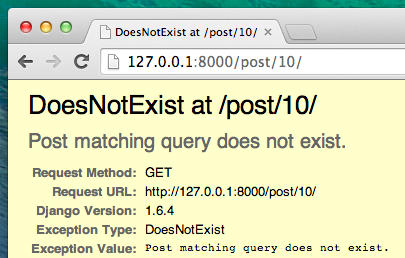

# Расширяем свое приложение

Мы уже выполнили часть необходимых шагов для создания веб-сайта: мы знаем как создать модель, URL, представление и шаблон. Мы также знаем как улучшить визуальный дизайн с помощью CSS.

Время практики!

Первое, что нам потребуется в блоге - страница для отображения конкретной записи, верно?

У нас уже есть модель `Post`, так что нам не нужно добавлять дополнительный код в файл `models.py`.

## Создадим в шаблоне ссылку на страницу поста

We will start with adding a link inside `blog/templates/blog/post_list.html` file. So far it should look like this: blog/templates/blog/post_list.html

```html



    
        <div class="post">
            <div class="date">
                {{ post.published_date }}
            </div>
            <h1><a href="">{{ post.title }}</a></h1>
            <p>{{ post.text|linebreaksbr }}</p>
        </div>
    

```

Нам хотелось бы иметь ссылку с заголовка поста в списке на страницу подробной информации о посте. Давай изменим `<h1><a href="">{{ post.title }}</a></h1>` чтобы получилась ссылка на пост:

blog/templates/blog/post_list.html

```html
<h1><a href="">{{ post.title }}</a></h1>
```

Самое время разобраться с загадочным ``. Как можешь предположить, синтаксис `` означает использование тегов шаблонов Django. На этот раз мы используем тот, что создаст для нас URL!

The `post_detail` part means that Django will be expecting a URL in `blog/urls.py` with name=post_detail

And how about `pk=post.pk`? `pk` is short for primary key, which is a unique name for each record in a database. Because we didn't specify a primary key in our `Post` model, Django creates one for us (by default, a number that increases by one for each record, i.e. 1, 2, 3) and adds it as a field named `pk` to each of our posts. We access the primary key by writing `post.pk`, the same way we access other fields (`title`, `author`, etc.) in our `Post` object!

Now when we go to http://127.0.0.1:8000/ we will have an error (as expected, since we do not yet have a URL or a *view* for `post_detail`). It will look like this:


## Создадим URL для страницы поста

Давай создадим URL в `urls.py` для *представления* `post_detail`!

Мы хотим, чтобы адрес страницы нашего первого поста был таким: **URL**: http://127.0.0.1:8000/post/1/

Давай создадим URL в файле `blog/urls.py` и укажем Django на *представление* под названием `post_detail`, которое будет отображать пост целиком. Add the line `url(r'^post/(?P<pk>\d+)/$', views.post_detail, name='post_detail'),` to the `blog/urls.py` file. Файл должен выглядеть примерно так:

blog/urls.py

```python
from django.conf.urls import url
from . import views

urlpatterns = [
    url(r'^$', views.post_list, name='post_list'),
    url(r'^post/(?P<pk>\d+)/$', views.post_detail, name='post_detail'),
]
```

This part `^post/(?P<pk>\d+)/$` looks scary, but no worries – we will explain it for you:

- it starts with `^` again – "the beginning".
- `post/` just means that after the beginning, the URL should contain the word **post** and a **/**. So far so good.
- `(?P<pk>\d+)` – this part is trickier. Она означает, что Django возьмет все, что придется на эту часть строки и передаст представлению в качестве переменной `pk`. (Note that this matches the name we gave the primary key variable back in `blog/templates/blog/post_list.html`!) `\d` also tells us that it can only be a digit, not a letter (so everything between 0 and 9). `+` означает, что цифр должно быть от одной и больше. So something like `http://127.0.0.1:8000/post//` is not valid, but `http://127.0.0.1:8000/post/1234567890/` is perfectly OK!
- `/` – then we need a **/** again.
- `$` – "the end"!

Если ты введешь адрес `http://127.0.0.1:8000/post/5/` в браузер, Django должен понять, что тебе требуется *представление* под именем `post_detail`, и передать информацию о переменной `pk` (равной `5`) этому *представлению*.

OK, we've added a new URL pattern to `blog/urls.py`! Let's refresh the page: http://127.0.0.1:8000/ Boom! The server has stopped running again. Have a look at the console – as expected, there's yet another error!


Помнишь, каким должен быть следующий шаг? Конечно: добавить представление!

## Добавим представление для страницы поста

This time our *view* is given an extra parameter, `pk`. Но как дать нашему *представлению* знать о нем? Для этого мы определим функцию как `def post_detail(request, pk):`. Обрати внимание, что мы должны использовать тоже имя переменной, что мы выбрали для обработки URL (`pk`). Пропуск переменной будет неправилен и приведет к ошибке!

Now, we want to get one and only one blog post. To do this, we can use querysets, like this:

blog/views.py

```python
Post.objects.get(pk=pk)
```

But this code has a problem. If there is no `Post` with the given `primary key` (`pk`) we will have a super ugly error!



Мы этого не хотим! Однако, Django, конечно, имеет средство, которое позволит нам её обойти: `get_object_or_404`. In case there is no `Post` with the given `pk`, it will display much nicer page, the `Page Not Found 404` page.


Хорошая новость в том, что ты можешь сделать свою страницу `Page not found`. Но для нас сейчас это не самая важная задача и мы её пропустим.

OK, time to add a *view* to our `views.py` file!

In `blog/urls.py` we created a URL rule named `post_detail` that refers to a view called `views.post_detail`. This means that Django will be expecting a view function called `post_detail` inside `blog/views.py`.

We should open `blog/views.py` and add the following code near the other `from` lines:

blog/views.py

```python
from django.shortcuts import render, get_object_or_404
```

And at the end of the file we will add our *view*:

blog/views.py

```python
def post_detail(request, pk):
    post = get_object_or_404(Post, pk=pk)
    return render(request, 'blog/post_detail.html', {'post': post})
```

Именно. Теперь обнови страницу http://127.0.0.1:8000/


Заработало! Только что произойдет, если ты попробуешь перейти по ссылке из заголовка записи?


Ой, нет! Другая ошибка! Но мы уже знаем как иметь с ней дело, верно? Нам нужно добавить шаблон!

## Create a template for the post details

Мы создадим файл `post_detail.html` в директории `blog/templates/blog`.

Должно получиться примерно так:

blog/templates/blog/post_detail.html

```html



    <div class="post">
        
            <div class="date">
                {{ post.published_date }}
            </div>
        
        <h1>{{ post.title }}</h1>
        <p>{{ post.text|linebreaksbr }}</p>
    </div>

```

И снова мы расширяем `base.html`. В блоке `content` мы отображаем дату публикации (published_date, если она существует), заголовок и текст. Нам также нужно обсудить пару важных вещей, хорошо?

` ... ` is a template tag we can use when we want to check something. (Remember `if ... else ..` from **Introduction to Python** chapter?) In this scenario we want to check if a post's `published_date` is not empty.

OK, we can refresh our page and see if `TemplateDoesNotExist` is gone now.


Ура! Все работает!

## Еще одна вещь: развертывание!

Было бы неплохо проверить, что веб-сайт все еще будет работать на PythonAnywhere, верно? Давай еще раз проведем развертывание.

command-line

    $ git status
    $ git add --all .
    $ git status
    $ git commit -m "Added view and template for detailed blog post as well as CSS for the site."
    $ git push
    

Затем набери в [Bash консоли PythonAnywhere](https://www.pythonanywhere.com/consoles/):

command-line

    $ cd my-first-blog
    $ git pull
    [...]
    

И нажми **Reload** на вкладке [Web tab](https://www.pythonanywhere.com/web_app_setup/).

Вот и все! Поздравляем :)