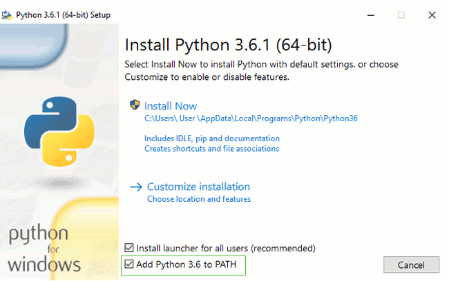

> Для тех читателей, кто занимается дома: эта глава описывается в видео [Установка Python и текстового редактора](https://www.youtube.com/watch?v=pVTaqzKZCdA).
> 
> Этот подраздел основан на руководстве Geek Girls Carrots (https://github.com/ggcarrots/django-carrots)

Django написан на Python. Нам нужен Python, чтобы сделать что-нибудь в Django. Давай начнем с его установки! Мы хотим, чтобы ты установила самую свежую версию Python 3, поэтому, если у тебя уже есть более ранняя версия, то её придется обновить. Если у тебя уже установлена версия 3.4 или более высокая, она должна подойти.

Пожалуйста, установи обычный Python даже если Anaconda установлена на твоем компьютере.

<!--sec data-title="Install Python: Windows" data-id="python_windows" data-collapse=true ces-->

Для начала проверь, какая версия Windows у тебя на компьютере — 32-битная или 64-битная. Это будет указано в строке «Тип системы» на странице «Сведения о системе». Чтобы попасть туда, попробуй один из этих способов:

* Нажмите одновременно клавишу Windows и клавишу Pause/Break
* Откройте панель управления из меню Windows, затем перейдите в Система & Безопасность, затем перейдите в Система
* Нажми клавишу Windows, затем перейди по разделам Настройки > Система > О системе

Ты можешь загрузить Python для Windows с официального веб-сайта: https://www.python.org/downloads/windows/. Перейди по ссылке "Latest Python 3 Release - Python x.x.x". Если у тебя установлена **64-битная** версия Windows, скачай **Windows x86-64 executable installer**. Если нет — скачай **Windows x86 executable installer**. После загрузки дистрибутива ты должна запустить его (двойным щелчком) и следовать инструкциям.

Обрати внимание на экран мастера установки, который называется "Setup" (Настройка). Тебе нужно пролистать его вниз и выбрать опцию "Add Python 3.6 to the PATH" (Добавить Python 3.6 к системной переменной PATH), как на рисунке (это может выглядеть по-разному в зависимости от версии, которую ты устанавливаешь):

Когда установка закончится, ты можешь увидеть предложение узнать больше о Python или об установленной тобой версии. Закрой это окно — ты узнаешь намного больше в этом руководстве!

Примечание: если ты используешь старую версию Windows (7, Vista или ещё более старую версию), и установка Python 3.6.x завершается выводом сообщения об ошибке, ты можешь попробовать:

1. либо установить все доступные обновления Windows и попробовать установить Python 3.6 заново; либо
2. установить [более раннюю версию Python](https://www.python.org/downloads/windows/), например, [3.4.6](https://www.python.org/downloads/release/python-346/).

Если ты установишь старую версию Python, экран установки может выглядеть несколько иначе, чем показано выше. Убедись, что вы прокрутили вниз, чтобы увидеть «Add python.exe to Path», а затем нажми кнопку на левой стороне и выбери "Will be installed on local hard drive":

<!--endsec-->

<!--sec data-title="Install Python: OS X" data-id="python_OSX"
data-collapse=true ces-->

> **Примечание** Прежде чем установить Python на OS X, следует убедиться, что ваш Mac параметры позволяют устанавливать пакеты, которые не из App Store. Перейди к System Preferences (они находится в папке «Приложения»), нажмите «Безопасность & amp; конфиденциальности», а затем вкладку «Общие». Если настройка "Позволить приложения загруженные с " установлена как "Mac App Store", то измените ее на "Mac App Store and identified developers."

Тебе нужно перейти по ссылке https://www.python.org/downloads/release/python-361/ и скачать установщик Python:

* Скачай файл *Mac OS X 64-bit/32-bit installer*,
* Сделай двойной щелчок на *python-3.4.3-macosx10.6.pkg* для запуска установщика.

<!--endsec-->

<!--sec data-title="Install Python: Linux" data-id="python_linux"
data-collapse=true ces-->

Вполне вероятно, что у тебя уже установлен Python. Чтобы проверить это (а также версию языка), открой консоль и введи следующую команду:

command-line

    $ python3 --version
    Python 3.6.1
    

Если у вас установлена другая версия Python, новее 3.4.0 (например, 3.6.0), то ее не нужно обновлять. Если у тебя не установлен Python, или если ты хочешь использовать другую версию, сначала проверь, какой дистрибутив Linux ты используешь при помощи следующей команды:

command-line

    $ grep '^NAME=' /etc/os-release
    

После этого, в зависимости от результата, следуй одной из инструкций по установке ниже.

<!--endsec-->

<!--sec data-title="Install Python: Debian or Ubuntu" data-id="python_debian" data-collapse=true ces-->

Введи эту команду в консоль:

command-line

    $ sudo apt install python3
    

<!--endsec-->

<!--sec data-title="Install Python: Fedora" data-id="python_fedora"
data-collapse=true ces-->

Используй следующую команду в консоли:

command-line

    $ sudo dnf install python3
    

Если вы находитесь на более старых версиях Fedora, вы можете получить сообщение об ошибке, что команда `dnf` не найдена. В этом случае вам нужно использовать `yum` вместо dnf.

<!--endsec-->

<!--sec data-title="Install Python: openSUSE" data-id="python_openSUSE"
data-collapse=true ces-->

Используй следующую команду в консоли:

command-line

    $ sudo apt install python3.6
    

<!--endsec-->

Убедись, что установка прошла успешно, открыв приложение *Терминал* и запустив команду `python3`:

command-line

    $ python3 --version
    Python 3.6.1
    

Показана версия может отличаться от 3.6.1--он должен соответствовать версии, которую вы установили.

**ПРИМЕЧАНИЕ:** Если ты на Windows, и ты получаешь сообщение об ошибке `python3` не был найден, попробуй использовать `python` (без `3`) и проверить, если он все еще может быть версия Python, которая является 3.4.0 или выше. Если это не сработает, ты можешь открыть новую командную строку и повторить попытку; это произойдет, если ты используешь командную строку, открытую перед установкой Python.

* * *

Если у тебя остались какие-либо сомнения, или что-то пошло не так и ты понятия не имеешь что делать дальше - спроси своего тренера! Иногда дела идут не совсем гладко, поэтому лучше попросить помощи у кого-то с большим опытом.