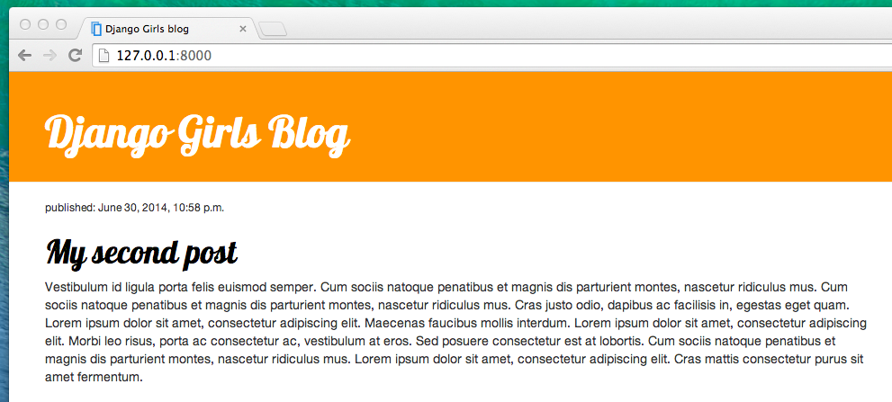

# CSS - skrášlime to!

Náš blog vyzerá zatiaľ dosť škaredo, však? Je čas to napraviť! Použijeme na to CSS.

## Čo je CSS?

Kaskádové štýly (CSS, angl. Cascading Style Sheets) sú jazyk, ktorý sa používa na popis vzhľadu a formátovania webstránky napísanej v markupovom jazyku (napríklad HTML). Predstav si to ako make-up pre našu webstránku. ;)

Ale nechceme začať zase od nuly, že? Znovu použijeme niečo, čo iné programátorky a programátori zverejnili na internete zadarmo. Ako vieš, vymýšlať koleso nie je žiadna zábava.

## Použime Bootstrap!

Bootstrap je jedným z najpopulárnejších HTML a CSS frameworkov pre vývoj krásnych webových stránok: https://getbootstrap.com/

Bol napísaný programátormi a programátorkami, ktorí pracovali pre Twitter. Teraz je vyvíjaný dobrovoľníkmi a dobrovoľníčkami z celého sveta!

## Inštalácia Bootstrapu

Aby si nainštalovala Bootstrap, otvor svoj súbor `.html` vo svojom editore a pridaj toto do sekcie `<head>`:

blog/templates/blog/post_list.html

```html
<link rel="stylesheet" href="https://cdn.jsdelivr.net/npm/bootstrap@5.1.3/dist/css/bootstrap.min.css" integrity="sha384-1BmE4kWBq78iYhFldvKuhfTAU6auU8tT94WrHftjDbrCEXSU1oBoqyl2QvZ6jIW3" crossorigin="anonymous">
```

Nepridá to do tvojho projektu žiadne súbory. Iba to ukazuje na súbory, ktoré už existujú na internete. Skúsme to, otvor svoju webstránku a obnov stránku. Už to máme!


Už to vyzerá lepšie!

## Statické súbory v Djangu

Konečne sa pozrieme zblízka na veci, ktoré nazývame **statické súbory**. Statické súbory sú všetky tvoje CSS a obrázky. Ich obsah nie je závislý na kontexte žiadosti a budú rovnaké pre každého používateľa či používateľku.

### Kam umiestniť statické súbory pre Django

Django už vie, kde nájsť statické súbory pre zabudovanú aplikáciu "admin". Teraz už len musíme pridať niektoré statické súbory pre našu vlastnú aplikáciu `blog`.

To urobíme tak, že vo vnútri našej aplikácie blog vytvoríme adresár s názvom `static`:

    djangogirls
    ├── blog
    │   ├── migrations
    │   ├── static
    │   └── templates
    └── mysite
    

Django automaticky nájde všetky zložky s názvom "static" vo všetkých priečinkoch tvojej aplikácie. Následne bude možné použiť ich obsah ako statické súbory.

## Tvoj prvý CSS súbor!

Vytvorme teraz CSS súbor, ktorý tvojej web stránke pridá tvoj vlastný štýl. Vytvor nový adresár s názvom `css` vnútri adresára `static`. Potom vytvor nový súbor s názvom `blog.css` vo vnútri tohto adresára `css`. Pripravená?

    djangogirls
    └─── blog
         └─── static
              └─── css
                   └─── blog.css
    

Je čas napísať trochu CSS! Otvor v editore kódu súbor `blog/static/css/blog.css`.

Tu sa nebudeme do hĺbky zaoberať úpravou a štúdiom CSS. Na konci tejto stránky sa nachádza odkaz na bezplatný CSS kurz, ak sa o tom chceš dozvedieť viac.

Ale urobme aspoň niečo. Čo keby sme zmenili farbu hlavičiek? Počítače používajú špeciálne kódy, aby rozumeli farbám. Tieto kódy sa začínajú `#` potom nasleduje 6 písmen (A-F) a číslic (0-9). Napríklad kód pre modrú je `#0000FF`. Kódy farieb nájdeš napríklad tu: http://www.colorpicker.com/. Môžeš tiež použiť [preddefinované farby](http://www.w3schools.com/colors/colors_names.asp) ako napríklad `red` (červená) alebo `green` (zelená).

Do súboru `blog/static/css/blog.css` pridaj nasledujúci kód:

blog/static/css/blog.css

```css
h1 a, h2 a {
    color: #C25100;
}

```

`h1 a` je CSS selektor. Znamená to, že aplikujeme naše štýly na všetky `a` elementy, ktoré sa nachádzajú vnútri `h1` elementu. Selektor `h2 a` robí presne to isté, akurát pre elementy `h2`. Takže keď máme niečo ako: `<h1><a href="">link</a></h1>`, použije sa na to štýl `h1 a`. V tomto prípade elementu hovoríme, aby zmenil svoju farbu na `#FCA205`, čo je tmavooranžová. Alebo si môžeš vybrať vlastnú farbu, akurát daj pozor, aby dobre kontrastovala s bielym pozadím!

V CSS súbore definujeme štýly pre elementy v HTML súbore. Prvý spôsob, akým môžme identifikovať elementy, je názov elementu. Môžno si pamätáš tieto tagy z HTML sekcie. Veci ako `a`,`h1`, a `body` sú príklady názvov elementov. Elementy taktiež identifikujeme pomocou atribútu `class` alebo atribútu `id`. Triedy (class) a id sú názvy, ktorými nazveš elementy. Triedy definujú skupiny elementov a id-čká poukazujú na konkrétne elementy. Napríklad nasledujúci element môže byť identifikovaný v CSS pomocou názvu `a`, triedy `external_link`, alebo id `link_to_wiki_page`:

```html
<a href="https://en.wikipedia.org/wiki/Django" class="external_link" id="link_to_wiki_page">
```

O [CSS selektoroch](http://www.w3schools.com/cssref/css_selectors.asp) si môžeš prečítať viac na stránkach w3schools.

Ešte musíme povedať našej HTML šablóne, že sme pridali nejaké CSS. Otvor súbor `blog/templates/blog/post_list.html` v editore a pridaj tento riadok na úplný začiatok:

blog/templates/blog/post_list.html

```html

```

Tu sme len nahrali statické súbory. :) Medzi tagmi `<head>` a `</head>`, po odkazoch na bootstrapové CSS súbory, pridaj tento riadok:

blog/templates/blog/post_list.html

```html
<link rel="stylesheet" href="">
```

Prehliadač číta súbory, ktoré dostane, zaradom, takže sa musíme uistiť, že sú na správnom mieste. Inak kód v našich súboroch môže byť prepísaný kódom z boostrapových súborov. Práve sme našej šablóne povedali, kde sa nachádza náš CSS súbor.

Súbor by mal teraz vyzerať asi takto:

blog/templates/blog/post_list.html

```html

<!DOCTYPE html>
<html>
    <head>
        <title>Django Girls blog</title>
        <link rel="stylesheet" href="https://cdn.jsdelivr.net/npm/bootstrap@5.1.3/dist/css/bootstrap.min.css" integrity="sha384-1BmE4kWBq78iYhFldvKuhfTAU6auU8tT94WrHftjDbrCEXSU1oBoqyl2QvZ6jIW3" crossorigin="anonymous">
        <link rel="stylesheet" href="">
    </head>
    <body>
        <header>
            <h1><a href="/">Django Girls Blog</a></h1>
        </header>

        
            <article>
                <time>published: {{ post.published_date }}</time>
                <h2><a href="">{{ post.title }}</a></h2>
                <p>{{ post.text|linebreaksbr }}</p>
            </article>
        
    </body>
</html>
```

OK, súbor ulož a obnov stránku!


Pekne! Možno by sme chceli dať našej webovej stránke trochu priestoru na dýchanie. Zväčšíme okraj na ľavej strane? Skúsme to!

blog/static/css/blog.css

```css
body {
    padding-left: 15px;
}
```

Pridaj to do svojho CSS, súbor ulož a pozri, ako to funguje!


Mohli by sme trochu upraviť font v našej hlavičke, nie? Skopíruj toto do svojej hlavičky `<head>` v súbore `blog/templates/blog/post_list.html`:

blog/templates/blog/post_list.html

```html
<link href="//fonts.googleapis.com/css?family=Lobster&subset=latin,latin-ext" rel="stylesheet" type="text/css">
```

Rovnako ako predtým, skontroluj poradie a umiestni pred odkaz na `blog/static/css/blog.css`. Tento riadok bude importovať font pod názvom *Lobster* z Google Fonts (https://www.google.com/fonts).

Nájdi deklaračný blok `h1 a` (kód medzi zátvorkami `{` a `}`) v CSS súbore `blog/static/css/blog.css`. Teraz pridaj riadok `font-family: 'Lobster';` medzi zátvorky a obnov stránku:

blog/static/css/blog.css

```css
h1 a, h2 a {
    color: #C25100;
    font-family: 'Lobster';
}
```


Super!

Ako bolo uvedené vyššie, CSS má koncept tried. Triedy ti umožňujú pomenovať časti HTML kódu a použiť štýly iba na tejto časti bez zasahovania do iných častí. To môže byť veľmi užitočné! Možno máš dva divy, ktoré robia niečo iné (ako tvoja hlavička a tvoj príspevok). Triedy ti pomôžu docieliť, aby vyzerali každý inak.

Poďme skúsiť pomenovať niektoré časti HTML kódu. Zmeň `header`, ktorý obsahuje tvoju hlavičku, takto:

blog/templates/blog/post_list.html

```html
<header class="page-header">
    <div class="container">
        <h1><a href="/">Django Girls Blog</a></h1>
    </div>
</header>
```

A teraz pridaj triedu `post` do tvojho `article`, v ktorom je blog post.

blog/templates/blog/post_list.html

```html
<article class="post">
    <time>published: {{ post.published_date }}</time>
    <h2><a href="">{{ post.title }}</a></h2>
    <p>{{ post.text|linebreaksbr }}</p>
</article>
```

Teraz pridáme deklarácie pre rôzne selektory. Selektory, ktoré začínajú znamienkom `.`, sa týkajú tried. Na webe je ohľadne CSS veľa skvelých tutorialov a vysvetlení, ktoré ti pomôžu pochopiť nasledujúci kód. Ale teraz len skopíruj a vlož nasledujúci kód do tvojho súboru `blog/static/css/blog.css`:

blog/static/css/blog.css

```css
.page-header {
    background-color: #C25100;
    margin-top: 0;
    margin-bottom: 40px;
    padding: 20px 20px 20px 40px;
}

.page-header h1,
.page-header h1 a,
.page-header h1 a:visited,
.page-header h1 a:active {
    color: #ffffff;
    font-size: 36pt;
    text-decoration: none;
}

h1,
h2,
h3,
h4 {
    font-family: 'Lobster', cursive;
}

.date {
    color: #828282;
}

.save {
    float: right;
}

.post-form textarea,
.post-form input {
    width: 100%;
}

.top-menu,
.top-menu:hover,
.top-menu:visited {
    color: #ffffff;
    float: right;
    font-size: 26pt;
    margin-right: 20px;
}

.post {
    margin-bottom: 70px;
}

.post h2 a,
.post h2 a:visited {
    color: #000000;
}

.post > .date,
.post > .actions {
    float: right;
}

.btn-secondary,
.btn-secondary:visited {
    color: #C25100;
    background: none;
    border-color: #C25100;
}

.btn-secondary:hover {
    color: #FFFFFF;
    background-color: #C25100;
}
```

Teraz deklaráciami tried obklop HTML kód, ktorý zobrazuje posty. Nahraď toto:

blog/templates/blog/post_list.html

```html

    <article class="post">
        <time>published: {{ post.published_date }}</time>
        <h2><a href="">{{ post.title }}</a></h2>
        <p>{{ post.text|linebreaksbr }}</p>
    </article>

```

v súbore `blog/templates/blog/post_list.html` týmto:

blog/templates/blog/post_list.html

```html
<main class="container">
    <div class="row">
        <div class="col">
            
                <article class="post">
                    <time class="date">
                        {{ post.published_date }}
                    </time>
                    <h2><a href="">{{ post.title }}</a></h2>
                    <p>{{ post.text|linebreaksbr }}</p>
                </article>
            
        </div>
    </div>
</main>
```

Ulož tieto súbory a obnov svoju web stránku.



Super! Vyzerá to úžasne, nie? Pozri sa na kód, ktorý sme práve vložili, a nájdi miesta, kde sme pridali triedy v HTML a použili sme ich v CSS. Kde by si spravila zmenu, ak by si chcela dátum spraviť tyrkysový?

Neboj sa trochu pohrať s týmto CSS a poskúšať pomeniť niektoré veci. Hranie sa s CSS ti pomôže porozumieť tomu, čo robia rôzne veci. Ak niečo pokazíš, neboj sa, môžeš vždy vrátiť zmeny späť!

Vrelo odporúčame online kurzy zdarma "Basic HTML & HTML5" a "Basic CSS" na [freeCodeCamp](https://learn.freecodecamp.org/). Naučia ťa všetko o tom, ako môžeš svoje stránky skrášliť pomocou HTML a CSS.

Pripravená na ďalšiu kapitolu?! :)