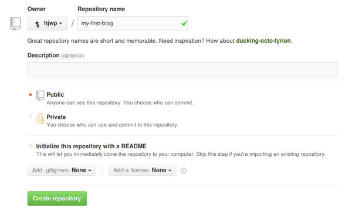
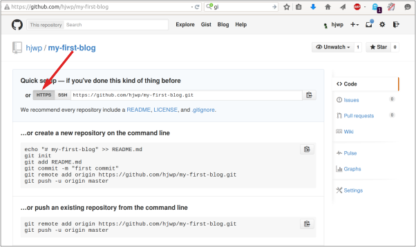

# Nasadenie!

> **Poznámka** Môže byť trochu ťažké prehrýzť sa touto kapitolou. Vydrž a dokonči ju, nasadenie je dôležitou časťou vývoja webových stránok. Táto kapitola je umiestnená uprostred tutoriálu, aby ti mentor či mentorka mohli pomôcť s trochu náročnejšími časťami procesu spúšťania tvojej webovej stránky online. To znamená, že môžeš dokončiť tutoriál aj sama, ak ti nevyjde čas.

Až do tohto momentu bola tvoja webová stránka dostupná len v tvojom počítači. Teraz sa naučíš, ako ju nasadiť! Nasadenie (deployment) je proces publikovania aplikácie na internete, aby ju všetci konečne mohli vidieť. :)

Ako už vieš, webová stránka musí byť umiestnená na serveri. Na internete existuje množstvo poskytovateľov serverov, my použijeme [PythonAnywhere](https://www.pythonanywhere.com/). PythonAnywhere je bezplatný pre malé aplikácie, ktoré nemajú príliš veľa návštevníkov a návštevníčok, takže zatiaľ ti to určite bude stačiť.

Ďalšou externou službou, ktorú budeme využívať, je [GitHub](https://www.github.com), kde sa uchovávajú zdrojové kódy. Existujú aj ďalšie podobné služby, no v dnešnej dobe už majú takmer všetci programátori a programátorky githubové konto a teraz ho už budeš mať aj ty!

Tieto tri miesta budú pre teba dôležité. Lokálny počítač bude miestom, kde budeš vyvíjať a testovať. Keď si spokojná so zmenami, uložíš kópiu programu na GitHub. Tvoja webová stránka bude na PythonAnywhere a budeš ju aktualizovať stiahnutím novej kópie svojho kódu z GitHubu.

# Git

> **Poznámka** Ak už máš za sebou [inštaláciu](../installation/README.md), nemusíš toto robiť znova - môžeš preskočiť na ďalšiu časť a začať s vytváraním vlastného Git repozitára.



## Založenie Git repozitára

Git sleduje zmeny na konkrétnej skupine súborov, v niečom, čo sa nazýva úložisko kódu alebo repozitár (skrátene "repo"). Založme si repo pre náš projekt. Otvor konzolu a spusti nasledujúce príkazy v adresári `djangogirls`:

> **Poznámka** Skontroluj si aktuálny pracovný priečinok príkazom `pwd` (macOS/Linux) alebo `cd` (Windows) pred inicializáciou repozitára. Mala by si byť v priečinku `djangogirls`.

command-line

    $ git init
    Initialized empty Git repository in ~/djangogirls/.git/
    $ git config --global user.name "Tvoje Meno"
    $ git config --global user.email ty@example.com
    

Inicializácia Git repozitára je niečo, čo musíme urobiť len raz za projekt (a už nikdy nebudeš musieť znovu zadávať užívateľské meno a e-mail).

### Upravenie názvu vetvy

Vo verziách Gitu starších ako **2.28** budeš musieť zmeniť meno svojej vetvy na "main". Ak chceš zistiť, akú verziu Gitu máš, prosím, spusti nasledovný príkaz:

command-line

    $ git --version
    git version 2.xx...
    

V prípade, že druhé číslo verzie ("xx" vyššie) je menšie ako 28, budeš musieť spustiť nasledujúci príkaz, aby si premenovala svoju vetvu. Ak je to 28 alebo viac, pokračuj, prosím, sekciou "Ignorovanie súborov". Rovnako ako v časti "Inicializácia" je toto niečo, čo musíme spraviť len jeden jediný raz vrámci projektu, a aj to iba v prípade, ak je tvoja verzia Gitu menšia ako 2.28:

command-line

    $ git branch -M main
    

### Ignorovanie súborov

Git bude sledovať zmeny všetkých súborov a priečinkov v tomto adresári, ale sú aj niektoré súbory, ktoré chceme ignorovať. To urobíme tak, že vytvoríme súbor s názvom `.gitignore` v základnom adresári. Otvor si editor a vytvor nový súbor s týmto obsahom:

.gitignore

    # Python
    *.pyc
    *~
    __pycache__
    
    # Env
    .env
    myvenv/
    venv/
    
    # Database
    db.sqlite3
    
    # Static folder at project root
    /static/
    
    # macOS
    ._*
    .DS_Store
    .fseventsd
    .Spotlight-V100
    
    # Windows
    Thumbs.db*
    ehthumbs*.db
    [Dd]esktop.ini
    $RECYCLE.BIN/
    
    # Visual Studio
    .vscode/
    .history/
    *.code-workspace
    

A ulož ho ako `.gitignore` v priečinku "djangogirls".

> **Poznámka** Bodka na začiatku názvu súboru je dôležitá! Ak máš problém vytvoriť takýto súbor (napríklad Macom sa nepáči, ak chceš cez Vyhľadávanie (Finder) vytvoriť súbory, ktoré sa začínajú bodkou), potom použi funkciu "Uložiť ako" vo svojom editore, to funguje vždy. A daj pozor na to, aby si k názvu súboru nepridala `.txt`, `.py` alebo akúkoľvek inú koncovku - Git ho rozpozná, iba ak sa volá presne `.gitignore`. V Linuxe a MacOS sú súbory, ktoré začínajú `.` (ako `.gitignore`), považované za skryté a príkaz `ls` ich neukáže. Namiesto neho môžeš použiť `ls -a`, aby si súbor `.gitignore` videla.
> 
> **Poznámka** Jeden zo súborov, ktoré si spomenula vo svojom súbore `.gitignore`, je `db.sqlite3`. Tento súbor je tvoja lokálna databáza, kde sú uložení všetci tvoji používatelia/používateľky a príspevky. Budeme sa riadiť štandardnými programátorskými postupmi, čo znamená, že budeme používať dve rôzne databázy, jednu pre svoju vlastnú lokálnu testovaciu stránku a druhú pre svoju online stránku na PythonAnywhere. Na PythonAnywhere to možno bude SQLite, tak ako na stroji, na ktorom vyvíjaš, ale zvyčajne by si tam skôr použila databázu, ktorá sa volá MySQL, ktorá zvládne oveľa viac navštevníčiek a návštevníkov ako SQLite. Tak či onak, to, že ignoruješ svoju SQLite databázu v kópii pre GitHub, znamená, že všetky príspevky a superuser, ktorých si doteraz vytvorila, budú dostupní len lokálne, a na produkčnej verzii budeš musieť vytvoriť nových. Svoju lokálnu databázu si môžeš predstaviť ako pieskovisko, na ktorom si môžeš vyskúšať rôzne veci a nebáť sa, že zmažeš reálne príspevky zo svojho blogu.

Vždy je dobré použiť príkaz `git status` pred `git add` alebo kedykoľvek, keď si nebudeš istá, čo sa zmenilo. Pomôže ti to vyhnúť sa prekvapeniam ako napríklad pridanie nesprávnych súborov. Príkaz `git status` vracia informácie o nesledovaných (untracked) či zmenených (modified) súboroch, alebo súboroch pripravených na zmenu (staged), o stave vetvy a veľa ďalších vecí. Výstup by mal byť podobný nasledovnému:

command-line

    $ git status
    On branch main
    
    No commits yet
    
    Untracked files:
      (use "git add <file>..." to include in what will be committed)
    
            .gitignore
            blog/
            manage.py
            mysite/
            requirements.txt
    
    nothing added to commit but untracked files present (use "git add" to track)
    

A nakoniec uložíme naše zmeny. Prejdi na konzolu a zadaj nasledujúce príkazy:

command-line

    $ git add .
    $ git commit -m "My Django Girls app, first commit"
     [...]
     13 files changed, 200 insertions(+)
     create mode 100644 .gitignore
     [...]
     create mode 100644 mysite/wsgi.py
    

## Prenos nášho kódu na GitHub

Choď na [GitHub.com](https://www.github.com) a založ (Sign Up) si nový účet zdarma. (Ak si to už spravila počas prípravy na workshop, super!) Zapamätaj si svoje heslo (a pridaj si ho do svojho správcu hesiel, ak nejaký používaš).

Potom vytvor nový repozitár a pomenuj ho "my-first-blog". Políčko "initialize with a README" nechaj nezaškrtnuté, voľbu .gitignore nechaj prázdnu (urobili sme to manuálne) a License nechaj ako None.

> **Poznámka** Názov `my-first-blog` je dôležitý -- mohla by si si vybrať aj niečo iné, ale bude sa to ďalej vyskytovať veľakrát a musela by si to zakaždým nahradiť. Pravdepodobne bude pohodlnejšie, ak ostaneš pri názve `my-first-blog`.

Na nasledujúcej stránke sa ti ukáže klonovacia URL tvojho repa, ktorú budeme potrebovať v niektorých z nasledujúcich príkazov:

Teraz musíme pripojiť Git repozitár v tvojom počítači k tomu na GitHube.

Napíš do konzoly nasledujúci príkaz (nahraď `<your-github-username>` svojím užívateľským menom na GitHube, ale bez špicatých zátvoriek - URL by mala byť rovnaká ako klonovacia URL, ktorú si práve videla).

command-line

    $ git remote add origin https://github.com/<your-github-username>/my-first-blog.git
    $ git push -u origin main
    

Keď pošleš niečo na GitHub, spýta sa ťa to na tvoje githubové meno a heslo (buď rovno v príkazovom riadku alebo vo vyskakovacom okne) a keď ich zadáš, mala by si vidieť niečo takéto:

command-line

    Counting objects: 6, done.
    Writing objects: 100% (6/6), 200 bytes | 0 bytes/s, done.
    Total 3 (delta 0), reused 0 (delta 0)
    To https://github.com/ola/my-first-blog.git
    
     * [new branch]      main -> main
    Branch main set up to track remote branch main from origin.
    

<!--TODO: maybe do ssh keys installs in install party, and point ppl who dont have it to an extension -->

Tvoj kód je na GitHube. Choď sa naň pozrieť! Zistíš, že sa nachádza vo vyberanej spoločnosti - [Django](https://github.com/django/django), [Django Girls Tutorial](https://github.com/DjangoGirls/tutorial) a mnoho iných skvelých open sourcových softvérových projektov uchováva svoj kód na GitHube. :)



# Choď sa pozrieť na svoju stránku!

Hlavná stránka tvojej aplikácie by ťa mala vítať nápisom "It worked!", tak ako na tvojom počítači. Skús pridať `/admin/` na koniec adresy URL, a budeš presmerovaná na stránky administrácie. Prihlás sa svojím menom a heslom a uvidíš, že môžeš na server pridať nové príspevky. Nezabudni, že príspevky z tvojej lokálnej testovacej databázy sme neposlali na tvoj online blog.

Keď vytvoríš niekoľko príspevkov, môžeš sa vrátiť do tvojho lokálneho prostredia (nie PythonAnywhere). Odteraz by si na zmenách mala pracovať vo svojom lokálnom prostredí. To je štandardný pracovný postup pri vývoji webových aplikácií - urobíš zmeny lokálne, dáš tieto zmeny na GitHub a stiahneš zmeny na svoj webový server. Vďaka tomu môžeš pracovať a experimentovať bez toho, aby si niečo pokazila na svojej online stránke. Celkom cool, že?

*PORIADNE* sa potľapkaj po chrbte! Nasadenie serveru je jedna z najzradnejších častí vývoja web stránok a často zaberie ľuďom aj niekoľko dní, kým to celé spojazdnia. Ale ty už máš svoju stránku online teraz, na skutočnom internete!