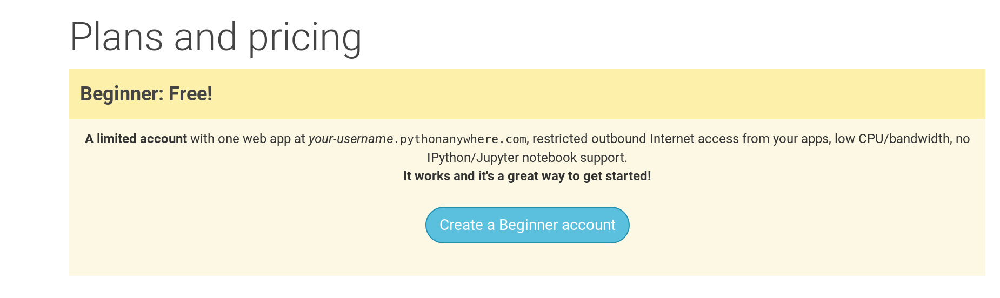

PythonAnywhere je služba, ktorá ti umožní nechať bežať svoj kód v Pythone na serveroch v "cloude". Použijeme ju na uverejnenie našej stránky na internete.

Náš blog uverejníme na PythonAnywhere. Vytvor si "Beginner" účet na PythonAnywhere (verzia zdarma stačí, nepotrebuješ kreditnú kartu).

* [www.pythonanywhere.com](https://www.pythonanywhere.com/)

> **Poznámka** Pri výbere používateľského mena mysli na to, že URL tvojho blogu bude v tvare `tvojeuzivatelskemeno.pythonanywhere.com`, takže si vyber prezývku alebo názov, o čom tvoj blog je. Taktiež si určite zapamätaj svoje heslo (pridaj si ho do svojho správcu hesiel, ak nejaký používaš).

## Vytvorenie PythonAnywhere API tokenu

Toto je niečo, čo musíš spraviť len raz. Keď si vytvoríš PythonAnywhere účet, hodí ťa to na tvoju nástenku. Nájdi odkaz na svoj účet (Account) vpravo hore:

následne vyber záložku "API token" a stlač tlačítko "Create new API token".

