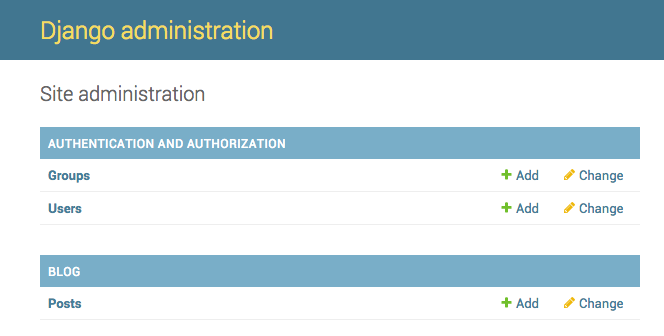
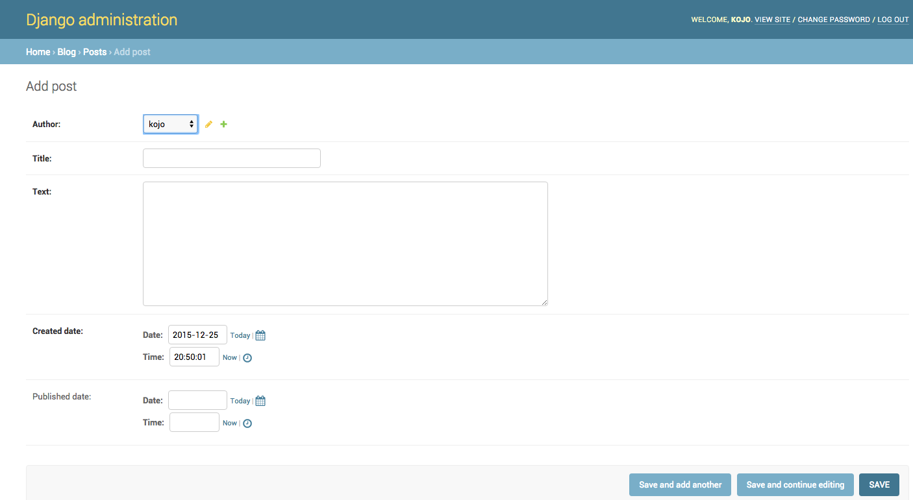

# Django admin

Na pridávanie, editovanie a mazanie príspevkov, ktoré sme práve namodelovali, budeme používať Django admina.

Otvorme súbor `blog/admin.py` v editore a nahraďme jeho obsah týmto:

blog/admin.py

```python
from django.contrib import admin
from .models import Post

admin.site.register(Post)
```

Ako vidíš, importujeme model Post definovaný v predchádzajúcej kapitole. Aby bol náš model viditeľný na adminskej stránke, musíme ho zaregistrovať pomocou `admin.site.register(Post)`.

OK, je čas pozrieť sa na náš Post model. Nezabudni v konzole spustiť web server pomocou príkazu `python manage.py runserver`. V prehliadači zadaj adresu http://127.0.0.1:8000/admin/. Zobrazí sa ti takáto prihlasovacia stránka:


Pre prihlásenie musíš vytvoriť *superusera* - užívateľa, ktorý má kontrolu nad všetkým na stránke. Vráť sa do príkazového riadku, napíš `python manage.py createsuperuser` a stlač enter.

> Ak chceš zadať viac príkazov, kým web server beží, otvor nové okno terminálu a aktivuj svoj virtualenv. Ako písať príkazy sme si povedali v kapitole **Tvoj prvý Django projekt!** v odstavci **Spustenie webového serveru**.

macOS alebo Linux:

    (myvenv) ~/djangogirls$ python manage.py createsuperuser
    

Windows:

    (myvenv) C:\Users\Name\djangogirls> python manage.py createsuperuser
    

Po výzve zadaj svoje meno (malé písmená, bez medzier), emailovú adresu a heslo. **Netráp sa, že nevidíš heslo, ktoré zadávaš, tak to má byť.** Len ho zadaj a stlač `enter`. Výstup by mal vyzerať asi takto (kde užívateľské meno a email by mali byť tvoje vlastné):

    Username: ola
    Email address: ola@example.com
    Password:
    Password (again):
    Superuser created successfully.
    

Vráť sa do prehliadača. Prihlás sa zvolenými údajmi ako superuser, mala by sa ti zobraziť nástenka Django admina.



Choď do kategórie Posts a trochu sa s ňou pohraj. Pridaj 5 alebo 6 príspevkov. Netráp sa s obsahom - je viditeľný len pre teba na tvojom lokálnom počítači - môžeš skopírovať nejaký text z tohto tutoriálu, aby si ušetrila čas. :)

Uisti sa, že aspoň dva alebo tri príspevky (ale nie všetky) majú nastavený dátum publikovania. Príde nám to vhod neskôr.



Ak chceš vedieť viac o Django admine, pozri si dokumentáciu Djanga: https://docs.djangoproject.com/en/5.1/ref/contrib/admin/

Teraz je asi vhodný čas dať si kávu (alebo čaj) alebo niečo pod zub a nabrať trochu energie. Práve si vytvorila svoj prvý Django model - zaslúžiš si trochu oddychu!