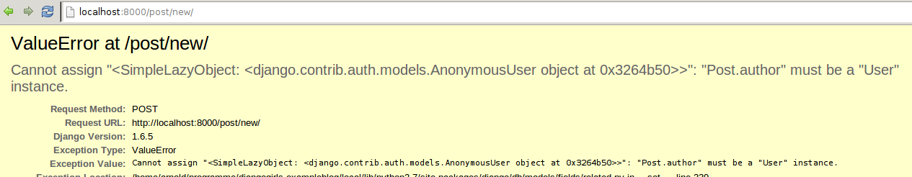
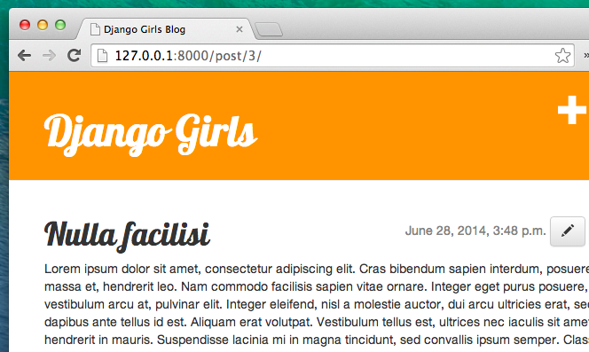

# Django formuláre

Posledná vec, ktorú chceme urobiť na našej web stránke, je vytvoriť pohodlný spôsob pridávania a úpravy blogových príspevkov. Django `admin` je v pohode, ale ťažko sa prispôsobuje a upravuje do krajšej podoby. Pomocou `formulárov` budeme mať absolútnu moc nad naším rozhraním - môžeme urobiť takmer čokoľvek, čo si vieme predstaviť!

Na Django formulároch je fajn, že ich môžeme vytvoriť úplne od nuly alebo vytvoriť `ModelForm`, ktorý uloží výsledok formulára do modelu.

A toto je presne to, čo chceme urobiť: vytvoríme formulár pre náš model `Post`.

Tak, ako všetky ostatné dôležité časti Djanga, aj formuláre majú svoj vlastný súbor: `forms.py`.

Musíme vytvoriť súbor s týmto názvom v adresári `blog`.

    blog
       └── forms.py
    

OK, otvorme ho v editore a napíšme nasledovný kód:

blog/forms.py

```python
from django import forms

from .models import Post

class PostForm(forms.ModelForm):

    class Meta:
        model = Post
        fields = ('title', 'text',)
```

Najskôr musíme naimportovať Django formuláre (`from django import forms`) a náš model `Post` (`from .models import Post`).

`PostForm`, ako asi správne predpokladáš, je názov nášho formulára. Musíme Djangu povedať, že tento formulár je `ModelForm` (aby Django pre nás mohlo trochu čarovať) - za to je zodpovedný `forms.ModelForm`.

Ďalej máme `triedu Meta`, kde Djangu povieme, ktorý model by mal byť použitý na vytvorenie tohto formulára (`model = Post`).

Nakoniec môžeme Djangu povedať, ktoré polia budú v našom formulári. V tomto prípade chceme, aby boli zobrazené iba `title` (nadpisy) a `text` - `author` by mala byť aktuálne prihlásená osoba (teda ty!) a dátum vytvorenia `created_date` by mal byť automaticky nastavený pri vytvorení postu (t.j. v kóde), však?

To je všetko! Jediné, čo treba teraz urobiť, je použiť formulár vo *viewe* a zobraziť ho v šablóne.

Takže ešte raz vytvoríme link na stránku, URL, zobrazenie a šablónu.

## Link na stránku s formulárom

Predtým, než pridáme link, budeme potrebovať zopár ikoniek, ktoré použijeme ako tlačidlá pre link. V rámci tohto tutoriálu si stiahni [file-earmark-plus.svg](https://raw.githubusercontent.com/twbs/icons/main/icons/file-earmark-plus.svg) a ulož ho do priečinku `blog/templates/blog/icons/`

> Poznámka: Pre stiahnutie SVG obrázku otvor kontextové menu k linku (väčšinou stlačením pravého tlačidla na myši) a zvoľ "Uložiť odkaz ako". V dialógu, kde si vyberáš, kde sa má súbor uložiť, sa nasmeruj do priečinku `djangogirls` svojho Django projektu a ďalej do podadresára `blog/templates/blog/icons/` a ulož súbor tam.

Prišiel čas otvoriť `blog/templates/blog/base.html` v editore. Teraz môžeme použiť tento súbor s ikonkou do našej základnej šablóny takto. V elemente `div` vnútri `header` sekcie pridáme link pred element `h1`:

blog/templates/blog/base.html

```html
<a href="" class="top-menu">
    
</a>
```

Všimni si, že chceme zavolať náš nový view `post_new`. [SVG ikonku](https://icons.getbootstrap.com/icons/file-earmark-plus/) máme z [Bootstrap Icons](https://icons.getbootstrap.com/) a zobrazí sa ako ikonka stránky s pluskom. Použijeme šablónový príkaz `include`. Týmto dosiahneme, že sa obsah súboru vloží do Django šablóny. Webový prehliadač vie, ako sa s týmto typom obsahu vysporiadať, bez toho, aby bolo treba čokoľvek ďalej spracovávať.

> Všetky Bootstrapové ikonky si môžeš stiahnuť [tu](https://github.com/twbs/icons/releases/download/v1.11.3/bootstrap-icons-1.11.3.zip). Súbor rozbaľ a skopíruj všetky obrázkové súbory SVG do nového adresára vo vnútri `blog/templates/blog/` s názvom `icons`. Vďaka tomuto môžeš pristupovať k ikonke ako `pencil-fill.svg` pomocou cesty `blog/templates/blog/icons/pencil-fill.svg`

Po zmene riadku by tvoj HTML súbor mal vyzerať takto:

blog/templates/blog/base.html

```html

<!DOCTYPE html>
<html>
    <head>
        <title>Django Girls blog</title>
        <link rel="stylesheet" href="https://cdn.jsdelivr.net/npm/bootstrap@5.3.3/dist/css/bootstrap.min.css" integrity="sha384-QWTKZyjpPEjISv5WaRU9OFeRpok6YctnYmDr5pNlyT2bRjXh0JMhjY6hW+ALEwIH" crossorigin="anonymous">
        <link href='//fonts.googleapis.com/css?family=Lobster&subset=latin,latin-ext' rel='stylesheet' type='text/css'>
        <link rel="stylesheet" href="">
    </head>
    <body>
        <header class="page-header">
            <div class="container">
                <a href="" class="top-menu">
                    
                </a>
                <h1><a href="/">Django Girls Blog</a></h1>
            </div>
        </header>
        <main class="content container">
            <div class="row">
                <div class="col">
                    
                    
                </div>
            </div>
        </main>
    </body>
</html>
```

Po uložení a obnove stránky http://127.0.0.1:8000 uvidíš našu starú známu chybu `NoReverseMatch`. Je to tak? Dobre!

## URL

Otvoríme `blog/urls.py` v editore a pridáme riadok:

blog/urls.py

```python
path('post/new/', views.post_new, name='post_new'),
```

A výsledný kód bude vyzerať takto:

blog/urls.py

```python
from django.urls import path
from . import views

urlpatterns = [
    path('', views.post_list, name='post_list'),
    path('post/<int:pk>/', views.post_detail, name='post_detail'),
    path('post/new/', views.post_new, name='post_new'),
]
```

Po obnovení stránky uvidíme chybu `AttributeError`, pretože nemáme naimplementovaný view `post_new`. Pridajme ho teraz.

## View post_new

Teraz otvoríme súbor `blog/views.py` v editore a pridáme nasledujúce riadky so zvyškom importovacích riadkov `from`:

blog/views.py

```python
from .forms import PostForm
```

A potom náš *view*:

blog/views.py

```python
def post_new(request):
    form = PostForm()
    return render(request, 'blog/post_edit.html', {'form': form})
```

Nový formulár pre `Post` vytvoríme tak, že zavoláme `PostForm()` a prepošleme ho šablóne. K tomuto *viewu* sa ešte vrátime, ale teraz poďme rýchlo vytvoriť šablónu formulára.

## Šablóna

Musíme vytvoriť súbor `post_edit.html` v priečinku `blog/templates/blog` a otvoriť ho v editore. Aby formulár fungoval, potrebujeme niekoľko vecí:

* Musíme zobraziť formulár. Môžeme to urobiť (napríklad) pomocou `{{ form.as_p }}`.
* Riadok vyššie musí byť obalený HTML elementom form: `<form method="POST">...</form>`.
* Potrebujeme tlačidlo `Uložiť`. Vytvoríme ho ako HTML tlačidlo: `<button type="submit">Uložiť</button>`.
* A nakoniec hneď za otváracím tagom `<form ...>` musíme pridať ``. Toto je veľmi dôležité, vďaka tomu je formulár zabezpečený! Ak na to zabudneš, Django sa bude sťažovať, keď sa pokúsiš formulár uložiť:


OK, poďme sa pozrieť, ako by malo vyzerať HTML v `post_edit.html`:

blog/templates/blog/post_edit.html

```html



    <h2>New post</h2>
    <form method="POST" class="post-form">
        {{ form.as_p }}
        <button type="submit" class="save btn btn-secondary">Save</button>
    </form>

```

Čas obnoviť stránku! Aha! Tvoj formulár je na svete!


Ale moment! Keď zadáš niečo do polí `title` a `text` a skúsiš to uložiť, čo sa stane?

Nič! Sme stále na rovnakej stránke a náš text zmizol... a žiaden nový príspevok sa nepridal. Takže čo sa pokazilo?

Odpoveď znie: nič. Akurát musíme ešte trochu popracovať na našom *viewe*.

## Uloženie formuláru

Znova otvor `blog/views.py` v editore. Momentálne máme v `post_new` len toto:

blog/views.py

```python
def post_new(request):
    form = PostForm()
    return render(request, 'blog/post_edit.html', {'form': form})
```

Keď odošleme formulár, vrátime sa do rovnakého viewu, ale teraz už máme v `request` aj nejaké údaje, presnejšie v `request.POST` (názov nemá nič spoločné s "postom" na blogu, ide len o to, že posielame - "postujeme" údaje). Pamätáš si, ako naša definícia formuláru `<form>` v HTML súbore mala premennú `method="POST"`? Všetky polia z formulára sú teraz v `request.POST`. `POST` by si nemala premenovať na nič iné (jediná ďalšia platná hodnota pre premennú `method` je `GET`, teraz ale nemáme čas vysvetliť si rozdiel).

Takže v našom *viewe* musíme ošetriť dva rôzne prípady: prvý, ak pristupujeme na stránku prvýkrát a chceme prázdny formulár, a druhý, keď sa vrátime na *view* s už predvyplnenými údajmi formulára. Takže potrebujeme pridať podmienku (na to použijeme `if`):

blog/views.py

```python
if request.method == "POST":
    [...]
else:
    form = PostForm()
```

Je čas nahradiť tri bodky `[...]`. Ak ide o `metódu` `POST`, tak chceme vytvoriť `PostForm` s dátami z formulára, však? Urobíme to takto:

blog/views.py

```python
form = PostForm(request.POST)
```

Ďalej skontrolujeme, či je formulár v poriadku (všetky povinné polia sú vyplnené a nie sú zadané žiadne nesprávne hodnoty). To urobíme pomocou `form.is_valid()`.

Skontrolujeme, či je formulár platný a ak áno, môžeme ho uložiť!

blog/views.py

```python
if form.is_valid():
    post = form.save(commit=False)
    post.author = request.user
    post.published_date = timezone.now()
    post.save()
```

V podstate tu ide o dve veci: uložíme formulár pomocou `form.save` a pridáme autora (keďže pole `author` nebolo v `PostForm`, avšak toto pole je povinné). `commit=False` znamená, že ešte nechceme uložiť model `Post` - najskôr chceme pridať autora. Väčšinou budeš používať `form.save()` bez `commit=False`, no v tomto prípade to musíme tak spraviť. `post.save()` uchová zmeny (pridanie autora) a máme vytvorený nový blogový príspevok!

A nakoniec by bolo super, keby sme mohli ísť rovno na stránku `post_detail` pre náš novovytvorený príspevok, nie? K tomu potrebujeme ešte jeden import:

blog/views.py

```python
from django.shortcuts import redirect
```

Pridaj tento riadok úplne na začiatok súboru. A teraz môžeme povedať: "prejdi na stránku `post_detail` novovytvoreného príspevku":

blog/views.py

```python
return redirect('post_detail', pk=post.pk)
```

`post_detail` je názov viewu, na ktorý chceme ísť. Spomínaš si, že tento *view* vyžaduje premennú `pk`? Aby sme ju odovzdali viewu, použijeme `pk=post.pk`, kde `post` je náš novovytvorený príspevok!

OK, dosť bolo rečí, už je načase pozrieť sa, ako teraz vyzerá celý *view*, však?

blog/views.py

```python
def post_new(request):
    if request.method == "POST":
        form = PostForm(request.POST)
        if form.is_valid():
            post = form.save(commit=False)
            post.author = request.user
            post.published_date = timezone.now()
            post.save()
            return redirect('post_detail', pk=post.pk)
    else:
        form = PostForm()
    return render(request, 'blog/post_edit.html', {'form': form})
```

Pozrime sa, či to funguje. Poď na stránku http://127.0.0.1:8000/post/new/, pridaj `title` a `text`, ulož to... a voilà! Nový príspevok je pridaný a my sme presmerovaní na stránku `post_detail`!

Možno si si všimla, že pred uložením príspevku nastavujeme dátum publikovania. Neskôr v **DjangoGirls Tutorial: Rozšírenie** sa zoznámime s *tlačidlom Publikovať*.

To je úžasné!

> Keďže sme nedávno použili administrátorské rozhranie Djanga, systém si myslí, že sme stále prihlásení. Existuje zopár situácií, ktoré by mohli spôsobiť odhlásenie (zatvorenie prehliadača, reštart databázy a podobne). Pokiaľ by sa ti zobrazovala chyba pri vytváraní postu, ktorá by sa sťažovala, že nie si prihlásená, choď na adminskú stránku http://127.0.0.1:8000/admin and prihlás sa znova. Toto problém dočasne vyrieši. Čaká však na teba aj permanentné riešenie v kapitole **Domáca úloha: zvýš svojej stránke bezpečnosť!** po skončení hlavného tutoriálu.



## Validácia formuláru

Teraz si ukážeme, aké sú Django formuláre super. Príspevok na blogu musí mať polia `title` a `text`. V našom modeli `Post` sme nepovedali (na rozdiel od `published_date`), že tieto polia sú nepovinné, takže Django štandardne očakáva, že budú nastavené.

Skús uložiť formulár bez `title` a `text`. Pokús sa uhádnuť, čo sa stane!


Django sa postará o to, aby overilo, či sú všetky polia formulára správne. Nie je to skvelé?

## Formulár pre úpravu

Teraz už vieme, ako sa pridáva nový príspevok. Ale čo ak chceme upraviť existujúci? Je to veľmi podobné tomu, čo sme práve spravili. Poďme rýchlo vytvoriť niekoľko dôležitých vecí. (Ak niečomu nerozumieš, opýtaj sa svojej mentorky alebo mentora alebo sa pozri na predchádzajúce kapitoly, pretože všetky tieto kroky sme si už prebrali.)

V prvom rade si uložíme ikonku, ktorá bude reprezentovať tlačidlo na úpravu. Stiahni si [pencil-fill.svg](https://raw.githubusercontent.com/twbs/icons/main/icons/pencil-fill.svg) a ulož ho do adresára `blog/templates/blog/icons/`.

Otvor si `blog/templates/blog/post_detail.html` v editore a pridaj nasledujúci kód dovnútra elementu `article`:

blog/templates/blog/post_detail.html

```html
<aside class="actions">
    <a class="btn btn-secondary" href="">
      
    </a>
</aside>
```

aby šablóna vyzerala takto:

blog/templates/blog/post_detail.html

```html



    <article class="post">
        <aside class="actions">
            <a class="btn btn-secondary" href="">
                
            </a>
        </aside>
        
            <time class="date">
                {{ post.published_date }}
            </time>
        
        <h2>{{ post.title }}</h2>
        <p>{{ post.text|linebreaksbr }}</p>
    </article>

```

Otvor si `blog/urls.py` v editore a pridaj tento riadok:

blog/urls.py

```python
    path('post/<int:pk>/edit/', views.post_edit, name='post_edit'),
```

Znova použijeme šablónu `blog/templates/blog/post_edit.html`, takže posledná vec, čo nám chýba, je *view*.

Otvor `blog/views.py` v editore a na úplný koniec súboru pridaj toto:

blog/views.py

```python
def post_edit(request, pk):
    post = get_object_or_404(Post, pk=pk)
    if request.method == "POST":
        form = PostForm(request.POST, instance=post)
        if form.is_valid():
            post = form.save(commit=False)
            post.author = request.user
            post.published_date = timezone.now()
            post.save()
            return redirect('post_detail', pk=post.pk)
    else:
        form = PostForm(instance=post)
    return render(request, 'blog/post_edit.html', {'form': form})
```

To vyzerá skoro tak isto ako náš view `post_new`, však? Ale nie úplne. Jeden rozdiel je, že posielame navyše parameter `pk` z `urls`. A ďalej: pomocou `get_object_or_404(Post, pk=pk)` získame model `Post`, ktorý chceme upravovať, a následne pri vytváraní formuláru odovzdáme tento príspevok ako parameter `instance`, aj v prípade, keď ukladáme formulár…

blog/views.py

```python
form = PostForm(request.POST, instance=post)
```

…aj v prípade, keď sme otvorili formulár za účelom úpravy daného príspevku:

blog/views.py

```python
form = PostForm(instance=post)
```

OK, vyskúšajme, či to funguje! Poďme na stránku `post_detail`. V pravom hornom rohu by malo byť tlačidlo na úpravu:



Keď naňho klikneš, uvidíš formulár s našim blogovým príspevkom:


Môžeš si vyskúšať zmeniť názov alebo text a uložiť zmeny!

Gratulujeme! Tvoja aplikácia je čím ďalej dokonalejšia!

Ak potrebuješ viac informácií o Django formulároch, prečítaj si dokumentáciu: https://docs.djangoproject.com/en/3.2/topics/forms/

## Bezpečnosť

Možnosť vytvárať nové príspevky len kliknutím na link je super! Ale v tomto momente každý, kto navštívi tvoju stránku, bude môcť pridať nový blog post, a to asi nie je to, čo by si chcela. Zmeňme to tak, že tlačidlo sa zobrazí iba tebe a nikomu inému.

Otvor `blog/templates/blog/base.html` v editore a nájdi náš `div` vovnútri `header` a tag "a", ktorý si tam umiestnila už predtým. Mal by vyzerať takto:

blog/templates/blog/base.html

```html
<a href="" class="top-menu">
    
</a>
```

Do tejto časti pridáme ďalší tag ``, vďaka ktorému sa link zobrazí len užívateľovi alebo užívateľke, ktorí sú prihlasení do admina. Momentálne si to len ty! Zmeň element `<a>`, aby vyzeral takto:

blog/templates/blog/base.html

```html

    <a href="" class="top-menu">
        
    </a>

```

Tento `` spôsobí, že link bude odoslaný do prehliadača len v prípade, ak je používateľka či používateľ požadujúci stránku prihlásená/-ý. Nezabráni to vytváraniu nových príspevkov úplne, ale ako prvý krok je to dobré. Viac o bezpečnosti si povieme v rozširujúcich lekciách.

Spomínaš si na ikonku na upravovanie, ktorú sme práve pridali na našu stránku s detailmi? Rovnakú zmenu chceme pridať aj sem, aby iní ludia nemohli upravovať existujúce príspevky.

Otvor `blog/templates/blog/post_detail.html` v editore a nájdi tento riadok:

blog/templates/blog/post_detail.html

```html
<a class="btn btn-secondary" href="">
    
</a>
```

Zmeň ho na toto:

blog/templates/blog/post_detail.html

```html

     <a class="btn btn-secondary" href="">
        
     </a>

```

Kedže si pravdepodobne prihlásená, ak obnovíš stránku, neuvidíš nič nové. Načítaj stránku v inom prehliadači alebo incognito okne (nazývané "InPrivate" vo Windows Edge) a uvidíš, že odkaz sa nezobrazuje a ikonka tiež nie!

## Ešte jedna vec: čas nasadiť aplikáciu!

Pozrime sa, či to všetko funguje na PythonAnywhere. Je čas na ďalšie nasadenie!

* Najprv commitni svoj nový kód a pošli ho na GitHub:

command-line

    $ git status
    $ git add .
    $ git status
    $ git commit -m "Pridane viewy na vytvorenie/editovanie prispevkov priamo zo stranky"
    $ git push
    

* Potom v [konzole PythonAnywhere](https://www.pythonanywhere.com/consoles/):

PythonAnywhere command-line

    $ cd ~/<your-pythonanywhere-domain>.pythonanywhere.com
    $ git pull
    [...]
    

(Nezabudni nahradiť `<your-pythonanywhere-domain>` svojou subdoménou na PythonAnywhere bez špicatých zátvoriek.)

* A nakoniec prejdi na stránku ["Web"](https://www.pythonanywhere.com/web_app_setup/) (použi tlačidlo menu v pravej hornej časti konzoly) a stlač **Reload**. Obnov svoj blog na https://subdomena.pythonanywhere.com, aby si videla svoje zmeny.

A to by malo byť všetko! Gratulujeme! :)