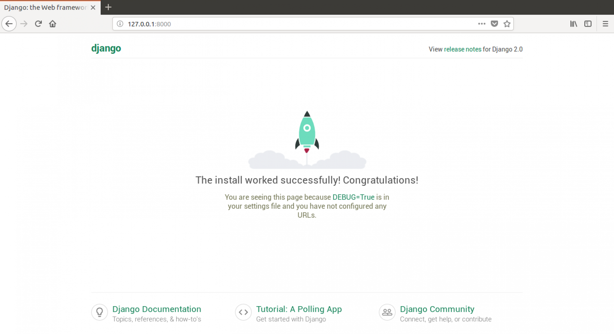

# Tvoj prvý Django projekt!

> Časť tejto kapitoly je založená na tutoriáli Geek Girls Carrots (https://github.com/ggcarrots/django-carrots).
> 
> Časti tejto kapitoly sú založené na [django-marcador tutorial](http://django-marcador.keimlink.de/) pod licenciou Creative Commons Attribution-ShareAlike 4.0 International License. Tutoriál django-marcador je autorsky chránený Markusom Zapke-Gründemannom et al.

Vytvoríme jednoduchý blog!

Prvý krok je vytvoriť nový Django projekt. To v podstate znamená, že spustíme pár skriptov, poskytovaných Djangom, ktoré pre nás vytvoria kostru Django projektu. Je to len pár priečinkov a súborov, ktoré použijeme neskôr.

Mená niektorých súborov a priečinkov sú pre Django veľmi dôležité. Súbory, ktoré teraz vytvoríme, by si nemala premenovať. Presúvať ich na iné miesto taktiež nie je dobrý nápad. Django potrebuje udržovať určitú štruktúru, aby bolo schopné nájsť dôležité veci.

> Nezabudni všetko spúšťať vo virtualenve. Pokiaľ vo svojej konzole nevidíš predponu `(myenv)`, musíš aktivovať virtualenv. Ako na to bolo vysvetlené v kapitole **Inštalácia Djanga** v časti **Práca s virtualenvom**. Pokiaľ napíšeš `myvenv\Scripts\activate` na Windowse alebo `source myvenv/bin/activate` na Mac OS X alebo Linuxe, malo by všetko fungovať.

<!--sec data-title="Create project: OS X or Linux" data-id="django_start_project_OSX_Linux" data-collapse=true ces-->

Vo svojej Mac OS X alebo Linux konzole spusti tento príkaz. **Nezabudni pridať bodku `.` na konci!**

command-line

    (myvenv) ~/djangogirls$ django-admin startproject mysite .
    

> Bodka `.` je dôležitá, pretože hovorí skriptu, aby nainštaloval Django v tvojom aktuálnom priečinku (pre ktorý je bodka `.` skratkou).
> 
> **Poznámka** Pri písaní predchádzajúceho príkazu nezabudni, že píšeš len časť, ktorá začína `django-admin`. Časť `(myvenv) ~/djangogirls$` je len príkladom promptu, kam budeš zadávať svoje príkazy.

<!--endsec-->

<!--sec data-title="Create project: Windows" data-id="django_start_project_windows" data-collapse=true ces-->

Vo Windowse spusti tento príkaz. **(Nezabudni pridať bodku `.` na konci)**:

command-line

    (myvenv) C:\Users\Name\djangogirls> django-admin.exe startproject mysite .
    

> Bodka `.` je dôležitá, pretože hovorí skriptu, aby nainštaloval Django v tvojom aktuálnom priečinku (pre ktorý je bodka `.` skratkou).
> 
> **Poznámka** Pri písaní predchádzajúceho príkazu nezabudni, že píšeš len časť, ktorá začína `django-admin.exe`. Časť `(myvenv) C:\Users\Name\djangogirls>` je len príkladom promptu, kam budeš zadávať svoje príkazy.

<!--endsec-->

`django-admin.py` je skript, ktorý pre teba vytvorí priečinky a súbory. Momentálne by si mala mať štruktúru priečinkov, ktorá vyzerá takto:

    djangogirls
    ├── manage.py
    ├── mysite
    │   ├── asgi.py
    │   ├── __init__.py
    │   ├── settings.py
    │   ├── urls.py
    │   └── wsgi.py
    ├── myvenv
    │   └── ...
    └── requirements.txt
    

> **Poznámka**: v štruktúre priečinkov uvidíš aj adresár `myvenv`, ktorý sme vytvorili dávnejšie.

`manage.py` je skript, ktorý pomáha so správou stránky. Okrem iného budeme vďaka nemu môcť spustiť na našom počítači webový server, bez toho, aby sme inštalovali čokoľvek iné.

Súbor `settings.py` obsahuje konfiguráciu tvojej webovej stránky.

Pamätáš, keď sme sa rozprávali o poštárke, ktoré zisťuje, kam doručiť list? `urls.py` obsahuje zoznam vzorov, ktoré používa `urlresolver`.

Zatiaľ ignorujme ostatné súbory, keďže ich teraz aj tak nebudeme meniť. Jediná vec, na ktorú netreba zabudnúť, je, že ich nesmieš omylom zmazať!

## Zmena nastavení

Spravme pár zmien v `mysite/settings.py`. Otvor súbor v editore kódu, ktorý si si nainštalovala predtým.

**Poznámka**: Pamätaj, že `settings.py` je obyčajný súbor, ako každý iný. Môžeš ho otvoriť z editoru pomocou možnosti "Súbor -> Otvoriť" v menu. Malo by sa ti zobraziť štandardné okno, v ktorom vyhľadáš svoj `settings.py` súbor a označíš ho. Prípadne môžeš ísť do priečinku djangogirls na pracovnej ploche a kliknúť na súbor pravým tlačidlom myši. Potom vyber editor kódu zo zoznamu. Výber editora je dôležitý, pretože môžeš mať nainštalované iné programy, ktoré dokážu tento súbor otvoriť, ale nedovolia ti ho upravovať.

Bolo by dobré mať na našej stránke správny čas. Choď na [zoznam časových pásiem na Wikipédii](https://en.wikipedia.org/wiki/List_of_tz_database_time_zones) a skopíruj svoje časové pásmo (TZ) (napr. `Europe/Bratislava`).

V súbore `settings.py` nájdi riadok, ktorý obsahuje `TIME_ZONE`, a uprav ho tak, aby obsahoval tvoje časové pásmo. Napríklad:

mysite/settings.py

```python
TIME_ZONE = 'Europe/Bratislava'
```

Jazykový kód sa skladá z jazyka, napr. `en` pre angličtinu alebo `sk` pre slovenčinu, a kódu krajiny, napr. `de` pre Nemecko alebo `ch` pre Švajčiarsko. Ak angličtina nie je tvoj materinský jazyk, môžeš pridať nasledovné, ak chceš zmeniť nápisy na tlačidlách a pripomienkach do svojho jazyka. Ak to spravíš, bude napríklad tlačidlo "Cancel" preložené do jazyka, ktorý tu definuješ. [Django má zabudovaných veľa prekladov](https://docs.djangoproject.com/en/3.2/ref/settings/#language-code).

Ak chceš iný jazyk, zmeň jazykový kód tým, že zmeníš nasledujúci riadok:

mysite/settings.py

```python
LANGUAGE_CODE = 'de-ch'
```

Budeme tiež musieť pridať cestu pre statické súbory. (O statických súboroch a CSS si povieme viac neskôr.) Choď na *koniec* súboru a rovno pod `STATIC_URL` pridaj `STATIC_ROOT`:

mysite/settings.py

```python
STATIC_URL = '/static/'
STATIC_ROOT = BASE_DIR / 'static'
```

Keď `DEBUG` je `True` a `ALLOWED_HOSTS` je prázdne, host sa validuje voči `['localhost', '127.0.0.1', '[::1]']`. Toto sa nebude zhodovať s naším hostname na PythonAnywhere, keď nasadíme našu aplikáciu, preto zmeníme nasledovné nastavenie:

mysite/settings.py

```python
ALLOWED_HOSTS = ['127.0.0.1', '.pythonanywhere.com']
```

> **Poznámka**: Ak používaš Chromebook, pridaj nasledovný riadok na koniec súboru settings.py: `MESSAGE_STORAGE = 'django.contrib.messages.storage.session.SessionStorage'`
> 
> Ak používaš Cloud 9, tiež pridaj `.amazonaws.com` do `ALLOWED_HOSTS`.
> 
> Ak hostuješ svoj projekt na `Glitch.com`, mali by sme ochrániť tajný kľúč, ktorý by mal zostať skrytý (inak by ho mohol vidieť každý, kto použije tvoj projekt):
> 
> - Najprv si musíme vytvoriť nový náhodný tajný kľúč. Otvor Glitch terminál a napíš nasledujúci príkaz:
>     
>     command-line
>     
>     ```bash
>     python -c 'from django.core.management.utils import get_random_secret_key; \
>           print(get_random_secret_key())'
>     ```
>     
>     Mal by sa ti zobraziť dlhý náhodný reťazec, ktorý je ako stvorený pre tvoju novú Django webstránku. Tento kľúč teraz skopírujeme do súboru `.env`, ktorý Glitch ukáže len autorovi či autorke danej webstránky.
> 
> - Vytvor súbor pod názvom `.env` v základnom adresári tvojho projektu a pridaj doň nasledovné:
>     
>     .env
>     
>     ```bash
>     # Tuto pomedzi apostrofy na zaciatku a na konci mozes skopirovat nahodny kluc, ktory si vygenerovala vyssie
>     SECRET='3!0k#7ds5mp^-x$lqs2%le6v97h#@xopab&oj5y7d=hxe511jl'
>     ```
> 
> - Následne uprav svoj Django settings súbor tým, že doň vložíš túto tajnú hodnotu, a nastav názov tvojej Django webstránky:
>     
>     mysite/settings.py
>     
>     ```python
>     import os
>     
>     SECRET_KEY = os.getenv('SECRET')
>     ```
> 
> - A ešte trochu nižšie v tom istom súbore doň vložíme meno tvojej novej Glitch stránky:
>     
>     mysite/settings.py
>     
>     ```python
>     ALLOWED_HOSTS = [os.getenv('PROJECT_DOMAIN') + ".glitch.me"]
>     ```
>     
>     Hodnota `PROJECT_DOMAIN` je automaticky vygenerovaná Glitchom. Bude taká istá, ako je meno tvojho projektu.

## Nastavenie databázy

Existuje veľa rôznych databázových softvérov, ktoré umožňujú ukladať údaje pre tvoje web stránky. My budeme používať predvolenú databázu `sqlite3`.

Tá je už nastavená v tejto časti súboru `mysite/settings.py`:

mysite/settings.py

```python
DATABASES = {
    'default': {
        'ENGINE': 'django.db.backends.sqlite3',
        'NAME': BASE_DIR / 'db.sqlite3',
    }
}
```

Databázu pre náš blog vytvoríme spustením tohto príkazu v konzole: `python manage.py migrate` (musíme byť v priečinku `djangogirls`, ktorý obsahuje súbor `manage.py`). Ak je všetko ok, mala by si vidieť niečo takéto:

command-line

    (myvenv) ~/djangogirls$ python manage.py migrate
    Operations to perform:
      Apply all migrations: admin, auth, contenttypes, sessions
    Running migrations:
      Applying contenttypes.0001_initial... OK
      Applying auth.0001_initial... OK
      Applying admin.0001_initial... OK
      Applying admin.0002_logentry_remove_auto_add... OK
      Applying admin.0003_logentry_add_action_flag_choices... OK
      Applying contenttypes.0002_remove_content_type_name... OK
      Applying auth.0002_alter_permission_name_max_length... OK
      Applying auth.0003_alter_user_email_max_length... OK
      Applying auth.0004_alter_user_username_opts... OK
      Applying auth.0005_alter_user_last_login_null... OK
      Applying auth.0006_require_contenttypes_0002... OK
      Applying auth.0007_alter_validators_add_error_messages... OK
      Applying auth.0008_alter_user_username_max_length... OK
      Applying auth.0009_alter_user_last_name_max_length... OK
      Applying auth.0010_alter_group_name_max_length... OK
      Applying auth.0011_update_proxy_permissions... OK
      Applying auth.0012_alter_user_first_name_max_length... OK
      Applying sessions.0001_initial... OK
    

A je to! Teraz treba spustiť webový server a zistiť, či je naša web stránka funkčná!

## Spustenie webového servera

Musíš sa nachádzať v priečinku, v ktorom sa nachádza súbor `manage.py` (adresár `djangogirls`). V konzole spustíme webový server zadaním `python manage.py runserver`:

command-line

    (myvenv) ~/djangogirls$ python manage.py runserver
    

Ak používaš Chromebook, použi nasledovný príkaz:

Cloud 9

    (myvenv) ~/djangogirls$ python manage.py runserver 0.0.0.0:8080
    

alebo tento, ak používaš Glitch:

Glitch.com terminal

    $ refresh
    
    

Ak si vo Windowse a padne ti to s chybovou hláškou `UnicodeDecodeError`, použi namiesto toho tento príkaz:

command-line

    (myvenv) ~/djangogirls$ python manage.py runserver 0:8000
    

Teraz už musíš len skontrolovať, či tvoja web stránka beží. Otvor si prehliadač (Firefox, Chrome, Safari, Internet Explorer alebo čokoľvek používaš) a zadaj adresu:

browser

    http://127.0.0.1:8000/
    

Ak používaš Chromebook alebo Cloud 9, namiesto toho klikni na URL vo vyskakovacom okne, ktoré by sa ti malo objaviť v pravom hornom rohu príkazového okna, kde ti beží web server. Táto URL bude vyzerať nejako takto:

browser

    https://<a bunch of letters and numbers>.vfs.cloud9.us-west-2.amazonaws.com
    

alebo na Glitchi:

    https://nazov-tvojho-glitch-projektu.glitch.me
    

Blahoželáme! Práve si vytvorila svoju prvú web stránku, ktorá beží na tvojom webovom serveri! Nie je to úžasné?



Treba spomenúť, že v príkazovom okne môže naraz bežať len jeden príkaz, a v príkazovom okne, ktoré si otvorila nedávno, teraz beží tvoj web server. Pokým web server beží a čaká na prichádzajúce požiadavky, terminál ti síce dovolí doň písať, ale nedovolí ti vykonávať príkazy.

> Ako webový server funguje, sme si povedali v kapitole **Ako funguje internet**.

Ak chceš spúšťať ďalšie príkazy počas toho, ako beží tvoj web server, treba otvoriť nové terminálové okno a aktivovať svoj virtualenv. Inštrukcie, ako otvoriť nové terminálové okno, nájdeš v [Úvode do príkazového riadku](../intro_to_command_line/README.md). Ak chceš webový server zastaviť, prepni sa späť do okna, v ktorom beží, a stlač Ctrl + C súčasne (na Windowse možno budeš musiť stlačiť Ctrl + Break).

Pripravená na ďalší krok? Prišiel čas vytvoriť nejaký obsah!