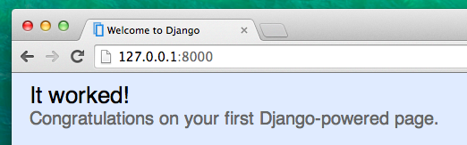
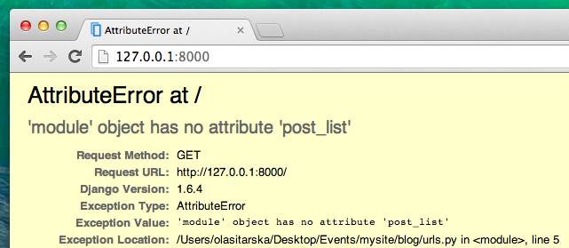

# Django URL

Chystáme sa vytvoriť našu prvú webovú stránku: domovská stránka tvojho blogu! Ale ešte predtým sa poďme naučiť niečo o Django URL.

## Čo je URL?

URL je jednoducho povedané webová adresa. URL si môžeš všimnúť zakaždým, keď navštíviš webovú stránku - vidno ju v prehliadači. (Áno! `127.0.0.1:8000` je URL! A `https://djangogirls.org` je tiež URL.)



Každá stránka na internete potrebuje svoju vlastnú URL. Týmto spôsobom aplikácia vie, čo by mala ukázať užívateľovi, ktorý otvorí URL. V Djangu používame takzvaný `URLconf` (URL konfigurácia). URLconf je súbor vzorov, ktoré sa Django pokúsi priradiť podľa prijatej URL, aby tak našiel správne zobrazenie.

## Ako fungujú URL v Djangu?

Otvorme súbor `mysite/urls.py` v editore kódu a pozrime sa, ako vyzerá:

mysite/urls.py

```python
"""mysite URL Configuration

[...]
"""
from django.conf.urls import url
from django.contrib import admin

urlpatterns = [
    url(r'^admin/', admin.site.urls),
]
```

Ako vidíš, Django sem už pre nás niečo umiestnil.

Riadky medzi trojitými uvodzovkami (`'''` or `"""`) sa nazývajú docstringy - môžeš ich pridať na začiatku suboru, triedy, alebo metódy aby si popísala čo robí. Python ich nespustí.

Adminovská URL, ktorú si navštívila v predchádzajúcej kapitole je už tu:

mysite/urls.py

```python
    url(r'^admin/', admin.site.urls),
```

Tento riadok znamená, že pre každú URL, ktorá začína na `admin` Django nájde zodpovedajúce *zobrazenie (view)*. V tomto prípade pridávame množstvo adminovských URL, takže to nie je všetko natlačené v jednom malom súbore -- je to čitateľnejšie a čistejšie.

## Regex

Zaujíma ťa, ako Django porovnáva URL so zobrazeniami? No, táto časť je trochu zložitejšia. Django používa `regex`, čo je skratka pre "regulárne výrazy". Regex má veľa (veľa!) pravidiel, ktoré tvoria vyhľadávací vzor. Keďže regexy sú pokročilá téma, nebudeme sa nimi veľmi detailne zaoberať.

Ak chceš porozumieť tvorbe vzorov, tu je príklad postupu - budeme potrebovať iba obmedzenú množinu pravidiel, ktorými zapíšeme vzor, ktorý hľadáme, konkrétne:

* `^` znamená začiatok textu
* `$` znamená koniec textu
* `\d` znamená číslica
* `+` znamená, že predchádzajúci prvok sa má opakovať aspon jeden krát
* `()` znamená, že chceme zachytiť časť vzoru

Všetko ostatné v definícii URL bude brané doslovne.

Teraz si predstav, že máš webovú stránky s adresou napríklad `http://www.mysite.com/post/12345/`, kde `12345` je číslo tvojho postu.

Písať samostatné zobrazenia pre všetky čísla postov by bolo naozaj otravné. Pomocou regulárnych výrazov však vieme vytvoriť vzor, ktorý bude zodpovedať URL a vytiahnuť z nej číslo, ktoré potrebujeme: `^post/(\d+)/$`. Rozoberme si to na drobné, aby sme videli, čo sa tu vlastne deje:

* **^post/** hovorí Djangu, aby zobral čokoľvek, čo má na začiatku URL `post` (hneď po `^`)
* **(\d+)** znamená, že tam bude číslo (jedna alebo viac číslic) a že chceme číslo zachytiť a vytiahnuť
* **/** povie Djangu, že bude nasledovať ďalší znak `/`
* **$** potom označuje koniec adresy URL, čo znamená, že vzoru budú zodpovedať iba reťazce s `/` na konci

## Tvoja prvá Django URL!

Je čas vytvoriť našu prvú URL! Chceme, aby 'http://127.0.0.1:8000/' bola domovská stránka nášho blogu a zobrazovala zoznam príspevkov.

Tiež chceme udržiavať súbor `mysite/urls.py` čistý, takže naimportujeme URL z našej aplikácie `blog` do hlavného súboru `mysite/urls.py`.

Tak do toho, pridaj riadok čo importuje `blog.urls`. Všimni si, že používame funkciu `include` takže ju budeš musieť taktiež importovať.

Súbor `mysite/urls.py` by mal teraz vyzerať takto:

mysite/urls.py

```python
from django.conf.urls import include
from django.conf.urls import url
from django.contrib import admin

urlpatterns = [
    url(r'^admin/', admin.site.urls),
    url(r'', include('blog.urls')),
]
```

Django teraz presmeruje všetko, čo prichádza na 'http://127.0.0.1:8000/' do `blog.urls` a tam bude hľadať ďalšie inštrukcie.

Pri písaní regulárnych výrazov je vždy dobré pridať pred reťazec `r`. To je užitočný tip pre Python, že reťazec môže obsahovať špeciálne znaky, ktoré nie sú urečené pre Python samotný, ale pre regulárny výraz.

## blog.urls

Vytvor nový prázdny súbor s názvom `urls.py` v priečinku `blog`. Dobre! Pridaj tieto dva riadky:

blog/urls.py

```python
from django.conf.urls import url
from . import views
```

Tu iba importujeme Django metódu `url` a všetky naše `views` z aplikácie `blog` (zatiaľ žiadne nemáme, ale k tomu sa o chvíľu dostaneme!)

Následne, môžeme pridať náš prvý URL vzor:

blog/urls.py

```python
urlpatterns = [
    url(r'^$', views.post_list, name='post_list'),
]
```

Ako vidíš, priradili sme `view` s názvom `post_list` tejto URL: `^$`. Tento regulárny výraz sa bude zhodovať iba ak po `^` (začiatku) bude nasledovať `$` (koniec) - takže zodpovedať bude iba prázdny reťazec. To je správne, pretože v Django URL prekladači 'http://127.0.0.1:8000/' nie je súčasťou URL. Tento vzor povie Djangu, že `views.post_list` je to správne miesto, kam treba ísť, ak niekto vstúpi na stránku cez adresu 'http://127.0.0.1:8000/'.

Posledná časť `name='post_list'` je názov URL, ktorý sa použije na identifikáciu zobrazenia. Názov môže byť rovnaký ako názov zobrazenia, ale pokojne to môže byť aj niečo úplne iné. Neskôr budeme v projekte používať pomenované URL, takže je dôležité pomenovať všetky URL v aplikácii. Názvy by mali byť unikátne a ľahké na zapamätanie.

Ak sa teraz pokúsiš navštiviť http://127.0.0.1:8000/ uvidíš správu, že stránka nie je dostupná ('web page not available'). Toto je z toho dôvodu že server (spomínaš si keď si spúšťala `runserver`?) už nebeží. Pozri sa na konzolu svojho serveru, aby si zistila prečo.



Konzola zobrazuje chybu, ale neboj sa - je to pomerne užitočné: hovorí ti, že neexistuje atribút post_list (**no attribute 'post_list'**). To je názov *view*, ktorý sa Django pokúša nájsť a použiť, ale sme ho ešte nevytvorili. V tejto fáze `/admin/` tiež nefunguje. Žiadne obavy, aj k tomu sa dostaneme.

> Ak chceš vedieť viac o Django URLconfs, pozri sa na oficiálnu dokumentáciu: https://docs.djangoproject.com/en/1.11/topics/http/urls/