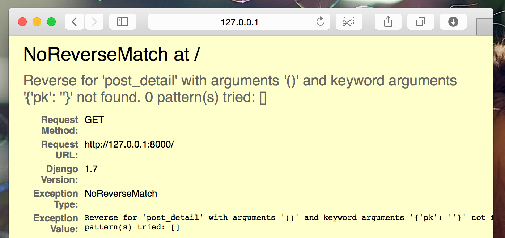



# Ako rozšíriť aplikáciu

Už sme dokončili všetky kroky potrebné k tomu, aby sme vytvorili našu webovú stránku: vieme, ako napísať model, URL, view a šablónu. Taktiež vieme, ako našu stránku skrášliť.

Čas na precvičovanie!

Prvá vec, ktorú na našom blogu potrebujeme, je podstránka, ktorá zobrazí iba jeden príspevok, že?

Už máme model `Post`, takže nepotrebujeme do `models.py` pridávať nič nové.

## Vytvorenie odkazu na detail príspevku

Začneme tak, že pridáme link do súboru `blog/templates/blog/post_list.html`. Otvor ho vo svojom editore. Zatiaľ by mal vyzerať takto nejako: blog/templates/blog/post_list.html

```html



    
        <article class="post">
            <time class="date">
                {{ post.published_date }}
            </time>
            <h2><a href="">{{ post.title }}</a></h2>
            <p>{{ post.text|linebreaksbr }}</p>
        </article>
    

```

Chceme, aby link z titulku príspevku smeroval na stránku s detailami príspevku. Zmeňme `<h2><a href="">{{ post.title }}</a></h2>` tak, aby odkazoval na stránku detailu príspevku:

{{ warning_icon }} blog/templates/blog/post_list.html

```html
<h2><a href="">{{ post.title }}</a></h2>
```

Nadišiel čas vysvetliť si tento záhadný zápis: ``. Ako možno tušíš, notácia `` znamená, že používame tagy Django šablóny. Tentoraz použijeme jeden, ktorý pre nás vytvorí URL!

Časť `post_detail` znamená, že Django bude očakávať URL v `blog/urls.py`, pre ktorú platí name=post_detail

A čo `pk=post.pk`? `pk` je skratka pre primárny kľúč (primary key), ktorý jednoznačne určuje každý konkrétny záznam v databáze. Každý Django model má pole, ktoré slúži ako jeho primárny kľúč. Bez ohľadu na to, ako sa toto pole volá, dá sa naň vždy odkazovať menom "pk". Keďže sme neurčili žiadny primárny kľúč v našom `Post` modeli, Django ho vytvorí za nás (štandardne sa volá "id" a je to číslo, ktoré sa zvyšuje o jedna pre každý záznam, t.j. 1, 2, 3) a pridá ho ako pole ku každému z našich príspevkov. K primárnemu kľúču môžeme pristupovať napísaním `post.pk` rovnako, ako pristupujeme k iným poliam (`title`, `author`, atď.) v našom `Post` objekte!

Teraz keď pôjdeme na http://127.0.0.1:8000/, uvidíme chybu (ako sa dalo očakávať, keďže ešte nemáme URL alebo *view* pre `post_detail`). Bude to vyzerať takto:



## Vytvorenie URL na detail príspevku

Vytvorme URL v `urls.py` pre náš *view* `post_detail`!

Chceme, aby sa detaily nášho prvého príspevku zobrazili na tejto **URL**: http://127.0.0.1:8000/post/1/

Vytvorme URL v súbore `blog/urls.py` tak, aby odkazovala Django na *view* nazvaný `post_detail`, ktorý zobrazí celý príspevok blogu. Otvor súbor `blog/urls.py` v editore a pridaj doň riadok `path('post/<int:pk>/', views.post_detail, name='post_detail'),` tak, aby súbor vyzeral takto:

{{ warning_icon }} blog/urls.py

```python
from django.urls import path
from . import views

urlpatterns = [
    path('', views.post_list, name='post_list'),
    path('post/<int:pk>/', views.post_detail, name='post_detail'),
]
```

Časť `post/<int:pk>/` definuje vzor URL – vysvetlime si ho:

- `post/` znamená, že na začiatku by URL mala obsahovať slovo **post** a **/**. Zatiaľ všetko v poriadku.
- `<int:pk>` – táto časť je trochu záludnejšia. Znamená, že Django očakáva číslo (integer alebo skrátene int) a posunie ho viewu ako premennú pod názvom `pk`.
- `/` – potom potrebujeme znova **/** predtým, ako URL skončí.

To znamená, že ak zadáš `http://127.0.0.1:8000/post/5/` do svojho prehliadača, Django pochopí, že hľadáš *view* s názvom `post_detail`, a posunie informáciu, že `pk` je `5`, tomuto *viewu*.

OK, pridali sme nový vzor URL do `blog/urls.py`! Poďme obnoviť stránku: http://127.0.0.1:8000 / Bum! Server znova prestal bežať. Pozri sa do konzoly - ako sa aj dalo očakávať, je tam ďalšia chyba!

{{ warning_icon }} command-line

        return _bootstrap._gcd_import(name[level:], package, level)
      File "<frozen importlib._bootstrap>", line 1030, in _gcd_import
      File "<frozen importlib._bootstrap>", line 1007, in _find_and_load
      File "<frozen importlib._bootstrap>", line 986, in _find_and_load_unlocked
      File "<frozen importlib._bootstrap>", line 680, in _load_unlocked
      File "<frozen importlib._bootstrap_external>", line 850, in exec_module
      File "<frozen importlib._bootstrap>", line 228, in _call_with_frames_removed
      File "/Users/ola/djangogirls/blog/urls.py", line 6, in <module>
        path('post/<int:pk>/', views.post_detail, name='post_detail'),
    AttributeError: module 'blog.views' has no attribute 'post_detail'
    

Pamätáš si, čo je ďalší krok? Musíme pridať náš nový view!

## Pridanie viewu pre detaily príspevku

Tentokrát má náš *view* extra parameter s názvom `pk`. Náš *view* ho potrebuje zachytiť, však? Takže definujeme našu funkciu ako `def post_detail(request, pk):`. Pozor na to, že tento parameter musí mať presne rovnaký názov, ako sme špecifikovali v `urls` (`pk`). Vynechanie tejto premmenej je nesprávne a bude mať za následok chybu!

Teraz chceme, aby sme dostali jeden jediný príspevok blogu. Na to môžeme použiť querysety, a to takto:

{{ warning_icon }} blog/views.py

```python
Post.objects.get(pk=pk)
```

Ale tento kód má problém. Pokiaľ neexistuje žiaden `Post` s daným `primárnym kľúčom`(`pk`), dostaneme veľmi škaredú chybu!


To nechceme! Našťastie Django má zabudované niečo, čo si s tým poradí: `get_object_or_404`. V prípade, že neexistuje žiaden `Post` s daným `pk`, zobrazí oveľa krajšiu stránku, `Page Not Found 404`.


Dobrá správa je, že si môžeš vytvoriť svoju vlastnú `Page not found` stránku a spraviť ju takú peknú, ako len chceš. Ale to nie je momentálne extra dôležité, takže to preskočíme.

Dobre, čas pridať *view* do nášho súboru `views.py`!

V `blog/urls.py` sme vytvorili URL pravidlo s názvom `post_detail`, ktoré odkazuje na view s názvom `views.post_detail`. To znamená, že Django očakáva view funkciu s názvom `post_detail` v súbore `blog/views.py`.

Mali by sme otvoriť `blog/views.py` v editore a pridať nasledovný kód k ostatným `from` riadkom:

blog/views.py

```python
from django.shortcuts import render, get_object_or_404
```

A na konci súboru pridáme náš *view*:

blog/views.py

```python
def post_detail(request, pk):
    post = get_object_or_404(Post, pk=pk)
    return render(request, 'blog/post_detail.html', {'post': post})
```

Áno. Nastal čas obnoviť stránku: http://127.0.0.1:8000/


Funguje to! Ale čo sa stane, keď klikneš na odkaz v názve príspevku blogu?


Ale nie! Ďalšia chyba! Ale už vieme, s čím máme dočinenia, že? Potrebujeme pridať šablónu!

## Vytvorenie šablóny pre detaily príspevku

Vytvoríme súbor v `blog/templates/blog` s názvom `post_detail.html` a otvoríme ho v editore.

Vlož doň nasledujúci kód:

blog/templates/blog/post_detail.html

```html



    <article class="post">
        
            <time class="date">
                {{ post.published_date }}
            </time>
        
        <h2>{{ post.title }}</h2>
        <p>{{ post.text|linebreaksbr }}</p>
    </article>

```

Opäť raz rozširujeme (extend) `base.html`. V bloku `content` chceme zobraziť published_date príspevku (pokiaľ existuje), titulok a text. Ale mali by sme prebrať pár dôležitých vecí, však?

` ... ` je tag šablóny, ktorý môžeme použiť, ak chceme niečo skontrolovať. (Pamätáš si `if ... else ...` z kapitoly **Úvod do jazyka Python**?) V tomto prípade chceme skontrolovať, či pole `published_date` nášho príspevku nie je prázdne.

Dobre, môžeme obnoviť našu stránku a pozrieť sa, či `TemplateDoesNotExist` zmizlo.


Jupí! Funguje to!

# Je čas nasadiť!

Bolo by dobré vedieť, či tvoja stránka stále funguje na PythonAnywhere, však? Pokúsme sa ju znova nasadiť.

command-line

    $ git status
    $ git add .
    $ git status
    $ git commit -m "Pridany view a sablona pre detaily prispevku a taktiez CSS pre stranku"
    $ git push
    

Potom v [Bash konzole PythonAnywhere](https://www.pythonanywhere.com/consoles/):

PythonAnywhere command-line

    $ cd ~/<your-pythonanywhere-domain>.pythonanywhere.com
    $ git pull
    [...]
    

(Nezabudni nahradiť `<your-pythonanywhere-domain>` svojou subdoménou na PythonAnywhere bez špicatých zátvoriek.)

## Aktualizovanie statických súborov na serveri

Servery ako PythonAnywhere sa ku "statickým súborom" (ako CSS súbory) správajú inak ako ku Python súborom, lebo ich môžu optimalizovať, aby ich bolo možné rýchlejšie načítať. Preto keď meníme naše CSS súbory, musíme spustiť ďalší príkaz na serveri, aby ich aktualizoval. Názov tohto príkazu je `collectstatic`.

Začni spustením virtualenvu, ak už nie je aktivovaný (PythonAnywhere používa príkaz `workon`, je to presne ako príkaz `source mojenv/bin/activate`, ktorý si použila na vlastnom počítači):

PythonAnywhere command-line

    $ workon <your-pythonanywhere-domain>.pythonanywhere.com
    (ola.pythonanywhere.com)$ python manage.py collectstatic
    [...]
    

Tento `manage.py collectstatic` príkaz sa trochu podobá na `manage.py migrate`. Urobíme zmeny v našom kóde a potom povieme Djangu, aby aplikovalo (*apply*) dané zmeny buď na statické súbory na serveri, alebo na databázu.

Každopádne, teraz môžeme prejsť na stránku ["Web"](https://www.pythonanywhere.com/web_app_setup/) (cez menu v pravom hornom rohu konzoly), stlačiť **Reload** a pozrieť sa na náš výsledok na adrese https://subdomena.pythonanywhere.com.

A to by malo byť všetko! Gratulujeme! :)