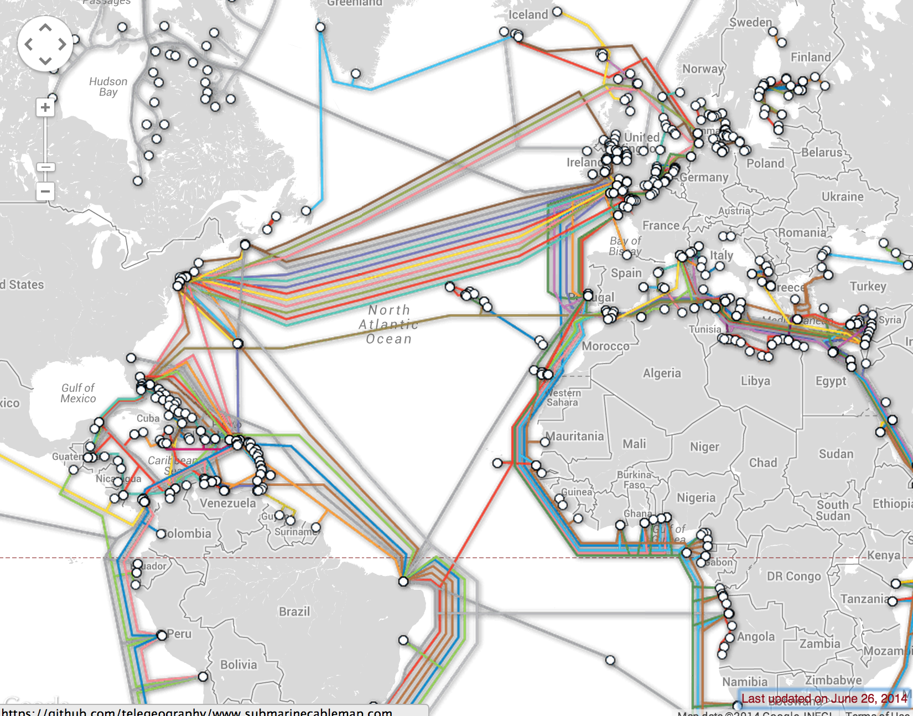
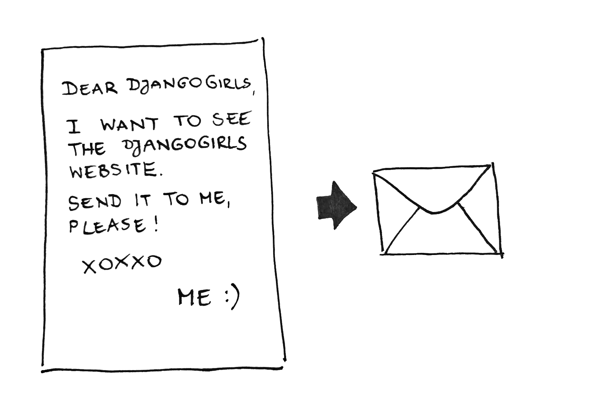

# Ako funguje internet

> Pre čitateľky a čitateľov doma: Táto kapitola je spracovaná vo videu [How the Internet Works](https://www.youtube.com/watch?v=oM9yAA09wdc).
> 
> Táto kapitola je inšpirovaná prednáškou "Ako funguje Internet" od Jessicy McKellar (http://web.mit.edu/jesstess/www/).

Stavíme sa, že internet používaš každý deň. Ale vieš, čo sa udeje, keď napíšeš adresu ako https://djangogirls.org do prehliadača a stlačíš `enter`?

Prvá vec, ktorú musíš vedieť, je, že webová stránka je len kôpka súborov uložených na pevnom disku, presne ako tvoje filmy, hudba či obrázky. Ale je tu jedna vec, ktorá je špecifická pre webové stránky: obsahujú počítačový kód nazývaný HTML.

Pokiaľ nemáš skúsenosti s programovaním, môže byť pochopenie HTML zo začiatku zložité, ale tvoj webový prehliadač (ako Chrome, Safari, Firefox atď.) HTML miluje. Webové prehliadače sú navrhnuté tak, aby rozumeli tomuto kódu, nasledovali jeho inštrukcie a ukazovali súbory, ktoré tvoria tvoju webovú stránku, presne tak, ako chceš.

Ako každý iný súbor, aj HTML súbor musí byť uložený niekde na pevnom disku. V prípade internetu používame špeciálne výkonné počítače nazývané *servery*. Nemajú obrazovku, myš alebo klávesnicu, pretože ich hlavnou úlohou je ukladať dáta a poskytovať ich. Preto ich voláme *servery* -- pretože *poskytujú* (serve) tvoje dáta.

OK, ale ty chceš vedieť, ako vyzerá internet, že?

Nakreslili sme ti obrázok! Vyzerá takto:

Vyzerá to ako neporiadok, že? V skutočnosti je to sieť prepojených strojov (hore spomenutých *serverov*). Stoviek a tisícok strojov! Mnoho, mnoho kilometrov káblov po celom svete! Môžeš navštíviť stránku Submarine Cable Map (http://submarinecablemap.com), ak chceš vidieť, aká komplikovaná sieť to je. Tu je obrázok zo stránky:

Nie je to fascinujúce? Ale zjavne nie je možné mať kábel medzi každým strojom pripojeným k internetu. Takže na to, aby sme boli schopní kontaktovať nejaký stroj (napríklad ten, na ktorom je uložená stránka https://djangogirls.org), musíme poslať žiadosť cez mnoho, mnoho rozdielnych strojov.

Vyzerá to takto:

Predstav si, že keď napíšeš https://djangogirls.org, pošleš list, v ktorom stojí: "Drahé Django Girls, chcem vidieť stránku djangogirls.org. Prosím, pošlite mi ju!"

Tvoj list ide na najbližšiu poštu. Potom ide na ďalšiu, ktorá je o čosi bližšie adresátovi či adresátke, potom na ďalšiu a ďalšiu, až kým nedorazí do svojej destinácie. Jediná unikátna vec je, že keď pošleš mnoho listov (*dátových paketov*) na rovnaké miesto, môžu ísť cez úplne odlišné pošty (*routery*). Záleží to od toho, ako sú rozdistribuované na každej pošte.

Takto to funguje - posielaš správy a očakávaš nejaké odpovede. Akurát namiesto papiera a pera používaš bajty dát, ale princíp je rovnaký!

Namiesto adries s názvom ulice, mesta, PSČ a krajinou používame IP adresy. Tvoj počítač najprv požiada DNS (Domain Name System), aby preložil djangogirls.org na IP adresu. Funguje to trocha ako staré dobré telefónne zoznamy, kde si môžeš vyhľadať meno osoby, ktorú chceš kontaktovať, a nájsť jej telefón a adresu.

Keď pošleš list, musí mať určité náležitosti, aby ho bolo možné správne doručiť: adresu, známku atď. Taktiež používaš jazyk, ktorému adresát rozumie, že? Rovnako to funguje aj s *dátovými paketmi*, ktoré posielaš, aby sa ti zobrazila stránka. Používame protokol s názvom HTTP (Hypertext Transfer Protocol).

Takže v podstate keď máš webovú stránku, musíš mať *server* (stroj), na ktorom bude žiť. Keď *server* obdrží prichádzajúcu *požiadavku* alebo request (v liste), pošle naspäť tvoju webovú stránku (v ďalšom liste).

Keďže toto je Django tutoriál, možno sa pýtaš, kde do tohto procesu vstupuje Django. Keď pošleš odpoveď, nechceš vždy poslať každému to isté. Je oveľa lepšie, ak sú tvoje listy osobné, presne pre človeka, ktorý ti práve napísal, že? Django ti pomáha vytváriť tieto osobné, zaujímavé listy. :)

Dosť bolo rečí, je čas tvoriť!