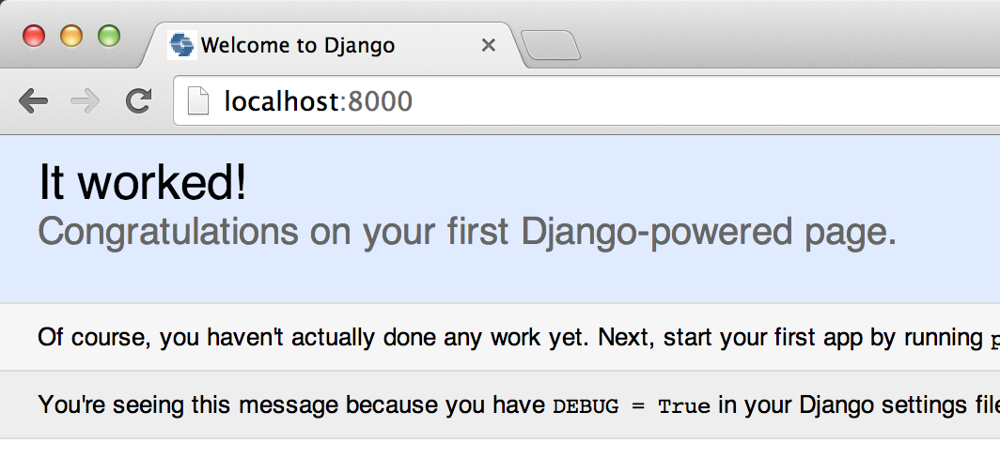

# Your first Django project!

*This chapter is based on awesome tutorials by Geek Girls Carrots (http://django.carrots.pl/) and django-marcador (http://django-marcador.keimlink.de/).*

Let's build a simple blog!

The first step to create it is starting a new Django project. Basically that means that we will run some script from Django that will create for us a skeleton of a Django project: bunch of directories and files that we will later use.

The names of some files and directories are very important for Django. You should not rename files that we are about to create. Moving them to different place is also not a good idea. Django needs a certain folder/files structure to be able to find important things.

In console/command-line you should type:

    (blog) ~$ django-admin.py startproject mysite

`django-admin.py` is a script that will create folders and files for you. It should look like this:

    mysite
    │   manage.py
    │
    └───mysite
            settings.py
            urls.py
            wsgi.py
            __init__.py

`manage.py` is a script that helps with administration of the page. Thanks to it we will be able to start a web server on our computer without installing anything else.

File `settings.py` contains a configuration of your website.

Remember when we talked about a postman checking where to deliver a letter? `urls.py` file contains a list of patterns used by `urlresolver`.

Let's ignore the other files for now - we will not change them, so we will skip explaining what they actually do. The only thing to remember is to not delete them by accident!

## Changing settings

Let's do some changes in `settings.py`.

It would be nice to have a correct time on our website. You should find lines that contain `USE_TZ` and `TIME_ZONE` and change them to look like this:

    USE_TZ = False
    TIME_ZONE = 'Europe/Berlin'

## Creating a database

Most of web application have their own database. A database is a collection of data. This is a place in which you will store all information about users, all your blog post texts, etc..

There is a number of different database systems that store data for you. We will use one of the simpliest: `sqlite3`, which was installed with Django. But if you plan to do some serious websites in the future we recommend looking at `PostgreSQL`.

To create a database for our blog we will type in console/command-line `python manage.py syncdb`. It should look like this:

    (blog) ~/mysite python manage.py syncdb
    Creating tables ...
    Creating table django_admin_log
    Creating table auth_permission
    Creating table auth_group_permissions
    Creating table auth_group
    Creating table auth_user_groups
    Creating table auth_user_user_permissions
    Creating table auth_user
    Creating table django_content_type
    Creating table django_session

    You just installed Django's auth system, which means you don't have any superusers defined.
    Would you like to create one now? (yes/no): yes
    Username (leave blank to use 'Name'):
    Email address: admin@example.com
    Password:
    Password (again):
    Superuser created successfully.
    Installing custom SQL ...
    Installing indexes ...
    Installed 0 object(s) from 0 fixture(s)

It will ask you if you want to create a superuser. Type `yes`, press Enter and type your username (lowercase, no spaces), email address and password when you will be asked to type it. Remember this username and password! We will use it later.

And you are done. Time to start web server and see if our website is working!

You need to be in a folder that contains `manage.py` file (in `mysite` directory). In console/command-line we will start the web server by typing `python manage.py runserver`:

    (blog) ~/mysite python manage.py runserver

Now all you need to do is to check if your website is running :). Open your browser (Firefox, Chrome, Safari, Internet Explorer or whatever you use) and type the address:

    http://localhost:8000/

Congratulations! You've just created your first website and run it using a web server! Isn't it awesome?

Ready for the next steps? It's time to create some content!

