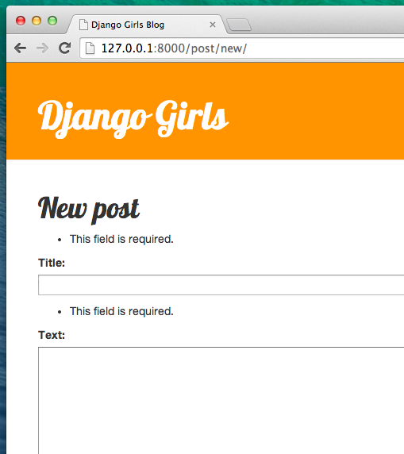
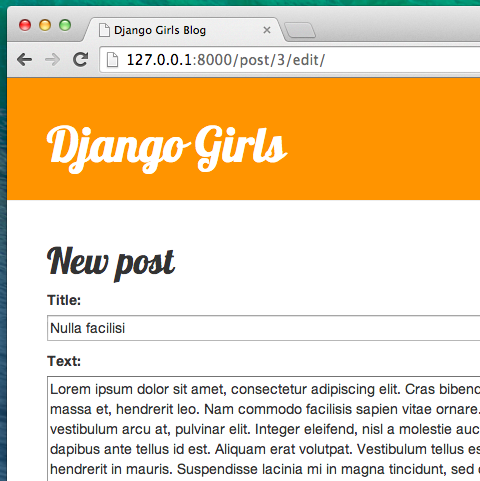

# Django Forms

Blogumuzda yapmak istediğimiz son şey blog yazılarını eklemek ve düzenlemek için güzel bir yapı oluşturmak. Django'nun `admin` arayüzü çok havalı, ama özelleştirilmesi ve güzel hale getirilmesi oldukça zor. `forms` ile mutlak güce sahip olacağız – biz hayal edebileceğiniz hemen hemen her şeyi yapabilirsiniz!

Django formlarının güzel yanı, hem sıfırdan bir form tanımlayabilmemiz hem de sonuçları modele kaydedecek bir `ModelForm` oluşturabilmemizdir.

Tam olarak yapmak istediğimiz şey: `Post` modelimiz için bir form oluşturmak.

Django'nun diğer önemli parçaları gibi, formların da kendi dosyası var: `forms.py`.

`blog` dizinimizde bu isimde bir dosya oluşturmalıyız.

    blog
       └── forms.py
    

Tamam, şimdi dosyayı açalım ve altta ki kodu yazalım:

blog/forms.py

```python
from django import forms

from .models import Post

class PostForm(forms.ModelForm):

    class Meta:
        model = Post
        fields = ('title', 'text',)
```

Önce Django formları (`from django import forms`) ve tabii ki `Post` modelimizi içe aktarmalıyız (`from .models import Post`).

`PostForm`, tahmin etmiş olabileceğiniz gibi, formumuzun ismi. Django'ya bu formun `ModelForm` olduğunu söylemeliyiz ( dolayısı ile Django bizim için biraz büyü yapacak) - `forms.ModelForm` bunun için sorumludur.

Sırada Django'ya bu formu (`model = Post`) oluşturmak için hangi modelin kullanılması gerektiğini anlattığımız `class Meta` var).

Son olarak, formumuzda hangi alan(lar)ın bulunması gerektiğini söyleyebiliriz. Bu senaryoda sadece `başlık` ve `metin` ortaya çıkmasını istiyoruz – `yazar` şu anda giriş yapmış kişi olmalıdır (siz!) ve `oluşturulma_tarihi` bir gönderi oluşturduğumuzda otomatik olarak ayarlanmalıdır (örneğin kod), değil mi?

Ve hepsi bu kadar! Şimdi tek yapmamız gereken formu bir *view* içinde kullanıp, template (şablon) içinde göstermek.

Bir kere daha sayfaya bir bağlantı, bir url, bir görünüm ve şablon oluşturacağız.

## Formun bulunduğu sayfaya bağlantı oluşturma

Şimdi `blog/templates/blog/base.html` şablonunu açma zamanı. Öncelikle `page-header` adlı `div` öğesinin içine bir bağlantı ekleyeceğiz:

blog/templates/blog/base.html

```html
<a href="" class="top-menu"><span class="glyphicon glyphicon-plus"></span></a>
```

Yeni view'umuzun (görünümüzümün) adını `post_new` koymak istiyoruz. `"glyphicon glyphicon-plus"` class'ı kullandığımız bootstrap teması tarafından sağlanıyor ve bizim için bir artı işareti gösterecek.

Satırı ekledikten sonra, HTML dosyanız bu şekilde görünmelidir:

blog/templates/blog/base.html

```html

<html>
    <head>
        <title>Django Girls blog</title>
        <link rel="stylesheet" href="//maxcdn.bootstrapcdn.com/bootstrap/3.2.0/css/bootstrap.min.css">
        <link rel="stylesheet" href="//maxcdn.bootstrapcdn.com/bootstrap/3.2.0/css/bootstrap-theme.min.css">
        <link href='//fonts.googleapis.com/css?family=Lobster&subset=latin,latin-ext' rel='stylesheet' type='text/css'>
        <link rel="stylesheet" href="">
    </head>
    <body>
        <div class="page-header">
            <a href="" class="top-menu"><span class="glyphicon glyphicon-plus"></span></a>
            <h1><a href="/">Django Girls Blog</a></h1>
        </div>
        <div class="content container">
            <div class="row">
                <div class="col-md-8">
                    
                    
                </div>
            </div>
        </div>
    </body>
</html>
```

Dokümanı kaydedip http://127.0.0.1:8000 sayfasını yeniledikten sonra, siz de tanıdık `NoReverseMatch` hatasını görüyor olmalısınız, değil mi?

## URL

`blog/urls.py` dosyasını açalım ve yeni bir satır ekleyelim:

blog/urls.py

```python
url(r'^post/new/$', views.post_new, name='post_new'),
```

Ve kodun son hali şu şekilde görünecektir:

blog/urls.py

```python
from django.conf.urls import url
from . import views

urlpatterns = [
    url(r'^$', views.post_list, name='post_list'),
    url(r'^post/(?P<pk>\d+)/$', views.post_detail, name='post_detail'),
    url(r'^post/new/$', views.post_new, name='post_new'),
]
```

Siteyi yeniledikten sonra, bir `AttributeError` görürüz, çünkü uygulanan `post_new` görünümüne sahip değiliz. Hemen şimdi ekleyelim.

## post_new view

Şimdi `blog/views.py` dosyasını açıp aşağıdaki satırları diğer `from` satırlarının olduğu yere ekleyelim:

blog/views.py

```python
from .forms import PostForm
```

Ve sonra bizim *view*'imiz:

blog/views.py

```python
def post_new(request):
    form = PostForm()
    return render(request, 'blog/post_edit.html', {'form': form})
```

Yeni bir `Post` formu oluşturmak için `PostForm()` fonksiyonunu çağırmak ve template'e iletmek gerekir. *view* kısmına geri döneceğiz, ancak şimdilik form için bir şablon oluşturalım.

## Template

Öncelikle `blog/templates/blog` dizininde `post_edit.html` isimli bir dosya oluşturmalıyız. Bir formu çalışır hale getirmek için birkaç şeye ihtiyacımız var:

* Formu göstermek zorundayız. Örneğin bunu şu şekilde yapabiliriz `{{ form.as_p }}`.
* Yukarıdaki örnek satır HTML form etiketi içine alınmalı: `<form method="POST">...</form>`.
* Bir `Kaydet` butonuna ihtiyacımız var. Bunu Bir HTML butonu ile yapıyoruz: `<button type="submit">Kaydet</button>`.
* Ve son olarak, açılıştan hemen sonra `<form ...>` etiketini eklememiz gerekiyor ``. Formlarımızın güvenliğini sağladığı için bu çok önemlidir! Eğer bu kısmı unutursan, formu kaydetmeye çalıştığınızda Django şikayet edecektir:


Tamam,hadi `post_edit.html` deki HTML'ye nasıl bakılacağını görelim:

blog/templates/blog/post_edit.html

```html



    <h1>New post</h1>
    <form method="POST" class="post-form">
        {{ form.as_p }}
        <button type="submit" class="save btn btn-default">Save</button>
    </form>

```

Yenileme zamanı! Hey! Formun görüntülendi!


Ama, bekle bir dakika! `başlık` ve `başlık` alanlarına bir şey yazdığında ve kaydetmeye çalıştığında, ne olacak?

Hiçbirşey! Bir kere daha aynı sayfadayız, metnimiz gitmiş ve yeni gönderi eklenmemiş. Peki ne yanlış gitti?

Yanıt: hiçbir şey. Sadece *view*'ımızda biraz daha iş yapmamız gerekiyor.

## Formu kaydetme

Bir kez daha `blog/views.py` yi açın.Halihazırda `post_new` görüntüsündeki elimizdeki bütün şey şunlardır:

blog/views.py

```python
def post_new(request):
    form = PostForm()
    return render(request, 'blog/post_edit.html', {'form': form})
```

Formu teslim ettiğinizde, aynı görüşe yönlendirileceğiz, bu sefer `request` içinde daha fazla bilgi olacak, özellikle `request.POST` içinde ( isimlendirmenin blog gönderisiyle bir bağlantısı yoktur; daha fazla veri göndermemizle ilgilidir). HTML dosyasının `<form>` açıklamasının `method="POST"` değişken varlığını hatırlıyormusunuz? Formdan gelen tüm alanlar şimdi `request.POST`'un içerisinde. `POST`'un ismini değiştirmememiz lazım (`method` için geçerli diğer değer sadece `GET`'dir, ama şimdi ikisi arasındaki farkın ne olduğunu anlatacak kadar vaktimiz yok).

*view* içinde halletmemiz gereken iki ayrı durum vardır: öncelikle, sayfaya ilk kez eriştiğimizde ve boş bir form isteğimizde, ikincide *view* girdiğimiz form verisiyle geri gideriz. Yani bir koşul eklememiz gerekiyor (bunun için `if` kullanacağız):

blog/views.py

```python
if request.method == "POST":
    [...]
else:
    form = PostForm()
```

Noktaları doldurma zamanı `[...]`. Eğer `method` `POST` ise `PostForm` formdaki veriyle oluşturmalıyız, değil mi? Bunu şu şekilde yapacağız:

blog/views.py

```python
form = PostForm(request.POST)
```

Bir sonraki işimiz formun doğru olup olmadığını kontrol etmek (tüm gerekli alanlar ayarlanmış ve yanlış değer verilmediyse). Bunu şu şekilde yaparız `form.is_valid()`.

Formun doğruluğunu kontrol ediyoruz ve doğru ise kaydedebiliriz!

blog/views.py

```python
if form.is_valid():
    post = form.save(commit=False)
    post.author = request.user
    post.published_date = timezone.now()
    post.save()
```

Temel olarak, burada iki şey yaptık: formu `form.save` ile kaydettik ve bir yazar ekledik (`PostForm`'da bir `yazar` tanımlı olmadığı ve bu zorunlu bir alan olduğu için). `commit=False`; e `Post` modelini kaydetmek istemiyoruz demektir - öncelikle yazarı eklemeliyiz. Çoğu zaman `form.save()` kullanırken, `commit=False` kullanılmayacaktır, bu durumda desteklemeliyiz. `post.save()` değişiklikleri saklar (yazar ekleme) ve yeni blog yazısı oluşturulur!

Son olarak hızlı bir şekilde yeni oluşturulmuş blog gönderimiz için `post_detail` gidebilirsek harika olurdu değil mi? Bunu yapmak için bir tane daha içe yapmamız gerekli:

blog/views.py

```python
from django.shortcuts import redirect
```

Dosyanızın başlangıcına ekleyin. Şimdi "yeni oluşturulmuş gönderi için `post_detail` gidin" diyebiliriz:

blog/views.py

```python
return redirect('post_detail', pk=post.pk)
```

`post_detail`, gitmek istediğimiz view'un (görünümün) adı. Unutmayalım ki bu *view* için bir `pk` değişkeni lazım. Bu görüntülere geçmek için `pk=post.pk` kullanırız,burada `post` yeni oluşturulan blog yazısıdır!

Tamam, çok fazla konuştuk, ama muhtemelen bütün *görüntü* neye benziyor görmek istiyoruz değil mi?

blog/views.py

```python
def post_new(request):
    if request.method == "POST":
        form = PostForm(request.POST)
        if form.is_valid():
            post = form.save(commit=False)
            post.author = request.user
            post.published_date = timezone.now()
            post.save()
            return redirect('post_detail', pk=post.pk)
    else:
        form = PostForm()
    return render(request, 'blog/post_edit.html', {'form': form})
```

Bakalım çalışacak mı? http://127.0.0.1:8000/post/new/ sayfasına gidin, bir `başlık` ve`metin` ekleyin, kaydedin... ve işte oldu! Yeni blog gönderisi eklenmiştir ve `post_detail` sayfasına yönlendirildik!

Gönderiyi kaydetmeden önce yayınlama tarihini ayarladığımızın farkına varabilirsiniz. Daha sonra *yayınlama butonu* **Django Girls Tutorial: Uzantılar** içinde tanıtacağız.

Süper!

> Son zamanlarda Django yönetici ara yüzünü kullandığımız için sistem halihazırda hala giriş yaptığımızı düşünüyor. Oturumu kapatmamıza yol açabilen birkaç durum vardır(tarayıcıyı kapama, DB'yi yeniden başlatma ve benzeri). Eğer,bir post oluştururken,oturum açan bir kullanıcının yoksunluğuna istinaden hatalar aldığınıza rastlıyorsanız yönetici sayfasına http://127.0.0.1:8000/admin yönelin ve tekrardan giriş yapın. Bu durumu geçici de olsa da halleder. Kalıcı çözüm, ana tutorialdan sonra **Ödev: Web sitene güvenlik ekleme!** bölümünde anlatılacak.


## Form doğrulama

Şimdi de Django formlarının ne kadar havalı olduğunu görelim. Bir blog postunun `baslik` ve `yazi` alanları olmalı. `Post` modelimizde bu alanların( `published_date` e karşı olarak) gerekli olmadığını söylemedik, bu yüzden Django varsayılan olarak hazır olmasını bekler.

Formu `başlık` ve `metin` olmadan kaydetmeyi deneyin. Tahmin edin ne olacak!



Django formumuzdaki tüm alanların doğru olduğunu onaylamaya dikkat ediyor. Müthiş değil mi?

## Form düzenleme

Artık yeni bir form oluşturmayı biliyoruz. Peki, mevcut bir formu güncellemek için ne yapmalı? Bu az önce yaptığımız şeyle çok benzer. Hızlıca bazı önemli şeyleri oluşturalım. (Eğer birşeyi anlamazsan, çalıştırıcına sormalısın veya önceki bölümlere bakmalısın, çünkü bütün bu adımları daha önce bitirdik.)

`blog/templates/blog/post_detail.html` açın ve satırı ekleyin

blog/templates/blog/post_detail.html

```html
<a class="btn btn-default" href=""><span class="glyphicon glyphicon-pencil"></span></a>
```

böylece şablon bunun gibi görünecektir:

blog/templates/blog/post_detail.html

```html



    <div class="post">
        
            <div class="date">
                {{ post.published_date }}
            </div>
        
        <a class="btn btn-default" href=""><span class="glyphicon glyphicon-pencil"></span></a>
        <h1>{{ post.title }}</h1>
        <p>{{ post.text|linebreaksbr }}</p>
    </div>

```

`blog/urls.py` dosyasına şu satırı ekleyelim:

blog/urls.py

```python
    url(r'^post/(?P<pk>\d+)/edit/$', views.post_edit, name='post_edit'),
```

Daha önce kullandığımız `blog/templates/blog/post_edit.html` template'i tekrar kullanacağız, tek eksik bir *view*.

`blog/views.py` açın ve dosyanın en sonuna bunu ekleyin:

blog/views.py

```python
def post_edit(request, pk):
    post = get_object_or_404(Post, pk=pk)
    if request.method == "POST":
        form = PostForm(request.POST, instance=post)
        if form.is_valid():
            post = form.save(commit=False)
            post.author = request.user
            post.published_date = timezone.now()
            post.save()
            return redirect('post_detail', pk=post.pk)
    else:
        form = PostForm(instance=post)
    return render(request, 'blog/post_edit.html', {'form': form})
```

Bu nerdeyse bizim `post_new` view'e benziyor, değil mi? Ama, tam da değil. Özellikle url'lerden ekstra bir `pk` parametresi geçiriyoruz. Sonra,`get_object_or_404(Post, pk=pk)` düzenlemek istediğimiz `Post` modelini alıyoruz ve daha sonra bir form oluşturduğumzda bu yazıyı `instance` olarak geçiriyoruz, formu kaydettiğimizde de…

blog/views.py

```python
form = PostForm(request.POST, instance=post)
```

…ve düzenlemek için bu post ile ilgili bir form açtığımızda:

blog/views.py

```python
form = PostForm(instance=post)
```

Tamam, çalışıp çalışmadığını test edelim! `post_detail` sayfasına gidelim. Sağ üst köşede bir düzenleme butonu olmalıdır:


Butona tıklarsak blog postunu görmemiz lazım:



Başlık ya da metni değiştirmekten ve değişiklikleri kaydetmekten çekinmeyin!

Tebrikler! Uygulaman gittikçe tamamlanıyor!

Eğer Django formlarıyla ilgili daha çok bilgiye ihtiyacın varsa,belgelendirmeyi okumalısın: https://docs.djangoproject.com/en/1.11/topics/forms/

## Güvenlik

Bir bağlantıya (link) tıklayarak yeni bir blog oluşturabilmek harika! Ama şu anda sizin sitenizi ziyaret eden herkes yeni bir blog post yapabilecek ve bu muhtemelen isteyeceğiniz bir şey değil. Butonun sadece sana görünmesini sağlayalım.

`blog/templates/blog/base.html` dosyasında yarattığımız `page-header` `div` ve anchor etiketlerini (tags) bulalım. Şuna benziyor olmalı:

blog/templates/blog/base.html

```html
<a href="" class="top-menu"><span class="glyphicon glyphicon-plus"></span></a>
```

Linkin sadece admin olarak giriş yapmış kullanıcılara gözükmesi için başka bir `` etiketi ekleyeceğiz. Şu anda bu kişi sensin! `<a>` etiketini şöyle değiştirelim:

blog/templates/blog/base.html

```html

    <a href="" class="top-menu"><span class="glyphicon glyphicon-plus"></span></a>

```

Bu `` bağlantının sadece eğer sayfayı talep eden kullanıcı oturum açtıysa tarayıcıya gönderilmesine sebep olacak. Bu yeni post yaratılmasını kesin olarak engellemese de iyi bir başlangıç. Güvenlik konusu ek derslerde daha çok ele alınacak.

Az evvel detay sayfamıza eklediğimiz düzenle ikonunu hatırladınız mı? Aynı değişikliği oraya da eklemek istiyoruz. Böylelikle başka insanlar var olan gönderileri düzenleyemeyecekler.

`blog/templates/blog/post_detail.html` açın ve bu satırı bulun:

blog/templates/blog/post_detail.html

```html
<a class="btn btn-default" href=""><span class="glyphicon glyphicon-pencil"></span></a>
```

Buna çevirin:

blog/templates/blog/post_detail.html

```html

     <a class="btn btn-default" href=""><span class="glyphicon glyphicon-pencil"></span></a>

```

Yüksek olasılıkla login yapmış olduğunuz için sayfayı yenilediğinizde farklı bir şey göremeyeceksiniz. Sayfayı farklı bir tarayıcı veya görünmez pencere ile yükleyin(Windows Edge üzerinde "InPrivate" olarak adlandırılan), yinede göreceksiniz ki bağlantı ve ikon gözükmeyecektir!

## Bir şey daha: deployment (yayına alma) zamanı!

Bakalım PythonAnywhere'de calışacak mı? Tekrar yayına alalım!

* İlk önce kodumuzu commit edelim, sonra Github'a push edelim:

komut-satırı

    $ git status
    $ git add --all .
    $ git status
    $ git commit -m "Sitede gönderi oluşturmak ve düzenlemek için view'ler eklendi."
    $ git push
    

* Sonra bir [PythonAnywhere Bash konsol](https://www.pythonanywhere.com/consoles/) una gidip:

komut-satırı

    $ cd ilk-blogum
    $ git pull
    [...]
    

* Nihayet, [Web tab](https://www.pythonanywhere.com/web_app_setup/) ına gidip **Reload** edelim.

O kadar! Tebrikler :)