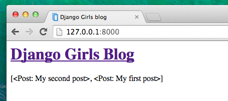
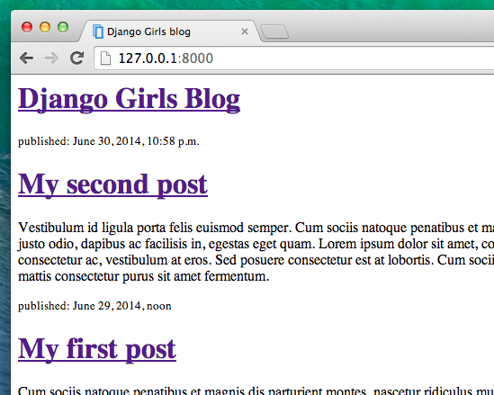

# Django template

Bazı verileri gösterme zamanı! Django bunun için bize faydalı bazı yerleşik **template etiketleri** sunuyor.

## Template etiketleri nedir?

You see, in HTML, you can't really write Python code, because browsers don't understand it. They know only HTML. We know that HTML is rather static, while Python is much more dynamic.

**Django template tags** allow us to transfer Python-like things into HTML, so you can build dynamic websites faster and easier. Cool!

## Gönderi listesi template'ini göster

Bir önceki bölümde, template'e `posts` değişkeni içinde gönderiler listesi verdik. Şimdi, bunu HTML'de göstereceğiz.

Django şablonunda bir değişken yazdırmak için, değişken adını çift kıvrımlı parantez içinde şu şekilde kullanırız:

blog/templates/blog/post_list.html

```html
{{ posts }}
```

Bunu `blog/templates/blog/post_list.html` şablonunda deneyelim. İkinci `<div>`'den üçüncü `</div>`'e kadar olan her şeyi `{{ posts }}` ile değiştirelim. Ne olduğunu görmek için dosyayı kaydedip sayfayı yenileyelim:



Gördüğümüz sadece bu:

blog/templates/blog/post_list.html

```html
<QuerySet [<Post: My second post>, <Post: My first post>]>
```

Yani Django bunu bir nesneler listesi olarak algılıyor. **Python'a giriş**'ten listelerin nasıl gösterildiğini hatırlıyor musun? Evet, döngülerle! Bir Django template ile bunu şöyle yaparsın:

blog/templates/blog/post_list.html

```html

    {{ post }}

```

Bunu kendi template'imizle deneyelim.


İşe yarıyor! But we want the posts to be displayed like the static posts we created earlier in the **Introduction to HTML** chapter. HTML ve template etiketlerini karıştırabiliriz. `body` şöyle görünecektir:

blog/templates/blog/post_list.html

```html
<div>
    <h1><a href="/">Django Girls Blog</a></h1>
</div>


    <div>
        <p>published: {{ post.published_date }}</p>
        <h1><a href="">{{ post.title }}</a></h1>
        <p>{{ post.text|linebreaksbr }}</p>
    </div>

```

`` ve `` arasına koyduğunuz her şey listedeki her nesne için tekrarlanır. Sayfanı yenile:



Have you noticed that we used a slightly different notation this time (`{{ post.title }}` or `{{ post.text }})`? Böylece `Post` modelinde tanımlanan alanlardaki verilere ulaşıyoruz. Also, the `|linebreaksbr` is piping the posts' text through a filter to convert line-breaks into paragraphs.

## Bir şey daha

It'd be good to see if your website will still be working on the public Internet, right? Let's try deploying to PythonAnywhere again. Here's a recap of the steps…

* İlk önce kodumuzu Github'a push komutu ile yükleyelim

command-line

    $ git status
    [...]
    $ git add --all .
    $ git status
    [...]
    $ git commit -m "Modified templates to display posts from database."
    [...]
    $ git push
    

* [PythonAnywhere](https://www.pythonanywhere.com/consoles/)'e bağlanalım ve **Bash konsolu**'na gidelim (veya yeni bir konsol açalım) ve şunu çalıştıralım:

PythonAnywhere command-line

    $ cd ilk-blogum
    $ git pull
    [...]
    

* Ve son olarak da [Web tab](https://www.pythonanywhere.com/web_app_setup/) sekmesine gidip web uygulamamızdaki **Reload**'a basalım. Şimdi güncellememiz yayında olmalı! If the blog posts on your PythonAnywhere site don't match the posts appearing on the blog hosted on your local server, that's OK. The databases on your local computer and Python Anywhere don't sync with the rest of your files.

Congrats! Now go ahead and try adding a new post in your Django admin (remember to add published_date!) Make sure you are in the Django admin for your pythonanywhere site, https://yourname.pythonanywhere.com/admin. Then refresh your page to see if the post appears there.

Works like a charm? We're proud! Step away from your computer for a bit – you have earned a break. :)

