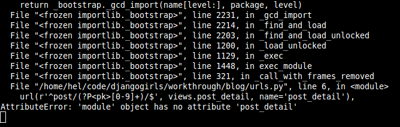
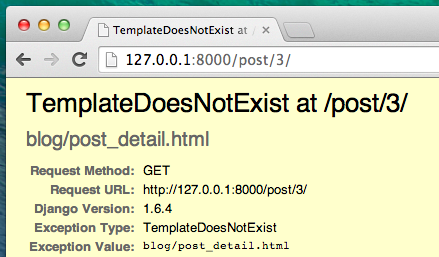

# Uygulamanı genişlet

Websitemizi oluşturmak için gerekli adımların hepsini tamamladık: bir modelin, url'nin, view'ün ve template'in nasıl yazılacağını biliyoruz. Websitemizi nasıl güzelleştirebiliriz onu da biliyoruz.

Pratik zamanı!

Blog'umuzda lazım olan ilk şey bir gönderiyi göstermek için bir sayfa, değil mi?

Halihazırda bir `Post` modelimiz var, dolayısıyla `models.py` dosyasına bir şey eklememize gerek yok.

## Bir gönderinin detayı için bir şablon linki oluşturun

`blog/templates/blog/post_list.html` dosyasının içine bir bağlantı ekleyerek başlayacağız.Şimdiye kadar bunun gibi görünmesi gerek: blog/templates/blog/post_list.html

```html



    
        <div class="post">
            <div class="date">
                {{ post.published_date }}
            </div>
            <h1><a href="">{{ post.title }}</a></h1>
            <p>{{ post.text|linebreaksbr }}</p>
        </div>
    

```

Gönderi listesindeki bir gönderinin başlığından bir gönderinin detay sayfasına bir link (bağlantı) olsun istiyoruz. `<h1><a href="">{{ post.baslik }}</a></h1>`'i gönderinin detay sayfasına link verecek şekilde değiştirelim:

blog/templates/blog/post_list.html

```html
<h1><a href="">{{ post.title }}</a></h1>
```

Gizemli `` satırını anlatma zamanı. Şüphelendiğiniz üzere, `` notasyonu, Django template tags (şablon etiketleri) kullandığımız manasına geliyor. Bu sefer bizim için URL oluşturacak bir template etiketi kullanacağız!

`post_detail` kısmı Django, `blog/urls.py` URL'si içinde name=post_detail 'ı bekliyor olacak demektir.

Ve `pk=post.pk`'a ne dersin? `pk` veritabanındaki her benzersiz isim için varolan birincil anahtarın kısaltmasıdır. Çünkü `Post` modelimizde birincil anahtar belirtmediysek Django bizim için bir tane yaratır (varsayılan olarak her kayıt için birer arttırır, mesela 1,2,3) ve her gönderimize `pk` adında bir alan ekler. Ana anahtara `post.pk` yazarak erişiriz, diğer alanlar içinde aynısı geçerlidir (`title`, `author`, vb.) `Post` objesi!

Şimdi http://127.0.0.1:8000/ adresine gittiğimizde bir hata ile karşılaşacağızURL yada `içerik detayları`için bir*görüntü*'müz olmadığı için hatayı almamız normal)hata böyle görünecektir:


## Bir gönderinin detayı için URL oluşturun

`post_detail` *view*'ümüz için `urls.py`'un içinde bir URL oluşturalım!

İlk gönderimizin detayının şu **URL**'de gösterilmesini istiyoruz: http://127.0.0.1:8000/post/1/

`blog/urls.py` dosyasında `post_detail` adında bir Django *view*'una işaret eden bir URL yapalım. Bu <1>view</1> bir gönderinin tümünü gösterecek. `blog/urls.py` dosyasına şu satırı ekleyin `url(r'^post/(?P<pk>\d+)/$', views.post_detail, name='post_detail'),`. Dosyanın şu hale gelmiş olması gerekiyor:

blog/urls.py

```python
from django.conf.urls import url
from . import views

urlpatterns = [
    url(r'^$', views.post_list, name='post_list'),
    url(r'^post/(?P<pk>\d+)/$', views.post_detail, name='post_detail'),
]
```

`^post/(?P<pk>\d+)/$` kısmı korkunç görünüyor, ama endişe etmeyin - sizin için açıklayalım:

- "başlangıç" yine `^` ile başlar.
- başlangıçtan sonraki `post/` kısmı URL **post** ve bir tane **/** içermesi gerekir anlamına gelir. Şimdiye kadar her şey iyi.
- `(?P<pk>\d+)` - bu kısım biraz daha hileli. Buranın anlamı şu: Django bu alana yerleştirdiğimiz her şeyi alacak ve onu `pk` adında bir değişken olarak view'e aktaracak. (Bunun `blog/templates/blog/post_list.html` 'de vermiş olduğumuz birincil anahtar değeriyle eşleştiğini note edin!) aynı zamanda `\d` işareti bize sadece bir rakam olabileceğini söyler, harf değil (yani her şey 0 ve 9 arasındadır). `+` en az bir veya daha fazla rakam olması gerektiğini ifade ediyor. Yani `http://127.0.0.1:8000/post//` gibi bir şey geçerli değil, ama `http://127.0.0.1:8000/post/1234567890/` uygun!
- `/` - sonra yine **/**'a ihtiyacımız var.
- `$`-"son"!

Bu şu demek, eğer tarayıcınıza `http://127.0.0.1:8000/post/5/` yazarsanız, Django `post_detail` adında bir *view* aradığınızı anlar ve `pk` eşittir `5` bilgisini *view*'e aktarır.

Tamamdır.`blog/urls.py`!'e yeni bir URL kalıbı ekledik! Http://127.0.0.1:8000/ sayfasını yenileyelim.Boom! Sunucu çalıştırmayı tekrar durdurdu. Konsola göz at, beklendiği gibi bir hata daha var!



Bir sonraki adımın ne olduğunu hatırlıyor musunuz? Tabi ki: görünüm'ü eklemek!

## Gönderi detayı için bir view ekleyin

Bu sefer *view*'ımıza `pk` ekstra parametresi verilir. *view*'ümüzün onu yakalaması gerekiyor, değil mi? Fonksiyonumuzu `def post_detail(request, pk):` olarak tanımlayacağız. Dikkat edin, url'lerde kullandığımız ismin birebir aynısını kullanmamız gerekiyor (`pk`). Bu değişkeni kullanmamak yanlıştır ve hataya sebep olacaktır!

Şimdi sadece ve sadece bir tane blog gönderisi almak istiyoruz. Bunu yapmak için şunun gibi sorgu setlerini/kümelerini kullanabiliriz:

blog/views.py

```python
Post.objects.get(pk=pk)
```

Ama bu kodda bir hata var. Eğer `birincil anahtar<code>verilmiş herhangi bir <code>gönderi`(<0>pk</code>) yoksa, Çok çirkin bir hata elde etmiş olacağız!


Bunu istemeyiz! Ama tabi Django'da bunu ele alan bir şey var: `get_object_or404`. Bu durumda `pk` verilen bir `gönderi` bulunamazsa çok daha güzel bir sayfa gösterilecek: `Page Not Found 404` hatası.


İyi haber şu, kendi `Sayfa bulunamadı` sayfasını yapabilir ve istediğiniz kadar güzelleştirebilirsiniz. Ama şu anda çok önemli değil, o yüzden bu kısmı atlayacağız.

Tamam, `views.py` dosyamıza bir *view* ekleme zamanı!

`blog/urls.py` içinde `views.post_detail` denilen bir görünüm ifade eden `post_detail` adında bir URL kuralı oluşturduk. Bunun anlamı Django `blog/views.py` içindeki `post_detail` adlı bir görünüm fonksiyonunu bekliyor demektir.

`blog/views.py` 'i açmalıyız ve diğer `from` satırının yanına şu kodları eklemeliyiz:

blog/views.py

```python
from django.shortcuts import render, get_object_or_404
```

Ve dosyanın sonuna kendi *görünüm*'ümüzü ekliyeceğiz:

blog/views.py

```python
def post_detail(request, pk):
    post = get_object_or_404(Post, pk=pk)
    return render(request, 'blog/post_detail.html', {'post': post})
```

Evet. http://127.0.0.1:8000/ sayfasını tazeleme zamanı


Çalıştı! Fakat blog gönderisi başlığındaki bir bağlantıya tıkladığınızda ne oluyor?



Of hayır! Başka bir hata! Ama onu nasıl halledeceğimizi biliyoruz, di mi? Bir template eklememiz gerekiyor!

## Gönderi detayları için bir şablon oluştur

`blog/templates/blog` dizininde `post_detail.html` adında bir dosya oluşturacağız.

Şöyle görünmeli:

blog/templates/blog/post_detail.html

```html



    <div class="post">
        
            <div class="date">
                {{ post.published_date }}
            </div>
        
        <h1>{{ post.title }}</h1>
        <p>{{ post.text|linebreaksbr }}</p>
    </div>

```

Bir kere daha `base.html` dosyasını genişleteceğiz. `content` bloğunda bir gönderinin varsa yayınlama tarihini , başlığını ve metnini göstermek istiyoruz. Ama daha önemli şeyleri konuşmalıyız, değil mi?

` ... ` bir şeyi kontrol etmek istediğimizde kullanabileceğimiz bir şablon etiketidir. (Unutmayın `if... else ..` **Python'a Giriş** bölümünden?) Bu durumda eğer gönderinin `published_date` kısmı boş değilse kontrol etmek isteriz.

Tamam, şimdi sayfamızı yenileyerek `Şablonyok` kaybolmuşmu görebiliriz.


Heyo! Çalışıyor!

## Bir şey daha: deployment (yayına alma) zamanı!

Sitenizin hala PythonAnywhere'de çalışıp çalışmadığına bakmakta fayda var, değil mi? Yeniden taşımayı deneyelim.

komut-satırı

    $ git status
    $ git add --all .
    $ git status
    $ git commit -m "Site için CSS ve ayrıntılı blog gönderisi için görünüm ve şablon eklendi."
    $ git push
    

Sonra bir [PythonAnywhere Bash konsol](https://www.pythonanywhere.com/consoles/) una gidip:

komut-satırı

    $ cd ilk-blogum
    $ git pull
    [...]
    

Nihayet, [Web tab](https://www.pythonanywhere.com/web_app_setup/) ına gidip **Reload** edelim.

O kadar! Tebrikler :)