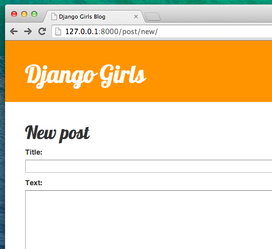
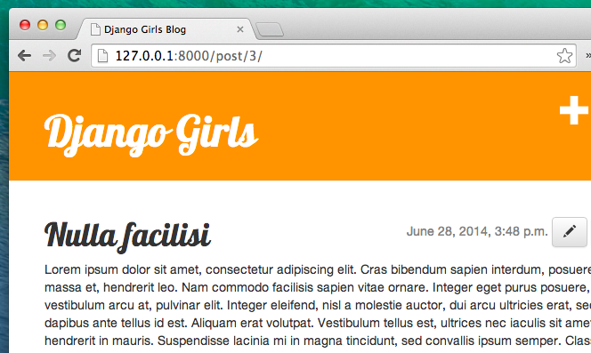

# Django форми

Остання річ, яку б ми хотіли зробити з нашим сайтом це створити зручний спосіб додавати і редагувати пости. Django адміністратор це звісно круто, але водночас він є досить складним для налаштування. З формами ми будемо мати абсолютний контроль над нашим інтерфейсом - можемо робити майже усе що заманеться!

Що тішить стосовно Django форм так це те, що останні можна визначати як з нуля так і створювати засобами `ModelForm`, що зберігають результат форми всередині моделі.

Це саме те, що нам потрібно: створимо форму для нашої моделі `Post`.

Як і кожна важлива складова Django, форми мають свій власний файл: `forms.py`.

Потрібно створити файл із заданим ім'ям в папці `blog`.

    blog
       └── forms.py
    

Ok, відкриймо цей файл і наберемо наступний код:

    from django import forms
    
    from .models import Post
    
    class PostForm(forms.ModelForm):
    
        class Meta:
            model = Post
            fields = ('title', 'text',)
    

Спершу потрібно імпортувати Django форми (`from django import forms`) і, очевидно, нашу модель `Post` (`from .models import Post`).

`PostForm`, як ви можливо зазначили, ім'я нашої форми. Ми маємо повідомити Django, що наша форма є `ModelForm` (таким чином Django здійснить для нас певні магічні маніпуляції) і рядок `forms.ModelForm` відповідає за це.

Далі, у нас є `class Meta`, де ми вказуємо для Django котра з моделей має бути використана для створення форми (`model = Post`).

Зрештою, можемо зазначити якими полями має закінчуватись наша форма. В даному сценарії ми би хотіли опублікувати такі параметри як заголовок `title` і зміст `text`, дані про автора `author`, що автоматично встановлюються як дані користувача, який наразі залогінився (тобто ви!), а також дата створення `created_date`, яка автоматично встановлюється при створенні поста (тобто в коді), вірно ж?

І це все! Все що нам потрібно тепер зробити це використати форму в блоці *view* і відобразити її в шаблоні.

Отже знову ми створимо: посилання на сторінку, адресу (URL), вид (view) і шаблон (template).

## Посилання на сторінку з формою

Час відкрити `blog/templates/blog/base.html`. Додамо лінк всередині блоку `div` із ім'ям `page-header`:

```html
<a href="" class="top-menu"><span class="glyphicon glyphicon-plus"></span></a>
```    


Зауважте, що ми хочемо запустити наш новий блок view `post_new`.

Після додавання відповідного рядка, ваш html файл має виглядати наступним чином:

```html

<html>
    <head>
        <title>Django Girls blog</title>
        <link rel="stylesheet" href="//maxcdn.bootstrapcdn.com/bootstrap/3.2.0/css/bootstrap.min.css">
        <link rel="stylesheet" href="//maxcdn.bootstrapcdn.com/bootstrap/3.2.0/css/bootstrap-theme.min.css">
        <link href='//fonts.googleapis.com/css?family=Lobster&subset=latin,latin-ext' rel='stylesheet' type='text/css'>
        <link rel="stylesheet" href="">
    </head>
    <body>
        <div class="page-header">
            <a href="" class="top-menu"><span class="glyphicon glyphicon-plus"></span></a>
            <h1><a href="/">Django Girls Blog</a></h1>
        </div>
        <div class="content container">
            <div class="row">
                <div class="col-md-8">
                    
                    
                </div>
            </div>
        </div>
    </body>
</html>
```
    

Після збереження і перезапуску сторінки http://127.0.0.1:8000 ви, очевидніше за все, побачите знайому помилку `NoReverseMatch`, вірно?

## URL

Відкриваємо `blog/urls.py` і додаємо рядок:

    url(r'^post/new/$', views.post_new, name='post_new'),
    

Остаточно код буде виглядати так:

    from django.conf.urls import include, url
    from . import views
    
    urlpatterns = [
        url(r'^$', views.post_list),
        url(r'^post/(?P<pk>[0-9]+)/$', views.post_detail),
        url(r'^post/new/$', views.post_new, name='post_new'),
    ]
    

Після оновлення сайту бачимо помилку `AttributeError`, оскільки вид `post_new` не є реалізованим. Давайте додамо цей вид прямо зараз.

## post_new view

Час відкрити файл `blog/views.py` і додати наступні рядки:

    from .forms import PostForm
    

і функцію для потрібного відображення:

    def post_new(request):
        form = PostForm()
        return render(request, 'blog/post_edit.html', {'form': form})
    

Щоб створити нову форму `Post`, нам потрібно викликати функцію `PostForm()` і передати її до шаблону. Повернемося пізніше до цього відображення, а зараз давайте створимо шаблон для форми.

## Шаблон

Нам потрібно створити файл `post_edit.html` у папці `blog/templates/blog`. Щоб створити форму нам знадобиться декілька речей:

*   ми маємо відобразити форму. Можемо це зробити, наприклад, за допомогою простого `{{ form.as_p }}`.
*   верхній рядок має бути розміщений всередині тега HTML для форми: `<form method="POST">...</form>`
*   нам знадобиться кнопка Зберегти - `Save`. Створимо її в HTML за допомогою: `<button type="submit">Save</button>`
*   і врешті-решт одразу після відкриття тегу для форми `<form ...>` потрібно додати ``. Це дуже важливо з міркувань безпеки вашої форми! Django наголосить на цьому, якщо ви раптом забудете вказати згадану вказівку і будете намагатися зберегти форму:


Добре, отже давайте подивимось як має виглядати HTML код в `post_edit.html`:

```html



    <h1>New post</h1>
    <form method="POST" class="post-form">
        {{ form.as_p }}
        <button type="submit" class="save btn btn-default">Save</button>
    </form>

```
    

Час перезавантажитись! Йой! Ваша форма відображується!



Але, одну хвилинку! Коли ви набираєте щось в полях `title` і `text` і намагаєтесь зберегти зміни - що ж тоді станеться?

А нічого! Ми знову опинимося на тій самій сторінці і наш текст зникне... і жодного нового поста. Отже, що ж пішло не так?

Відповідь: нічого. Мусимо проробити трохи більше роботи з нашим блоком *view*.

## Зберігання форми

Відкрийте `blog/views.py` знову. Наразі все що ми маємо в `post_new` це:

    def post_new(request):
        form = PostForm()
        return render(request, 'blog/post_edit.html', {'form': form})
    

Коли відбувається зберігання форми, ми повертаємось назад до того ж виду, але цього разу матимемо трохи більше даних в `request`, конкретніше у `request.POST`. Пам'ятайте, що у файлі HTML наше визначення `<form>` містило атрибут `method="POST"`? Усі поля форми на даний момент знаходитимуться в `request.POST`. Ви не повинні перейменовувати `POST` на щось інше (лише єдине альтернативне прийнятне значення для атрибуту `method` це `GET`, але ми не маємо часу пояснювати в чому різниця).

Отже, ми маємо дві окремі ситуації, що потребують контролю для нашого блоку вид *view*. Перша: коли ми отримуємо доступ до сторінки вперше і хочемо отримати пусту форму. Друга: коли ми повертаємось назад до виду *view* із усіма нещодавно доданими даними форми. Таким чином, маємо додати умову (використаємо для цього `if`).

    if request.method == "POST":
        [...]
    else:
        form = PostForm()
    

Час заповнити порожнє місце `[...]`. Якщо метод `method` є методом `POST`, тоді ми захочемо створити `PostForm` з даними форми, вірно? Зробимо це за допомогою:

    form = PostForm(request.POST)
    

Просто! Наступна річ - перевірити чи коректно заповнена форма (налаштовані усі необхідні поля і не відбулося зберігання жодного некоректного значення). Зробимо це за допомогою `form.is_valid()`.

Ми перевіряємо чи є форма прийнятною і якщо це так, то можемо зберегти її!

    if form.is_valid():
        post = form.save(commit=False)
        post.author = request.user
        post.save()
    

В основі, маємо тут два моменти: зберігаємо форму за допомогою `form.save` і додаємо автора (оскільки поле автор `author` було відсутнє в `PostForm` і це поле є необхідним!). `commit=False` означає, що ми не хочемо поки що зберігати модель `Post` - ми хочемо спочатку додати ім'я автора. У більшості випадків ви будете користуватися `form.save()`, без `commit=False`, але в даному випадку, ми маємо це зробити. `post.save()` захистить здійснені зміни (додавання автора) і створиться новий блог пост!

Зрештою, було б чудово якби ми могли миттєво переходити на сторінку `post_detail` для щойно створеного допису у блозі, чи не так? Щоб зробити це, нам необхідно виконати ще один імпорт:

    from django.shortcuts import redirect
    

Додайте це з самого початку вашого файлу. А тепер можемо повідомити: перейти на сторінку `post_detail` для щойно створеного поста.

    return redirect('blog.views.post_detail', pk=post.pk)
    

`blog.views.post_detail` -- ім'я виду, до якого ми хочемо перейти. Пам'ятаєте, що цей вид потребує змінної `pk`? Щоб здійснити передачу вище згаданої змінної, скористаємося `pk=post.pk`, де `post` є новоствореним постом!

Але, ок, щось дуже багато балачок, напевно ми хотіли б побачити як відображується даний вид наразі в цілому, правда ж?

    def post_new(request):
        if request.method == "POST":
            form = PostForm(request.POST)
            if form.is_valid():
                post = form.save(commit=False)
                post.author = request.user
                post.save()
                return redirect('blog.views.post_detail', pk=post.pk)
        else:
            form = PostForm()
        return render(request, 'blog/post_edit.html', {'form': form})
    

Подивимося, чи усе працює. Перейдіть на сторінку http://127.0.0.1:8000/post/new/, додайте заголовок `title` і зміст `text`, збережіть зміни... і вуаля! Новий блог пост успішно додано і нас автоматично перенаправило на сторінку `post_detail`!

Ви напевно вже зауважили, що ми взагалі не встановлюємо дату публікації. Ми представимо *кнопку публікації* додатково в **Django Girls Tutorial: Extensions**.

Просто чудово!

## Валідація форми

А тепер, ми покажемо вам наскільки круто використовувати Django форми. Блог пост повинен мати такі поля як заголовок - `title` і зміст - `text`. В нашій моделі `Post` ми не вказали (на відміну від дати публікації - `published_date`), що ці поля не є необхідними, отже Django, за замовчуванням, очікує що вони будуть заповнені.

Спробуйте зберегти форму без атрибутів `title` і `text`. Здогадуємось, що трапиться!


Django турбується про те, щоб усі поля нашої форми були коректно заповнені. Хіба це не круто?

> Оскільки ми нещодавно мали справу з інтерфейсом Django адміністратора система наразі вважає, що ми залогінились. Є декілька ситуацій, які могли призвести до того, що ми вийшли з системи (закриття браузера, перезавантаження бази даних тощо). Якщо раптом виявиться, що при створенні поста з'явиться помилка, пов'язана із відсутністю залогіненого користувача, перейдіть на сторінку адміністратора http://127.0.0.1:8000/admin і залогіньтеся знову. Проблему тимчасово буде вирішено. Безповоротне розв'язання проблеми чекає на вас у розділі **Домашня робота: безпека вашого сайту!** після освоєння головної програми.


## Редагування форми

Тепер ми знаємо як додати нову форму. Та якщо ми раптом захочемо відредагувати вже існуючу? Це дуже схоже на те, що ми щойно проробили. Давайте швидко створимо певні важливі речі (якщо вам щось незрозуміло, ви маєте запитати вашого тренера або ще раз передивитись попередній параграф, оскільки ми вже пройшли усі ці речі).

Відкрийте `blog/templates/blog/post_detail.html` і додайте наступний рядок:

```html
<a class="btn btn-default" href=""><span class="glyphicon glyphicon-pencil"></span></a>
```
    

таким чином, шаблон буде виглядати подібним чином:

```html



    <div class="date">
    
        {{ post.published_date }}
    
    <a class="btn btn-default" href=""><span class="glyphicon glyphicon-pencil"></span></a>
    </div>
    <h1>{{ post.title }}</h1>
    <p>{{ post.text|linebreaks }}</p>

```
    

В `blog/urls.py` додамо цей рядок:

    url(r'^post/(?P<pk>[0-9]+)/edit/$', views.post_edit, name='post_edit'),
    

Повторно використаємо шаблон `blog/templates/blog/post_edit.html`, отже остання річ, яка лишилась це відображення..

Давайте відкриємо `blog/views.py` і додамо в самому кінці файлу:

    def post_edit(request, pk):
        post = get_object_or_404(Post, pk=pk)
        if request.method == "POST":
            form = PostForm(request.POST, instance=post)
            if form.is_valid():
                post = form.save(commit=False)
                post.author = request.user
                post.save()
                return redirect('blog.views.post_detail', pk=post.pk)
        else:
            form = PostForm(instance=post)
        return render(request, 'blog/post_edit.html', {'form': form})
    

Виглядає майже точно так як і наш вид `post_new`, чи не так? Але не зовсім. Перше: ми передаємо додатковий параметр `pk` з адресного рядку. Наступне: ми отримуємо модель `Post`, яку хотіли б відредагувати як `get_object_or_404(Post, pk=pk)` і потім, при створенні форми ми передаємо цей пост як екземпляр `instance` коли зберігаємо форму:

    form = PostForm(request.POST, instance=post)
    

а коли ми просто відкриваємо форму з цим постом для редагування:

    form = PostForm(instance=post)
    

Добре, давайте протестуємо чи все працює! Перейдімо на сторінку `post_detail`. У верхньому правому кутку має з'явитися кнопка редагування:



Коли ви натиснете на неї, то побачите форму з нашим блог постом:


Можете вільно змінити заголовок або текст і зберегти зміни!

Вітаємо! Ваш додаток стає все більше і більше завершеним!

Якщо бажаєте дізнатись більше інформації про Django форми ознайомтесь із документацією: https://docs.djangoproject.com/en/1.8/topics/forms/

## Ще одне: розгортання!

Було б непогано побачити чи ваш сайт все ще працює на Heroku, чи не так? Давайте спробуємо розгорнути його знову. Якщо ви вже забули як це зробити, зверніться до кінцевої частини розділу [Розгортання](../deploy/README.md):

```bash
$ git status
...
$ git add -A .
$ git status
...
$ git commit -m "Added views to create/edit blog post inside the site."
...
$ git push heroku master
```
    

І це все! Вітання :)
