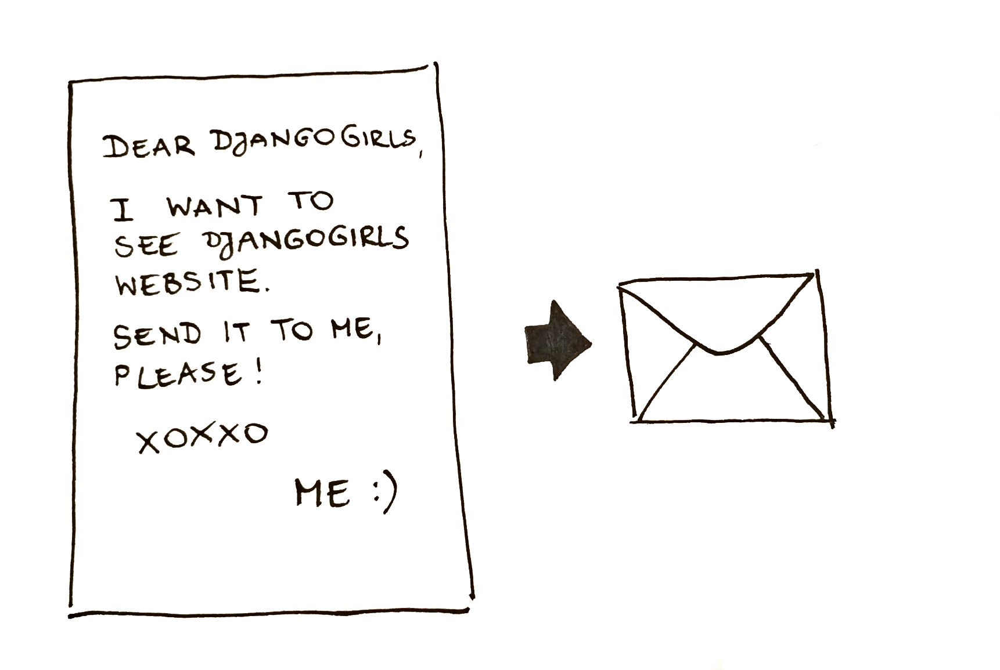

# Як працює Інтернет

> На створення цього розділу нас надихнула розмова "Як працює Інтернет" Джесіки Маккеллар (http://web.mit.edu/jesstess/www/).

Б'ємось об заклад, ви використовуєте Інтернет кожного дня. Однак, чи знаєте ви насправді, що трапляється, коли ви набираєте адресу на зразок https://djangogirls.org у браузері та натискаєте `enter`?

Перша річ, яку вам необхідно зрозуміти - це те, що веб-сайт є лише набором файлів на жорсткому диску. Просто як фільми, музика або зображення.
Проте, є одна унікальна річ для веб-сайтів: вони містять комп'ютерний код, що називається HTML.

Якщо ви не знайомі із програмуванням, спочатку може бути складно зрозуміти, що таке HTML, але веб-браузери (такі як Chrome, Safari, Firefox тощо) його люблять.
Веб-браузери розроблені спеціально, щоб розуміти цей код, виконувати його інструкції та показувати файли, з якого складається ваш сайт, саме так, як ви того забажаєте.

Як і звичайні файли, нам потрібно зберігати HTML-файли в певному місці на жорсткому диску. В Інтернеті ми використовуємо спеціальні потужні комп'ютери, що називаються *серверами*.
Вони не мають екрану, мишки чи клавіатури, тому що їхня основна ціль - зберігати і обробляти дані. Саме тому ці комп'ютери назвали *серверами*, вони обробляють (англ. to *serve* - обробляти) ваші дані.

Гаразд, але ж ви хочете дізнатися як виглядає Інтернет, чи не так?

Ми намалювали для вас картинку! Вона виглядає наступним чином:

Суцільний безлад, правильно? Фактично, це мережа з'єднаних машин (вище зазначених *серверів*). Сотні тисяч машин! Багато-багато кілометрів кабелю по усьому світу! Можете відвідати веб-сайт Submarine Cable Map (http://submarinecablemap.com/), щоб побачити, наскільки складною є мережа. Тут наведено знімок з веб-сайту:

Вражаюче, чи не так? Але однозначно, неможливо мати проводи між кожною машиною, підключеною до Інтернету. Отже, щоб досягти машини (наприклад, ту на якій збережено https://djangogirls.org), ми повинні передати запит через багато-багато різних машин.

Це виглядатиме так:

Уявіть, що коли ви набираєте https://djangogirls.org, ви відправляєте листа, що говорить: "Шановні Django Girls, я хочу побачити веб-сайт djangogirls.org. Відправте мені його, будь ласка!"

Ваш лист надійде до найближчого поштового віділення. Далі він надходить до іншого, що знаходиться трохи ближче до вашого адресата, далі до іншого і так далі, поки не буде досягнуто остаточного пункту призначення. Єдина відмінність в тому, що при відправці багатьох листів (*пакетів даних*) в однакове місце, кожен з них може піти через абсолютно різні поштові відділення (*маршрутизатори*). Це залежить від того, як їх розподілили в кожному відділенні.

Так, це так само просто. Ви відправляєте повідомлення і очікуєте певної відповіді. Звісно, замість паперу і ручки ви використовуєте байти даних, але ідея та сама!

Замість адрес із назвами вулиці, міста, індексом і назвою країни, ми використовуємо IP адреси. Ваш комп'ютер спочатку запитує про DNS (англ. Domain Name System - система доменних імен) для переводу djangogirls.org в IP-адресу. Це працює подібно до старомодних телефонних довідників, де ви могли б знайти ім'я особи, з якою бажаєте зв'язатися і знайти її номер телефону та адресу.

Коли ви відправляєте листа, це потребує наявності певних речей для коректної доставки: адреса, штамп тощо. Також ви використовуєте мову, котру розуміє отримувач, правда ж? Те ж саме стосується і *пакетів даних*, які ви відправляєте, щоб побачити веб-сайт. Ми використовуємо протокол, який називається HTTP (англ. Hypertext Transfer Protocol, протокол передачі гіпер-текстових документів).

Отже, по суті, коли у вас є веб-сайт, вам треба мати *сервер* (машину), де він житиме. Коли *сервер* отримує вхідний *запит* (в листі), він відправляє назад ваш веб-сайт (в іншому листі).

Оскільки ви читаєте навчальний посібник з Django, ви запитаєте, що ж робить Django. Коли ви відправляєте відповідь, то не завжди бажаєте відправляти одне й те саме кожному. Набагато краще, якщо ваші листи є персоналізованими, особливо для осіб, які щойно вам написали, еге ж? Django допомагає вам зі створенням цих персоналізованих цікавих листів :).

Досить розмов, час творити!
