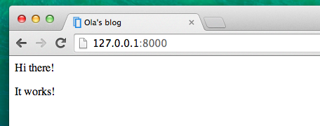

# Вступ до HTML

Ви можете запитати, що таке шаблон?

Шаблон - це файл, який ми можемо повторно використовувати для представлення різноманітної інформації в послідовному форматі. Наприклад, ви можете використовувати шаблон для допомоги у написанні листа, бо, хоча кожен лист може містити різне повідомлення та бути адресованим різним особам, усі листи поширюватимуться у однаковому форматі.

Формат Django шаблону описаний мовою, що називається HTML (це HTML, зазначений у першому розділі **Як працює Інтернет**).

## Що таке HTML?

HTML - це простий код, що інтерпретується вашим веб браузером (таким як Chrome, Firefox чи Safari) для відображення веб сторінки для користувача.

HTML розшифровується як "Мова розмітки гіпертексту". __Гіпертекст__ означає тип тексту, який підтримує гіперпосилання між сторінками. __Розмітка__ (англ. markup) означає, що ми отримали документ із розміченим кодом для того, щоб повідомити комусь (у даному випадку, браузеру) як треба інтерпретувати сторінку. HTML код побудований за допомогою __тегів__, кожен з яких починається із `<` і закінчується на `>`. Теги представляють __елементи розмітки__.

## Ваш перший шаблон!

Під створенням шаблону мається на увазі створення файлу шаблону. Будь-що є файлом, чи не так? Ви, напевно, це вже зауважили.

Шаблони зберігаються в папці `blog/templates/blog`. Отже, спершу створіть папку із назвою `templates` всередині вашої папки blog. Далі створіть іншу папку із назвою `blog` всередині вашої папки templates:

    blog
    └───templates
        └───blog

(Вас може здивувати, для чого нам потрібно дві папки із однаковим ім'ям `blog` - як виявиться пізніше, це всього лише зручне узгодженість із найменування, котра спрощує життя, коли речі починають ускладнюватися.)

А тепер створіть файл `post_list.html` (просто залиште його поки що порожнім) всередині папки `blog/templates/blog`.

Погляньте, як тепер виглядає ваш веб сайт: http://127.0.0.1:8000/

> Якщо помилка `TemplateDoesNotExists` досі не зникла, спробуйте перезапустити ваш сервер. Перейдіть до командного рядка, зупиніть сервер, натиснувши Ctrl+C (клавіші Control і C разом) та активуйте його знову, запустивши команду `python manage.py runserver`.


Більше ніяких помилок! Вітання :) Однак, ваш сайт насправді не публікує нічого, окрім пустої сторінки, оскільки ваш шаблон також пустий. Ми маємо це виправити.

Додайте наступне у ваш файл шаблону:

```html
<html>
    <p>Hi there!</p>
    <p>It works!</p>
</html>
```

То як тепер виглядає ваш веб-сайт? Натисніть, щоб з'ясувати: http://127.0.0.1:8000/


Спрацювало! Гарна робота :)

- Базовий тег `<html>` завжди є початком будь-якої веб сторінки і `</html>` - завжди є кінцем. Як бачите, увесь контент сайту розміщений між початковим тегом `<html>` і закриваючим тегом `</html>`.
- `<p>` - тег для елементів абзацу; `</p>` закриває кожен абзац.

## Голова і тіло (Head & body)

Кожну сторінку HTML також можна поділити на два елементи: __head__ - (голова) і __body__ - (тіло).

- __head__ - елемент, що містить інформацію про документ, яка не відображається на екрані.

- __body__ - елемент, що містить усе інше, що відображається як частина веб сторінки.

Ми використовуємо `<head>` щоб повідомити браузер про конфігурацію сторінки, а `<body>`, щоб повідомити браузер, що у дійсності знаходиться на сторінці.

Наприклад, ви можете розмістити заголовок веб-сторінки всередині `<head>` наступним чином:

```html
<html>
    <head>
        <title>Ola's blog</title>
    </head>
    <body>
        <p>Hi there!</p>
        <p>It works!</p>
    </body>
</html>
```

Збережіть файл і перезавантажте вашу сторінку.



Зауважте, як браузер зрозумів , що "Ola's blog" - це заголовок вашої сторінки? Він інтерпретував `<title>Ola's blog</title>` і розмістив текст у рядку заголовка вашого браузера (він також буде використаний для закладок чи інших речей).

Можливо, ви також звернули увагу, що кожен відкриваючий тег відповідає *закриваючому тегу*, із `/`, і ці елементи є *вкладеними* (тобто ви не можете закрити окремий тег поки усі теги, що містяться всередині не будуть також закриті).

Це щось на кшталт як покласти речі всередину ящиків. У вас є один великий ящик, `<html></html>`; всередині цього ящика є `<body></body>`, що містить ще менші ящики: `<p></p>`.

Ви повинні керуватися цими правилами _закриваючих_ тегів, і _вкладених_ елементів - якщо ви цього не робитимите, браузер може бути не в змозі інтерпретувати їх правильно і ваша сторінка буде відображатись некоректно.

## Налаштуйте ваш шаблон

А тепер можете трохи побавитися і спробувати налаштувати ваш шаблон! Тут наведено декілька корисних тегів для цього:

- `<h1>Заголовок</h1>` - для найважливішого заголовка
- `<h2>Підзаголовок</h2>` для заголовків наступного рівня
- `<h3>Підпідзаголовок</h3>` ... і так далі, аж до `<h6>`
- `<em>текст</em>` робить акцент на вашому тексті
- `<strong>текст</strong>` робить сильний акцент на вашому тексті
- `<br />` переходить на наступну лінію (ви не можете нічого розмістити всередині br)
- `<a href="http://djangogirls.org">link</a>` створює посилання
- `<ul><li>перший елемент</li><li>другий елемент</li></ul>` створює список, такий як цей!
- `<div></div>` визначає блок сторінки

Тут наведено повний приклад шаблону:

```html
<html>
    <head>
        <title>Django Girls blog</title>
    </head>
    <body>
        <div>
            <h1><a href="">Django Girls Blog</a></h1>
        </div>

        <div>
            <p>published: 14.06.2014, 12:14</p>
            <h2><a href="">My first post</a></h2>
            <p>Aenean eu leo quam. Pellentesque ornare sem lacinia quam venenatis vestibulum. Donec id elit non mi porta gravida at eget metus. Fusce dapibus, tellus ac cursus commodo, tortor mauris condimentum nibh, ut fermentum massa justo sit amet risus.</p>
        </div>

        <div>
            <p>published: 14.06.2014, 12:14</p>
            <h2><a href="">My second post</a></h2>
            <p>Aenean eu leo quam. Pellentesque ornare sem lacinia quam venenatis vestibulum. Donec id elit non mi porta gravida at eget metus. Fusce dapibus, tellus ac cursus commodo, tortor mauris condimentum nibh, ut f.</p>
        </div>
    </body>
</html>
```

Тут було створено три блоки `div`.

- Перший `div` елемент містить заголовок нашого блогу - а точніше, заголовок і посилання
- Два інших `div` елементи містять наші пости із датою публікації, `h2` із заголовком поста, який можна клікнути і два `p` (абзаци) тексту, один для дати, а інший для нашого блог посту.

Отримуємо наступний ефект:


Йой! Але досі, наш шаблон лише незмінно відображає точно __таку ж інформацію__ - тоді як раніше йшлося про шаблони, що дозволяють нам відображувати __різну__ інформацію в __однаковому форматі__.

Що б ми дійсно хотіли зробити, так це відобразити реальні пости, додані в нашій панелі адміністратора Django - це те, до чого ми перейдемо далі.

## Ще одна річ: розгортання!

Було б добре побачити все це в Інтернеті, правда? Давайте зробимо ще одне розгортання на PythonAnywhere:

### Фіксування (commit) і завантаження (push) коду на GitHub

По-перше, давайте подивимося, які файли були змінені після розгортання (виконайте ці команди локально, не на PythonAnywhere):

    $ git status

Переконайтеся, що ви перебуваєте в директорії `djangogirls`, далі давайте скажемо для `git` включити всі зміни в рамках цього каталогу:

    $ git add --all .

> __Зауваження__ `-A` (коротко усі - "all") означає, що `git` також розпізнає якщо раптом ви видалили файли (за замовчуванням, він розпізнає лише нові/змінені файли). Також пам'ятайте (з розділу 3), що `.` означає поточну директорію.

Перед тим як завантажити усі файли, давайте перевіримо що ж буде завантажувати `git` (усі файли, які буде завантажувати `git` повинні тепер з'явитися і бути позначеними зеленим кольором):

    $ git status

Майже на місці, а тепер час повідомити йому про те, що треба зберегти ці зміни в його історії. Ми збираємося задати "commit message" що ж ми змінили. На цьому етапі можна набрати будь-що, що вважатимете за потрібне, однак, має сенс надрукувати щось дійсно зрозуміле, щоб, таким чином, ви могли згадати що ви зробили у майбутньому.

    $ git commit -m "Changed the HTML for the site."

> __Зауваження__ Переконайтеся, що ви використали подвійні лапки навколо повідомлення про здійснену фіксацію.

Після того, як ми це зробили, завантажимо (push) наші зміни до GitHub:

    git push


### Завантаження (pull) нового коду на PythonAnywhere і перезапуск веб-додатку

* Відкрийте [сторінку з терміналами на PythonAnywhere](https://www.pythonanywhere.com/consoles/) і переключіться на вже запущений **Bash термінал** (або запустіть новий). Далі, наберіть команди:

```
$ cd ~/my-first-blog
$ source myvenv/bin/activate
(myvenv)$ git pull
[...]
(myvenv)$ python manage.py collectstatic
[...]
```

Подивіться, що ваш код почав завантажуватись. Якщо ви хочете перевірити успішність процедури, відкрийте вкладку **Files** і подивіться на свій код на PythonAnywhere.


* Зрештою, переключіться на вкладку [Web](https://www.pythonanywhere.com/web_app_setup/) і натисніть **Reload**.

Оновлення повинні відобразитись на вашому веб-сайті! Переключись на нього і онови сторінку. Ви повинні побачити зміни :)
